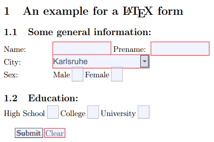

I've just stumbled across a full, working example how to create a html form within an LaTeX document. You can fill this form within your PDF-Reader. Here is the <a href='../images/2012/02/pdf-form.pdf'>example PDF-file</a>.

It looks like this in Chromes PDF reader:
<figure class="aligncenter">
            <a href="../images/2012/02/pdf-latex-form-chrome.png"></a>
            <figcaption class="text-center">PDF LaTeX form in Chrome</figcaption>
        </figure>

```latex
\documentclass[a4paper,12pt]{article}
\usepackage{amssymb} % needed for math
\usepackage{amsmath} % needed for math
\usepackage[utf8]{inputenc} % this is needed for german umlauts
\usepackage[ngerman]{babel} % this is needed for german umlauts
\usepackage[T1]{fontenc}    % this is needed for correct output of umlauts in pdf
\usepackage[margin=2.5cm]{geometry} %layout

\usepackage{hyperref}  % this is needed for forms and links within the text

\hypersetup{
  pdfauthor   = {Martin Thoma},
  pdfkeywords = {Martin Thoma, exmple, LaTeX, form},
  pdftitle    = {An example for a LaTeX form}
}

\begin{document}

\title{An example for a LaTeX form}
\author{Martin Thoma}
\date{\today}

\section{An example for a \LaTeX~form}

\begin{Form}[action=mailto:info@example.com,encoding=html,method=post]
\subsection{Some general information:}
\begin{tabbing}
xxxxxxxxxx: \= \kill  % This is needed for the right tab width
Name: 			\> \TextField[name=name,width=3cm,charsize=12pt]
{\mbox{}}
Prename: \TextField[name=vor,width=3cm,charsize=12pt]
{\mbox{}} \\

City: 			\>
\ChoiceMenu[combo,name=city,width=5cm,charsize=12pt,default=Karlsruhe]{\mbox{}}
{Chemnitz,Dresden,Leipzig,Berlin,Hamburg,Karlsruhe,M&uuml;nchen} \\

Sex: 	\>
\ChoiceMenu[radio,default=f,name=sex,charsize=14pt]{\mbox{}}{Male=m,Female=f}
\end{tabbing}

\subsection{Education:}
\CheckBox[name=highschool,charsize=12pt]{High School}
\CheckBox[name=college,charsize=12pt]{College}
\CheckBox[name=university,charsize=12pt]{University} \\


\Submit{Submit}
\Reset{Clear}
\hfill ~\\
\end{Form}

\end{document}
```

You can save this as pdf-form.tex and run this command in Linux:
```bash
pdflatex pdf-form.tex -output-format=pdf
```

It seems as if the \ChoiceMenu radio option is buggy at the moment. Does anybody know how to fix that?
edit: Hmm ... it works in Chromes PDF reader, but not in Document Viewer. Mayby Document Viewer is buggy.

<h2>Sources</h2>
<ul>
    <li>TeX Users Group: <a href="http://www.tug.org/applications/hyperref/manual.html#x1-190006">PDF and HTML forms</a></li>
    <li><a href="http://www.qucosa.de/fileadmin/data/qucosa/documents/4512/data/vortrag2.pdf">Teil 2: LATEX und PDF</a> - TU Chemnitz (German)</li>
    <li><a href="http://www2.informatik.hu-berlin.de/~piefel/LaTeX-PS/Archive-2004/V12-PDF.pdf">Dokumentation der HU Berlin</a> (German)</li>
</ul>
