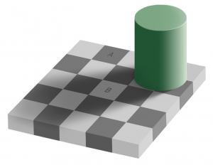
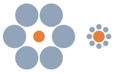
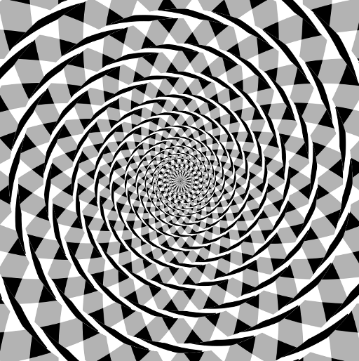
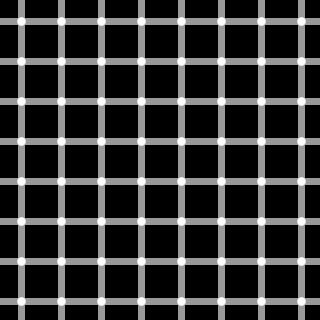
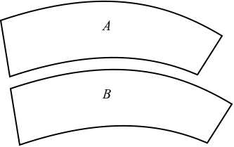
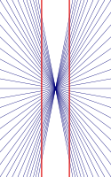
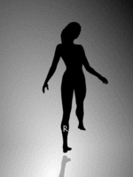
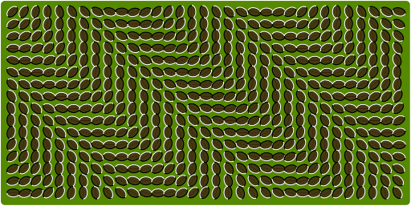
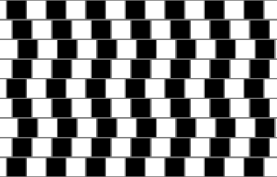

Some really great and short examples of illusions. If you want an explanation of them, I have added a link to the corresponding Wikipedia article.

<h2>Checker shadow illusion</h2>
<figure>
    
    <figcaption>Checker shadow illusion</figcaption>
</figure>
<a href="http://en.wikipedia.org/wiki/Checker_shadow_illusion">Checker shadow illusion</a>: The pieces A and B are of the same color.

<h2>Ebbinghaus illusion</h2>
<figure>
    
    <figcaption>Ebbinghaus illusion</figcaption>
</figure>
<a href="http://en.wikipedia.org/wiki/Ebbinghaus_illusion">Ebbinghaus illusion</a>:  the first central circle seems to be smaller than the second central circle although they are of identical size.

The <a href="http://en.wikipedia.org/wiki/M%C3%BCller-Lyer_illusion">Müller-Lyer illusion</a> is similar.

<h2>Fraser spiral illusion</h2>
<figure>
    
    <figcaption>Fraser spiral illusion</figcaption>
</figure>
Although you think you see a spiral, there are only concentric circles. This illusion is known as <a href="http://en.wikipedia.org/wiki/Fraser_spiral_illusion">Fraser spiral illusion</a>.

<h2>Grid illusion</h2>
<figure>
    
    <figcaption>Grid illusion</figcaption>
</figure>
Dark dots seem to appear and disappear in the <a href="http://en.wikipedia.org/wiki/Grid_illusion">Grid illusion</a>.

<h2>Jastrow illusion</h2>
<figure>
    
    <figcaption>Jastrow illusion</figcaption>
</figure>
In the <a href="http://en.wikipedia.org/wiki/Jastrow_illusion">Jastrow illusion</a>, the two figures are identical, although the lower one appears to be larger.

<h2>Zöllner illusion</h2>
<figure>
    
    <figcaption>Zöllner illusion</figcaption>
</figure>
In the figure of <a href="http://en.wikipedia.org/wiki/Z%C3%B6llner_illusion">Zöllner illusion</a> the black lines seem to be not parallel, but in reality they are parallel.

<h2>Hering illusion</h2>
<figure>
    
    <figcaption>Hering illusion</figcaption>
</figure>
<a href="http://en.wikipedia.org/wiki/Hering_illusion">Hering illusion</a>: Two straight and parallel lines look as if they were bowed outwards.

<h2>Spinning Dancer</h2>
This image is the only animated one in this post.
<figure>
    
    <figcaption>Spinning Dancer</figcaption>
</figure>
<a href="http://en.wikipedia.org/wiki/Spinning_Dancer">Spinning Dancer</a>: If the foot touching the ground is perceived to be the left foot, the dancer appears to be spinning clockwise (if seen from above); if it is taken to be the right foot, then she appears to be spinning counterclockwise.

<h2>Illusory motion</h2>
<figure>
    
    <figcaption>Illusory motion</figcaption>
</figure>
<a href="http://en.wikipedia.org/wiki/Illusory_motion">Illusory motion</a>: This image is not animated!

<h2>Caf&eacute; wall illusion</h2>
<figure>
    
    <figcaption>Caf&eacute; wall illusion</figcaption>
</figure>
<a href="http://en.wikipedia.org/wiki/Caf%C3%A9_wall_illusion">Caf&eacute; wall illusion</a>:  the parallel straight dividing lines between staggered rows with alternating black and white "bricks" appear to be sloped
