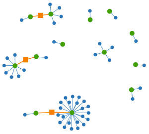

Google Chrome is the browser of my choice. It is fast, has developer tools and looks great. But it could be improved. I'll describe some features I miss.

<h2>Disable sound for tabs</h2>
Sometimes I watch a movie while I play a flash game. Some flash games don't offer an option to mute them. So I would like to get the possibility to disable sound for one tab.

It could look like this.
<figure class="aligncenter">
            
            <figcaption class="text-center">Disable the sound of a tab</figcaption>
        </figure>

<h2>Spell checker</h2>
I write Blogs in German and in English. So I would like a spell-checker option at the bottom-left corner to switch languages:
<figure class="aligncenter">
            
            <figcaption class="text-center">Spell checker</figcaption>
        </figure>

<h2>HTML5 Form Elements</h2>
HTML5 brought many cool new form elements to the web. If you like, take a look at <a href="http://www.martin-thoma.de/html5/input.php">my list of HTML5 input types</a>. Chrome should support all of them!
Note that Chrome does support these types according to <a href="http://html5test.com/">html5test.com</a>. But I can't see any difference between type=url and type=text. That's not supporting the new types!

By the way, at the moment Chrome scores 385 points + 13 bonus points. The best browser currently scores 425 points + 25 bonus points.

<figure class="aligncenter">
            
            <figcaption class="text-center">Opera 11.01 Native date input type</figcaption>
        </figure>

<h2>Internal PDF-Reader</h2>
<figure class="aligncenter">
            
            <figcaption class="text-center">Internal PDF reader of Chrome</figcaption>
        </figure>
<h3>Rotate PDF</h3>
Some PDF files I receive are rotated by 90&deg;. It would be great if I could, as in every PDF viewer, rotate this. A common shortcut is Ctrl+Arrow key.

<h3>Page numbers</h3>
It would be great, if I could enter the number of the page I want to view. For example in the URL by adding "#123" for page 123.

<h2>Security</h2>
<h3>Extensions</h3>
Auto-Disable extensions for https. Only PayPal, Amazon, Ebay, GMail and my bank accounts work with https. I don't need my addons for these sites and I would appreciate if I could auto-disable them for https.

<h3>Password Reuse Visualizer</h3>
Firefox offers a tool which helps to identify passwords, that get reused often. It is called "<a href="https://addons.mozilla.org/de/firefox/addon/password-reuse-visualizer/">Password Reuse Visualizer</a>" and looks like this:

<figure class="aligncenter">
            
            <figcaption class="text-center">Password Reuse Visualizer</figcaption>
        </figure>

<h2>Material</h2>
I've used <a href="http://www.famfamfam.com/lab/icons/silk/">famfamfam slik icons</a>. For the menus I've used Sans, 14pt, no hinting but Antialiasing. If someone has better options, it would be great if you posted it as a comment.

If you just want to see if your problem has already been submitted, go to the <a href="http://code.google.com/p/chromium/issues/list">issue-list</a>.
