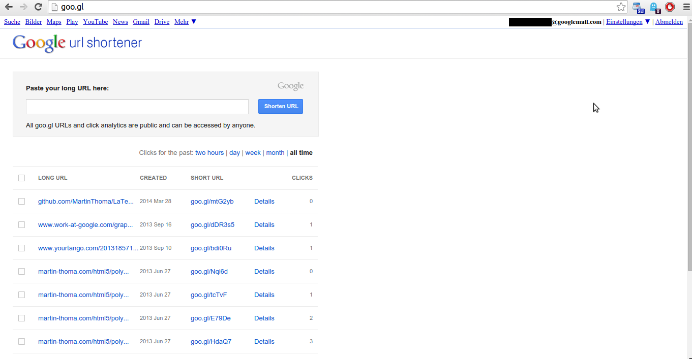
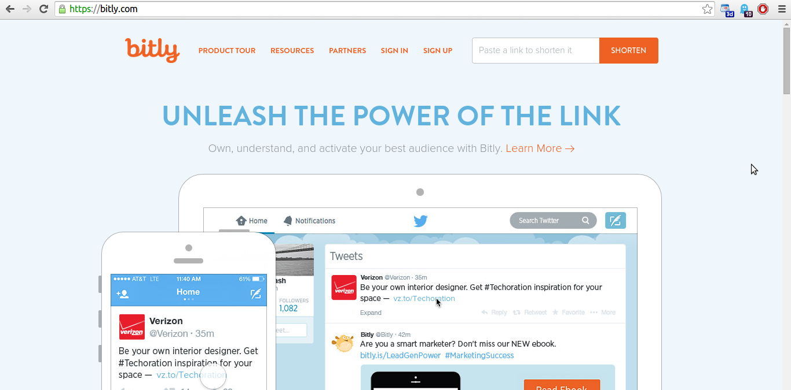

URL shortening services are Websites, which offer redirections from one of
their pages with short URLs to your page (with a long URL). URL shortening
services are great when you need to print URLs. I don't like them on Websites /
in e-mails as I can't see the target, but I don't want to type so much when I
get a URL in my real live.

These services should be used more often in my university. It's ridiculous that
all students have to note very long URLs in the first few days. It's not a real
problem, but using URL shorteners would be better.

I'll describe some services in the following article.

<h2>bitly</h2>
Long URL: <a href="https://lists.ira.uni-karlsruhe.de/mailman/listinfo/swt1-vorlesung">https://lists.ira.uni-karlsruhe.de/mailman/listinfo/swt1-vorlesung</a> (66 characters)
Short URL: <a href="http://bit.ly/HKEKD0">http://bit.ly/HKEKD0</a> (20 characters)
Custom URL: <a href="http://bit.ly/SWT-List">http://bit.ly/SWT-List</a> (22 characters, but you need to sign up for free)

Bitly does not re-use old links (<a href="https://bitly.com/pages/help#i_1_4">source</a>).
You get additional information by adding a + sing at the end: <a href="http://bit.ly/HKEKD0+">http://bit.ly/HKEKD0+</a>, <a href="http://bit.ly/SWT-List+">http://bit.ly/SWT-List+</a>

<h2>TinyURL</h2>
Long URL: <a href="https://lists.ira.uni-karlsruhe.de/mailman/listinfo/swt1-vorlesung">https://lists.ira.uni-karlsruhe.de/mailman/listinfo/swt1-vorlesung</a> (66 characters)
Short URL: <a href="http://tinyurl.com/87oscxb">http://tinyurl.com/87oscxb</a> (26 characters)
Custom URL: <a href="http://tinyurl.com/SWT-List">http://tinyurl.com/SWT-List</a> (27 characters)

<h2>Goo.gl</h2>
Long URL: <a href="https://lists.ira.uni-karlsruhe.de/mailman/listinfo/swt1-vorlesung">https://lists.ira.uni-karlsruhe.de/mailman/listinfo/swt1-vorlesung</a> (66 characters)
Short URL: <a href="http://goo.gl/z5cp0">http://goo.gl/z5cp0</a> (19 characters)
Custom URL: Not possible

This service is owned by Google.

Links do not expire and nobody can change them (<a href="http://support.google.com/websearch/bin/answer.py?hl=en&answer=190768">source</a>).

## Quality Properties

I think you can make a very simple list of quality properties of URL
shorteners:

### User Interface

The user interface should be minimalistic. Goo.gl is a good example, bitly
and tinyurl are still ok:

<figure class="aligncenter">
            
            <figcaption class="text-center">Goo.gl url shortener</figcaption>
        </figure>

<figure class="aligncenter">
            
            <figcaption class="text-center">Tinyurl url shortener</figcaption>
        </figure>

<figure class="aligncenter">
            
            <figcaption class="text-center">Bit.ly url shortener</figcaption>
        </figure>

### Choose your own name

If possible, the user should be able to choose the name of the short URL.

### NEVER change short URL

Short URLs should live forever and never change.

### Preview

* Adding '?preview' should give you a preview of the URL
* The preview should be the default option. Only if the user actively deactivated that - which can be stored with a cookie - preview should not be shown. This is especially important in case of JavaScript in the URL / probably malicious websites

## See also

* <a href="http://mashable.com/2008/01/08/url-shortening-services/">URL Toolbox: 90+ URL Shortening Services</a> - if you wish to see some more
* Wikipedia:
    * <a href="http://en.wikipedia.org/wiki/Bitly">bitly</a>
    * <a href="http://en.wikipedia.org/wiki/TinyURL">TinyURL</a>
    * [URL shortening](https://en.wikipedia.org/wiki/URL_shortening)
* [phlasch](https://github.com/bbmokhtari/phlasch): A Python implementation of a URL shortener. Note that this is only the backend + API, not the frontend. I haven't used it so far, but it looks ok

Did I miss quality measures?
