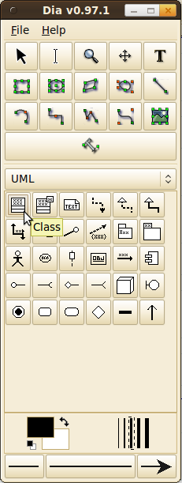
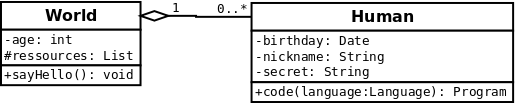

<h2>Dia</h2>
Creating UML diagrams with Dia works like a charm! It provides some default tools. You should simply try it. Dia is a free tool.

Take a look at these screenshots:
<figure class="aligncenter">
            <a href="../images/2012/05/dia-create-class.png"></a>
            <figcaption class="text-center">Create a class for a class diagram in Dia</figcaption>
        </figure>

<figure class="aligncenter">
            <a href="../images/2012/05/dia-class-properties.png"></a>
            <figcaption class="text-center">Edit class properties in Dia</figcaption>
        </figure>

<figure class="aligncenter">
            <a href="../images/2012/05/dia-association.png"></a>
            <figcaption class="text-center">Customizing associations in Dia - adding multiplicities is so much easier in Dia than in MetaUML!</figcaption>
        </figure>

<figure class="aligncenter">
            <a href="../images/2012/05/Dia-ClassDiagram.png"></a>
            <figcaption class="text-center">A quick example for a class diagram created with Dia</figcaption>
        </figure>

<h2>LaTeX</h2>
I only know MetaUML for creating class diagrams entirely in LaTeX. Does anybody know something different?

Of course, you can include a diagram created with Dia:
<ol>
  <li>Export the diagram as PNG (antialized)</li>
  <li>Add something like that to your tex-file: \includegraphics[width=180mm]{myDiagramm.png}</li>
</ol>


<h3>MetaUML</h3>
A MetaUML class diagram looks like that in code (saved as myMetaDiagram.mp):

```text
input metauml;
beginfig(1);
	Class.World("World")
		   ("-age: int",
			"#ressources: List")
		   ("+sayHello(): void");

	Class.NoHuman("Human")
		   ("-birthday: Date",
			"-nickname: String",
			"-secret: String")
		   ("+code(language: Language): Program");

	leftToRight(50)(World, NoHuman);
	drawObjects(World, NoHuman);

	link(aggregation)(NoHuman.w -- World.e);
	item(iAssoc)("1")(obj.n     = .2[World.e,NoHuman.w]);
	item(iAssoc)("has >")(obj.n = .5[World.e,NoHuman.w]);
	item(iAssoc)("0..*")(obj.n  = .8[World.e,NoHuman.w]);

endfig;
end
```

You have to execute mpost before you can compile LaTeX. A working example is in this <a href='../images/2012/05/UML.zip'>UML Archive</a>.

It looks like that in your generated PDF file:
<figure class="aligncenter">
            <a href="../images/2012/05/MetaUML-class-diagram.png"></a>
            <figcaption class="text-center">MetaUML class diagram</figcaption>
        </figure>

<h2>See also</h2>
<ul>
  <li>Wikipedia: <a href="http://en.wikipedia.org/wiki/Class_diagram">Class diagram</a>, <a href="http://en.wikipedia.org/wiki/Dia_(software)">Dia</a></li>
  <li>Dia:  <a href="http://www.wspiegel.de/infogk12/oops/dia_einf.html#py16_2">Dia und UML</a></li>
  <li><a href="http://ftp.fernuni-hagen.de/ftp-dir/pub/mirrors/www.ctan.org/graphics/metapost/contrib/macros/metauml/doc/metauml_manual_0.2.5.pdf">MetaUML: Tutorial, Reference and Test Suite</a></li>
  <li>Freies Magazin, Mai 2012: <a href="http://www.freiesmagazin.de/freiesMagazin-2012-05">Astah &ndash; Kurzvorstellung des UML-Programms</a> (German)</li>
</ul>
