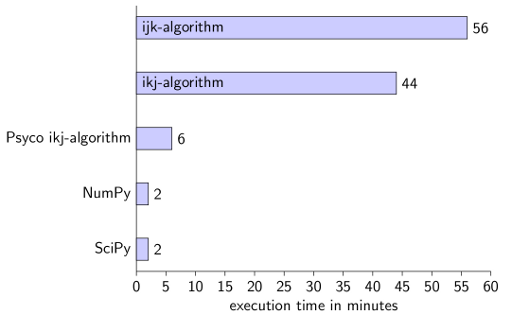
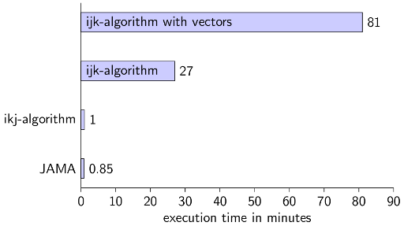

<div class="info">This is Part I of my matrix multiplication series. <a href="../matrix-multiplication-python-java-cpp/">Part I</a> was about simple matrix multiplication algorithms and <a href="../strassen-algorithm-in-python-java-cpp/">Part II</a> was about the Strassen algorithm.
<a href="../part-iii-matrix-multiplication-on-multiple-cores-in-python-java-and-c/">Part III</a> is about parallel matrix multiplication.</div>

This post is about simple implementations of matrix multiplications. The goal of this post is to find out how easy it is to implement a matrix multiplication in Python, Java and C++. Additionally, I want to get to know how good these solutions are.

The second post will be an implementation of the Strassen algorithm for matrix multiplication. <a href="http://en.wikipedia.org/wiki/Strassen_algorithm">Strassen algorithm</a> does matrix multiplication in $\cal O(n^{log_2(7)+o(1)}) \approx \cal O(n^{2.807})$ instead of $\cal O(n^3)$. I am quite sure this will outperform almost every other change. See Part II: <a href="../strassen-algorithm-in-python-java-cpp/">The Strassen algorithm in Python, Java and C++</a>.

The third post will be about parallel programming. I have two cores and I want to see if it will be significantly faster if I use both of them.

<h2>The implementations</h2>
I will post all scripts for this test and I've added a <a href="https://github.com/MartinThoma/matrix-multiplication">GIT repository</a>, so feel free to test it on your machine. I am also happy if you post some of your solutions with running times ☺ I am quite sure that my Java and C++ code can be written much better. If you know how, please leave a comment.
If you know other languages, you could create a script for these. I focus on Python, Java and C++ as they are very often used.

I have implemented these three types of algorithms for this post:
<ul>
    <li><strong>ijk-algorithm</strong>: This is a simple, straight forward implementation of a matrix multiplication. I've used the definition of matrix multiplication. I didn't use multiple threads.</li>
    <li><strong>ikj-algorithm</strong>: just like the ijk-algorithm, but I've switched two of the three the for-loops.</li>
    <li><strong>Library-functions</strong>: I always prefer libraries over self-implemented solutions. I think they are faster than anything I could come up with in a reasonable amount of time.</li>
</ul>

If you post a solution, please consider these restrictions:
<ul>
    <li><strong>Input</strong>: The input file should get passed with the parameter <code>-i</code>, e.g.: 
    <code>python -i 2000.in</code> or <code>java Shell -i 2000.in</code></li>
    <li>The standard value for the command line parameter -i should be "2000.in" (a $2000 \times 2000$ matrix)</li>
    <li>The user should <em>not</em> have to give the size of the matrix!</li>
    <li>The two square-matrices that should get multiplied are ...
    <ul>
    <li>... read from a text-file.</li>
    <li>... represented like this:
        <ul>
        <li>Every line of one matrix is one line in the text-file.</li>
        <li>Newlines are only "\n".</li>
        <li>Every number is separated by "\t".</li>
        <li>The both matrices are separated by one newline.</li>
        </ul>
    </li>
    </ul>
    </li>
    <li><strong>Output</strong>: The result has to get printed to standard output.</li>
    <li>The result has to be formatted like the input (tabs for separation of number, \n for marks a new line)</li>
</ul>

<h2>The Tests</h2>
I will check the speed of a multiplication of two big matrices following for Python, Java and C++ for all algorithms like this:

```shell
$ time python scriptABC.py -i ../2000.in > result.txt
$ diff result.txt bigMatrix.out
```

The <code>bigMatrix.out</code> was produced by the Python ijk-implementation. I make the diff to test if the result is correct.

<h2>The Setting</h2>
I created two "random" matrices $A, B \in \mathbb{N}^{2000 \times 2000}$ with this script. The file that was created needs about 29.7 MB and is also in the GIT-Hub repository. But you can also create the matrices with this script:

```python
#!/usr/bin/env python
# -*- coding: utf-8 -*-

import random
random.seed(1234)

def createRandomMatrix(n):
	maxVal = 1000 # I don't want to get Java / C++ into trouble
	matrix = []
	for i in range(n):
		matrix.append([random.randint(0,maxVal) for el in range(n)])
	return matrix

def saveMatrix(matrixA, matrixB, filename):
	f = open(filename, 'w')
	for i, matrix in enumerate([matrixA, matrixB]):
		if i != 0:
			f.write("\n")
		for line in matrix:
			f.write("\t".join(map(str, line)) + "\n")
n = 3
matrixA = createRandomMatrix(n)
matrixB = createRandomMatrix(n)
saveMatrix(matrixA, matrixB, "2000.in")
```

All scripts are tested on my computer:
<table>
<tr>
<td colspan="2" style="background-color:#cdcdcd">Acer TravelMate 5735Z</td>
</tr>
<tr>
<td style="background-color:#efefef">CPU</td>
<td>2x Pentium(R) Dual-Core CPU T4500 @2.30GHz</td>
</tr>
<tr>
<td style="background-color:#efefef">RAM</td>
<td>4 GB</td>
</tr>
<tr>
<td style="background-color:#efefef">Video Card</td>
<td>Intel GMA 4500MHD</td>
</tr>
<tr>
<td style="background-color:#efefef">System</td>
<td>Ubuntu 10.10.04 LTS</td>
</tr>
</table>

<h2>Python</h2>
I've used Python 2.6.5.

<h3>ijk-algorithm</h3>

```python
#!/usr/bin/env python
# -*- coding: utf-8 -*-

from optparse import OptionParser
parser = OptionParser()
parser.add_option("-i", dest="filename", default="2000.in",
     help="input file with two matrices", metavar="FILE")
(options, args) = parser.parse_args()

def read(filename):
	lines = open(filename, 'r').read().splitlines()
	A = []
	B = []
	matrix = A
	for line in lines:
		if line != "":
			matrix.append(map(int, line.split("\t")))
		else:
			matrix = B
	return A, B

def printMatrix(matrix):
	for line in matrix:
		print "\t".join(map(str,line))

def standardMatrixProduct(A, B):
	n = len(A)
	C = [[0 for i in range(n)] for j in range(n)]
	for i in range(n):
		for j in range(n):
			for k in range(n):
				C[i][j] += A[i][k] * B[k][j]
	return C

A, B = read(options.filename)
C = standardMatrixProduct(A, B)
printMatrix(C)
```

```shell
real	56m49.266s
user	56m30.524s
sys	0m2.980s
```

<h3>ikj-algorithm</h3>

```python
def ikjMatrixProduct(A, B):
	n = len(A)
	C = [[0 for i in range(n)] for j in range(n)]
	for i in range(n):
		for k in range(n):
			for j in range(n):
				C[i][j] += A[i][k] * B[k][j]
	return C
```

```shell
real	44m36.507s
user	44m13.458s
sys	0m2.000s
```

<h3>Psyco ikj-algorithm</h3>
<a href="http://en.wikipedia.org/wiki/Psyco">Psyco</a> is a just in time compiler, which makes my scripts MUCH faster. It is very simple to use. Add these two lines at the top of the ikj-script:

```python
import psyco
psyco.full()
```

```shell
real	6m14.820s
user	6m12.959s
sys	0m0.620s
```

Amazing, isn't it?

<h3>Libraries</h3>
<h4>NumPy</h4>
NumPy-Version: 1.3.0 (Current version is 1.6.2, see <a href="http://en.wikipedia.org/wiki/NumPy">Wiki</a>)

```python
#!/usr/bin/env python
# -*- coding: utf-8 -*-

import numpy

from optparse import OptionParser
parser = OptionParser()
parser.add_option("-i", dest="filename", default="2000.in",
     help="input file with two matrices", metavar="FILE")
(options, args) = parser.parse_args()

def read(filename):
	lines = open(filename, 'r').read().splitlines()
	A = []
	B = []
	matrix = A
	for line in lines:
		if line != "":
			matrix.append(map(int, line.split("\t")))
		else:
			matrix = B
	return A, B

def printMatrix(matrix):
	matrix = numpy.array(matrix)
	for line in matrix:
		print "\t".join(map(str,line))

A, B = read(options.filename)
A = numpy.matrix(A)
B = numpy.matrix(B)
C = A * B # easy and intuitive, isn't it?
printMatrix(C)
```

```shell
real	1m38.425s
user	1m36.066s
sys	0m0.520s
```

<h4>SciPy</h4>
You might need to install <code>python-scitools</code>.

```python
#!/usr/bin/env python
# -*- coding: utf-8 -*-

import numpy
import scipy

from optparse import OptionParser
parser = OptionParser()
parser.add_option("-i", dest="filename", default="2000.in",
     help="input file with two matrices", metavar="FILE")
(options, args) = parser.parse_args()

def read(filename):
	lines = open(filename, 'r').read().splitlines()
	A = []
	B = []
	matrix = A
	for line in lines:
		if line != "":
			matrix.append(map(int, line.split("\t")))
		else:
			matrix = B
	return A, B

def printMatrix(matrix):
	matrix = numpy.array(matrix)
	for line in matrix:
		print "\t".join(map(str,line))

A, B = read(options.filename)
A = scipy.matrix(A)
B = scipy.matrix(B)
C = A * B # easy and intuitive, isn't it?
printMatrix(C)
```

```shell
real	1m35.795s
user	1m33.438s
sys	0m0.488s
```

<h3>Conclusion for Python</h3>
<figure class="aligncenter">
            <a href="../images/2012/06/python-execution-times.png"></a>
            <figcaption class="text-center">Python execution times for matrix multiplication</figcaption>
        </figure>
Using NumPy is by far the easiest and fastest option. I've needed about five minutes for each of the non-library scripts and about 10 minutes for the NumPy/SciPy scripts.

By the way, it is useless to combine Psyco and NumPy. It gets a little bit faster (1 minute and 28 seconds), but this could also be a random effect. If you execute it many times, you will see that the execution time is never the same.

<h2>Java</h2>
I am using this Java version:

```shell
$ java -version
java version "1.6.0_20"
OpenJDK Runtime Environment (IcedTea6 1.9.13) (6b20-1.9.13-0ubuntu1~10.04.1)
OpenJDK Server VM (build 19.0-b09, mixed mode)
```

<h3>ijk-algorithm</h3>

```java
import java.io.BufferedReader;
import java.io.FileReader;
import java.io.IOException;
import java.util.LinkedList;
import java.util.List;
import java.util.ArrayList;

public class Shell {
    static List<ArrayList<ArrayList<Integer>>> read(String filename) {
        ArrayList<ArrayList<Integer>> A = new ArrayList<ArrayList<Integer>>();
        ArrayList<ArrayList<Integer>> B = new ArrayList<ArrayList<Integer>>();

        String thisLine;

        try {
            BufferedReader br = new BufferedReader(
                    new FileReader(filename));

            // Begin reading A
            while ((thisLine = br.readLine()) != null) {
                if (thisLine.trim().equals("")) {
                    break;
                } else {
                    ArrayList<Integer> line = new ArrayList<Integer>();
                    String[] lineArray = thisLine.split("\t");
                    for (String number : lineArray) {
                        line.add(Integer.parseInt(number));
                    }
                    A.add(line);
                }
            }

            // Begin reading B
            while ((thisLine = br.readLine()) != null) {
                ArrayList<Integer> line = new ArrayList<Integer>();
                String[] lineArray = thisLine.split("\t");
                for (String number : lineArray) {
                    line.add(Integer.parseInt(number));
                }
                B.add(line);
            }
            br.close();
        } catch (IOException e) {
            System.err.println("Error: " + e);
        }

        List<ArrayList<ArrayList<Integer>>> res = new LinkedList<ArrayList<ArrayList<Integer>>>();
        res.add(A);
        res.add(B);
        return res;
    }

    static int[][] ijkAlgorithm(ArrayList<ArrayList<Integer>> A,
            ArrayList<ArrayList<Integer>> B) {
        int n = A.size();

        // initialise C
        int[][] C = new int[n][n];

        for (int i = 0; i < n; i++) {
            for (int j = 0; j < n; j++) {
                for (int k = 0; k < n; k++) {
                    C[i][j] += A.get(i).get(k) * B.get(k).get(j);
                }
            }
        }
        return C;
    }

    static void printMatrix(int[][] matrix) {
        for (int[] line : matrix) {
            int i = 0;
        	StringBuilder sb = new StringBuilder(matrix.length);
            for (int number : line) {
                if (i != 0) {
                    sb.append("\t");
                } else {
                    i++;
                }
                sb.append(number);
            }
            System.out.println(sb.toString());
        }
    }

    public static void main(String[] args) {
		String filename;
		if (args.length < 2) {
			filename = "2000.in";
		} else {
			filename = args[1];
		}
        List<ArrayList<ArrayList<Integer>>> matrices = read(filename);
        ArrayList<ArrayList<Integer>> A = matrices.get(0);
        ArrayList<ArrayList<Integer>> B = matrices.get(1);
        int[][] C = ijkAlgorithm(A, B);
        printMatrix(C);
    }

}
```

```shell
real	27m21.295s
user	26m53.877s
sys	0m4.368s
```

Note: Java is not C++! If you use <a href="http://docs.oracle.com/javase/6/docs/api/java/util/Vector.html">Vector</a> instead of <a href="http://docs.oracle.com/javase/6/docs/api/java/util/ArrayList.html">ArrayList</a>, you get these results:

```shell
real	82m26.754s
user	80m42.003s
sys	0m24.598s
```

One reason might be that Vector is synchronized.

<h3>ikj-algoirthm</h3>
I've only switched line 60 and line 61.

```shell
real	2m9.478s
user	1m26.369s
sys	0m39.162s
```

<h3>Library: JAMA</h3>
I've searched in Google for "java matrix multiplication". The first 10 results were only implementations of the ijk-algorithm. Although the ijk-algorithm is very easy, most of the results were only questions where people tried to implement it.

After some search (20 minutes minimum) I've found <a href="http://math.nist.gov/javanumerics/jama/">JAMA</a>. They also have a <a href="http://math.nist.gov/javanumerics/jama/doc/">documentation</a>. You might need to install this for the following code:

```shell
sudo apt-get install libjama-*
```

```java
import java.io.BufferedReader;
import java.io.FileReader;
import java.io.IOException;
import java.util.ArrayList;
import java.util.LinkedList;
import java.util.List;

import Jama.Matrix;

public class Shell {
    static List<ArrayList<ArrayList<Double>>> read(String filename) {
        ArrayList<ArrayList<Double>> A = new ArrayList<ArrayList<Double>>();
        ArrayList<ArrayList<Double>> B = new ArrayList<ArrayList<Double>>();

        String thisLine;

        try {
            BufferedReader br = new BufferedReader(new FileReader(filename));

            // Begin reading A
            while ((thisLine = br.readLine()) != null) {
                if (thisLine.trim().equals("")) {
                    break;
                } else {
                    ArrayList<Double> line = new ArrayList<Double>();
                    String[] lineArray = thisLine.split("\t");
                    for (String number : lineArray) {
                        line.add((double) Integer.parseInt(number));
                    }
                    A.add(line);
                }
            }

            // Begin reading B
            while ((thisLine = br.readLine()) != null) {
                ArrayList<Double> line = new ArrayList<Double>();
                String[] lineArray = thisLine.split("\t");
                for (String number : lineArray) {
                    line.add((double) Integer.parseInt(number));
                }
                B.add(line);
            }
        } catch (IOException e) {
            System.err.println("Error: " + e);
        }

        List<ArrayList<ArrayList<Double>>> res = new LinkedList<ArrayList<ArrayList<Double>>>();
        res.add(A);
        res.add(B);
        return res;
    }

    static int[][] ijkAlgorithm(ArrayList<ArrayList<Integer>> A,
            ArrayList<ArrayList<Integer>> B) {
        int n = A.size();

        // initialise C
        int[][] C = new int[n][n];

        for (int i = 0; i < n; i++) {
            for (int j = 0; j < n; j++) {
                for (int k = 0; k < n; k++) {
                    C[i][j] += A.get(i).get(k) * B.get(k).get(j);
                }
            }
        }
        return C;
    }

    static void printMatrix(Matrix matrix, int n) {
        for (int i = 0; i < n; i++) {
            for (int j = 0; j < n; j++) {
                if (j != 0) {
                    System.out.print("\t");
                }
                System.out.printf("%.0f", matrix.get(i, j));
            }
            System.out.println("");
        }
    }

    public static void main(String[] args) {
        String filename;
        if (args.length < 2) {
            filename = "2000.in";
        } else {
            filename = args[1];
        }
        List<ArrayList<ArrayList<Double>>> matrices = read(filename);
        ArrayList<ArrayList<Double>> A = matrices.get(0);
        ArrayList<ArrayList<Double>> B = matrices.get(1);
        int n = A.size();
        double[][] Aarray = new double[n][n];
        double[][] Barray = new double[n][n];
        for (int i = 0; i < n; i++) {
            for (int j = 0; j < n; j++) {
                Aarray[i][j] = A.get(i).get(j);
                Barray[i][j] = B.get(i).get(j);
            }
        }
        Matrix AM = new Matrix(Aarray);
        Matrix BM = new Matrix(Aarray);
        Matrix CM = AM.times(BM);

        printMatrix(CM, n);
    }

}
```

```shell
real	1m36.506s
user	0m51.367s
sys	0m45.043s
```

It took me about two hours to get it work. I had to add the JAMA-JAR to eclipse, export my project as a JAR and run it with

```shell
$ time java -jar jama-shell.jar -i ../2000.in > jama-result.out
```

I still have no idea how to compile it with bash only.

<h3>Conclusion for Java</h3>

<figure class="aligncenter">
            <a href="../images/2012/06/java-execution-time.png"></a>
            <figcaption class="text-center">Java execution times for matrix multiplication</figcaption>
        </figure>

You should definitely know if some Java-datastructures are synchronised or not. And you should know how the computer / caches work.

<h2>C++</h2>
I have gcc 4.4.3 and compiled everything with these options:

```shell
$ g++ -std=c++98 -Wall -O3 -g myScript.cpp -o $(PROBLEM).out -pedantic
```

<h3>ijk-algorithm</h3>

```cpp
#include <sstream>
#include <string>
#include <fstream>
#include <iostream>
#include <vector>

using namespace std;

struct Result {
	vector< vector<int> > A;
	vector< vector<int> > B;
};

Result read(string filename) {
	vector< vector<int> > A, B;
	Result ab;
	string line;
	ifstream infile;
	infile.open (filename.c_str());

	int i = 0;
	while (getline(infile, line) &amp;&amp; !line.empty()) {
		istringstream iss(line);
		A.resize(A.size() + 1);
		int a, j = 0;
		while (iss >> a) {
			A[i].push_back(a);
			j++;
		}
		i++;
	}

	i = 0;
	while (getline(infile, line)) {
		istringstream iss(line);
		B.resize(B.size() + 1);
		int a;
		int j = 0;
		while (iss >> a) {
			B[i].push_back(a);
			j++;
		}
		i++;
	}

	infile.close();
	ab.A = A;
	ab.B = B;
	return ab;
}

vector< vector<int> > ijkalgorithm(vector< vector<int> > A, 
									vector< vector<int> > B) {
	int n = A.size();

	// initialise C with 0s
	vector<int> tmp(n, 0);
	vector< vector<int> > C(n, tmp);

	for (int i = 0; i < n; i++) {
		for (int j = 0; j < n; j++) {
			for (int k = 0; k < n; k++) {
				C[i][j] += A[i][k] * B[k][j];
			}
		}
	}
	return C;
}

void printMatrix(vector< vector<int> > matrix) {
	vector< vector<int> >::iterator it;
	vector<int>::iterator inner;
	for (it=matrix.begin(); it != matrix.end(); it++) {
		for (inner = it->begin(); inner != it->end(); inner++) {
			cout << *inner;
			if(inner+1 != it->end()) {
				cout << "\t";
			}
		}
		cout << endl;
	}
}

int main (int argc, char* argv[]) {
	string filename;
	if (argc < 3) {
		filename = "2000.in";
	} else {
		filename = argv[2];
	}
	Result result = read (filename);
	vector< vector<int> > C = ijkalgorithm(result.A, result.B);
	printMatrix(C);
	return 0;
}
```

```shell
real	1m40.439s
user	1m38.642s
sys	0m0.280s
```

<h3>ikj-algorithm</h3>
Again, I've only switched line 61 and 62.

```shell
real	0m15.172s
user	0m14.877s
sys	0m0.248s
```

<h3>Library: Boost</h3>
If you want to compile these scripts, you might have to install the boost libraries first. On Ubuntu you can enter:

```shell
sudo apt-get install libboost-math*
```

```cpp
#include <sstream>
#include <string>
#include <fstream>
#include <iostream>
#include <vector>
#include <boost/numeric/ublas/matrix.hpp>
#include <boost/numeric/ublas/io.hpp>

using namespace std;

struct Result {
	boost::numeric::ublas::matrix<int> A;
	boost::numeric::ublas::matrix<int> B;
};

int getMatrixSize(string filename) {
	string line;
	ifstream infile;
	infile.open (filename.c_str());
	getline(infile, line);
	return count(line.begin(), line.end(), '\t') + 1;
}

void printMatrix(boost::numeric::ublas::matrix<int> matrix) {
	for (unsigned int i=0; i < matrix.size1(); i++) {
		for (unsigned int j=0; j < matrix.size2(); j++) {
			cout << matrix(i, j);
			if(j+1 != matrix.size2()) {
				cout << "\t";
			}	
		}
		cout << endl;
	}
}

Result read(string filename) {
	Result ab;
	string line;
	ifstream infile;
	infile.open (filename.c_str());

	// get dimension
	getline(infile, line);
	int n = getMatrixSize(filename);

	boost::numeric::ublas::matrix<int> A(n,n), B(n,n);

	// process first line
	istringstream iss(line);
	int a, i = 0, j = 0;
	while (iss >> a) {
		A(i,j) = a;
		j++;
	}
	i++;

	while (getline(infile, line) &amp;&amp; !line.empty()) {
		istringstream iss(line);
		j = 0;
		while (iss >> a) {
			A(i,j) = a;
			j++;
		}
		i++;
	}

	i = 0;
	while (getline(infile, line)) {
		istringstream iss(line);
		j = 0;
		while (iss >> a) {
			B(i,j) = a;
			j++;
		}
		i++;
	}

	infile.close();
	ab.A = A;
	ab.B = B;
	return ab;
}

int main (int argc, char* argv[]) {
	string filename;
	if (argc < 3) {
		filename = "2000.in";
	} else {
		filename = argv[2];
	}
	Result result = read (filename);

	boost::numeric::ublas::matrix<int> C;
	C = boost::numeric::ublas::prod(result.A, result.B);
	printMatrix(C);

	return 0;
}
```

```shell
real	4m15.388s
user	4m10.272s
sys	0m0.588s
```

<h3>Library: Blitz</h3>
This is a great example of useless library. I've installed the library:

```shell
$ sudo apt-get install libblitz*
```
Then I wanted to use it. Well, I have no clue how I could exactly use it! See my StackOverflow Question: <a href="http://stackoverflow.com/questions/11113993/is-a-documentation-of-blitz-matrices-available">Is a documentation of Blitz++ matrices available?</a>

<h3>Conclusion for C++</h3>
<figure class="aligncenter">
            <a href="../images/2012/06/cpp-execution-time.png"></a>
            <figcaption class="text-center">C++ execution times for matrix multiplication</figcaption>
        </figure>

Again, it brings a performance boost if you know how your CPU works. I was very astonished, that the library Boost is slower (actually MUCH slower) than my simplest approach was.

<h2>Conclusion</h2>
If I want to create a working piece of code in a minimum amount of time, I will always take Python. It has been very easy to solve this task with the given restrictions. But C++ is amazing when speed is important.

It was astonishingly difficult to find working code examples for this task for Java and C++. I was searching for libraries and found some, but the search results were not satisfying.

<h2>See also</h2>
<ul>
  <li><a href="http://www.boost.org/doc/libs/1_49_0/libs/numeric/ublas/doc/matrix.htm">Boost Matrix multiplication</a></li>
  <li><a href="http://rosettacode.org/wiki/Matrix_multiplication">Rosetta Code: Matrix multiplication</a> (Implementations in 63 programming languages!)</li>
  <li><a href="http://stackoverflow.com/questions/10442365/why-is-matrix-multiplication-faster-with-numpy-than-with-ctypes-in-python">Why is matrix multiplication faster with numpy than with ctypes in Python?</a></li>
  <li><a href="http://stackoverflow.com/questions/11110604/why-is-boosts-matrix-multiplication-slower-than-mine">Why is boosts matrix multiplication slower than mine?</a></li>
</ul>

<div class="info">Continue reading with Part II: <a href="../strassen-algorithm-in-python-java-cpp/">The Strassen algorithm in Python, Java and C++</a></div>
