You can create some very complex visualizations with LaTeX. Take a look at these:

<figure class="aligncenter">
            <a href="../images/2012/06/circumscribed-polygons-and-circles.png">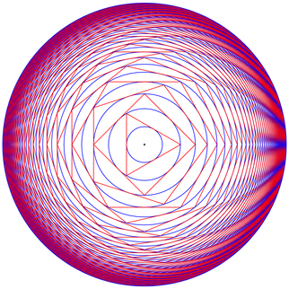</a>
            <figcaption class="text-center">Circumscribed polygons and circles</figcaption>
        </figure>
Used matlab
Source: <a href="http://www.texample.net/tikz/examples/circumscribed-polygons-and-circles/">texample.net</a>

<figure class="aligncenter">
            <a href="../images/2012/06/mosaik-from-pompeii.png">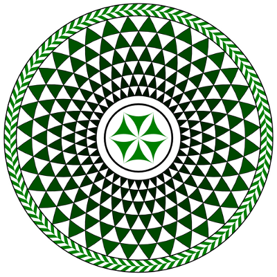</a>
            <figcaption class="text-center">Mosaic from Pompeii</figcaption>
        </figure>
Source: <a href="http://www.texample.net/tikz/examples/mosaic-from-pompeii/">texample.net</a>

<figure class="aligncenter">
            <a href="../images/2012/06/dandelin-spheres.png">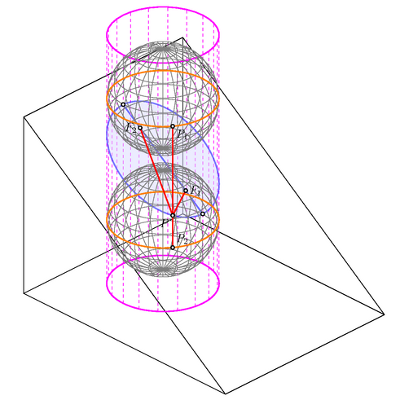</a>
            <figcaption class="text-center">Plane Sections of the Cylinder - Dandelin Spheres</figcaption>
        </figure>
Source: <a href="http://www.texample.net/tikz/examples/dandelin-spheres/">texample.net</a>

<figure class="aligncenter">
            <a href="../images/2012/06/dipolar-magnetic-field.png">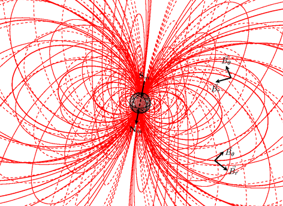</a>
            <figcaption class="text-center">Example: Dipolar magnetic field</figcaption>
        </figure>
Source: <a href="http://www.texample.net/tikz/examples/dipolar-magnetic-field/">texample.net</a>

<figure class="aligncenter">
            <a href="../images/2012/06/gamma-interaction.png">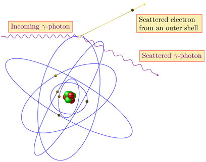</a>
            <figcaption class="text-center">Gamma interaction</figcaption>
        </figure>
Source: <a href="http://www.texample.net/tikz/examples/gamma-interaction/">texample.net</a>

<figure class="aligncenter">
            <a href="../images/2012/06/complete-graph.png">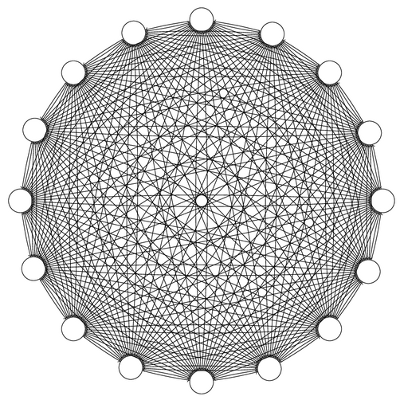</a>
            <figcaption class="text-center">A complete graph</figcaption>
        </figure>
Source: <a href="http://www.texample.net/tikz/examples/complete-graph/">texample.net</a>

<figure class="aligncenter">
            
            <figcaption class="text-center">Mandala</figcaption>
        </figure>
Source: <a href="http://www.texample.net/tikz/examples/mandala/">texample.net</a>

<figure class="aligncenter">
            <a href="../images/2012/06/pascals-triangle.png">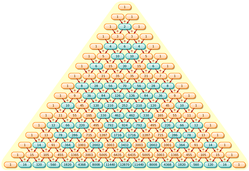</a>
            <figcaption class="text-center">Pascal&rsquo;s triangle and Sierpinski triangle</figcaption>
        </figure>
Source: <a href="http://www.texample.net/tikz/examples/pascals-triangle-and-sierpinski-triangle/">texample.net</a>

<figure class="aligncenter">
            <a href="../images/2012/06/seismic-focal-mechanism.png">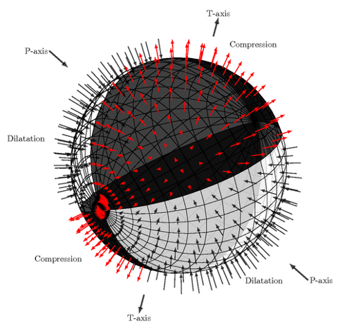</a>
            <figcaption class="text-center">Seismic focal mechanism in 3D view</figcaption>
        </figure>
Source: <a href="http://www.texample.net/tikz/examples/seismic-focal-mechanism-in-3d-view/">texample.net</a>

<figure class="aligncenter">
            <a href="../images/2012/06/membrane-surface.png">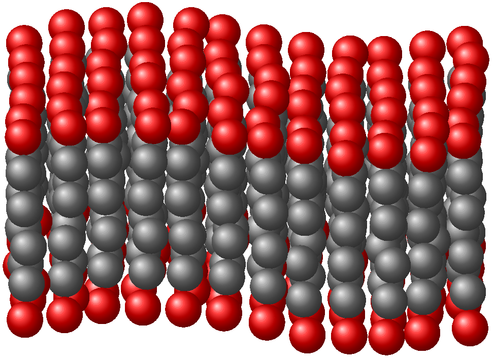</a>
            <figcaption class="text-center">Membrane-like surface</figcaption>
        </figure>
Source: <a href="http://www.texample.net/tikz/examples/membrane-surface/">texample.net</a>

<figure class="aligncenter">
            <a href="../images/2012/06/mindmap.png">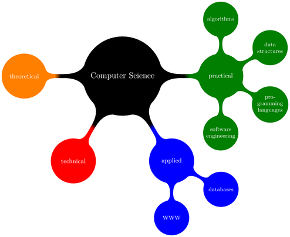</a>
            <figcaption class="text-center">Computer science mindmap</figcaption>
        </figure>
Source: <a href="http://www.texample.net/tikz/examples/computer-science-mindmap/">texample.net</a>

<figure class="aligncenter">
            <a href="../images/2012/06/spherical-and-cartesian-grids.png">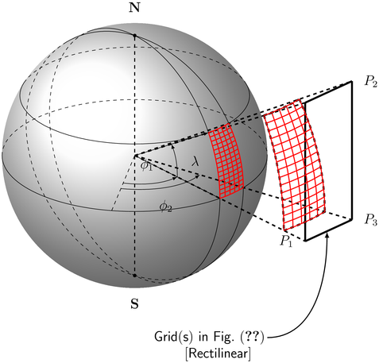</a>
            <figcaption class="text-center">Spherical and cartesian grids</figcaption>
        </figure>
Source: <a href="http://www.texample.net/tikz/examples/spherical-and-cartesian-grids/">texample.net</a>

Do you know more? Please leave a comment!

<h2>See also</h2>
<ul>
  <li><a href="http://tex.stackexchange.com/q/61437/5645">Penrose tiling in TikZ</a></li>
  <li><a href="http://www.texample.net/tikz/examples/lindenmayer-systems/">Lindenmayer systems</a></li>
  <li><a href="http://tex.stackexchange.com/q/54341/5645">How to draw nanotubes with TeX</a></li>
</ul>
