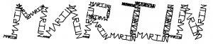
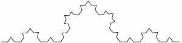
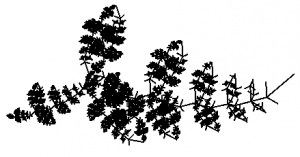

<blockquote>[...] Fractals are typically self-similar patterns, where self-similar means they are "the same from near as from far". [...] The definition of fractal goes beyond self-similarity per se to exclude trivial self-similarity and include the idea of a detailed pattern repeating itself.</blockquote>
Source: <a href="http://en.wikipedia.org/wiki/Fractal">Fractal</a>, Wikipedia

<h2>Examples</h2>
The <a href="http://en.wikipedia.org/wiki/Rensselaer_Polytechnic_Institute">Rensselaer Polytechnic Institute</a> made an <a href="http://www.ccd.rpi.edu/eglash/temp/CS%20RPI/Chapter%201.2.html">applet</a> which allows you to create fractals by yourself.
So I've tried this one as a starter:
<figure class="aligncenter">
            
            <figcaption class="text-center">Martin Fractal #1</figcaption>
        </figure>
<figure class="aligncenter">
            
            <figcaption class="text-center">Martin Fractal #2</figcaption>
        </figure>
<figure class="aligncenter">
            
            <figcaption class="text-center">Martin Fractal #3</figcaption>
        </figure>

You might know this one:
<figure class="aligncenter">
            
            <figcaption class="text-center">Snowflake fractal #1</figcaption>
        </figure>

<figure class="aligncenter">
            
            <figcaption class="text-center">Snowflake fractal #2</figcaption>
        </figure>

<figure class="aligncenter">
            
            <figcaption class="text-center">Snowflake fractal #3</figcaption>
        </figure>

<figure class="aligncenter">
            
            <figcaption class="text-center">Snowflake fractal #4</figcaption>
        </figure>

<h2>Fractals in Nature</h2>
Fractals seem to appear quite often in nature. I have just re-created one that I have seen recently:
<figure class="aligncenter">
            
            <figcaption class="text-center">Leaf fractal #1</figcaption>
        </figure>

<figure class="aligncenter">
            
            <figcaption class="text-center">Leaf fractal #2</figcaption>
        </figure>

<figure class="aligncenter">
            
            <figcaption class="text-center">Leaf fractal #3</figcaption>
        </figure>

<figure class="aligncenter">
            
            <figcaption class="text-center">Leaf fractal #4</figcaption>
        </figure>

<figure class="aligncenter">
            
            <figcaption class="text-center">Leaf fractal #5</figcaption>
        </figure>

<figure class="aligncenter">
            
            <figcaption class="text-center">Leaf fractal #6</figcaption>
        </figure>

<figure class="aligncenter">
            
            <figcaption class="text-center">Leaf fractal #9</figcaption>
        </figure>

<h2>Mandelbrot set</h2>
The <a href="http://en.wikipedia.org/wiki/Mandelbrot_set">Mandelbrot set</a> is maybe the best known fractal, although it is not a fractal in my opinion. It does never repeat itself.

<iframe width="512" height="288" src="//www.youtube.com/embed/1o5FMTHkLQg" frameborder="0" allowfullscreen></iframe>

<h2>See also</h2>
<ul>
  <li><a href="http://en.wikipedia.org/wiki/Fractal">Fractal</a></li>
  <li>Mandelbrot set</li>
  <li><a href="http://www.acm.uiuc.edu/~troys2/tutorials/FractalTreeReel2.swf">Visualization of a fractal</a></li>
  <li>TED Talk: <a href="http://www.ted.com/talks/lang/en/ron_eglash_on_african_fractals.html">Ron Eglash on African fractals</a></li>
</ul>
