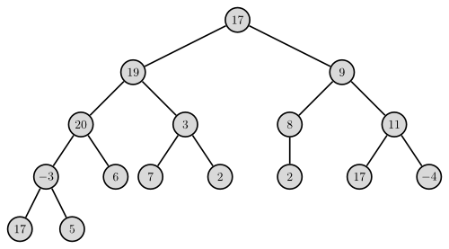
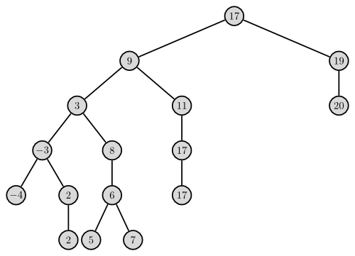
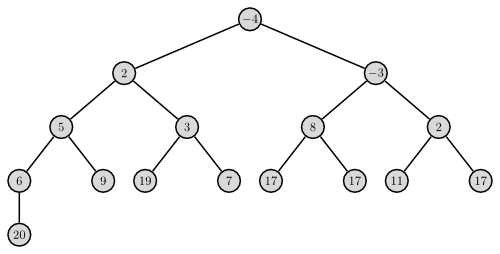
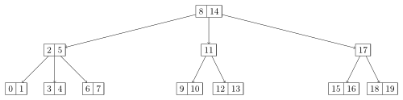

Diese &Uuml;bersicht beinhaltet grundlegende Datenstrukturen. Es gibt weitaus <a href="http://de.wikipedia.org/wiki/Kategorie:Datenstruktur">mehr Datenstrukturen</a> (z.B. <a href="http://de.wikipedia.org/wiki/Bloomfilter">Bloomfilter</a>), als ich hier erw&auml;hne. Diese Datenstrukturen wurden in der Vorlesung Algorithmen I bei Frau Zitterbart am KIT erkl&auml;rt.

<h2>Array</h2>
<figure class="aligncenter">
            <a href="../images/2012/07/array.png"></a>
            <figcaption class="text-center">Array</figcaption>
        </figure>
Ein Array, auch <a href="http://de.wikipedia.org/wiki/Feld_(Datentyp)">Feld</a> genannt, ist eine Datenstruktur.
Charakteristika:
<ul>
  <li>Ein Array hat eine feste, nicht ver&auml;nderbare Gr&ouml;&szlig;e.</li>
  <li>Der Zugriff auf jedes beliebige Element erfolgt in konstanter Zeit - ist also insbesondere unabh&auml;ngig von der Gr&ouml;&szlig;e!</li>
</ul>

<h2>Dynamische Arrays</h2>
Dynamische Arrays sind wie normale Arrays, nur dass sie wachsen k&ouml;nnen. Sobald ein Element eingef&uuml;gt werden soll, dass nicht mehr ins Array passen w&uuml;rde, allokiert man ein doppelt so gro&szlig;es Array und kopiert die Elemente um.

In Java ist es ein <a href="http://docs.oracle.com/javase/7/docs/api/java/util/Vector.html">Vector</a> bzw. eine <a href="http://docs.oracle.com/javase/7/docs/api/java/util/ArrayList.html">ArrayList</a>, in <a href="../vectors-in-cpp/" title="Vectors in C++">C++ Vektoren</a>.

<h2>Hashtabelle</h2>
<blockquote>In der Informatik bezeichnet man eine spezielle Indexstruktur als Hashtabelle (englisch hash table oder hash map) bzw. Streuwerttabelle. Als Indexstruktur werden Hashtabellen verwendet um Datenelemente in einer gro&szlig;en Datenmenge aufzufinden. Zu Hashtabellen alternative Index-Datenstrukturen sind beispielsweise Baumstrukturen (wie etwa ein B+-Baum) und die Skip-List. Hashtabellen zeichnen sich durch einen &uuml;blicherweise konstanten Zeitaufwand bei Einf&uuml;ge- bzw. Entfernen-Operationen aus. Beim Einsatz einer Hashtabelle zur Suche in Datenmengen spricht man auch von einem Hashverfahren oder Streuspeicherverfahren.</blockquote>
Quelle: <a href="http://de.wikipedia.org/wiki/Hashtabelle">Hashtabelle</a>

Hashtabellen werden hier benutzt:
<ul>
  <li>Python 3.2.3: Modules/_pickle.c</li>
  <li>Java OpenJDK 7: <a href="http://docs.oracle.com/javase/7/docs/api/java/util/Hashtable.html">java.util.HashTable</a> und sehr viele mehr benutzen es (Properties.java, Dictionary.java, Enum.java, ...)</li>
</ul>

Sie garantieren eine amortisierte Laufzeit von ${\cal O}(1)$ f&uuml;r Suchen, L&ouml;schen und Einf&uuml;gen.

Folgende Begriffe sollte man kennen:
<ul>
  <li><a href="http://de.wikipedia.org/wiki/Divisionsrestmethode">Divisions-Rest-Methode</a>: $h(k) = k \mod m$</li>
  <li><a href="http://de.wikipedia.org/wiki/Multiplikative_Methode">Multiplikationsmethode</a>: $h(k) = \lfloor A \cdot k \mod 1 \rfloor$, mit z.B. $A \approx \frac{\sqrt{5}-1}{2}$</li>
  <li>offenes Hashing</li>
  <li><a href="http://de.wikipedia.org/wiki/Doppel-Hashing">Doppeltes Hashing</a>: $h(k, i) = (h_1(k) + i \cdot h_2(k)) \mod m$</li>
  <li><a href="http://de.wikipedia.org/wiki/Hashtabelle#Lineares_Sondieren">Lineares und quadratische Sondieren</a></li>
  <li>Belegungsfaktor: $\alpha = \frac{\text{Anzahl gespeicherter Elemente}}{\text{Anzahl der Slots}}$</li>
  <li>Prim&auml;re und sekund&auml;re Clusterbildung</li>
</ul>

<h2>Stack</h2>
<figure class="alignright">
            <a href="../images/2012/07/stack-101x300.png"></a>
            <figcaption class="text-center">Stack a capacity of 5 elements and size of 4.</figcaption>
        </figure>

Stacks, auch "<a href="http://de.wikipedia.org/wiki/Stapelspeicher">Stapelspeicher</a>" oder "Kellerspeicher" genannt, sind eine elementare Datenstruktur. Es sollte sie in jeder Sprache geben. In Java ist es in <a href="http://docs.oracle.com/javase/7/docs/api/java/util/Stack.html">java.util.Stack</a>, in Python sind es <a href="http://docs.python.org/tutorial/datastructures.html#using-lists-as-stacks">Listen</a> und nat&uuml;rlich gibt es auch in <a href="../stacks-in-cpp/" title="Stacks in C++">C++ Stacks</a>.

Wie man am Bild sehr sch&ouml;n sehen kann, definiert ein Stack keine Ordnung &uuml;ber die Elemente. Wenn ein neues Element kommt, wird es auf den Stack gelegt. Man kann auch nur das oberste Element - in diesem Fall a - vom Stack nehmen. Deshalb werden Stacks auch als LIFO-Speicher (<em>L</em>ast <em>I</em>n <em>F</em>irst <em>O</em>ut) bezeichnet.

Stacks werden mit dynamischen Arrays realisiert. Dazu mal ein kleines Beispiel:

```java

import java.util.Stack;

public class test {
    public static void main(String[] args) {
        Stack<Integer> s = new Stack<Integer>();

        s.add(12);
        s.push(13);

        for (int i = 0; i < 100; i++) {
            s.push(i);
            System.out.printf("size: %d \t capacity: %d\n",
                    s.size(), s.capacity());
        }

        while (s.size() > 0) {
            System.out.printf(
                    "Element: %d \t size: %d \t capacity: %d\n",
                    s.pop(),s.size(), s.capacity());
        }
    }
}

```


Ausgabe:
```bash

size: 3 	 capacity: 10
size: 4 	 capacity: 10
size: 5 	 capacity: 10
size: 6 	 capacity: 10
size: 7 	 capacity: 10
size: 8 	 capacity: 10
size: 9 	 capacity: 10
size: 10 	 capacity: 10
size: 11 	 capacity: 20
size: 12 	 capacity: 20
size: 13 	 capacity: 20
size: 14 	 capacity: 20
size: 15 	 capacity: 20
size: 16 	 capacity: 20
size: 17 	 capacity: 20
size: 18 	 capacity: 20
size: 19 	 capacity: 20
size: 20 	 capacity: 20
size: 21 	 capacity: 40
size: 22 	 capacity: 40
size: 23 	 capacity: 40
size: 24 	 capacity: 40
size: 25 	 capacity: 40
size: 26 	 capacity: 40
size: 27 	 capacity: 40
size: 28 	 capacity: 40
size: 29 	 capacity: 40
size: 30 	 capacity: 40
size: 31 	 capacity: 40
size: 32 	 capacity: 40
size: 33 	 capacity: 40
size: 34 	 capacity: 40
size: 35 	 capacity: 40
size: 36 	 capacity: 40
size: 37 	 capacity: 40
size: 38 	 capacity: 40
size: 39 	 capacity: 40
size: 40 	 capacity: 40
size: 41 	 capacity: 80
size: 42 	 capacity: 80
size: 43 	 capacity: 80
size: 44 	 capacity: 80
size: 45 	 capacity: 80
size: 46 	 capacity: 80
size: 47 	 capacity: 80
size: 48 	 capacity: 80
size: 49 	 capacity: 80
size: 50 	 capacity: 80
size: 51 	 capacity: 80
size: 52 	 capacity: 80
size: 53 	 capacity: 80
size: 54 	 capacity: 80
size: 55 	 capacity: 80
size: 56 	 capacity: 80
size: 57 	 capacity: 80
size: 58 	 capacity: 80
size: 59 	 capacity: 80
size: 60 	 capacity: 80
size: 61 	 capacity: 80
size: 62 	 capacity: 80
size: 63 	 capacity: 80
size: 64 	 capacity: 80
size: 65 	 capacity: 80
size: 66 	 capacity: 80
size: 67 	 capacity: 80
size: 68 	 capacity: 80
size: 69 	 capacity: 80
size: 70 	 capacity: 80
size: 71 	 capacity: 80
size: 72 	 capacity: 80
size: 73 	 capacity: 80
size: 74 	 capacity: 80
size: 75 	 capacity: 80
size: 76 	 capacity: 80
size: 77 	 capacity: 80
size: 78 	 capacity: 80
size: 79 	 capacity: 80
size: 80 	 capacity: 80
size: 81 	 capacity: 160
size: 82 	 capacity: 160
size: 83 	 capacity: 160
size: 84 	 capacity: 160
size: 85 	 capacity: 160
size: 86 	 capacity: 160
size: 87 	 capacity: 160
size: 88 	 capacity: 160
size: 89 	 capacity: 160
size: 90 	 capacity: 160
size: 91 	 capacity: 160
size: 92 	 capacity: 160
size: 93 	 capacity: 160
size: 94 	 capacity: 160
size: 95 	 capacity: 160
size: 96 	 capacity: 160
size: 97 	 capacity: 160
size: 98 	 capacity: 160
size: 99 	 capacity: 160
size: 100 	 capacity: 160
size: 101 	 capacity: 160
size: 102 	 capacity: 160
Element: 99 	 size: 101 	 capacity: 160
Element: 98 	 size: 100 	 capacity: 160
Element: 97 	 size: 99 	 capacity: 160
Element: 96 	 size: 98 	 capacity: 160
Element: 95 	 size: 97 	 capacity: 160
Element: 94 	 size: 96 	 capacity: 160
Element: 93 	 size: 95 	 capacity: 160
Element: 92 	 size: 94 	 capacity: 160
Element: 91 	 size: 93 	 capacity: 160
Element: 90 	 size: 92 	 capacity: 160
Element: 89 	 size: 91 	 capacity: 160
Element: 88 	 size: 90 	 capacity: 160
Element: 87 	 size: 89 	 capacity: 160
Element: 86 	 size: 88 	 capacity: 160
Element: 85 	 size: 87 	 capacity: 160
Element: 84 	 size: 86 	 capacity: 160
Element: 83 	 size: 85 	 capacity: 160
Element: 82 	 size: 84 	 capacity: 160
Element: 81 	 size: 83 	 capacity: 160
Element: 80 	 size: 82 	 capacity: 160
Element: 79 	 size: 81 	 capacity: 160
Element: 78 	 size: 80 	 capacity: 160
Element: 77 	 size: 79 	 capacity: 160
Element: 76 	 size: 78 	 capacity: 160
Element: 75 	 size: 77 	 capacity: 160
Element: 74 	 size: 76 	 capacity: 160
Element: 73 	 size: 75 	 capacity: 160
Element: 72 	 size: 74 	 capacity: 160
Element: 71 	 size: 73 	 capacity: 160
Element: 70 	 size: 72 	 capacity: 160
Element: 69 	 size: 71 	 capacity: 160
Element: 68 	 size: 70 	 capacity: 160
Element: 67 	 size: 69 	 capacity: 160
Element: 66 	 size: 68 	 capacity: 160
Element: 65 	 size: 67 	 capacity: 160
Element: 64 	 size: 66 	 capacity: 160
Element: 63 	 size: 65 	 capacity: 160
Element: 62 	 size: 64 	 capacity: 160
Element: 61 	 size: 63 	 capacity: 160
Element: 60 	 size: 62 	 capacity: 160
Element: 59 	 size: 61 	 capacity: 160
Element: 58 	 size: 60 	 capacity: 160
Element: 57 	 size: 59 	 capacity: 160
Element: 56 	 size: 58 	 capacity: 160
Element: 55 	 size: 57 	 capacity: 160
Element: 54 	 size: 56 	 capacity: 160
Element: 53 	 size: 55 	 capacity: 160
Element: 52 	 size: 54 	 capacity: 160
Element: 51 	 size: 53 	 capacity: 160
Element: 50 	 size: 52 	 capacity: 160
Element: 49 	 size: 51 	 capacity: 160
Element: 48 	 size: 50 	 capacity: 160
Element: 47 	 size: 49 	 capacity: 160
Element: 46 	 size: 48 	 capacity: 160
Element: 45 	 size: 47 	 capacity: 160
Element: 44 	 size: 46 	 capacity: 160
Element: 43 	 size: 45 	 capacity: 160
Element: 42 	 size: 44 	 capacity: 160
Element: 41 	 size: 43 	 capacity: 160
Element: 40 	 size: 42 	 capacity: 160
Element: 39 	 size: 41 	 capacity: 160
Element: 38 	 size: 40 	 capacity: 160
Element: 37 	 size: 39 	 capacity: 160
Element: 36 	 size: 38 	 capacity: 160
Element: 35 	 size: 37 	 capacity: 160
Element: 34 	 size: 36 	 capacity: 160
Element: 33 	 size: 35 	 capacity: 160
Element: 32 	 size: 34 	 capacity: 160
Element: 31 	 size: 33 	 capacity: 160
Element: 30 	 size: 32 	 capacity: 160
Element: 29 	 size: 31 	 capacity: 160
Element: 28 	 size: 30 	 capacity: 160
Element: 27 	 size: 29 	 capacity: 160
Element: 26 	 size: 28 	 capacity: 160
Element: 25 	 size: 27 	 capacity: 160
Element: 24 	 size: 26 	 capacity: 160
Element: 23 	 size: 25 	 capacity: 160
Element: 22 	 size: 24 	 capacity: 160
Element: 21 	 size: 23 	 capacity: 160
Element: 20 	 size: 22 	 capacity: 160
Element: 19 	 size: 21 	 capacity: 160
Element: 18 	 size: 20 	 capacity: 160
Element: 17 	 size: 19 	 capacity: 160
Element: 16 	 size: 18 	 capacity: 160
Element: 15 	 size: 17 	 capacity: 160
Element: 14 	 size: 16 	 capacity: 160
Element: 13 	 size: 15 	 capacity: 160
Element: 12 	 size: 14 	 capacity: 160
Element: 11 	 size: 13 	 capacity: 160
Element: 10 	 size: 12 	 capacity: 160
Element: 9 	 size: 11 	 capacity: 160
Element: 8 	 size: 10 	 capacity: 160
Element: 7 	 size: 9 	 capacity: 160
Element: 6 	 size: 8 	 capacity: 160
Element: 5 	 size: 7 	 capacity: 160
Element: 4 	 size: 6 	 capacity: 160
Element: 3 	 size: 5 	 capacity: 160
Element: 2 	 size: 4 	 capacity: 160
Element: 1 	 size: 3 	 capacity: 160
Element: 0 	 size: 2 	 capacity: 160
Element: 13 	 size: 1 	 capacity: 160
Element: 12 	 size: 0 	 capacity: 160

```


Wenn man das ausf&uuml;hrt, sieht man es recht schnell. Alternativ schaut man in die Dokumentation und liest:
<blockquote>The Stack class represents a last-in-first-out (LIFO) stack of objects. It extends class Vector with five operations that allow a vector to be treated as a stack.</blockquote>

<table>
<tr>
<th>Operation</th>
<th>Worst-Case-Laufzeit</th>
<th>Anmerkungen</th>
</tr>
<tr>
<td>Push</td>
<td>${\cal O}(1)$</td>
<td>Ein Element auf den Stack legen</td>
</tr>
<tr>
<td>Pop</td>
<td>${\cal O}(1)$</td>
<td>Das oberste Element von der Liste nehmen</td>
</tr>
</table>

Ein Stack l&auml;sst sich als doppelt verkettete, zyklische Liste implementieren.

<h2>Warteschlangen</h2>
Warteschlangen, auch Queues genannt, sind Stacks sehr &auml;hnlich. Beide unterst&uuml;tzen prinzipiell nur zwei Operationen. Bei Stacks nanne es sich PUSH und POP, bei Warteschlangen hei&szlig;t es ENQUEUE und DEQUEUE. Im Unterschied zum Stack wird bei der Warteschlange das Element nicht von oben wieder weggenommen, sondern von hinten. Das Bild einer Warteschlange ist hier sehr passend.

<table>
<tr>
<th>Operation</th>
<th>Worst-Case-Laufzeit</th>
<th>Anmerkungen</th>
</tr>
<tr>
<td>Enqueue</td>
<td>${\cal O}(1)$</td>
<td>Ein Element auf den Stack legen</td>
</tr>
<tr>
<td>Dequeue</td>
<td>${\cal O}(1)$</td>
<td>Das oberste Element von der Liste nehmen</td>
</tr>
</table>

Eine Warteschlange l&auml;sst sich als doppelt verkettete, zyklische Liste implementieren.

<h2>Verkettete Listen</h2>
Wie bei allen Datenstrukturen, kann man f&uuml;r verkettete Listen mehr Operationen definieren und umsetzen, als ich hier aufliste. Eine gute Menge von Operationen wird durch das <a href="http://docs.oracle.com/javase/7/docs/api/java/util/List.html">Java List Interface</a> vorgegeben.

<h3>Einfach verkettete Liste</h3>
<figure class="aligncenter">
            <a href="../images/2012/07/singly-linked-list.png"></a>
            <figcaption class="text-center">Singly linked list</figcaption>
        </figure>

Sei $n$ die Anzahl der Elemente der Liste.
<table>
<tr>
<th>Operation</th>
<th>Worst-Case-Laufzeit</th>
<th>Anmerkungen</th>
</tr>
<tr>
<td>Suchen</td>
<td>${\cal O}(n)$</td>
<td>&rarr; Element ist am Ende der Liste</td>
</tr>
<tr>
<td>Minimum</td>
<td>${\cal O}(n)$</td>
<td>&rarr; Element ist am Ende der Liste</td>
</tr>
<tr>
<td>Maximum</td>
<td>${\cal O}(n)$</td>
<td>&rarr; Element ist am Ende der Liste</td>
</tr>
<tr>
<td>Einf&uuml;gen am Anfang</td>
<td>${\cal O}(1)$</td>
<td></td>
</tr>
<tr>
<td>Wahlfreies Einf&uuml;gen</td>
<td>${\cal O}(n)$</td>
<td></td>
</tr>
<tr>
<td>L&ouml;schen</td>
<td>${\cal O}(n)$</td>
<td>&rarr; Suchen</td>
</tr>
<tr>
<td>Vorg&auml;nger</td>
<td>${\cal O}(n)$</td>
<td></td>
</tr>
<tr>
<td>Nachfolger</td>
<td>${\cal O}(1)$</td>
<td></td>
</tr>
</table>

<h3>Doppelt verkettete Liste</h3>
<figure class="aligncenter">
            <a href="../images/2012/07/doubly-linked-list.png"></a>
            <figcaption class="text-center">Doubly linked list</figcaption>
        </figure>

Sei $n$ die Anzahl der Elemente der Liste.
<table>
<tr>
<th>Operation</th>
<th>Worst-Case-Laufzeit</th>
<th>Anmerkungen</th>
</tr>
<tr>
<td>Suchen</td>
<td>${\cal O}(n)$</td>
<td>&rarr; Element ist am Ende der Liste</td>
</tr>
<tr>
<td>Minimum</td>
<td>${\cal O}(n)$</td>
<td>&rarr; Element ist am Ende der Liste</td>
</tr>
<tr>
<td>Maximum</td>
<td>${\cal O}(n)$</td>
<td>&rarr; Element ist am Ende der Liste</td>
</tr>
<tr>
<td>Einf&uuml;gen am Anfang</td>
<td>${\cal O}(1)$</td>
<td></td>
</tr>
<tr>
<td>Wahlfreies Einf&uuml;gen</td>
<td>${\cal O}(n)$</td>
<td></td>
</tr>
<tr>
<td>L&ouml;schen</td>
<td>${\cal O}(n)$</td>
<td>&rarr; Suchen</td>
</tr>
<tr>
<td>Vorg&auml;nger</td>
<td>${\cal O}(1)$</td>
<td>Nur hier ist die doppelt-verkettete Liste besser als die einfach verkettete Liste.</td>
</tr>
<tr>
<td>Nachfolger</td>
<td>${\cal O}(1)$</td>
<td></td>
</tr>
</table>

<h2>B&auml;ume</h2>
In der Vorlesung wurden B&auml;ume sehr unpr&auml;zise eingef&uuml;hrt. Ich versuche das mal etwas pr&auml;ziser zu machen:
<div class="definition">Sei $G = (V, E)$ ein gerichteter Graph.
$G$ hei&szlig;t <strong>gerichteter Baum</strong> $: \Leftrightarrow \exists_{r \in V} \forall_{x \in V}:$Es exisitert genau ein Pfad von $r$ nach $x$.</div>

<div class="definition">Sei $G = (V, E)$ ein gerichteter Baum und sei $r \in V$ das $r$ aus der Definition. $r$ hei&szlig;t <strong>Wurzel</strong> von $G$.</div>

ACHTUNG: Die folgende Definition habe ich mir ausgedacht! NICHT IN DER KLAUSUR VERWENDEN!
<div class="definition">Sei $E \subseteq V \times V$ eine Menge ungerichteter Kanten.
Dann bezeichne $G(E) := \{(v, w) | \{v, w\} \in E\}$ die Menge aller zugeh&ouml;rigen gerichteten Kanten.</div>

<div class="definition">Sei $U = (V, E)$ ein ungerichteter Graph.
$U$ hei&szlig;t ein <strong>ungerichteter Baum</strong> $:\Leftrightarrow \exists$ gerichteten Baum $G = (V, E')$ mit $E' \subsetneq G(E)$.</div>

<div class="definition">Sei $G = (V, E)$ ein Baum und $x, y \in V$.
$x$ hei&szlig;t <strong>Elternknoten</strong> von $y :\Leftrightarrow x$ liegt auf dem Pfad von der Wurzel nach $y$ direkt vor $y$.</div>

<div class="definition">Sei $G = (V, E)$ ein Baum und $x, y \in V$.
$x$ hei&szlig;t <strong>Kindknoten</strong> von $y :\Leftrightarrow y$ ist Elternknoten von $x$.</div>

<h3>Bin&auml;re B&auml;ume</h3>
<figure class="aligncenter">
            <a href="../images/2012/07/binary-tree.png"></a>
            <figcaption class="text-center">Binary tree datastructure</figcaption>
        </figure>

<div class="definition">Sei $G = (V, E)$ ein Baum.
$G$ hei&szlig;t <strong>bin&auml;rer Baum</strong> $:\Leftrightarrow \forall_{x \in V}: x$ hat h&ouml;chstens zwei Kindknoten.</div>

Ich beziehe mich im folgenden auf ungerichtete, bin&auml;re B&auml;ume. Soll hei&szlig;en, jeder Knoten kennt seine Kinder- <strong>und</strong> seinen Vaterknoten.

Wie w&uuml;rde man das implementieren? Im Prinzip wie eine doppelt verkettete Liste. Jeder Knoten hat einen Zeiger auf den Eltern-Knoten und zwei Zeiger auf die Kindknoten.
<table>
<tr>
<th>Operation</th>
<th>Worst-Case-Laufzeit</th>
<th>Anmerkungen</th>
</tr>
<tr>
<td>Suchen</td>
<td>${\cal O}(|V| + |E|)$</td>
<td>&rarr; <a href="http://de.wikipedia.org/wiki/Traversierung#Graphentheorie">Graphentraversierung</a></td>
</tr>
<tr>
<td>Minimum</td>
<td>${\cal O}(|V| + |E|)$</td>
<td>&rarr; <a href="http://de.wikipedia.org/wiki/Traversierung#Graphentheorie">Graphentraversierung</a></td>
</tr>
<tr>
<td>Maximum</td>
<td>${\cal O}(|V| + |E|)$</td>
<td>&rarr; <a href="http://de.wikipedia.org/wiki/Traversierung#Graphentheorie">Graphentraversierung</a></td>
</tr>
<tr>
<td>Einf&uuml;gen</td>
<td>${\cal O}(|V|)$</td>
<td></td>
</tr>
<tr>
<td>L&ouml;schen</td>
<td>${\cal O}(|V| + |E|)$</td>
<td>&rarr; Suchen</td>
</tr>
<tr>
<td>Vorg&auml;nger</td>
<td>${\cal O}(1)$</td>
<td>Implementierungsabh&auml;ngig!</td>
</tr>
<tr>
<td>Nachfolger</td>
<td>${\cal O}(1)$</td>
<td></td>
</tr>
</table>

<h3>Suchb&auml;ume</h3>
<figure class="aligncenter">
            <a href="../images/2012/07/binary-search-tree.png"></a>
            <figcaption class="text-center">Binary search tree</figcaption>
        </figure>
Dieser Baum hat die gleichen Werte wie der Baum oberhalb, aber es gilt nun:
Der Wert aller Knoten links vom aktuellen Konten ist kleiner oder gleich dem des aktuelle, der Wert aller Knoten rechts davon ist echt gr&ouml;&szlig;er.

Ich beschr&auml;nke mich hier auf bin&auml;re Suchb&auml;ume.

Damit ergeben sich folgende Laufzeiten:
Sei $G = (V, E)$ ein beliebiger bin&auml;rer Suchbaum.
Jeder Knoten kennt seine Kinder- <strong>und</strong> seinen Vaterknoten.
<table>
<tr>
<th>Operation</th>
<th>Worst-Case-Laufzeit</th>
<th>Anmerkungen</th>
</tr>
<tr>
<td>Suchen</td>
<td>${\cal O}(|V|)$</td>
<td>&rarr; Verkettete Liste</td>
</tr>
<tr>
<td>Minimum</td>
<td>${\cal O}(|V|)$</td>
<td>&rarr; Verkettete Liste</td>
</tr>
<tr>
<td>Maximum</td>
<td>${\cal O}(|V|)$</td>
<td>&rarr; Verkettete Liste</td>
</tr>
<tr>
<td>Einf&uuml;gen</td>
<td>${\cal O}(|V|)$</td>
<td>&rarr; Verkettete Liste</td>
</tr>
<tr>
<td>L&ouml;schen</td>
<td>${\cal O}(|V|)$</td>
<td>&rarr; Verkettete Liste</td>
</tr>
<tr>
<td>Vorg&auml;nger</td>
<td>${\cal O}(1)$</td>
<td>Implementierungsabh&auml;ngig!</td>
</tr>
<tr>
<td>Nachfolger</td>
<td>${\cal O}(1)$</td>
<td></td>
</tr>
</table>

<h4>Rot-Schwarz-B&auml;ume</h4>
<figure class="aligncenter">
            <a href="../images/2012/07/red-black-tree1.png"></a>
            <figcaption class="text-center">Red Black Tree</figcaption>
        </figure>

Sei $G = (V, E)$ ein bin&auml;rer Suchbaum.
G hei&szlig;t Rot-Schwarz-Baum $: \Leftrightarrow$ F&uuml;r G gilt:
<ol>
  <li>Jeder Knoten ist entweder Rot oder Schwarz.</li>
  <li>Der Wurzelknoten ist schwarz.</li>
  <li>Die Blattknoten sind schwarz.</li>
  <li>Ein Knoten ist rot $\Rightarrow$ Beide Kinder sind schwarz.</li>
  <li>$\forall x \in V:$ Alle Pfade von x zu einem Blatt haben die gleiche Anzahl schwarzer Knoten.</li>
</ol>

<table>
<tr>
<th>Operation</th>
<th>Worst-Case-Laufzeit</th>
<th>Anmerkungen</th>
</tr>
<tr>
<td>Suchen</td>
<td>${\cal O}(\lg n)$</td>
<td></td>
</tr>
<tr>
<td>Minimum</td>
<td>${\cal O}(\lg n)$</td>
<td></td>
</tr>
<tr>
<td>Maximum</td>
<td>${\cal O}(\lg n)$</td>
<td></td>
</tr>
<tr>
<td>Einf&uuml;gen</td>
<td>${\cal O}(\lg n)$</td>
<td></td>
</tr>
<tr>
<td>L&ouml;schen</td>
<td>${\cal O}(\lg n)$</td>
<td></td>
</tr>
<tr>
<td>Vorg&auml;nger</td>
<td>${\cal O}(1)$</td>
<td></td>
</tr>
<tr>
<td>Nachfolger</td>
<td>${\cal O}(1)$</td>
<td></td>
</tr>
</table>

Eine Python-Implementation ist hier zu finden: <a href="https://github.com/MartinThoma/algorithms/blob/master/datastructures/redBlackTree.py">https://github.com/MartinThoma/algorithms</a>

<h3>Heaps</h3>
<figure class="aligncenter">
            <a href="../images/2012/07/heap.png"></a>
            <figcaption class="text-center">Ein bin&auml;rer Min-Heap</figcaption>
        </figure>

Ich beschr&auml;nke mich im folgenden auf <a href="http://de.wikipedia.org/wiki/Bin%C3%A4rer_Heap">bin&auml;re Min-Heaps</a>.
<table>
<tr>
<th>Operation</th>
<th>Worst-Case-Laufzeit</th>
<th>Anmerkungen</th>
</tr>
<tr>
<td>Suchen</td>
<td>${\cal O}(n)$</td>
<td>&rarr; Falls als array dargestellt, einfach alle Elemente des Arrays durchlaufen</td>
</tr>
<tr style="background-color:#99FF99">
<td>Minimum</td>
<td>${\cal O}(1)$</td>
<td></td>
</tr>
<tr style="background-color:#99FF99">
<td>Extract-Minimum</td>
<td>${\cal O}(\log n)$</td>
<td>&rarr; Heapify</td>
</tr>
<tr>
<td>Maximum</td>
<td>${\cal O}(n)$</td>
<td>&rarr; Suche</td>
</tr>
<tr>
<td>Einf&uuml;gen</td>
<td>${\cal O}(\log n)$</td>
<td>&rarr; Heapify</td>
</tr>
<tr>
<td>L&ouml;schen</td>
<td>${\cal O}(\log n)$</td>
<td>&rarr; Heapify (bei bekannter Position des Elements, sonst siehe Suche)</td>
</tr>
<tr>
<td>Vorg&auml;nger</td>
<td>${\cal O}(1)$</td>
<td>Hat keine besondere Bedeutung in Heaps.</td>
</tr>
<tr>
<td>Nachfolger</td>
<td>${\cal O} (1)$</td>
<td>Hat keine besondere Bedeutung in Heaps.</td>
</tr>
</table>

<h3>B-B&auml;ume</h3>
<figure class="aligncenter">
            <a href="../images/2012/07/b-tree-2.png"></a>
            <figcaption class="text-center">B-Baum der Ordnung 2</figcaption>
        </figure>
<figure class="aligncenter">
            <a href="../images/2012/07/b-tree-3.png"></a>
            <figcaption class="text-center">B-Baum der Ordnung 3</figcaption>
        </figure>

<blockquote>Ein B-Baum ist ein immer vollst&auml;ndig balancierter Baum, der Daten sortiert nach Schl&uuml;sseln speichert. Er kann bin&auml;r sein, ist aber im Allgemeinen kein Bin&auml;rbaum. Das Einf&uuml;gen, Suchen und L&ouml;schen von Daten in B-B&auml;umen ist in amortisiert logarithmischer Zeit m&ouml;glich. B-B&auml;ume wachsen &ndash; und schrumpfen &ndash; anders als viele Suchb&auml;ume von den Bl&auml;ttern hin zur Wurzel.</blockquote>
Quelle: <a href="http://de.wikipedia.org/wiki/B-Baum">Wikipedia</a>

Die beiden abgebildeten B-B&auml;ume sind entstanden, indem die Zahlen von 0 bis 19 in aufsteigener Reihenfolge eingef&uuml;gt wurden.

F&uuml;r einen B-Baum der Ordnung t, $t \geq 2$, gilt:
<ul>
  <li>Alle Pfade von der Wurzel zu einem Blatt sind gleich lang.</li>
  <li>Die Wurzel hat mindestens 2, h&ouml;chstens 2t Kinder.</li>
  <li>Alle anderen inneren Knoten haben mindestens t, h&ouml;chstens 2t Kinder.</li>
  <li>Jeder Knoten mit i Kindern hat i-1 Schl&uuml;ssel.</li>
</ul>

Die beiden B-B&auml;ume habe ich mit <a href="https://gist.github.com/3159687">diesem Script</a> erstellt.

Mehr zu B-B&auml;umen gibt es in diesem <a href="../b-baume/" title="B-B&auml;ume">Artikel &uuml;ber B-B&auml;ume</a>.

<h3>Tries</h3>
<figure class="aligncenter">
            <a href="../images/2012/07/trie.png"></a>
            <figcaption class="text-center">Trie</figcaption>
        </figure>
Bildquelle: <a href="http://commons.wikimedia.org/wiki/File:Trie.svg">Wikipedia</a>

Ein Trie ist ein spezieller digitaler Baum.
<blockquote>Ein Trie oder Pr&auml;fixbaum ist eine Datenstruktur, die in der Informatik zum Suchen nach Zeichenketten verwendet wird. Es handelt sich dabei um einen speziellen Suchbaum zur gleichzeitigen Speicherung mehrerer Zeichenketten.</blockquote>
Quelle: <a href="http://de.wikipedia.org/wiki/Trie">Wikipedia</a>


Wo werden Tries genutzt?
<ul>
  <li>Python charmap encoder (<a href="http://mail.python.org/pipermail/patches/2006-May/019891.html">source</a>)</li>
  <li>Der <a href="http://docs.oracle.com/javase/7/docs/api/java/text/Normalizer.html">Normalizer</a> scheint Tries zu verwenden.</li>
</ul>
