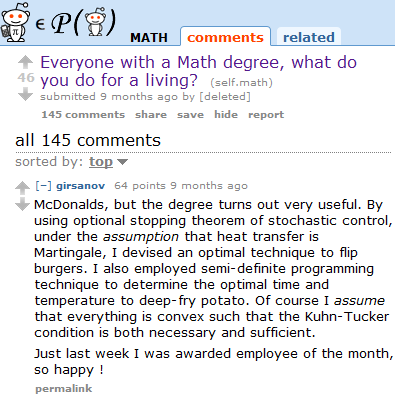
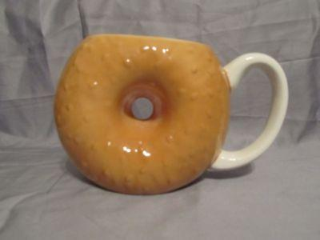
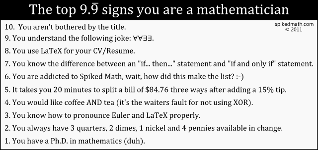

<iframe width="512" height="288" src="//www.youtube.com/embed/aYIv4jggQJc" frameborder="0" allowfullscreen></iframe>

## Math is beautiful

See also:
<ul>
  <li><a href="//www.youtube.com/watch?v=I1UzGC15sBI&feature=youtu.be&t=3m18s">Different sizes of infinity</a></li>
  <li><a href="http://youtu.be/ud-GOdM255c">Beauty in Maths: math animation no.7</a> - 5D Visualization of three equations</li>
</ul>

<h2>Math is important</h2>
If you are interested in natural science, you will definitely need math. Here are a few examples where math is directly needed:

<ul>
  <li><strong>Computer Science</strong>: All kinds of animations, stochastics is needed often, cryptography needs number theory</li>
  <li><strong>Physics</strong>: a lot of analysis seems to be needed, differential equations are used if processes are depend on time</li>
  <li><strong>Chemistry</strong>, <strong>Biology</strong>, <strong>Medicine</strong>, <strong>Psychology</strong>: again stochastics for interpreting results of experiments</li>
  <li><strong>economic science</strong>: modelling - I don't know anything about economic science, but I've heard they need differential equations</li>
</ul>

Although I guess you could continue this list, but the most important reason is that it teaches you how to think logically.

## Jobs are better
<figure>
    
    <figcaption>What you earn with a math-degree 😉</figcaption>
</figure>

## Math is worth a lot of money
<iframe width="512" height="384" src="//www.youtube.com/embed/BbX44YSsQ2I" frameborder="0" allowfullscreen></iframe>

## Math is fun
<figure>
    
    <figcaption>Only topologists really understand this joke, I guess...</figcaption>
</figure>

<figure>
    
    <figcaption>The top 10 signs you&rsquo;re a mathematician/computer scientist</figcaption>
</figure>

<iframe width="512" height="288" src="//www.youtube.com/embed/mpITo-RN-bY" frameborder="0" allowfullscreen></iframe>

## Money

Not knowing mathematics can cost you money. An obvious example is:

<iframe width="512" height="384" src="//www.youtube-nocookie.com/embed/BbX44YSsQ2I" frameborder="0" allowfullscreen></iframe>
