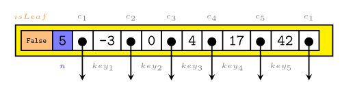

Ein B-Baum ist eine Datenstruktur, die vor allem für Datenbanken (z.B. <a href="http://de.wikipedia.org/wiki/SQLite">SQLite</a>) und Dateisysteme (z.B. <a href="http://de.wikipedia.org/wiki/Ext3">ext3</a>) eingesetzt wird.

Im Folgenden sollte man immer im Hinterkopf behalten, dass an den Schlüsseln auch Werte - sog. Satellitendaten - hängen. Der Einfachheit halber lasse ich diese aber hier weg.

<h2>Definition</h2>
Die folgende Definition ist sinngemäß aus "Introduction to Algorithms" von Thomas H. Cormen übernommen.

Für einen <strong>B-Baum der Ordnung t</strong>, $t \in \mathbb{N} \setminus \{1\}$, gilt:

<ol>
  <li>Jeder Knoten $x$ hat die folgenden Attribute:
    <ol>
      <li>$n$, die Anzahl der Schlüssel die im Knoten $x$ gespeichert wird,</li>
      <li>die $n$ Schlüssel, die in aufsteigender Reihenfolge gespeichert werden (also $key_1 \leq key_2 \leq ... \leq key_{n}$),</li>
      <li>$isLeaf$, ein boolscher Wert der <code>True</code> ist, falls $x$ ein Blatt ist und <code>False</code> ist, falls $x$ ein innerer Knoten ist</li>
    </ol>
  </li>
  <li>Jeder innere Knoten hat $n + 1$ Zeiger $c_1, c_2, ... c_{n+1}$ auf seine Kinder. Blattknoten haben keine Kinder, also sind ihre $c_i$-Attribute undefiniert.</li>
</ol>

Ein Knoten eines B-Baumes sieht also so aus:
<figure class="aligncenter">
            <a href="../images/2012/07/b-tree-node.png"></a>
            <figcaption class="text-center">Node of a B-tree</figcaption>
        </figure>

<ol start=3>
  <li>Die Schlüssel $key_i$ setzen grenzen für die Werte der Schlüssel, die in den einzelnen Subbäumen gespeichert sind.<br/> Falls $k_i$ ein Schlüssel im Subbaum mit der Wurzel $c_i$ ist, dann gilt: $k_1 \leq key_1 \leq k_2 \leq key_2 \leq ... \leq key_{n} \leq k_{n} \leq key_{n+1}$</li>
  <li>Alle Blätter haben die gleiche Tiefe.</li>
  <li>Für die Anzahl der Schlüssel eines Knotens gilt:
    <ol>
        <li>Jeder Knoten (bis auf die Wurzel) hat mindestens t-1 Schlüssel.</li>
        <li>Jeder Knoten hat höchstens $2t - 1$ Schlüssel.</li>
    </ol>
  </li>
</ol>

<h2>Stolperfallen</h2>
Ein Schlüssel ist etwas anderes als ein Zeiger!

<h2>Folgerungen</h2>
<ul>
  <li>$(2) \Rightarrow$ Die Wurzel hat min. 2 Kinder, falls der Baum nicht leer ist.</li>
  <li>$(2), (5.1) \Rightarrow$ Jeder innere Knoten (bis auf die Wurzel) hat min. t Kinder.</li>
  <li>$(2), (5.2) \Rightarrow$ Jeder innere Knoten hat maximal 2t Kinder.</li>
  <li>Wenn man an den Zeigern die Kinder in die Elterknoten zieht, sodass am Ende alle Knoten in der Wurzel sind, entsteht wegen (3) eine sortierte Liste.</li>
  <li>$ h \leq \log_t \frac{n+1}{2}$ (Cormen, S. 489)</li>
  <li>Ein B-Baum hat in der Tiefe h min. $2t^{h-1}$ Knoten.</li>
</ul>

<h2>Besondere B-Bäume</h2>
Ein B-Baum der Ordnung t = 2 wird auch <a href="http://de.wikipedia.org/wiki/2-3-4-Baum">2-3-4-Baum</a> genannt, da jeder Knoten entweder 2, 3 oder 4 Kinder hat.

Ich habe ja ausgeschlossen, dass es einen B-Baum der Ordnung t = 1 gibt. Warum eigentlich?
Aus (5.1) folgt: In einem B-Baum der Ordnung t = 1 müssten einzelne Knoten keine Schlüssel haben. Das ist nicht sinnvoll. Also muss $t \geq  2$ gelten.

<h2>Suchen eines Schlüssels</h2>
Das Suchen eines Schlüssels funktioniert so:

```txt
SEARCH-KEY(node, key):
    int i = 0

    while i < node.n and node.key[i].key < key:
        i += 1

    if node.key[i].key == key: # Schlüssel ist gesuchter Schlüssel
        return node.key[i].satelittendaten
    else if node.isLeaf: # Erfolglose Suche
        return NIL
    else: # Rekursiv weitersuchen
        DISK-READ(node.c[i])
        return SEARCH-KEY(node.c[i], key)
```

Es wird also zuerst der Knoten durchsucht und dann gegebenenfalls der passende Subbaum.

Laut Vorlesung (Folie 97) gilt:
<ul>
    <li>Anzahl Zugriffe auf Hintergrundspeicher maximal: ${\cal O}(\log_t(n))$</li>
    <li>Innerhalb eines Knotens: ${\cal O}(t)$</li>
    <li>Insgesamt also: ${\cal O}(t \cdot \log_t(n))$</li>
</ul>

<h2>Einfügen von Schlüsseln</h2>
Wenn ein Schlüssel in einen B-Baum eingefügt werden soll, dann muss man insebesondere auf Regel (5.1) und (5.2) achten:
Jeder Knoten enthält n Schlüssel, mit $t-1 \leq n \leq 2t -1$.

Die Idee ist, dass man das Blatt sucht, in dem der Schlüssel sein müsste. Falls noch Platz ist, kann man den Schlüssel einfach einfügen. Falls nicht, muss man das Blatt aufsplitten.

<h3>Beispiel zu Fall 1: Es ist noch Platz</h3>
<figure class="aligncenter">
            <a href="../images/2012/07/b-tree-2-small.png"></a>
            <figcaption class="text-center">Abb. 2: B-Baum der Ordnung t = 2</figcaption>
        </figure>

In den B-Baum aus Abb. 2 soll nun der Schlüssel <code>16</code> eingefügt werden. In einem B-Baum der Ordnung 2 hat jeder Knoten mindestens einen und höchstens 3 Schlüssel. Egal wo wir also landen würden, es würde noch in diesen Baum passen. Wir landen aber im Knoten rechts unten, da $11 < 16$ ist.

Das Ergebnis ist also:
<figure class="aligncenter">
            <a href="../images/2012/07/b-tree-2-small-2.png"></a>
            <figcaption class="text-center">Abb. 3: B-Baum der Ordnung t = 2</figcaption>
        </figure>

<h3>Beispiel zu Fall 2: Knotenüberlauf</h3>
Will man nun in den B-Baum der Ordnung 2 aus Abb. 3 den Schlüssel 17 hinzufügen, so gibt es einen "Knotenüberlauf". Der Schlüssel müsste in den Knoten rechts unten. Damit hätte dieser 4 Schlüssel, er darf aber nur 3 haben. Also splitten wir zuerst den Knoten. Schlüssel 15 wandert zu dem Elternknoten hoch, die beiden einzelnen Schlüssel bilden eigene Knoten. Damit man sieht, was mit den Schlüsseln geschehen würde, wenn der Baum größer wäre, habe ich diese mal eingefärbt:
<figure class="aligncenter">
            <a href="../images/2012/07/b-tree-2-small-3.png"></a>
            <figcaption class="text-center">Abb. 4: B-Baum der Ordnung t = 2</figcaption>
        </figure>

Nun ist man beim Einfügen von 17 wieder in Fall 1. Das Ergebnis sieht so aus:
<figure class="aligncenter">
            <a href="../images/2012/07/b-tree-2-small-4.png"></a>
            <figcaption class="text-center">Abb. 5: B-Baum der Ordnung t = 2</figcaption>
        </figure>

Natürlich kann es auch passieren, dass beim hochwandern des mittleren Knoten (15 von Abb. 3 nach Abb. 4) der Elternknoten überläuft. Dann muss halt auch dieser gesplittet werden. Wenn die Wurzel überläuft, muss eine neue Wurzel erstellt werden. Dann kann die alte Wurzel gesplittet werden.

Die Laufzeit des Einfügens ist in ${\cal O}(t \cdot \log_t(n))$.

<h2>Löschen eines Schlüssels</h2>
Falls sich der Schlüssel in einem Blatt befindet, kann man ihn einfach löschen. Allerdings muss man darauf achten, dass mindestens t-1 Schlüssel im Knoten verbleiben.

Ist der Schlüssel in einem inneren Knoten ist das ganze schwerer.

<h3>Fall 1: Schlüssel in Blatt</h3>
Der Einfachste Fall ist der <a href="#Beispiel_zu_Fall_1_Es_ist_noch_Platz">1. Fall des Einfügens</a>, nur umgekehrt. Also aus dem B-Baum aus Abb. 3 die 16 entfernen. Dann entsteht der B-Baum aus Abb. 2.

<h3>Fall 2 - 3</h3>
Für die anderen Fälle habe ich leider kein kleines Beispiel und will deshalb auf die Erklärung verzichten.

Falls ihr da Hilfe braucht:
Cormen, dritte Ausgabe, S. 499ff war sehr hilfreich. (<a href="http://shafaetsplanet.com/uploads/pdf/Introduction%20to%20Algorithms.pdf">Link</a> - Warum auch immer der eine PDF-Datei vom Buch hat. Die KIT-Bibliothek hat leider keine Online-Version.)

<h2>Trivia</h2>
<blockquote>[...] standard B-trees had numerous characteristics that were at odds with the ext2 design philosophy of simplicity and robustness. For example, XFS's B-tree implementation was larger than all of ext2 or ext3's source files combined.</blockquote>
Source: <a href="http://ext2.sourceforge.net/2005-ols/paper-html/node3.html">ext2.sourceforge.net</a>

<h2>Beispiel</h2>
Fügt man die Schlüssel 2, 4, 6, 8, 10, 12 in einen anfangs leeren B-Baum ein, entwickelt sich dieser wie folgt:

<figure class="aligncenter">
            <a href="../images/2012/07/b-tree-3-evolution.png"></a>
            <figcaption class="text-center">Entwicklung eines B-Baumes der Ordnung t = 3</figcaption>
        </figure>

Die grauen Felder sind für Zeiger reserviert. Ist kein Zeiger eingezeichnet, dann ist es ein NIL-Zeiger.

<h2>Siehe auch</h2>
<ul>
  <li><a href="http://stackoverflow.com/questions/11684578/which-datastructure-do-nodes-of-b-trees-use">Which datastructure do nodes of B-Trees use?</a></li>
  <li><a href="http://stackoverflow.com/questions/32376/what-is-a-good-open-source-b-tree-implementation-in-c">What is a good open source B-tree implementation in C?</a> - Da kann man mal sehen wie es wirklich funktioniert ☺</li>
  <li><a href="http://stackoverflow.com/a/6403383/562769">Red Black Tree vs. B Tree</a></li>
  <li><a href="http://stackoverflow.com/a/1589587/562769">When to choose RB tree, B-Tree or AVL tree?</a></li>
</ul>
