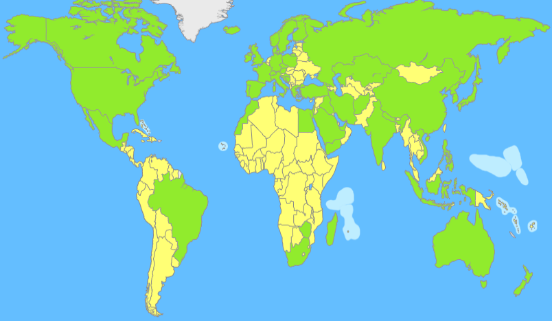
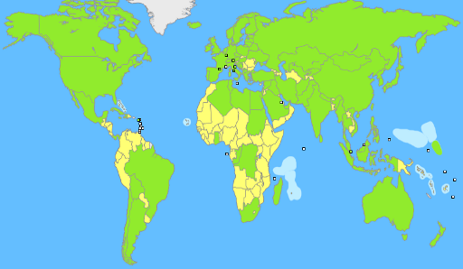

<figure class="aligncenter">
            
            <figcaption class="text-center">Länder der Erde</figcaption>
        </figure>

Hier ist ein <a href="http://www.jetpunk.com/quizzes/lander-der-welt-quiz">Spiel</a>, bei dem man die Länder der Erde eingeben muss. Es ist schon erschreckent, wie viele weiße Flecken hier sind.

<h2>Punktzahl</h2>
<h3>26. Juli 2012</h3>
You scored 54/196 = 28%.
This beats or equals 21.1% of test takers.
The average score is 93.

Viele afrikanische Länder sind mir unbekannt. Habt ihr schon mal von <a href="http://de.wikipedia.org/wiki/Nauru">Nauru</a> oder <a href="http://de.wikipedia.org/wiki/Kiribati">Kiribati</a> gehört?

<h3>02. August 2012</h3>
You scored 90/196 = 46%.
This beats or equals 67.6% of test takers.
The average score is 77.
Your high score is 90.

<figure class="aligncenter">
            
            <figcaption class="text-center">Länder der Erde - zweiter Versuch</figcaption>
        </figure>
