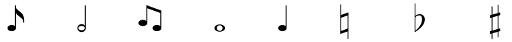
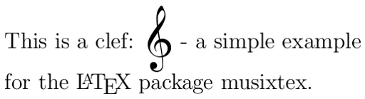
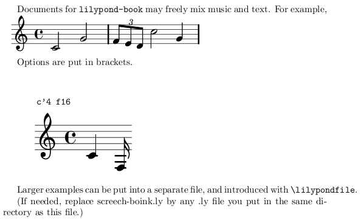

It is possible to write music with LaTeX. My girlfriend was quite surprised of this, so I decided to <del datetime="2012-08-01T08:01:06+00:00">write a little tutorial</del> show some examples.

<h2>Symbols</h2>
<figure class="aligncenter">
            <a href="../images/2012/08/music-notes.png"></a>
            <figcaption class="text-center">Some basic music symbols</figcaption>
        </figure>
```latex
\documentclass[a4paper,12pt]{article}
\usepackage{wasysym}
\begin{document}
\eighthnote ~~~ \halfnote ~~~ \twonotes ~~~ \fullnote ~~~
\quarternote ~~~ $\natural$ ~~~ $\flat$ ~~~ $\sharp$
\end{document}
```

The harmony package offers some additional symbols:
<figure class="aligncenter">
            <a href="../images/2012/08/latex-music-harmony.png"></a>
            <figcaption class="text-center">music symbols form the LaTeX-harmony package</figcaption>
        </figure>

```latex
\documentclass[a4paper,12pt]{article}
\usepackage{harmony}

\begin{document}
    \noindent \AAcht ~~~ \Acht ~~~ \AchtBL ~~~ \AchtBR ~~~ \AcPa \\
    \DD ~~~ \DDohne ~~~ \Dohne ~~~ \Ds ~~~ \DS \\
    \Ganz ~~~ \GaPa ~~~ \Halb ~~~ \HaPa ~~~ \Pu ~~~ \Sech \\
    \SechBL ~~~ \SechBl ~~~ \SechBR  ~~~ \SePa ~~~ \UB ~~~ \Vier \\
    \ViPa ~~~ \VM ~~~ \Zwdr ~~~ \ZwPa
\end{document}
```

<h2>musixtex</h2>
<figure class="aligncenter">
            <a href="../images/2012/08/latex-musixtex.png"></a>
            <figcaption class="text-center">musixtex example</figcaption>
        </figure>

```latex
\documentclass[a4paper,12pt]{article}
\usepackage{musixtex}

\begin{document}
    \noindent This is a clef:
    \begin{music}\trebleclef\end{music}
    - a simple example\\
    for the \LaTeX{} package musixtex.
\end{document}
```

<h2>ABC</h2>
<h3>Preparation</h3>
You have to have ABC installed. For Ubuntu-Users:

```bash
sudo apt-get install abcm2ps
```

<h3>Example</h3>
```latex
\documentclass[a4paper]{article}
\usepackage{abc}

\begin{document}
    You can create music sheets within the abc-environment:
    \begin{abc}[name=c-dur]
        X: 1 % start of header
        K: C % scale: C major
        "Text"c2 G4 | (3FED c4 G2 |
    \end{abc}
\end{document}
```

compile with

```bash
pdflatex --shell-escape myTexFile.tex
```

to get this:
<figure class="aligncenter">
            <a href="../images/2012/07/abc-example.png"></a>
            <figcaption class="text-center">ABC example for creating music sheets with LaTeX</figcaption>
        </figure>


<h2>LilyPond</h2>
<h3>Preparation</h3>
Make sure that you have installed <a href="http://en.wikipedia.org/wiki/GNU_LilyPond">GNU LilyPond</a> and LaTeX.

Ubuntu-Users have to type

```bash
sudo apt-get install lilypond
```

to install Lilypond.

<h3>Example</h3>
<h4>From the Documentation</h4>
Save the following source as `lilybook.lytex`:

```latex
\documentclass[a4paper]{article}

\begin{document}
    Documents for \verb+lilypond-book+ may freely mix music and text.
    For example,

    \begin{lilypond}
        \relative c' {
          c2 g'2 \times 2/3 { f8 e d } c'2 g4
        }
    \end{lilypond}

    Options are put in brackets.
    \begin[fragment,quote,staffsize=26,verbatim]{lilypond}
      c'4 f16
    \end{lilypond}

    Larger examples can be put into a separate file, and introduced
    with \verb+\lilypondfile+.
\end{document}
```

Compile it with these commands:

```bash
lilypond-book --output=out --pdf lilybook.lytex
cd out/
pdflatex lilybook
mv lilybook.pdf ../lilybook.pdf
cd ..
rm -rf out
```

For simplification, you can save this as <code>compile.sh</code>, execute <code>chmod +x compile.sh</code> and now you only have to enter <code>./compile.sh</code> to generate the PDF.

Output:
<figure class="aligncenter">
            <a href="../images/2012/07/lilypond-example.png"></a>
            <figcaption class="text-center">Lilypond example - output was a PDF</figcaption>
        </figure>

<h2>Further Reading</h2>
<ul>
<li>ABC
<ul>
  <li><a href="http://www.tug.org/texlive/Contents/live/texmf-dist/doc/latex/abc/abc.pdf">ABC-environment Documentation</a></li>
</ul>
</li>
<li>LilyPond
<ul>
  <li><a href="http://lilypond.org/doc/v2.14/Documentation/learning/index#top">LilyPond &mdash; Learning Manual</a></li>
  <li><a href="http://lilypond.org/doc/v2.14/Documentation/essay.pdf">Lilypond 2.14 Documentation</a></li>
  <li><a href="http://createdigitalmusic.com/2010/05/lilypond-free-beautiful-music-notation-engraving-for-anyone/">Lilypond: Free, Beautiful Music Notation Engraving for Anyone</a> by Peter Kirn</li>
  <li><a href="http://stackoverflow.com/q/10152486/562769">Including Lilypond in LaTeX</a></li>
  <li><a href="http://tex.stackexchange.com/a/69804/5645">Beautiful example</a></li>
</ul>
</li>
<li><a href="http://tex.stackexchange.com/questions/19813/creating-a-custom-songbook-with-the-songs-package">Creating a custom songbook with the songs package</a></li>
<li><a href="http://homepage2.nifty.com/tonomu/score/musixtex/musixtexe.html">MusiXTeX</a></li>
</ul>


If you've made some more complex examples with LaTeX, I'd be happy if you added them in the comments.
