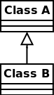
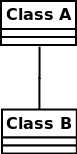
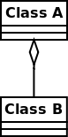
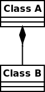
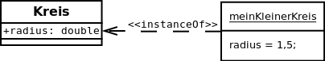
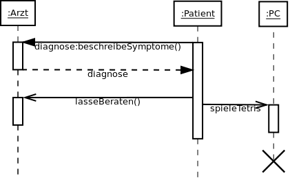

Folgende Pfeile werden in UML verwendet:
<h2>Klassendiagramme</h2>
<h3>Vererbung</h3>
<figure class="figure-right">
    
    <figcaption>Class B erbt von Class A; Class A ist die Oberklasse</figcaption>
</figure>
Die <a href="http://de.wikipedia.org/wiki/Vererbung_(Programmierung)">Vererbung</a> ist eines der wichtigsten Prinzipien der objektorientierten Programmierung. Sie zeigt eine "ist ein"-Beziehung an.

Beispiele sind:
<ul>
  <li><code>Tiger</code> ist eine <code>Großkatze</code> ist eine <code>Katze</code> ist ein <code>Raubtier</code> ist ein <code>Tier</code>.</li>
  <li><code>Auto</code> ist ein <code>Fortbewegungsmittel</code>.</li>
  <li><code>Auto</code> ist ein <code>Luxusgut</code>.</li>
</ul>

Beachte dass <code>Auto</code> hier sowohl von <code>Luxusgut</code>, als auch von <code>Fortbewegungsmittel</code> erbt. Das geht in manchen Programmiersprachen (C++, Python), in anderen nicht (Java).

<h3>Assoziation</h3>
<figure class="figure-right">
    
    <figcaption>Assoziation</figcaption>
</figure>

Die <a href="http://de.wikipedia.org/wiki/Assoziation_(UML)">Assoziation</a> zeigt eine Verbindung an, z.B.:
<ul>
	<li>Person - Termin: Eine Person hat Termine; Termine gehören zu einer Person.</li>
	<li>Lehrer - Schüler: Ein Schüler hat Lehrer; Lehrer haben Schüler.</li>
	<li>Auto - Fahrer: Ein Auto hat einen Fahrer; ein Fahrer hat ein Auto.</li>
</ul>
In einer Datenbank würde man für diese Relationen eine weitere Tabelle erstellen. Also eine Tabelle für Personen, eine für Termine und eine für Person-Termin-Verknüpfungen.
<h3>Aggregation</h3>
<figure class="figure-right">
    
    <figcaption>Aggregation</figcaption>
</figure>

Die <a href="http://de.wikipedia.org/wiki/Assoziation_(UML)#Aggregation">Aggregation</a> ist eine spezielle Assoziation. Sie zeigt eine "hat"-Beziehung an. Dabei ist die Richtung wichtig und sollte angezeigt werden.

Aggregationen sind z.B.:
<ul>
	<li>PKW hat Räder</li>
	<li>Eltern haben Kinder</li>
	<li>Buchladen hat Bücher</li>
</ul>
<h3>Komposition</h3>
<figure class="figure-right">
    
    <figcaption>Komposition</figcaption>
</figure>

Die <a href="http://de.wikipedia.org/wiki/Komposition_(UML)#Komposition">Komposition</a> zeigt eine notwendige "ist-Teil-von" Beziehung an. Das Teil kann also nicht ohne das Ganze existieren.

Beispiele sind:
<ul>
	<li>Buch hat Buchseiten (Buchseiten gibt es nicht ohne Buch)</li>
	<li>Rechnung hat Posten (Rechnungsposten gibt es nicht ohne Rechnung)</li>
	<li>Graph hat Knoten (Knoten gibt es nicht ohne Graph)</li>
</ul>

<h3>Weitere</h3>
<ul>
  <li>Die Benutzt-Relation wird als gestrichelter Pfeil mit nicht-ausgefülltem Kopf dargestellt.</li>
  <li>Eine Implementierung wird als gestrichelter Pfeil mit rundem, nicht ausgefülltem Kopf dargestellt.</li>
</ul>

<h2>Objektdiagramme</h2>
<figure>
    
    <figcaption>UML: instanceOf beziehung in einem Objektdiagramm</figcaption>
</figure>

<h2>Sequenzdiagramme</h2>
<a href="http://de.wikipedia.org/wiki/Sequenzdiagramm">Sequenzdiagramme</a> haben wieder eigene Pfeile.
<figure>
    
    <figcaption>UML Sequenzdiagramm</figcaption>
</figure>
Der Pfeil mit der ausgefüllten Spitze ist eine Synchrone Nachricht, der gestrichelte mit der nicht-ausgefüllten Spitze ist eine Antwort  und der durchgezogenen Pfeil mit der nicht-ausgefüllten Spitze ist eine asynchrone Nachricht.
<strong>ACHTUNG</strong>: In der Vorlesung bei Herrn Prof. Tichy hat die Antwort (Folie 42) auch keinen ausgefüllten Kopf, im Gegensatz zu dem hier gezeigtem Bild!

<h2>Siehe auch</h2>
<ul>
	<li><a title="How to create UML class diagrams" href="../how-to-create-uml-class-diagrams/">How to create UML class diagrams</a></li>
</ul>
