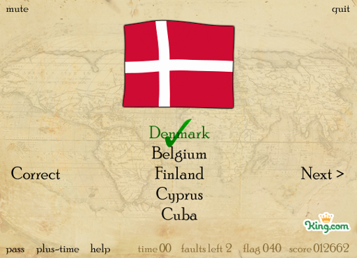

<figure class="aligncenter">
            
            <figcaption class="text-center">Flags of the Earth</figcaption>
        </figure>
<strong>Go to the Game</strong>: <a href="http://www.kongregate.com/games/KingDotCom/flags">Flags on Kongregate</a>
<strong>Task</strong>: Say which country the shown flag belongs to.
<strong>How to play</strong>: Click on on of the 4 - 5 countries.
<strong>My Record</strong>: 40 Flags and 12662 points.
