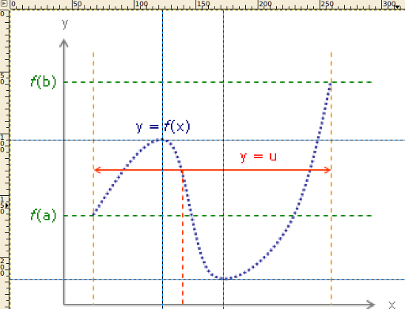

I am currently improving many articles on Wikipedia as a preparation for some math exams. And I recently started to create images with LaTeX / TikZ.

Today, I've found <a href="http://commons.wikimedia.org/wiki/File:Intermediatevaluetheorem.png">this image</a> in the article about the Intermediate value theorem:
<figure class="aligncenter">
            <a href="../images/2012/08/Intermediatevaluetheorem.png"></a>
            <figcaption class="text-center">Pixel-image of a function from Wikipedia</figcaption>
        </figure>

<h2>Get special points</h2>
As a first step, you should open the image with <a href="http://en.wikipedia.org/wiki/GIMP">GIMP</a> (or any other editor of your choice) and find the pixel-coordinates of special points:
<figure class="aligncenter">
            <a href="../images/2012/08/function-in-gimp.png"></a>
            <figcaption class="text-center">Cubic function in GIMP</figcaption>
        </figure>

<del datetime="2012-08-30T08:36:40+00:00">This function has a maximum at (123 | 105) and a minimum at (172 | 218)</del> ... well, thats not correct. Note that the axis of GIMP starts at the upper left. So the y-axis is wrong.

I have cropped and flipped the image vertically. Now you can read the minimum / maximum coordinates with GIMP:

<figure class="aligncenter">
            <a href="../images/2012/08/gimp-function-cropped-flipped.png"></a>
            <figcaption class="text-center">Cubic function cropped and flipped vertically</figcaption>
        </figure>

The local maximum is at (79 | 133) and the local minimum is at (131 | 20).

<h2>Form equations</h2>
A cubic function generally looks like this:
$f(x) = a \cdot x^3 + b \cdot x^2 + c \cdot x + d$

You have two points, so they have to fit to this equation:
(I) $f(79) = 133$
(II) $f(131) = 20$

The derivative has to be zero in a minimum and a maximum, so you know two more equations:
(III) $f'(79) = 0$
(IV)  $f'(131) = 0$

Four linear equations and four variables. Now we can solve those equations.

<h2>Get explicit equations</h2>
As a first step, we write down the equations in an explicit form. You have to know the general derivate of a cubic function:
$f'(x) = 3 a\cdot x^2 + 2 b \cdot x + c$

(I) $493039a + 6241b+79c + d = 133$
(II) $2352637a + 17689b + 131c + d = 20$
(III) $18723a + 158 b + c = 0$
(IV) $51483 a + 262 b + c = 0$

<h2>Solve the equations</h2>
Now you have to solve the equations. I took <a href="http://www.wolframalpha.com/input/?i=493039*a%2B6241*b%2B79*c%2Bd%3D133%2C+2352637*a%2B17689*b%2B131*c%2Bd%3D20%2C+18723*a%2B158*b%2Bc%3D0%2C+51483*a%2B262*b%2Bc%3D0">Wolfram|Alpha</a>, because the numbers are really ugly. If you like to do it by hand, you have to know how to use the <a href="http://en.wikipedia.org/wiki/Gaussian_elimination">Gaussian algorithm</a>.

Here is the exact solution:
<figure class="aligncenter">
            <a href="../images/2012/08/wolframalpha-solution-cubic-function.png"></a>
            <figcaption class="text-center">Exact solution of a cubic function with Wolfram|Alpah</figcaption>
        </figure>

And here is an approximation:
<figure class="aligncenter">
            <a href="../images/2012/08/wolframalpha-aproximate-form.png"></a>
            <figcaption class="text-center">Approximate form with Wolfram|Alpha</figcaption>
        </figure>

<h2>The LaTeX Code</h2>
```text
\documentclass{article}
\usepackage[pdftex,active,tightpage]{preview}
\setlength\PreviewBorder{2mm}
\usepackage{pgfplots}
\usepackage{units}
\pgfplotsset{compat=1.3}% <-- moves axis labels near ticklabels
                        % (respects tick label widths)
\usepackage{tikz}
\usetikzlibrary{arrows, positioning, calc, intersections, decorations.markings}

\usepackage{xcolor}
\definecolor{horizontalLineColor}{HTML}{008000}
\definecolor{verticalLineColor}{HTML}{FF0000}

\begin{document}

% Define this as a command to ensure that it is same in both cases
\newcommand*{\ShowIntersection}[2]{
\fill
    [name intersections={of=#1 and #2, name=i, total=\t}]
    [red, opacity=1, every node/.style={above left, black, opacity=1}]
    \foreach \s in {1,...,\t}{(i-\s) circle (2pt)
        node [above left] {\s}};
}

\begin{preview}
\begin{tikzpicture}
    \begin{axis}[
        label distance=0mm,
        width=8cm, height=7cm,     % size of the image
        xmin= 40,      % start the diagram at this x-coordinate
        xmax= 180,    % end   the diagram at this x-coordinate
        ymin=60,     % start the diagram at this y-coordinate
        ymax=170,   % end   the diagram at this y-coordinate
        ylabel=y,
        xlabel=x,
        axis lines=left,
        tick style={draw=none},
        xticklabels={,,},
        yticklabels={,,}
    ]
      \addplot[name path global=a, domain=55:161, dotted, blue,
               thick,samples=500, label=$y=f(x)$]
        {113/132078*x*x*x-11865/44026*x*x+1169437/44026*x-93155207/132078};
      % ( 55 |  82.7344) and (161 | 156.011) are on the graph
      \coordinate (b) at (axis cs: 55,170);
      \coordinate (c) at (axis cs:161,170);
      \coordinate (d) at (axis cs:161,82.7344);
      \coordinate (e) at (axis cs:161,156.011);
      \coordinate (a1) at (axis cs:55,111.494);
      \coordinate (a2) at (axis cs:161,111.494);
      \draw[verticalLineColor, thick, <->](a1) -- (a2);
      \draw[verticalLineColor,dashed](b |- 0,0) -- (b);
      \draw[verticalLineColor,dashed](c |- 0,0) -- (c);
      \draw[horizontalLineColor,dashed, thick](d -| 0,0) -- (d);
      \draw[horizontalLineColor,dashed, thick](e -| 0,0) -- (e);

      % (100 | 111.494)
      \coordinate (f) at (axis cs:100, 111.494);
      \draw[red,dashed](f |- 0,0) -- (f);
    \end{axis}
\end{tikzpicture}
\end{preview}
\end{document}
```

<h2>The result</h2>
<figure class="aligncenter">
            <a href="../images/2012/08/cubic-function-intermediate-value-theorem.png"></a>
            <figcaption class="text-center">Cubic function intermediate value theorem - Result</figcaption>
        </figure>
