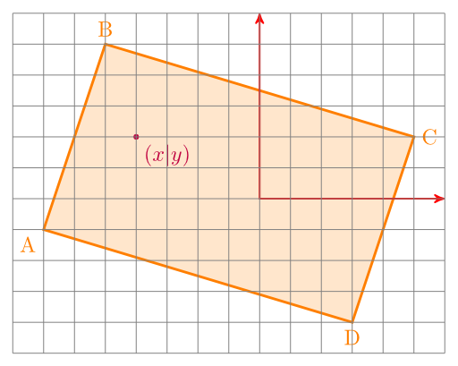
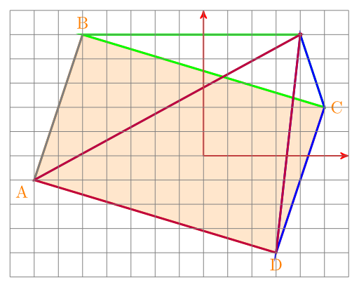

<figure class="aligncenter">
            <a href="../images/2012/09/rectangle.png"></a>
            <figcaption class="text-center">A rectangle</figcaption>
        </figure>

I've just found this interesting question on <a href="http://math.stackexchange.com/q/190111/6876">StackExchange</a>:

If you have a rectangle ABCD and point P. Is P inside ABCD?


## The idea
The idea how to solve this problem is simply beautiful.

If the point is in the rectangle, it divides it into four triangles:

<figure class="aligncenter">
            <a href="../images/2012/09/rectangle-2.png"></a>
            <figcaption class="text-center">Divided rectangle</figcaption>
        </figure>

If P is not inside of ABCD, you end up with somethink like this:

<figure class="aligncenter">
            <a href="../images/2012/09/rectangle-3.png"></a>
            <figcaption class="text-center">Point is outside of rectangle</figcaption>
        </figure>

You might note that the area of the four triangles in is bigger than the area of the rectangle. So if the area is bigger, you know that the point is outside of the rectangle.


## Formulae
If you know the coordinates of the points, you can calculate the area of the rectangle like this:

$A_\text{rectangle} = \frac{1}{2} \left| (y_{A}-y_{C})\cdot(x_{D}-x_{B}) + (y_{B}-y_{D})\cdot(x_{A}-x_{C})\right|$

The area of a triangle is:
$A_\text{triangle} = \frac{1}{2} (x_1(y_2-y_3) + x_2(y_3-y_1) + x_3(y_1-y_2))$


## Python
<div class="important">Please look at Jans comment. There is an error in my Python code, but I don't have the time to correct it.</div>

```python
from typing import Tuple
from dataclasses import dataclass


@dataclass
class Point:
    x: float
    y: float


Rectangle = Tuple[Point, Point, Point, Point]


def is_p_in_rectangle(r: Rectangle, P: Point) -> bool:
    area_rectangle = 0.5 * abs(
        #   y_A      y_C      x_D      x_B
        (r[0].y - r[2].y) * (r[3].x - r[1].x)
        #    y_B     y_D       x_A     x_C
        + (r[1].y - r[3].y) * (r[0].x - r[2].x)
    )

    ABP = 0.5 * (
        r[0].x * (r[1].y - r[2].y)
        + r[1].x * (r[2].y - r[0].y)
        + r[2].x * (r[0].y - r[1].y)
    )
    BCP = 0.5 * (
        r[1].x * (r[2].y - r[3].y)
        + r[2].x * (r[3].y - r[1].y)
        + r[3].x * (r[1].y - r[2].y)
    )
    CDP = 0.5 * (
        r[2].x * (r[3].y - r[0].y)
        + r[3].x * (r[0].y - r[2].y)
        + r[0].x * (r[2].y - r[3].y)
    )
    DAP = 0.5 * (
        r[3].x * (r[0].y - r[1].y)
        + r[0].x * (r[1].y - r[3].y)
        + r[1].x * (r[3].y - r[0].y)
    )
    return area_rectangle == (ABP + BCP + CDP + DAP)
```

## Triangle
The same idea can easily be adopted to triangles:

```python
from dataclasses import dataclass


@dataclass
class Point:
    x: float
    y: float


class Triangle:
    """Represents a triangle in R^2."""

    epsilon = 0.001

    def __init__(self, a: Point, b: Point, c: Point):
        self.a = a
        self.b = b
        self.c = c

    def get_area(self) -> float:
        """Get area of this triangle.
           >>> Triangle(Point(0.,0.), Point(10.,0.), Point(10.,10.)).get_area()
           50.0
           >>> Triangle(Point(-10.,0.), Point(10.,0.), Point(10.,10.)).get_area()
           100.0
        """
        a, b, c = self.a, self.b, self.c
        return abs(a.x * (b.y - c.y) + b.x * (c.y - a.y) + c.x * (a.y - b.y)) / 2

    def is_inside(self, p: Point) -> bool:
        """Check if p is inside this triangle."""
        current_area = self.get_area()
        pab = Triangle(p, self.a, self.b)
        pac = Triangle(p, self.a, self.c)
        pbc = Triangle(p, self.b, self.c)
        new_area = pab.get_area() + pac.get_area() + pbc.get_area()
        return abs(current_area - new_area) < Triangle.epsilon


if __name__ == "__main__":
    import doctest

    doctest.testmod()
```


## Credits

Thank you Teon Brooks for reporting an error (I wrote "rectangles" instead of
"triangles")
