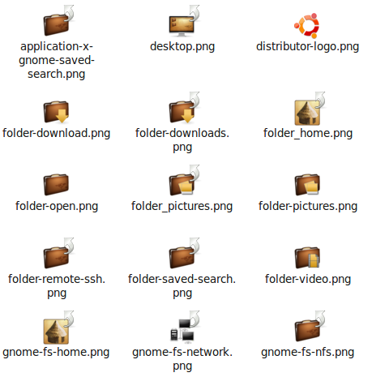

I don't understand why all desktop environment seem to lack a good theme chooser/editor and good themes. I have one favorite theme - called "<a href="http://www.bisigi-project.org/?p=28&lang=en">Balanzan Theme</a>" which should be available in every distribution. The Balanzan Theme is part of the <a href="http://www.bisigi-project.org/?lang=en">bisigi-project</a>. According to <a href="https://launchpad.net/~bisigi/+archive/ppa/+files/balanzan-theme_1.8.1.natty.ppa1.tar.gz">the package</a>, it is licensed under GPL. So I think I can upload some of its content here.

<h2>Installation</h2>
```bash
sudo add-apt-repository ppa:bisigi
sudo apt-get update
sudo apt-get install bisigi-themes
```

<h2>Impression</h2>
<figure class="aligncenter">
            <a href="../images/2012/10/balazan-font-300x247.png"></a>
            <figcaption class="text-center">Impression of the Balanzan Theme</figcaption>
        </figure>

<h2>Color Theme</h2>
<h3>LXDE</h3>
<table class="wikitable">
<tr>
  <th>&nbsp;</th>
  <th>Background</th>
  <th>Foreground</th>
</tr>
<tr>
  <th>Normal windows:</th>
  <td style="background-color:#F5EDD8">#F5EDD8</td>
  <td style="background-color:#101010">#101010</td>
</tr>
<tr>
  <th>Text windows:</th>
  <td style="background-color:#FFF">#FFF</td>
  <td style="background-color:#1A1A1A">#1A1A1A</td>
</tr>
<tr>
  <th>Selected items:</th>
  <td style="background-color:#F4C256">#F4C256</td>
  <td style="background-color:#1A1A1A">#1A1A1A</td>
</tr>
<tr>
  <th>Tooltips:</th>
  <td style="background-color:#F5F5B5">#F5F5B5</td>
  <td style="background-color:#000">#000</td>
</tr>
</table>

<h2>Icon Theme</h2>
Download <a href="https://launchpad.net/~bisigi/+archive/ppa/+files/balanzan-theme_1.8.1.natty.ppa1.tar.gz">the whole package</a>, go to <code>balazan-theme/icons</code> and look into <code>balazan.tar.bz2</code>.

Here are some of the icons:
<figure class="aligncenter">
            <a href="../images/2012/10/balazan-icons.png"></a>
            <figcaption class="text-center">Balanzan Icons</figcaption>
        </figure>

<h2>Background</h2>
The background is based on "<a href="http://ubuntu.damianvila.com/">Lion Claar</a>" background by Dami&aacute;n Vila:

<figure class="alignright">
            <a href="../images/2012/10/balanzan_4_3-150x150.png"></a>
            <figcaption class="text-center">Balanzan 4:3 wallpaper</figcaption>
        </figure>

<figure class="aligncenter">
            <a href="../images/2012/10/balanzan-150x150.png"></a>
            <figcaption class="text-center">Balanzan 16:9 wallpaper</figcaption>
        </figure>
