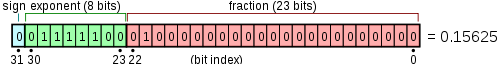

If you make a computer science degree, you will have to learn how numbers are internally represented. Most of the time, you get explanations like the pictures below:

<figure class="aligncenter">
            <a href="../images/2012/10/IEEE_754_single_precision.png"></a>
            <figcaption class="text-center">IEEE 754 single precision</figcaption>
        </figure>

<figure class="aligncenter">
            <a href="../images/2012/10/float-scheme.png"></a>
            <figcaption class="text-center">Example of a floating point number</figcaption>
        </figure>

You will (have to) learn how <a href="http://en.wikipedia.org/wiki/IEEE_floating_point">IEEE 754 floats</a> are structured on a bit-wise level. But I also like to check if it is correct, what I've learned.

So this is how you can check it: 
```c
#include <stdint.h>
#include <stdio.h> // printf
#include <limits.h> // INT_MAX, UINT_MAX, ...
#include <math.h>   // needed for NAN
union myUnion {
	uint32_t i; // unsigned integer 32-bit type (on every machine)
	float f; // a type you want to play with
};

void printValue(union myUnion u) {
	printf("uint32_t\t:\t%u\n", u.i);
	printf("Bits\t\t:\t");
	for (int i = 31; i >= 0; i--) {
		printf("%i", (u.i >> i) % 2);
		if (i != 0 && i % 4 == 0) {
			printf(".");
		}
		if (i == 31 || i == 23) {
			printf("|");
		}
	}
	printf("\nNumber\t\t:\t%0.10f\n\n", u.f);
}

void setSign(union myUnion *u, char sign) {
	u->i = (u->i & (0xffffffff - (1 << 31))) + (sign << 31);
}

/**
 * The exponent has 8 bits.
 * When all bits are 0, you switch to denormalized numbers.
 * When all bits are 1, you get either NaN or infinity, depending on
 * your characteristic. If the characteristic is 0, you get infinity.
 * Otherwise NaN.
 */
void setExponent(union myUnion *u, char exponent) {
	u->i = (u->i & (0xffffffff - (0xff << 23))) + (exponent << 23);
}

/**
 * The mantissa has 23 bits.
 */
void setMantissa(union myUnion *u, int mantissa) {
	u->i = (u->i & (0xffffffff - (0xff << 0))) + (mantissa << 0);
}

int main() {
	union myUnion testVar;
	
	printf("Manual guessing\n");
	testVar.i = 0;
	setSign(&testVar, 1);
	setExponent(&testVar, 0x01);
	setMantissa(&testVar, 0x00);
	printValue(testVar);

	printf("What does UINT_MAX evaluate to?\n");
	testVar.i = UINT_MAX;
	printValue(testVar);

	printf("What does nan evaluate to?\n");
	testVar.f = NAN;
	printValue(testVar);
	
	printf("The example above and switched first bit on\n");
    testVar.i = 0xbf200000;
	printValue(testVar);
}
```

I think I have tried all interesting values. Have fun trying it yourself ☺

(hmm ... I could also try to make a visualization ... I will think about this when I have more time)
