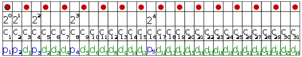

This blogpost is strongly related to <a href="http://page.math.tu-berlin.de/~felsner/DMSWe/Aufgaben/codes.pdf">this germand PDF</a> of a pupils' competition in which I have participated in 2008.

Today, we have a lot of data that is stored or transferred in a binary way. Once in a while an error occurs and single bits get switched from 0 to 1 or the other way around. <a href="http://en.wikipedia.org/wiki/Coding_theory">Coding theory</a> tries to find algorithms with which you can <strong>detect</strong> and <strong>correct</strong> errors.

<h2>Introduction</h2>
To keep it simple, we make a small example. We have \begin{align}
    \{A, B, C, D, E, F, G, H\}     &= \mathcal{F}_3\\
\{A', B', C', D', E', F', G', H'\} &\subsetneq \mathcal{F}_8
\end{align}

\begin{align}
c_3 = \{&(1,1,1,1,1,1),\\
&(0,0,0,0,1,1),\\
&(0,0,1,1,0,0),\\
&(0,1,0,1,0,1),\\
&(0,1,1,0,1,0),\\
&(1,0,0,1,1,0),\\
&(1,0,1,0,0,1),\\
&(1,1,0,0,0,0)\}
\end{align}

<h2>Hamming codes</h2>
<a href="http://en.wikipedia.org/wiki/Hamming_code">Hamming codes</a> are a family of $(2^k - 1, 2^{(2^k -1)-k}, 3), \quad k \geq 2$ codes. This means, every hamming code can only correct one error.

The idea behind Hamming codes is to save in one bit if the number of a fixed set of positions of the message is even or odd. This is called parity and done with XOR. The parity-bit is saved at the end of the message (or, just another point of view: the positions that are powers of two (1, 2, 4, 8, ...) of each message are only parity bits. This are obviously $\lceil \log_2(\text{length of code}) \rceil = \lceil \log(2^k - 1) \rceil = k$).

Wikipedia has a really nice image for that:
<figure class="aligncenter">
            
            <figcaption class="text-center">Parity-bits and data bits in a Hamming codeword</figcaption>
        </figure>

Now, how are the parity-bits calculated?
Well, think of each messages as a vector in $\{0,1\}^{(2^k - 1) - k}$. Then you define a matrix $G \in \{0,1\}^{2^k - 1} \times \{0,1\}^{(2^k - 1) - k}$. Now you can get the codewords $c$ by multiplying the datawords $d$ (messages) with $G$:
$c = G \cdot d$.
This is the reason why Hamming-Codes are called "linear codes". They can be obtained by a linear function.

How do I get the generator-matrix $G$?
I don't know it and my internet searches didn't reveal any solution. Do you know one?
