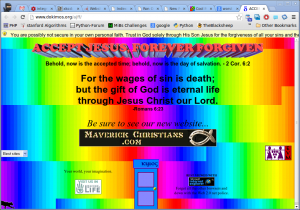
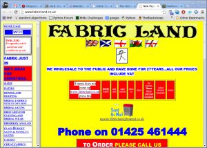
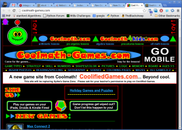
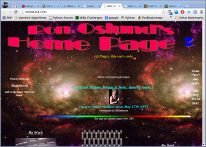

> **Note**: This article is from 2012. Many of these websites have likely been updated or may no longer exist. This serves as a historical reference for web design practices of that era.

Here are some screenshots of the worst websites I have ever seen. Most of them use too many colors, have moving elements, or use black backgrounds. One uses frames (which were already outdated by 2012).

<figure class="aligncenter">
            
            <figcaption class="text-center"><a href='http://www.dokimos.org/ajff/'>dokimos</a></figcaption>
        </figure>

<figure class="aligncenter">
            
            <figcaption class="text-center"><a href='http://www.fabricland.co.uk/'>fabricland.co.uk</a></figcaption>
        </figure>

<figure class="aligncenter">
            
            <figcaption class="text-center"><a href='http://coolmath-games.com/'>Coolmath-Games</a></figcaption>
        </figure>

<figure class="aligncenter">
            
            <figcaption class="text-center"><a href='http://ronoslund.com/'>ronoslund</a></figcaption>
        </figure>

<figure class="aligncenter">
            
            <figcaption class="text-center"><a href='http://www.5safepoints.com/'>5safepoints</a></figcaption>
        </figure>

Do you know similar examples of bad website designs?

## What Makes a Website Design "Bad"?

Looking at these examples from 2012, we can identify common problems:

- **Too many colors**: Overwhelming color schemes that hurt readability
- **Moving elements**: Distracting animations and scrolling text
- **Poor contrast**: Dark backgrounds with poor text visibility
- **Outdated technology**: Using frames and other deprecated HTML features
- **Information overload**: Cramming too much content without proper organization
- **Inconsistent navigation**: Making it hard for users to find what they need

Modern web design has evolved significantly since 2012, emphasizing:
- Clean, minimalist designs
- Mobile responsiveness
- Accessibility standards
- Fast loading times
- User-centered design principles
