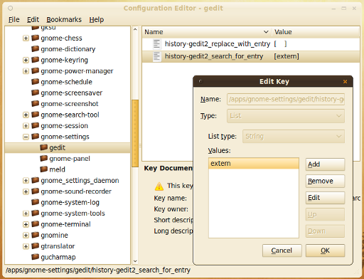

Start <code>gconf-editor</code>:
```bash
gconf-editor
```

Go to <code>/apps/gnome-settings/gedit/history-gedit2_search_for_entry</code> and <code>/apps/gnome-settings/gedit/history-gedit2_replace_entry_with</code> and remove the content there:

<figure class="aligncenter">
            <a href="../images/2012/12/gedit-remove-text-search-history.png"></a>
            <figcaption class="text-center">gedit: Clear text search / replace history</figcaption>
        </figure>
