I get a lot of data about my visitors which I would like to share. The following data is from 2012 of my domain martin-thoma.com. It was collected by Piwik. Note that I excluded my visits.

<h2>Articles</h2>
These articles had the most visitors:
<ol>
  <li><a href="../how-to-draw-a-finite-state-machine/">How to draw a finite-state machine</a></li>
  <li><a href="../matrix-multiplication-python-java-cpp/">Performance of Matrix multiplication in Python, Java and C++</a></li>
  <li><a href="../latex-vorlage-fur-ein-lastenheft/">LaTeX-Vorlage für ein Lastenheft</a> (german)</li>
  <li><a href="../computer-science-jokes/">Computer Science Jokes</a></li>
  <li><a href="../wie-fuhre-ich-einen-induktionsbeweis/">Wie führe ich einen Induktionsbeweis?</a> (german)</li>
</ol>

Recently, my article <a href="../frauenquote-am-kit/">Frauenquote am KIT</a> got also very popular.

<h2>Visitors</h2>
According to awstats:
<ul>
  <li>Different users: 81,028</li>
  <li>Visits: 119,855</li>
  <li>Page accesses: 2,379,654</li>
  <li>Bytes sent: 27.95 GB</li>
</ul>

According to Piwik:
<figure>
    <a href="../images/2012/12/2012-visitor-increase.png">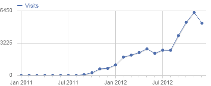</a>
    <figcaption>Number of visitors of my blog</figcaption>
</figure>

<h3>Where do they come from?</h3>

    <figure>
        <a href="../images/2012/12/2012-visitors-continent.png">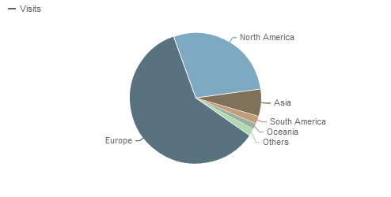</a>
        <figcaption>Continent - Piwik Statistics 2012</figcaption>
    </figure>
    <figure>
        <a href="../images/2012/12/2012-visitors-country.png">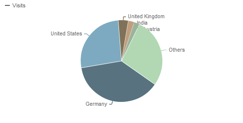</a>
        <figcaption>Country - Piwik Statistics 2012</figcaption>
    </figure>
    <figure>
        <a href="../images/2012/12/2012-visitors-region.png">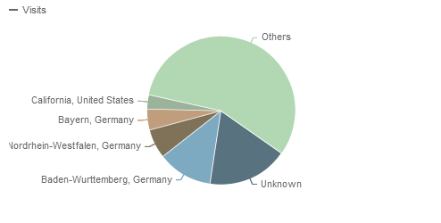</a>
        <figcaption>Region - Piwik Statistics 2012</figcaption>
    </figure>

<h3>Hardware</h3>
<figure>
    <a href="../images/2012/12/2012-visitors-screen-size.png">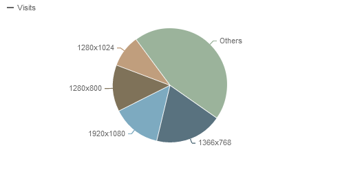</a>
    <figcaption>Screen size</figcaption>
</figure>

<figure>
    <a href="../images/2012/12/2012-visitors-desktop-vs-mobile.png">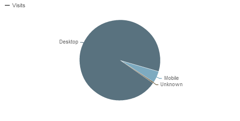</a>
    <figcaption>Desktop vs. Mobile</figcaption>
</figure>

<h3>Software</h3>

    <figure>
        <a href="../images/2012/12/2012-visitors-os.png">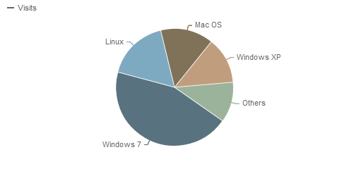</a>
        <figcaption>Operating Systems</figcaption>
    </figure>
    <figure>
        <a href="../images/2012/12/2012-browser-family.png">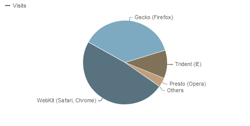</a>
        <figcaption>Browser families</figcaption>
    </figure>
    <figure>
        <a href="../images/2012/12/2012-visitors-browser.png">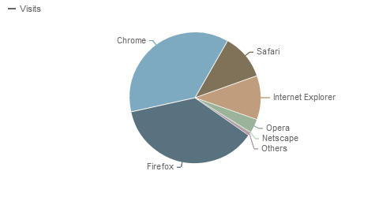</a>
        <figcaption>Browsers</figcaption>
    </figure>
    <figure>
        <a href="../images/2012/12/2012-browser-plugins.png">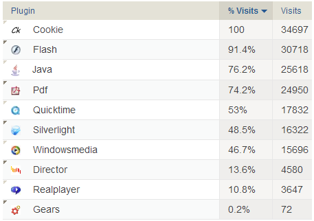</a>
        <figcaption>Browser Plugins</figcaption>
    </figure>

<h3>Provider</h3>
<figure>
    <a href="../images/2012/12/2012-visitors-provider.png">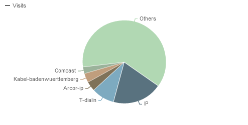</a>
    <figcaption>Providers</figcaption>
</figure>

<h2>Referrers</h2>
<figure>
    <a href="../images/2012/12/2012-referrers.png">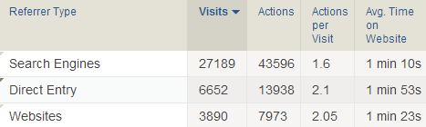</a>
    <figcaption>Referrers</figcaption>
</figure>

Obviously, search engines are much more important for my website than other websites.
Visitors who find me with Google, use these terms:
<ol>
  <li>"lastenheft vorlage" or "lastenheft beispiel" &rarr; <a href="../latex-vorlage-fur-ein-lastenheft/">LaTeX-Vorlage für ein Lastenheft</a></li>
  <li>"induktionsbeweis" &rarr; <a href="../wie-fuhre-ich-einen-induktionsbeweis/">Wie führe ich einen Induktionsbeweis?</a></li>
  <li>"computer science jokes" &rarr; <a href="../computer-science-jokes/">Computer Science Jokes</a></li>
  <li>"basiswechselmatrix" &rarr; <a href="../wie-bestimme-ich-die-basiswechselmatrix/">Wie bestimme ich die Basiswechselmatrix?</a></li>
  <li>"chomsky normalform" &rarr; <a href="../konstruktion-der-chomsky-normalform/">Konstruktion der Chomsky-Normalform</a></li>
</ol>

<h2>Spam</h2>
Akismet got a lot of comment spam on my blog:

<figure>
    <a href="../images/2012/12/2012-akismet-stats-total.png">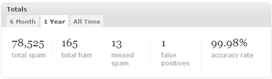</a>
    <figcaption>Akismet total stats for 2012</figcaption>
</figure>

<figure>
    <a href="../images/2012/12/2012-akismet-stats.png">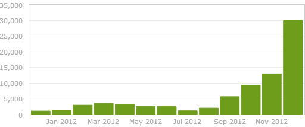</a>
    <figcaption>Akismet spam stats for 2012</figcaption>
</figure>
