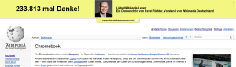
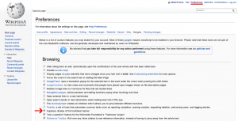

I didn't spend this year for Wikipedia because of the advertising. It really got on my nerves:

<figure class="aligncenter">
            
            <figcaption class="text-center">Wikipedia advertising - Fundraising campaign</figcaption>
        </figure>

But you can simply disable it:
<figure class="aligncenter">
            
            <figcaption class="text-center">How to disable Wikipedia fundraiser</figcaption>
        </figure>

You only have to go to:

Preferences &rarr; Gadgets tab &rarr; Browsing &rarr; check "Suppress display of the fundraiser banner"

Now I'm happy ☺
