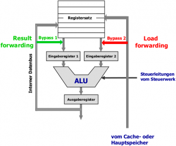
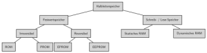
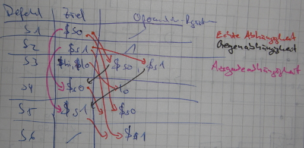

<div class="info">Dieser Artikel beschäftigt sich mit den Vorlesungen &bdquo;Digitaltechnik und Entwurfsverfahren&ldquo; sowie &bdquo;Rechnerorganisation&ldquo; des Moduls &bdquo;Technische Informatik&ldquo; am KIT. Er dient als Prüfungsvorbereitung. Ich habe die Vorlesungen bei Herrn Prof. Dr. Asfour gehört.</div>

<h2>Vorbereitung DT</h2>
<strong>Themen</strong>:
<ul>
  <li>Zahlensysteme: Horner-Schema, euklidischer Algorithmus</li>
  <li>Zahlendarstellungen: Wie wandle ich eine Zahl vom 10er-System ins Zahlensystem xy um und umgekehrt?
   <ul>
    <li>Vorzeichen</li>
    <ul>
     <li>Betrags-Vorzeichen &rarr; <span class="hint" title="Erstes Bit ist 1, wenn die Zahl negativ ist. Sonst wird die Zahl einfach binär dargestellt.">Antwort</span></li>
     <li>Einerkomplement &rarr; <span class="hint" title="Betrag der Zahl dual darstellen, Bits invertieren">Antwort</span></li>
     <li>Zweierkomplement &rarr; <span class="hint" title="Wie Einerkomplement, 1 addieren">Antwort</span></li>
     <li>Exzess-q &rarr; <span class="hint" title="Man fasst die durch Exzess-q dargestellte Zahl als Binärzahl auf, addiert -q dazu und erhält so die dargestellte Zahl">Antwort</span></li>
    </ul>
    </li>
    <li>Komma
     <ul>
       <li>Festkomma &rarr; <span class="hint" title="int, long, char">Beispiele</span></li>
       <li>Gleitkomma &rarr; <span class="hint" title="float, double">Beispiele</span> ($\pm \text{Mantisse} \cdot b^\text{Exponent}$)</li>
     </ul>
    </li>
    </ul>
  </li>
  <li>IEEE 754 Format
    <ul>
      <li><a href="../a-practical-approach-to-floats/">A practical approach to floats</a></li>
      <li>Wie wird NaN dargestellt? Wie wird $-\infty$ und $+\infty$ dargestellt?</li>
      <li>Was ist eine normalisierte Zahl, was eine denormalisierte?</li>
    </ul>
  </li>
  <li>Was ist <span class="hint" title="Alle Ziffern von 0-9 werden im 2er-System dargestellt.">BCD</span>, <span class="hint" title="Die Ziffern von 0-4 werden im 2er-System dargestellt. Dann geht es bei (B)_16 = 1011 weiter.">AIKEN</span> und <span class="hint" title="+3 auf jede Ziffer, dann wie BCD">STIBITZ</span>? Wie werden die Ziffern von 0-9 dort dargestellt?</li>
  <li>Was sind Hamming-Codes? &rarr; <a href="../error-correcting-codes/">Antwort</a></li>
  <li>Wie lauten die Huntingtonschen Axiome? &rarr; <a href="../beweise-aus-der-booleschen-algebra/">Antwort</a></li>
  <li>Nenne 3 verschiedene vollständige Operatorensysteme. &rarr; <span class="hint" title="(UND, ODER, NOT), (NAND), (NOR)">Antwort</span></li>
  <li>Was sind Primterme, Primimplikanten, Primimplikate, Minterme und Maxterme?</li>
  <li>Was sind DMF, DNF, KMF, KNF?</li>
  <li>Wie wende ich die Shannon-Zerlegung an? &rarr; <a href="../wie-wende-ich-die-shannon-zerlegung-an/">Antwort</a></li>
  <li>Wie minimiere ich Funktionen mit KV-Diagrammen?</li>
  <li>Wie funktioniert das Quine-McCluskey Verfahren? &rarr; <a href="../das-quine-mccluskey-verfahren/">Antwort</a></li>
  <li>Was macht das Consensus-Verfahren? &rarr; <a href="../das-consensus-verfahren/">Antwort</a></li>
  <li>Wie funktioniert das Nelson-Verfahren?</li>
  <li>Was bedeutet selbstleitend und selbstsperrend?</li>
  <li>Was ist ein <abbr title="metal-oxide-semiconductor field-effect transistor">MOSFET</abbr>? &rarr; <a href="http://commons.wikimedia.org/wiki/File:N-Kanal-MOSFET_(Schema).svg">Aufbau</a></li>
  <li><abbr title="Complementary Metal Oxide Semiconductor">CMOS</abbr>, N-MOS, P-MOS</li>
  <li>Was ist der Unterschied zwischen einem Hazard und einem Hazard-Fehler?</li>
  <li>Woran erkennt man Funktionshazards, woran Strukturhazards?</li>
  <li>Wie lauten die Ansteuertabellen von D-, T-, JK- und RS-Flipflops? &rarr; <a href="../flipflops-und-latches/">Antwort</a></li>
  <li>Was macht ein Carry-Ripple-Addierer? &rarr; <span class="hint" title="Nutzt zur Addition zweier n-stelliger Zahlen (n-1) Volladdierer und einen Halbaddierer.">Antwort</span></li>
  <li>Inwiefern stellt der Carry-Lookahead-Addierer eine Verbesserung des Carry-Ripple-Addierers dar? &rarr; <span class="hint" title="Der Carry-Ripple-Addierer rechnet vom LSB zum MSB Schritt für Schritt. Der Carry-Lookahead-Addierer versucht dies zu beschleunigen, indem er die Überträge direkt aus den Eingangsvariablen berechnet.">Antwort</span></li>
  <li>Was macht man, wenn bei der Addition zweier BCD-Zahlen eine Pseudotetrade auftritt? &rarr; <span class="hint" title="6 auf die betroffene Tetrade addieren.">Antwort</span></li>
  <li>Was macht man, wenn bei der Addition zweier BCD-Zahlen ein Übertrag in die nächste BCD-Ziffer auftritt? &rarr; <span class="hint" title="6 auf die Stelle addieren, die den Übertrag auf die nächste Stelle verursachte.">Antwort</span></li>
  <li>Was macht man, wenn bei der Addition zweier BCD-Zahlen bei der Korrekturaddition ein Übertrag auftrat? &rarr; <span class="hint" title="Nichts.">Antwort</span></li>
  <li>Was ist die PPS-Methode? &rarr; <span class="hint" title="Eine Multiplikationsmethode (Partial Product sum). Siehe DT-VL21.pdf">Antwort</span></li>
</ul>

<h2>Vorbereitung RO</h2>
<strong>Themen</strong>:
<ul>
  <li>Y-Diagramm</li>
  <li>Aufbau eines Mikroprozessors</li>
  <li>Umrechnen von Zahlensystemen</li>
  <li>RAM-Typen (DRAM, FPM-DRAM, EDO-RAM, SDRAM, DDRAM, DDR-SDRAM, RDRAM)</li>
  <li>Cache-Speicher</li>
</ul>

<strong>Begriffe</strong>
<ul>
  <li>Was sind Tristate-Treiber? &rarr; <span class="hint" title="Gatterform, die nicht nur Hi und Lo weiterleiten kann, sondern auch einen dritten, gegen Spannungen beider Polaritäten, hochohmigen Zustand haben können. Dadurch kann z.B. ein Baustein vom Bus abgetrennt werden. Sie dienen zum Abschalten des gleichzeitigen Zugriffs mehrerer Komponenten auf Systembusse.">Antwort</span></li>
  <li>Was ist der Unterschied zwischen <span class="hint" title="Symbolische Repräsentation der Maschinensprache, die für den Menschen verständlich und anschaulich ist, z.B. add &#36;s2, &#36;s1, &#36;s0">Assembler</span>, <span class="hint" title="Repräsentation von Anweisungen, die für einen Mikroprozessor unmittelbar verständlich sind, z.B. 00000000110000100011000000100001">Maschinensprache</span> und Mikrobefehlen?</li>
  <li>Wofür stehen RISC und CISC und was sind Beispiele? &rarr; <span class="hint" title="Reduced Instruction Set Computer (z.B. MIPS), Complex Instruction Set Computer (z.B. x86)">Antwort</span></li>
  <li>Was ist ein User/System-Bit, was ein Trace-Bit und was ein Decimal-Bit? &rarr; <span class="hint" title="Das User/System-Bit bestimmt, ob sich das System im eingeschränkten User-Modus oder im uneingeschränkten Systemmodus befindet. Das Trace-Bit erlaubt Befehlsabarbeitung im Einzelschritt-Modus zum Debuggen und das Decimal-Bit entscheidet, ob dual oder BCD gerechnet wird.">Antwort</span></li>
  <li>Welche Informationen können im Statusregister des Rechnewerkes stehen? &rarr; <span class="hint" title="Carry, Overflow, Zero, Sign, ...">Antwort</span></li>
  <li>Welche Informationen können im Akkumulator stehen? &rarr; <span class="hint" title="alle ALU-Ergebnisse">Antwort</span></li>
  <li>Warum benötigt die ALU Hilfsregister? &rarr; <span class="hint" title="Ohne die Hilfsregister würden während der ALU-Rechenzeit durch Hazards und Wettläufe Schwankungen am Ausgang entstehen.">Antwort</span></li>
  <li>Entspricht das logische Rechtsschieben der Division durch zwei? &rarr; <span class="hint" title="Nein, da bei negativen Zahlen die 1 im MSB erhalten werden muss.">Antwort</span></li>
  <li>Was ist ein superskalarer Prozessor? &rarr; <span class="hint" title="Ein Prozessor, der pro Takt mehrere allgemeine Register schreiben und lesen kann.">Antwort</span></li>
  <li>Was ist ein Little-Endian und was ist Big-Endian? &rarr; <span class="hint" title="Das MSB bei Little-Endian ist ganz links, bei Big-Endian ganz rechts.">Antwort</span></li>
  <li>Was versteht man unter dem Nulladressformat? &rarr; <span class="hint" title="Die Befehlssätze, die nur aus dem Opcode bestehen. Das Einadressformat hat z.B. zusätzlich noch die Quelle.">Antwort</span></li>
  <li>Was ist eine &bdquo;effektive Adresse&ldquo;? &rarr; <span class="hint" title="Die effektive Adresse ist die durch die Adressierungsart spezifizierte Adresse im Hauptspeicher. Sie entsteht im Prozessor nach Ausführung der Adressierung.">Antwort</span></li>
  <li>Was bedeutet <span class="hint" title="Zero flag; Wichtig für Schleifen">ZF</span>, <span class="hint" title="Carry flag; set if an arithmetic operation generats a carry or a borrow out of the MSB of the result">CF</span>, <span class="hint" title="Sign flag; set equal to the MSB">SF</span>, <span class="hint" title="Overflow flag; set if the integer result is too large a positive number or too small a negative number to fit in the destination operand">OF</span> und wozu sind sie jeweils gut?</li>
  <li>Was ist eine Load/Store-Architektur? &rarr; <abbr title="Eine Load/Store Architektur ist eine Computerarchitektur, deren Befehlssatz Daten-Speicherzugriffe ausschließlich mit speziellen Lade- und Speicher-Befehlen erlaubt.">Antwort</abbr></li>
  <li>Was sind die fünf Schritte in der DLX-Pipeline-Verarbeitung? &rarr; <abbr title="IF: Instruction fetch; ID/RF: Instruction decode/Register fetch; EX: Execute / address calculation; MEM: Memory access; WB: Write Back">Antwort</abbr></li>
  <li>In welcher Pipeline-Phase werden die Operanden aus dem memory geholt? &rarr; <abbr title="Tja, das war fies. Es ist nicht die MEM-Phase. In der MEM-Phase wird der Speicherzugriff von Lade- und Speicherbefehlen durchgeführt. Richtig ist: Die zweite Takthälfte der ID-Phase.">Antwort</abbr></li>
  <li>Durch welche Abhängigkeiten entstehen Verzögerungen in der DLX-Pipeline und wann treten diese auf? &rarr; <abbr title="Daten-, Struktur- und Steuerflussabhängigkeiten. Datenabhängigkeiten treten auf, wenn ein Operand noch nicht verfügbar ist. Strukturkonflikte treten auf, wenn zwei Pipeline-Stufen dieselbe Ressource benötigen, auf diese aber nur einmal zugegriffen werden kann. Steuerflusskonflikte treten bei Programmsteuerbefehlen auf. Dies kann z.B. der Fall sein wenn in der Holphase die Zieladresse des als nächstes auszuführenden Befehls noch nicht berechnet ist oder wenn bei einem bedingtem Sprung noch nicht klar ist, ob dieser überhaupt umgesetzt werden wird.">Antwort</abbr></li>
  <li>Was ist eine echte Datenabhängigkeit, was eine Gegenabhängigkeit und was eine Ausgabeabhängigkeit? &rarr; <abbr title="Echte Datenabhängigkeit: a = b + c; d = a + e. Gegenabhängigkeit: b = a + c; a = d + e. Ausgabeabhängigkeit: a = b + c; a = d + e">Antwort</abbr></li>
  <li>Was ist eine falsche Abhängigkeit? &rarr; <abbr title="Eine Gegen- oder Ausgabeabhängigkeit.">Antwort</abbr></li>
  <li>Treten bei echten Abhängigkeiten immer Konflikte auf? &rarr; <abbr title="Nein. Es können z.B. genügend Befehle zwischen den beiden Abhängigen sein.">Antwort</abbr></li>
  <li>Welche Konflikte gibt es und wann können sie auftreten? &rarr; <abbr title="Read-after-Write: Echte Abhängigkeit; Write-after-Read: Gegenabhängigkeit; Write-after-Write: Ausgabeabhängigkeit">Antwort</abbr></li>
  <li>Welche Abhängigkeiten können bei der DLX-Pipeline zu Konflikten führen? &rarr; <abbr title="Nur echte Abhängigkeiten können in der DLX-Pipeline zu Konflikten führen.">Antwort</abbr></li>
  <li>Wie kann man Datenkonflikte durch Software lösen? &rarr; <abbr title="Entweder durch Einfügen von NOPs (Leeroperationen) oder durch Umordnung der Befehle (Optimierung)">Antwort</abbr></li>
  <li>Wie kann man Datenkonflikte durch Hardware lösen? &rarr; <abbr title="Interlocking oder Stalling (Pipeline-Sperrung oder Pipeline-Leerlauf); Forwarding, benötigt aber noch Interlocking">Antwort</abbr></li>
  <li>Nennen Sie ein Beispiel für einen Konflikt, der nicht durch Forwarding lösbar ist? &rarr; <abbr title="load r2, B; add r2, r1, r2">Antwort</abbr></li>
  <li>Wie kann man Ressourcenkonflikte lösen? &rarr; <abbr title="Arbitrierung mit Interlocking; Übertaktung; Ressourcenreplizierung">Antwort</abbr></li>
  <li>Was bedeutet <span class="hint" title="Minimale Zeitdauer, die zwischen der fallenden Flanke von RAS bis zur Ausgabe der gewünschten Daten vergeht">t<sub>RAC</sub></span>, <span class="hint" title="Minimale Zeitdauer von Beginn eines Zeilenzugriffs bis zum nächsten Zeilenzugriff (Zykluszeit)">t<sub>RC</sub></span>, <span class="hint" title="Minimale Zeitdauer, die zwischen der fallenden Flanke von CAS bis zur Ausgabe der gewünschten Daten vergeht">t<sub>CAC</sub></span> und <span class="hint" title="Minimale Zeitdauer vom Beginn eines Spaltenzugriffs bis zum nächsten Spaltenzugriff (page mode cycle).">t<sub>PC</sub></span>?</li>
  <li>Wie versteht man unter Bus-Schnüffeln? &rarr; <abbr title="Jeder Prozessor kontrolliert ständig alle Adressen auf dem Bus, um Speicherinkonsistenzen zu vermeiden. Siehe Bus Snooping.">Antwort</abbr></li>
</ul>

<h3>MIPS</h3>
<h4>Befehlsformate</h4>
<figure class="aligncenter">
            <a href="../images/2013/01/mips-befehlsformate-300x136.png"></a>
            <figcaption class="text-center">MIPS Befehlsformate<br />Quelle: <a href='http://ti.ira.uka.de/TI-2/Vorlesung/Vorlesung.php'>Folien von Prof. Dr. Asfour</a></figcaption>
        </figure>

Typ-R-Befehle sind arithmetisch-logische Befehle wie add, sub, and, or sowie Vergleichsbefehle wie <abbr title="set on less than">slt</abbr>.

Typ-I-Befehle sind Lade- und Speicherbefehle sowie Verzweigungsbefehle:
<code>lw &#36;rt, imm(&#36;rs)</code>
<code>sw &#36;rt, imm(&#36;rs)</code>
<code>beq &#36;rs, &#36;rt, immediate</code>: Hier wird immediate als 16-Bit-vorzeichenbehaftete Zahl interpretiert und als Offset benutzt. Die Basisadresse ist dabei im PC. Also lautet die Zieladresse: (PC zum Zeitpunkt des Befehls + 4) + immediate

<h4>Grundlegende Befehle</h4>
<table>
  <thead>
    <tr>
      <th>Syntax</th>
      <th>Erklärung</th>
    </tr>
  </thead>
  <tbody>
    <tr>
      <td><code>li &#36;t0, 9</code></td>
      <td>load immediate: Lädt eine Konstante in ein Register</td>
    </tr>
    <tr>
      <td><code>sll &#36;rd, &#36;rs, shamt</code></td>
      <td>shift left logical: <code>&#36;rd = &#36;rs << shamt</code></td>
    </tr>
    <tr>
      <td><code>ble Rsrc1, Src2, label</code></td>
      <td>Branch on Less Than Equal: Rsrc1 &le; Src2</td>
    </tr>
    <tr>
      <td><code>bne &#36;rs, &#36;rt, imm</code></td>
      <td>Branch on not equal: if(&#36;rs!=&#36;rt) PC = PC + imm (imm could also be a label)</td>
    </tr>
    <tr>
      <td><code>slti &#36;rt, &#36;rs, imm</code></td>
      <td>Store less than immediate: <code>if(&#36;rs < imm) {&#36;rt = 1;} else {&#36;rt = 0}</code></td>
    </tr>
    <tr>
      <td><code>la Rdest, address</code></td>
      <td>Load computed address, not the contents of the location, into register Rdest</td>
    </tr>
  </tbody>
</table>

<h3>MiMa</h3>

<figure class="aligncenter">
            <a href="../images/2013/01/mima-microbefehlsformat-300x35.png"></a>
            <figcaption class="text-center">Mikrobefehlsformat der MiMa<br />Quelle: <a href='http://ti.ira.uka.de/TI-2/Vorlesung/RO-U01.pdf#page=15'>Folien von Prof. Dr. Asfour</a></figcaption>
        </figure>

<h4>Fetch-Phase</h4>
In der Fetch-Phase muss die neue Instruktion ins <abbr title="Instruktionsregister">IR</abbr> geladen werden und der <abbr title="Program Counter">PC</abbr> um eins erhöht werden:

<ol>
  <li>Takt: IAR &rarr; SAR; IAR &rarr; X; R = 1</li>
  <li>Takt: Eins &rarr; Y; ALU auf addieren; R = 1</li>
  <li>Takt: ALU auf addieren; R = 1</li>
  <li>Takt: Z &rarr; IAR</li>
  <li>Takt: SDR &rarr; IR</li>
</ol>

Das zugehörige Mikroprogramm ist:
```text
0010 0001 0000 1000 1000 0000 0001
0001 0100 0000 0000 1000 0000 0010
0000 0000 0000 0001 1000 0000 0011
0000 1010 0000 0000 0000 0000 0100
0000 0000 1001 0000 0000 0000 0101
```

<h2>Fragen</h2>
<div class="question">
<span class="question">Zeichnen Sie ein Y-Diagramm.</span>
<div class="answer">
<figure class="aligncenter">
            <a href="../images/2013/01/y-diagramm-300x206.png"></a>
            <figcaption class="text-center">Y-Diagramm<br />Quelle: <a href='http://ti.ira.uka.de/TI-2/Vorlesung/Vorlesung.php'>Folien von Prof. Dr. Asfour</a></figcaption>
        </figure>
</div>
</div>

<div class="question">
<span class="question">Wie ist ein Von-Neumann-Rechner aufgebaut?</span>
<div class="answer">
<figure class="aligncenter">
            <a href="../images/2013/01/von-neumann-architektur-300x228.png"></a>
            <figcaption class="text-center">Von-Neumann-Architektur</figcaption>
        </figure>

Das Steuerwerk wird auch &bdquo;Leitwerk&ldquo; genannt, das Rechenwerk auch &bdquo;<strong>A</strong>rithmetic <strong>L</strong>ogic <strong>U</strong>nit&ldquo;.

Der Bus beinhaltet Adress-, Daten- und Steuerleitungen.

Im Gegensatz zur Harvard-Architektur wird beim Speicher in der Von-Neumann-Architektur nicht zwischen Daten und Programmen unterschieden.
</div>
</div>

<div class="question">
<span class="question">Wie ist ein Mikroprozessor aufgebaut?</span>
<div class="answer">
<figure class="aligncenter">
            <a href="../images/2013/01/aufbau-mikroprozessor-300x212.png"></a>
            <figcaption class="text-center">Aufbau eines Mikroprozessors<br />Quelle: <a href='http://ti.ira.uka.de/TI-2/Vorlesung/RO-VL06.pdf#page=10'>Folien von Prof. Dr. Asfour</a></figcaption>
        </figure>
</div>
</div>

<div class="question">
<span class="question">Aus welchen Phasen besteht die Befehlsausführung?</span>
<div class="answer">
<ul>
  <li>Holphase</li>
  <li>Dekodierphase</li>
  <li>Ausführungsphase</li>
</ul>
</div>
</div>

<div class="question">
<span class="question">Warum gibt es mehr als ein Befehlsregister?</span>
<div class="answer">
<ul>
  <li>Die Befehlsformate sind unterschiedlich lang</li>
  <li>Opcode-Prefetching</li>
</ul>
</div>
</div>

<div class="question">
<span class="question">Was ist der Unterschied zwischen BCD in gepackter Darstellung und BCD in ungepackter Darstellung?</span>
<div class="answer">
Bei BCD in gepackter Darstellung werden in einem Byte (8 Bit) zwei BCD-Zahlen dargestellt.
In der ungepackten Darstellung wird in einem Byte nur eine BCD-Zahl dargestellt.
</div>
</div>

<div class="question">
<span class="question">Pipeline-Konflikte: Welche Forwarding-Techniken gibt es und wie werden sie umgesetzt?</span>
<div class="answer">
<figure class="aligncenter">
            <a href="../images/2013/01/forwarding-techniken2-300x249.png"></a>
            <figcaption class="text-center">Forwarding-Techniken<br />Quelle: Quelle: <a href='http://ti.ira.uka.de/TI-2/Vorlesung/RO-VL06.pdf#page=10'>Folien von Prof. Dr. Asfour</a></figcaption>
        </figure>
</div>
</div>

<div class="question">
<span class="question">Welche Halbleiterspeichertypen gibt es?</span>
<div class="answer">
<figure class="aligncenter">
            <a href="../images/2013/01/halbleiterspeicher-klassifizierung.png"></a>
            <figcaption class="text-center">Klassifizierung von Halbleiterspeicher</figcaption>
        </figure>
</div>
</div>

<div class="question">
<span class="question">Skizzieren Sie eine SRAM-Zelle.</span>
<div class="answer">
<figure class="aligncenter">
            <a href="../images/2013/01/cmos-sram-cell-300x300.png"></a>
            <figcaption class="text-center">CMOS SRAM Zelle</figcaption>
        </figure>
</div>
</div>

<div class="question">
<span class="question">Wie unterscheiden sich RISC- und CISC-Architekturen?</span>
<div class="answer">
<table>
  <thead>
    <tr>
      <th>CISC</th>
      <th>RISC</th>
    </tr>
  </thead>
  <tbody>
    <tr>
      <td>Komplexe Befehle, die in mehreren Taktzyklen ausgeführt werden</td>
      <td>Einfache Befehle, die in einem Taktzyklus ausgeführt werden</td>
    </tr>
    <tr>
      <td>Jeder Befehl kann auf den Speicher zugreifen</td>
      <td>Nur Lade- und Speicherbefehle greifen auf den Speicher zu</td>
    </tr>
    <tr>
      <td>Wenig Pipelining</td>
      <td>Intensives Pipelining</td>
    </tr>
    <tr>
      <td>Befehle werden von einem Mikroprogramm interpretiert</td>
      <td>Befehle werden durch festverdrahtete Hardware ausgeführt</td>
    </tr>
    <tr>
      <td>Befehlsformat variabler Länge</td>
      <td>Befehlsformat fester Länge</td>
    </tr>
    <tr>
      <td>Die Komplexität liegt im Mikroprogramm</td>
      <td>Die Komplexität liegt im Compiler</td>
    </tr>
    <tr>
      <td>Einfacher Registersatz</td>
      <td>Mehrere Registersätze</td>
    </tr>
  </tbody>
</table>
</div>
</div>

<div class="question">
<span class="question">Wie sieht das Schaltsymbol eines Halbaddierers aus?</span>
<div class="answer">
<figure class="aligncenter">
            <a href="../images/2013/01/addierer-schaltsymbol.png"></a>
            <figcaption class="text-center">Schaltsymbol eines Halbaddierers</figcaption>
        </figure>
</div>
</div>

<div class="question">
<span class="question">Wie kann man die Datenabhängigkeiten einer Pipeline spezifizieren und erkennen?</span>
<div class="answer">
<figure class="aligncenter">
            <a href="../images/2013/01/ti-pipeline-datenabhaengigkeit-300x121.jpg"></a>
            <figcaption class="text-center">Datenabhaengigkeiten in einer Pipeline</figcaption>
        </figure>

Erkennen kann man sie sehr schnell, indem man eine Tabelle mit den Spalten Befehl, Ziel-Register und Operanden-Register macht. Dabei muss man insbesondere bei der Multiplikation, <code>sw</code> und <code>lw</code> aufpassen. Folgendes (sehr gekritzelte) Beispiel für die <a href="http://ti.ira.uka.de/Klausur/AlteKlausuren/k_ss_12.pdf#page=11">Klausur vom 26. Juli 2012</a>:
<figure class="alignnone">
            <a href="../images/2013/01/datenabhaengigkeiten-erkennen.jpg"></a>
            <figcaption class="text-center">Datenabhängigkeiten schnell erkennen</figcaption>
        </figure>
</div>
</div>

<h2>Material</h2>
<ul>
  <li><a href="http://ti.ira.uka.de/">TI-Website</a>
    <ul>
      <li><a href="http://ti.ira.uka.de/Klausur/AlteKlausuren/AlteKlausuren.php">alte Klausuren</a></li>
      <li><a href="http://ti.ira.uka.de/Adressierungsarten/">Flash-Animation zur Adressierung</a></li>
    </ul>
  </li>
  <li><a href="../anki/Technische Informatik.apkg">Meine Karteikarten</a> (Siehe Anki auf <a href="http://de.wikipedia.org/wiki/Anki">Wikipedia</a> und <a href="http://wiki.ubuntuusers.de/Anki">UbuntuUsers</a> für mehr Informationen)</li>
  <li><a href="http://www.titut.de/">titut.de</a>, <a href="http://tutorium.chrismandery.de/">tutorium.chrismandery.de</a></li>
</ul>

StackOverflow:
<ul>
  <li><a href="http://stackoverflow.com/q/4115847/562769">Strange jump in MIPS assembly</a></li>
</ul>

<h2>Aufbau der Klausur</h2>
Die Klausuren sind alle sehr ähnlich aufgebaut. Eine typische Klausur hat 10 Aufgaben zu diesen Themen:

<ol>
  <li><strong>Schaltfunktionen</strong></li>
  <li><strong>Spezielle Bausteine</strong></li>
  <li><strong>Laufzeiteffekte</strong></li>
  <li><strong>Schaltwerke</strong></li>
  <li><strong>Rechnerarithmetik und Codes</strong></li>
  <li><strong>Allgemeines</strong>: Ankreuzaufgaben</li>
  <li><strong>MIPS-Assembler</strong>: C-Code in MIPS umwandeln und umgekehrt</li>
  <li><strong>Pipelining</strong>: Datenkonflikte erkennen und mit NOPs beheben, eventuell gibts noch Forwarding</li>
  <li><strong>Cache-Speicher</strong></li>
  <li><strong>Speicher</strong></li>
</ol>

<h2>Termine und Klausurablauf</h2>
<strong>Datum</strong>: Mittwoch, den 3. April 2013 von 14:00 bis 16:00 Uhr<br/>
<strong>Ort</strong>: <a href="http://kit.carstengriesheimer.de/map/1458">Gaede</a> (bei mir; siehe <a href="http://ti.ira.uka.de/Klausur/Hoersaalverteilung.htm">Hörsaaleinteilung</a>, die seit dem 2. April 2013 draußen ist)<br/>
<strong>Dauer</strong>: 1 h DT, 1 h RO<br/>
<strong>Punkte</strong>: (vermutlich) 90<br/>
<strong>Bestehensgrenze</strong>: (vermutlich) 40<br/>
<strong>Übungsschein</strong>: Wird nicht ins Studienportal eingetragen<br/>
<strong>Bonuspunkte</strong>:
<ul>
  <li>Übungsschein RO: 1 Bonuspunkt</li>
  <li>Übungsschein DT: 1 Bonuspunkt</li>
  <li>Für die Probeklausuren jeweils:
    <ul>
      <li>Note &bdquo;Sehr gut&ldquo;: 2 Bonuspunkte</li>
      <li>Note &bdquo;Gut&ldquo;: 1,5 Bonuspunkte</li>
      <li>Note &bdquo;Befriedigend&ldquo;: 1 Bonuspunkt</li>
      <li>Note &bdquo;Ausreichend&ldquo;: 0,5 Bonuspunkte</li>
    </ul>
  </li>
</ul>

<h2>Nicht vergessen</h2>
<ul>
  <li>Studentenausweis</li>
  <li>Kugelschreiber</li>
</ul>

<h2>Ergebnisse</h2>
Die Klausureinsicht ist am Montag, den 29. April 2013. Für die Einsicht muss man sich <a href="http://ti.ira.uka.de/Klausur/Einsicht/">hier</a> anmelden.
