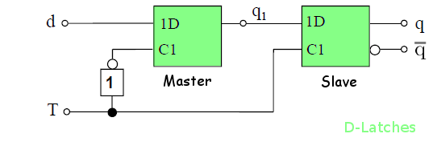

Flipflops und Latches sind 1-bit Datenspeicher. Es gibt sie als synchrone und als asynchrone Varianten, wobei &bdquo;synchron&ldquo; nur bedeutet, dass das Bauteil zusätzlich einen Takteingang hat. Der wichtigste (und einzige?) Unterschied zwischen Flipflops und Latches ist, dass Flipflops Taktflankengesteuert sind und Latches Pegelgesteuert sind. Das heißt, Flipflops können nur dann ihren Wert ändern, wenn der anliegende Takt von 0 auf 1 wechselt. Latches hingegen können ihren Wert immer ändern, wenn der anliegende Takt auf 1 ist. Beide haben die gleichen Ansteuertabellen, können aber unterschiedliche Zeitdiagramme haben.

Interessant sind vor allem die Ansteuertabellen. Dabei darf man sich nicht von der Art, wie diese aufgeschrieben werden, verwirren lassen: $q^t$ ist der Zustand des Flipflops zum Zeitpunkt $t$. Analog dazu ist $q^{t+1}$ der Zustand des Flipflops zum Zeitpunkt $t+1$. Nun steht rechts in der Tabelle, welche Signale man braucht um den Zustand $q^{t+1}$ zu erreichen, wenn man im Zustand $q^t$ ist.

    <figure>
        
        <figcaption>D-Latch</figcaption>
    </figure>
    <figure>
        
        <figcaption>D-Flipflop</figcaption>
    </figure>

<h2>D-Flipflops</h2>
<abbr title="Delay-Flipflops">D-Flipflops</abbr> ignorieren im Prinzip den aktuellen Zustand und setzen den neuen Zustand einfach auf das d-Signal.

D-Flipflops können aus D-Latches erstellt werden:
<figure>
    
    <figcaption>D-Flipflop</figcaption>
</figure>

<h3>Ansteuertabelle</h3>
<table>
<tr>
<td>
<table style="width:auto">
  <tr>
    <th style="border-bottom:1px solid black;">$q^t$</th>
    <th style="border-bottom:1px solid black;border-right: 1px solid black;">$q^{t+1}$</th>
    <th style="border-bottom:1px solid black;">$d^t$</th>
  </tr>
  <tr>
    <td>0</td>
    <td style="border-right: 1px solid black;">0</td>
    <td>0</td>
  </tr>
  <tr>
    <td>0</td>
    <td style="border-right: 1px solid black;">1</td>
    <td>1</td>
  </tr>
  <tr>
    <td>1</td>
    <td style="border-right: 1px solid black;">0</td>
    <td>0</td>
  </tr>
  <tr>
    <td>1</td>
    <td style="border-right: 1px solid black;">1</td>
    <td>1</td>
  </tr>
</table>
</td>
<td>
<figure>
    
    <figcaption>D-Flipflop mit Eingang D, unbenanntem Takt und Ausgang Q sowie Q negiert.</figcaption>
</figure>
</td>
</tr>
</table>

<h2>RS-Flipflops</h2>
Das <abbr title="Reset-Set-Flipflop">RS-Flipflop</abbr> bietet zwei Möglichkeiten: Entweder man resettet es, dann wird der neue Zustand 0, oder man setzt es. Dann ist der neue Zustand 1.

Ein RS-Flipflop hat zwei Eingänge und einen oder zwei Ausgänge.

<h3>Ansteuertabelle</h3>
<table>
<tr>
<td>
<table style="width:auto">
  <tr>
    <th style="border-bottom:1px solid black;">$q^t$</th>
    <th style="border-bottom:1px solid black;border-right: 1px solid black;">$q^{t+1}$</th>
    <th style="border-bottom:1px solid black;">$r^t$</th>
    <th style="border-bottom:1px solid black;">$s^t$</th>
  </tr>
  <tr>
    <td>0</td>
    <td style="border-right: 1px solid black;">0</td>
    <td>-</td>
    <td>0</td>
  </tr>
  <tr>
    <td>0</td>
    <td style="border-right: 1px solid black;">1</td>
    <td>0</td>
    <td>1</td>
  </tr>
  <tr>
    <td>1</td>
    <td style="border-right: 1px solid black;">0</td>
    <td>1</td>
    <td>0</td>
  </tr>
  <tr>
    <td>1</td>
    <td style="border-right: 1px solid black;">1</td>
    <td>0</td>
    <td>-</td>
  </tr>
</table>
</td>
<td>
<figure>
    
    <figcaption>RS-Flipflop</figcaption>
</figure>
</td>
</tr>
</table>

<h2>T-Flipflop</h2>
<abbr title="Toggle-Flipflop">T-Flipflops</abbr> wechseln den Zustand, wenn T gesetzt ist.

<h3>Ansteuertabelle</h3>
<table>
<tr>
<td>
<table style="width:auto">
  <tr>
    <th style="border-bottom:1px solid black;">$q^t$</th>
    <th style="border-bottom:1px solid black;border-right: 1px solid black;">$q^{t+1}$</th>
    <th style="border-bottom:1px solid black;">$T^t$</th>
  </tr>
  <tr>
    <td>0</td>
    <td style="border-right: 1px solid black;">0</td>
    <td>0</td>
  </tr>
  <tr>
    <td>0</td>
    <td style="border-right: 1px solid black;">1</td>
    <td>1</td>
  </tr>
  <tr>
    <td>1</td>
    <td style="border-right: 1px solid black;">0</td>
    <td>1</td>
  </tr>
  <tr>
    <td>1</td>
    <td style="border-right: 1px solid black;">1</td>
    <td>0</td>
  </tr>
</table>
</td>
<td>
<figure>
    
    <figcaption>T-Flipflop mit Eingang T, unbenanntem Taktsignal, Ausgang Q und dem negiertem Ausgang Q.</figcaption>
</figure>
</td>
</tr>
</table>

<h2>JK-Flipflop</h2>
<abbr title="Jump-/Kill-Flipflops">JK-Flipflops</abbr> haben zwei Eingänge, &bdquo;J&ldquo; und &bdquo;K&ldquo;. Warum die allerdings Jump und Kill genannt werden, ist mir nicht klar. Habt ihr eine Merkregel für die Ansteuertabelle dieses Flipflops?

<h3>Ansteuertabelle</h3>
<table>
<tr>
<td>
<table style="width:auto">
  <tr>
    <th style="border-bottom:1px solid black;">$q^t$</th>
    <th style="border-bottom:1px solid black;border-right: 1px solid black;">$q^{t+1}$</th>
    <th style="border-bottom:1px solid black;">$j^t$</th>
    <th style="border-bottom:1px solid black;">$k^t$</th>
  </tr>
  <tr>
    <td>0</td>
    <td style="border-right: 1px solid black;">0</td>
    <td>0</td>
    <td>-</td>
  </tr>
  <tr>
    <td>0</td>
    <td style="border-right: 1px solid black;">1</td>
    <td>1</td>
    <td>-</td>
  </tr>
  <tr>
    <td>1</td>
    <td style="border-right: 1px solid black;">0</td>
    <td>-</td>
    <td>1</td>
  </tr>
  <tr>
    <td>1</td>
    <td style="border-right: 1px solid black;">1</td>
    <td>-</td>
    <td>0</td>
  </tr>
</table>
</td>
<td>
<figure>
    
    <figcaption>JK-Flipflop</figcaption>
</figure>
</td>
</tr>
</table>
