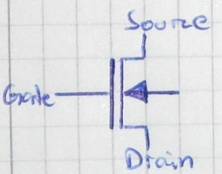
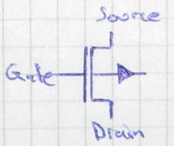
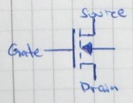
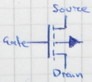
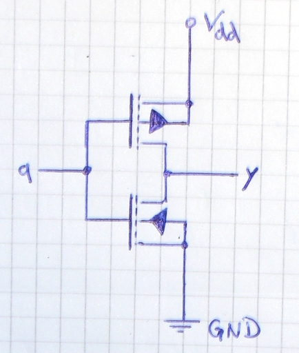
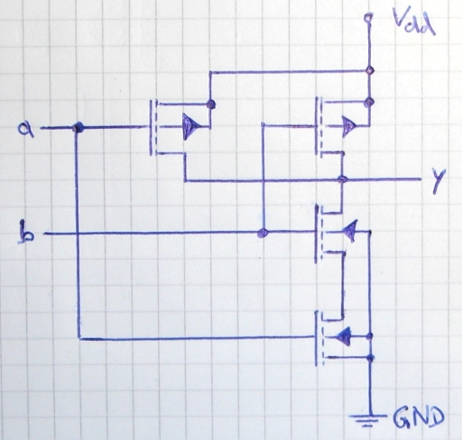

CMOS is a technology used to create digital circuits. The basic idea is to combine a pMOS circuit and a nMOS circuit.

<h2>MOSFET</h2>
Four <abbr title="metal&ndash;oxide&ndash;semiconductor field-effect transistor">MOSFET</abbr> are important for CMOS:

<table>
<tr>
  <th>&nbsp;</th>
  <th>nMOS</th>
  <th>pMOS</th>
</tr>
<tr>
<th>depletion</th>
  <td></td>
  <td></td>
</tr>
<tr>
<th>enhancement</th>
  <td></td>
  <td></td>
</tr>
</table>

<h2>Inverter</h2>
<figure>
    
    <figcaption>Inverter in CMOS technology</figcaption>
</figure>

<h2>NAND</h2>
<figure>
    
    <figcaption>NAND gate in CMOS technology</figcaption>
</figure>

<h2>Images</h2>
I tried to find good software to create those images. I didn't find any that allowed me to create those images. I've tried this:

<ul>
  <li><a href="http://wwwu.uni-klu.ac.at/magostin/cirkuit.html">Cirkuit</a>: Looks good, but crashes.</li>
  <li>EAGLE: too complex</li>
  <li>KLogic: seems only to be able to create logic plans</li>
  <li>PCB Designer: too complex, weird interface</li>
</ul>

<h2>Anything else?</h2>
Which other circuits do we have to know? (Perhaps Transmission Gate?)
