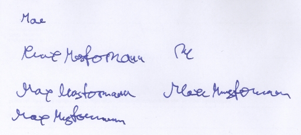
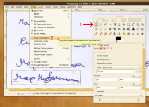
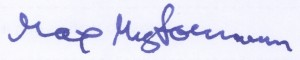
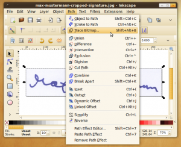
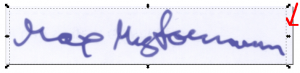
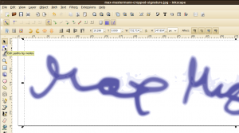
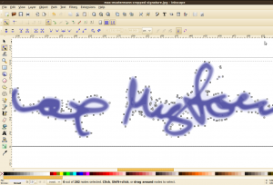
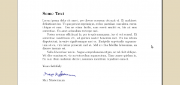

At first, you have to write your signature on a white sheet of paper. You might have to make several tries:

<figure class="aligncenter">
            <a href="../images/2013/02/signature-tries.jpg"></a>
            <figcaption class="text-center">Some tries for a nice signature</figcaption>
        </figure>

Then you should scan it in a high quality. Now crop the image to the size you like. I have used <a href="http://www.gimp.org/">GIMP</a> for this task:

<figure class="aligncenter">
            <a href="../images/2013/02/crop-to-selection-300x216.png"></a>
            <figcaption class="text-center">Crop the image to the correct section with GIMP</figcaption>
        </figure>

Now you should have an image like this one:
<figure class="aligncenter">
            <a href="../images/2013/02/max-mustermann-cropped-signature-300x60.jpg"></a>
            <figcaption class="text-center">Cropped signature</figcaption>
        </figure>

<h2>Inkscape</h2>
Open it with <a href="http://inkscape.org/download">Inkscape</a>, click on the image go to the menu "Path > Trace Bitmap":

<figure class="aligncenter">
            <a href="../images/2013/02/inkscape-trace-bitmap-300x244.png"></a>
            <figcaption class="text-center">Trace Bitmap in Inkscape</figcaption>
        </figure>

Now choose "Colors", check "Remove background" and click on "Update":
<figure class="aligncenter">
            <a href="../images/2013/02/trace-bitmap-settings-300x216.png"></a>
            <figcaption class="text-center">Trace Bitmap: Settings</figcaption>
        </figure>

Close the window and look closely at the image. It should now look like this:
<figure class="aligncenter">
            <a href="../images/2013/02/traced-bitmap-in-inkscape-300x73.png"></a>
            <figcaption class="text-center">Traced bitmap in Inkscape</figcaption>
        </figure>

You have to click at a part of the image that is currently not selected and then hit the remove key.

Now select the "Edit path by nodes" tool:
<figure class="aligncenter">
            <a href="../images/2013/02/edit-path-by-nodes-300x167.png"></a>
            <figcaption class="text-center">Edit path by nodes</figcaption>
        </figure>

Click on the gray area. The image will look like this:
<figure class="aligncenter">
            <a href="../images/2013/02/remove-nodes-in-inkscape-300x204.png"></a>
            <figcaption class="text-center">Remove nodes</figcaption>
        </figure>

Remove nodes of areas that have to many or where you don't want to have this gray area. This will take some time.
<figure class="aligncenter">
            <a href="../images/2013/02/inkscape-remove-nodes-300x247.png"></a>
            <figcaption class="text-center">Some nodes you should remove</figcaption>
        </figure>

As soon as you're finished, you should save your signature as SVG (if you want to edit it later) and as PDF (for LaTeX).

<h2>LaTeX</h2>

```latex
\documentclass[a4paper,12pt]{article}
\usepackage{pdfpages}  % needed for includepdf

\begin{document}
\section*{Some Text}
Lorem ipsum dolor sit amet, pro discere accusam detraxit ei. Ei
maluisset definitiones ius. Ut quo persius reprimique, sed ea
postulant consulatu, essent tibique et cum. Usu ne etiam facilis,
eam everti eruditi ea, his ad eros sententiae. Cu amet admodum
recteque mei.

Postea aeterno officiis pri in, per te quis numquam, ius ei veri
consul. Ei sententiae constituam vix, ad quidam noster bonorum mel.
Eu ius rebum disputationi, invenire signiferumque mei ea. Euripidis
expetendis argumentum sit eu, viris latine persecuti mel at. Mel ut
clita fabellas laboramus, an discere inermis est.

Nulla liberavisse usu in. Augue comprehensam ut pro, ne vel dicit
oblique. Vel dico omnium et, vis an tota solum argumentum. Eam
omnes quidam in. Eu eam illum malorum diceret, nonumes mentitum
repudiare eam et.\\

\noindent Yours faithfully\\
\\
\includegraphics[height=10mm]{max-mustermann-cropped-signature.pdf}\\
Max Mustermann
\end{document}
```

<h2>Result</h2>
The result looks like this:

<figure class="aligncenter">
            <a href="../images/2013/02/latex-signed-300x141.png"></a>
            <figcaption class="text-center">A signed document, created with LaTeX</figcaption>
        </figure>

It looks even better if you make the image a little bit darker in the first step with GIMP.
