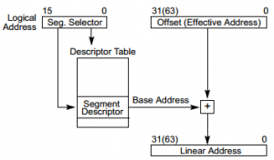
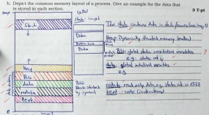

<div class="info">Dieser Artikel beschäftigt sich mit den Vorlesungen des Moduls &bdquo;Betriebssysteme&ldquo; am KIT. Er dient als Prüfungsvorbereitung. Ich habe die Vorlesungen bei Prof. Dr. Bellosa und später bei Prof. Dr. Beigl gehört.</div>

Wenn ich im Folgenden eine Seitenzahl angebe, dann ist damit "Operating System Concepts" von Silberschatz gemeint (ISBN 0-471-69466-5):

<h2>Themen</h2>
<ul>
  <li>Process Coordination:
    <ul>
      <li>Shared Memory</li>
      <li>Critical-Section Problem: <a href="http://de.wikipedia.org/wiki/Algorithmus_von_Peterson">Peterson's Solution</a>, Synchronisation</li>
      <li><a href="http://de.wikipedia.org/wiki/Deadlock">Deadlock</a>, <a href="http://en.wikipedia.org/wiki/Resource_starvation">Starvation</a></li>
    </ul>
  </li>
  <li>Process Management
    <ul>
      <li>Process Scheduling</li>
      <li>Process States: new, ready, running, waiting, terminated</li>
      <li>Process Control Block: Folie 6/65 slide_proc_management</li>
    </ul>
  </li>
  <li>Memory Management
    <ul>
      <li>Globale / lokale Seitenersetzungsstrategie</li>
      <li>Equal allocation</li>
      <li><a href="http://de.wikipedia.org/wiki/Slab_allocator">Slab allocator</a></li>
    </ul>
  </li>
</ul>

<h2>Begriffe</h2>
Folgende Begriffe muss man kennen und erklären können:
<ul>
  <li>Critical Section und Race Condition</li>
  <li><a href="http://de.wikipedia.org/wiki/Semaphor_(Informatik)">Semaphor</a>: counting Semaphores, binary Semaphores und Mutex Locks &rarr; Antwort auf S. 200f</li>
  <li>Dining-Philosophers Problem &rarr; Antwort auf S. 207f</li>
  <li>Deadlock, Starvation</li>
  <li>Safe State</li>
</ul>

<h2>FAQ</h2>
<ul>
  <li>Wie funktionieren Bitmasken und insbesondere ~, &, |?</li>
  <li>Nenne ein reales Beispiel, bei dem eine Race-Condition auftreten könnte.</li>
  <li>Welche Probleme hat Contiguous Allocation? &rarr; <span class="hint" title="Man muss sich entscheiden, wo auf der Festplatte eine neue Datei begonnen werden soll; Externe Fragmentierung. Strategien: First Fit, Best Fit, Worst Fit">Antwort</span></li>
</ul>

<div class="question">
<span class="question">Welche Scheduling-Verfahren gibt es?</span>
<div class="answer">
<ul>
  <li>Priority Scheduling</li>
  <li>Round Robin</li>
  <li>Multilevel Feedback Queue</li>
  <li>Lottery Scheduling</li>
  <li><abbr title="Preemtitive Shortest Job First">PSJF</abbr></li>
  <li><abbr title="First Come, First Serve">FCFS</abbr></li>
</ul></div>
</div>

<div class="question">
<span class="question">What is the difference between Page and Frame?</span>
<div class="answer">In a paging system, programs and data stored on disk are divided into equal, fixed sized blocks called pages, and main memory is divided into blocks of the same size called frames. Exactly one page can fit in one frame.

Physical memory is divided into parts called &bdquo;frame&ldquo; and logical memory is divided into parts called &bdquo;page&ldquo;.</div>
Quelle: <a href="http://wiki.answers.com/Q/What_is_the_difference_between_Page_and_Frame">wiki.answers.com</a>
</div>

<div class="question">
<span class="question">Nennen und erläutern Sie die drei notwendigen Bedingungen für eine gültige Lösung des Problems kritischer Abschnitte.</span>
<div class="answer">
<ul>
<li>Mutual exclusion: Only one thread can be in the CS at a time.</li>
<li>Progress:
  <ul>
    <li>If no thread is in the CS one of the threads trying to enter will eventually get in</li>
    <li>Threads that are not trying to enter do not hinder processes that try to enter from getting in</li>
  </ul>
</li>
<li>Bounded waiting: Once a thread starts trying to enter the critical section, there is a bound on the number of times other threads get in.</li>
</ul>
</div>
</div>

<div class="question">
<span class="question">Wie kann man das Problem kritischer Abschnitte lösen?</span>
<div class="answer">
<ul>
  <li>Interrupts deaktivieren (nur im Kernel-Space, nur Single-Core)</li>
  <li>Spezielle atomare Instruktionen:
    <ul>
      <li><a href="http://en.wikipedia.org/wiki/Test-and-set">Test-and-set</a></li>
      <li><a href="http://en.wikipedia.org/wiki/Compare-and-swap">Compare-and-swap</a></li>
      <li><a href="http://en.wikipedia.org/wiki/Fetch-and-add">Fetch-and-add</a></li>
      <li><a href="http://en.wikipedia.org/wiki/Swap_(computer_science)#Dedicated_instructions">swap</a></li>
    </ul>
  </li>
  <li><a href="http://de.wikipedia.org/wiki/Semaphor_(Informatik)">Semaphor</a> (wait und signal)</li>
  <li><a href="http://de.wikipedia.org/wiki/Monitor_(Informatik)">Monitor</a></li>
  <li><a href="http://de.wikipedia.org/wiki/Algorithmus_von_Peterson">Algorithmus von Peterson</a></li>
</ul>
</div>
</div>

<div class="question">
<span class="question">Nennen und erklären Sie die vier notwendigen Bedingungen für Deadlocks.</span>
<div class="answer">
<ul>
<li>Mutual exclusion: Eine Ressource kann nicht gleichzeitig von mehreren Prozessen benutzt werden</li>
<li>Hold and wait: Ein Prozess, der bereits mindestens eine Ressource hält, wartet auf mindestens eine andere Ressource</li>
<li>No preemption: Zugeteilte Ressourcen können einem Prozess nicht wieder entzogen werden. Er muss diese selbst freigeben.</li>
<li>Circular wait: Es gibt eine Menge von Prozessen $\{P_0, P_1, \dots, P_n\}$, wobei $P_0$ auf eine Ressource wartet, die $P_1$ hält, $P_1$ auf eine Ressource wartet, die $P_2$ hält, ..., $P_n$ auf eine Ressource wartet, die $P_0$ hält.</li>
</ul>
</div>
</div>

<div class="question">
<span class="question">Was kann man in Bezug auf das Deadlock-Problem machen?</span>
<div class="answer">
<ul>
  <li>Prevention</li>
  <li>Avoidance</li>
  <li>Detection:
    <ul>
      <li>Prozess abschießen</li>
      <li>Rollback</li>
    </ul>
  </li>
  <li><a href="http://de.wikipedia.org/wiki/Vogel-Strau%C3%9F-Algorithmus">Vogel-Strauß-Algorithmus</a>: Der User wird sich schon drum kümmern, z.B. indem er einen Prozess abschießt (<code>kill -9</code>) oder indem er den PC vom Strom nimmt.</li>
</ul>
</div>
</div>

<div class="question">
<span class="question">Erklären Sie RAID 0 - 5.</span>
<div class="answer">
<ul>
  <li>RAID 0: Striping. Platten werden "aneinandergehängt".</li>
  <li>RAID 1: Mirroring. Daten werden auf mehrere Platten gespiegelt.</li>
  <li>RAID 2: Fehlerkorrigierender Hamming-Code.</li>
  <li>RAID 3: Byteweise Parität.</li>
  <li>RAID 4: Blockweise Parität.</li>
  <li>RAID 5: Blockweise, verteilte Parität.</li>
</ul>
</div>
</div>

<div class="question">
<span class="question">Warum verwenden wir Seitentabellen? Könnte man nicht einfach im Hauptspeicher je zwei Datenwörter kombinieren, wobei das erste die Metainformationen (z.B. Zugriffsrechte, Prozess-ID) und das zweite die Daten enthält?</span>
<div class="answer">
Prinzipiell wollen wir in einer x86-Architektur, dass sich die Hardware um das Paging kümmert. Bei MIPS sieht das wohl anders aus (<a href="http://stackoverflow.com/q/10671147/562769">Quelle</a>).

Wenn man sich für jedes Datenwort ein Datenwort mit Metainformationen merken würde, hätte man sehr viel Overhead. Diese Informationen hat man bei Paging auf IA-32 nur alle 4096 Byte! (Allgemein ist Overhead übrigens eine Begründung, die häufig stimmt.)

Falls man es wirklich genau wissen will, sollte man wohl die <a href="http://www.intel.com/content/www/us/en/processors/architectures-software-developer-manuals.html">IA-32 Architectures Software Developer&rsquo;s Manuals</a> lesen. Das sind ja nur 3044 Seiten.
</div>
</div>

<div class="question">
<span class="question">Einstufige Seitentabellen sind deutlich einfacher zu verstehen und zu implementieren. Warum verwendet man sie nicht auf 64 Bit Systemen?</span>
<div class="answer">Sie würden zu viel Speicher benötigen. Es wird eine Seitentabelle pro Prozess benötigt. Die Größe einer einstufigen Seitentabelle berechnet sich folgendermaßen:

Sei $m$ die Größe des Hauptspeichers in Byte, $p$ die Größe einer Seite in Byte und $a$ die Anzahl der zusätzlichen Bit pro Seite (Access Control bits, validity. Siehe <a href="http://unix.stackexchange.com/q/68148/4784">StackExchange</a>).
Dann gilt:

Größe der Seitentabelle = Größe eines Seiteneintrags &middot; Anzahl der Seiten
$= \lceil \frac{\log_2(\frac{m}{p}) + a}{8}\rceil \text{Byte} \cdot \frac{2^{64} \text{ Byte}}{p \text{ Byte}}$

Typischerweise gilt: $m = 4 \text{ GB} = 4 \cdot 2^{30} \text{ Byte} = 2^{32} \text{ Byte}$, $p = 4096 \text{ Byte}$ und $a = 8$. Daraus folgt eine Seiteneintrags-Größe von 4 Byte und 4.503.599.627.370.496 Seiten. Das ergibt eine Seitentabellengröße von 16 Petabyte.
</div>
</div>

<div class="question">
<span class="question">Wenn man nur Segmentierung nutzt, wie kommt man dann von der logischen Adresse auf die physische?</span>
<div class="answer">
<figure class="aligncenter">
            <a href="../images/2013/03/segmentation-logical-to-linear-address-300x176.png"></a>
            <figcaption class="text-center">Segmentation: Logical to linear address (<a href='http://download.intel.com/products/processor/manual/325462.pdf'>source</a>)</figcaption>
        </figure>
</div>
</div>

<div class="question">
<span class="question">Wie ist ein Inode aufgebaut?</span>
<div class="answer">
<figure class="aligncenter">
            <a href="../images/2013/03/inode-struktur-256x300.png"></a>
            <figcaption class="text-center">Struktur eines Inodes</figcaption>
        </figure>
</div>
</div>

<div class="question">
<span class="question">Wie groß kann eine Datei maximal werden, wenn man Inodes mit jeweils einem indirekten, doppelt indirektem und dreifach indirektem Block hat?</span>
<div class="answer">
Sei $b$ die Größe eines Blocks in Byte und ein Zeiger belege 4 Byte.
Dann berechnet sich die maximale Dateigröße in Byte folgendermaßen:
$12 \cdot b + \frac{b}{4} \cdot b+ \frac{\frac{b}{4} \cdot b}{4} \cdot b + \frac{\frac{\frac{b}{4} \cdot b}{4} \cdot b}{4} \cdot b = 12 \cdot b + \frac{b^2}{4} + \frac{b^3}{16} + \frac{b^4}{64}$

Bei einer Blockgröße von 1024 Byte sind das 17,25 GB (<a href="http://www.wolframalpha.com/input/?i=12*1024%2B1024%5E2%2F4%2B1024%5E3%2F16%2B1024%5E4%2F64+byte">Rechnung</a>), bei einer Blockgröße von 4096 Byte sogar 4,40 TB (<a href="http://www.wolframalpha.com/input/?i=12*4096%2B4096%5E2%2F4%2B4096%5E3%2F16%2B4096%5E4%2F64+byte">Rechnung</a>)!

Wenn ihr Linux habt, könnt ihr diese Werte so herausfinden:
```bash
moose@pc08 ~ $ df
Filesystem     1K-blocks     Used Available Use% Mounted on
/dev/sda1      303869280 16418288 272015268   6% /
udev             1889040        4   1889036   1% /dev
tmpfs             758712      988    757724   1% /run
none                5120        0      5120   0% /run/lock
none             1896772      772   1896000   1% /run/shm
none              102400        8    102392   1% /run/user
moose@pc08 ~ $ sudo tune2fs -l /dev/sda1 | grep 'Block size'
Block size:               4096

```
</div>
</div>

<div class="question">
<span class="question">Depict the common memory layout of a process. Give an example of the data that is stored in each section.</span>
<div class="answer">
<figure class="aligncenter">
            <a href="../images/2013/03/process-memory-layout-300x165.jpg"></a>
            <figcaption class="text-center">Common process memory layout</figcaption>
        </figure>

Ich sehe gerade, dass bei rodata wohl das Schlüsselwort <code>const</code> dabei stehen sollte. Statische Variablen können natürlich geändert werden.
</div>
</div>

<div class="question">
<span class="question">What is anonymous memory?</span>
<div class="answer">
Anonymous memory is memory that is not backed by a file. Examples are stack and heap.
</div>
</div>

<h2>Material</h2>
Material zum Üben (also <a href="http://os.ibds.kit.edu/1556.php">alte Klausuren</a>) gibt es wie immer entweder online oder bei der Fachschaft.

Die Lösungen zu den Klausuren sind passwortgeschützt, aber wenn ihr euch einmal über VPN einloggt, stehen ganz unten auf der Seite die Zugangsdaten.

Das Skript / die Folien sind im <a href="https://studium.kit.edu/sites/vab/0x8763DF03F4275B4F908D321A58479E61/vorlesungsunterlagen_pwg/Forms/AllItems.aspx?RootFolder=%2fsites%2fvab%2f0x8763DF03F4275B4F908D321A58479E61%2fvorlesungsunterlagen_pwg%2fVorlesung&FolderCTID=&View=%7b2672A6DD-CB1A-408E-888B-441716F3F757%7d">VAB</a>.

Folgende Wiki-Artikel und manpages sollte man sich durchlesen:
<ul>
  <li><a href="http://de.wikipedia.org/wiki/Unix-Dateirechte">Unix-Dateirechte</a> und <code>chmod</code> sowie <a href="../linux-access-rights-and-attributes/" title="Linux access rights and attributes">mein Artikel</a>.</li>
</ul>

Als Buch kann ich neben dem Silberschatz folgendes empfehlen:
LPIC-1 - Vorbereitung auf die Prüfung des Linux Professional Institute. ISBN 978-3-937514-81-9

<h2>Some Random Facts</h2>
<ul>
  <li><code>subl $16, %esp</code> allokiert 16 Byte auf dem Stack.</li>
</ul>

<h2>Termine und Klausurablauf</h2>
<strong>Datum</strong>: 18.03.2012 um 14:00 Uhr.<br/>
<strong>Ort</strong>: ich bin im <a href="http://kit.carstengriesheimer.de/map/1459">30.21 Gerthsen</a> (<a href="https://studium.kit.edu/sites/vab/0xC1937D6957186A468FE059ECE05D74B8/Start/homepage.aspx">Hörsaalverteilung</a>)<br/>
<strong>Dauer</strong>: 60 Minuten<br/>
<strong>Punkte</strong>: 60<br/>
<strong>Bonuspunkte</strong>: Abhängig von den Punkten im Übungsschein:
<ul>
  <li>110 - 129 Punkte: 1 Bonuspunkt</li>
  <li>130 - 149 Punkte: 2 Bonuspunkte</li>
  <li>150 - 169 Punkte: 3 Bonuspunkte</li>
  <li>170 - x Punkte: 4 Bonuspunkte</li>
</ul>
<a href="https://studium.kit.edu/sites/vab/0xC1937D6957186A468FE059ECE05D74B8/Vorlesungsunterlagen/BS-WS1213-00aOrga.pdf">Quelle</a><br/>
<strong>Nicht vergessen</strong>: Studentenausweis<br/>
<strong>Einsicht</strong>: 09.04.2013 (war seit spätestens 13.02.2013 bekannt)<br/>
<strong>Ort der Einsicht</strong>: 07.07 (<a href="https://maps.google.com/maps?q=Vincenz-Prie%C3%9Fnitz-Stra%C3%9Fe+1,+Forschungsstelle+f%C3%BCr+Brandschutztechnik+am+KIT,+Oststadt+76131+Karlsruhe,+Baden-W%C3%BCrttemberg,+Deutschland&hl=de&ie=UTF8&ll=49.012738,8.423853&spn=0.015622,0.042272&geocode=FYXh6wIdLouAAA&hnear=Vincenz-Prie%C3%9Fnitz-Stra%C3%9Fe+1,+Oststadt+76131+Karlsruhe,+Baden-W%C3%BCrttemberg,+Deutschland&t=m&z=15">Vincenz-Priessnitz-Str. 1</a>, 2.OG, links), Raum 215<br/>
<strong>Zeit der Einsicht</strong>: Je nach Matrikelnummer unterschiedlich.

<h2>Ergebnisse</h2>
<strike>Hängen noch nicht aus (Stand: 15.03.2013)</strike>
Hängen nun aus (Stand: 08.04.2013) und <a href="https://studium.kit.edu/sites/vab/0xC1937D6957186A468FE059ECE05D74B8/vorlesungsunterlagen_pwg/Ergebnisse/klausur__18_03_2013.pdf">sind im VAB verfügbar</a>

<figure class="aligncenter">
            <a href="../images/2013/03/os-klausur-ws201213-ergebnisse-300x227.png"></a>
            <figcaption class="text-center">Ergebnisse der OS-Klausur vom WS 2012 / 2013</figcaption>
        </figure>
