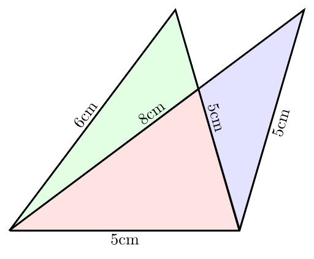

I've just seen the following image on spikedmath.com:

<figure class="aligncenter">
            
            <figcaption class="text-center">Some geometry questions. Source: <a href='http://spikedmath.com/549.html'>spikedmath.com</a></figcaption>
        </figure>

The second answers seem to be obviously the correct ones, right? Wrong.

According to <a href="http://en.wikipedia.org/wiki/Heron%27s_formula">Heron's formula</a> you can calculate a triangles area like this:

Let $a, b, c$ be the side lengths of the triangle.
$s := \frac{a+b+c}{2}$
$T = \sqrt{s \cdot (s-a) \cdot (s-b) \cdot (s-c)}$

So the area of the first triangle is
$s_1 := \frac{16}{2} = 8$
$T_1 := \sqrt{8 \cdot (8-5) \cdot (8-5) \cdot (8-6)} = \sqrt{8 \cdot 3 \cdot 3 \cdot 2} = 3 \cdot 4 = 12$

The area of the second one is
$s_1 := \frac{18}{2} = 9$
$T_1 := \sqrt{9 \cdot (9-5) \cdot (9-5) \cdot (9-8)} = \sqrt{9 \cdot 4 \cdot 4 \cdot 1} = 3 \cdot 4 = 12$

Both triangles have the same area!

When you draw it, it looks like this:

<figure class="aligncenter">
            
            <figcaption class="text-center">Both triangles in one picture</figcaption>
        </figure>
