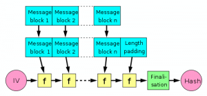

Dieser Artikel beschäftigt sich mit der Vorlesung &bdquo;Sicherheit&ldquo; am KIT. Er dient als Prüfungsvorbereitung. Ich habe die Vorlesungen bei Herrn <a href="http://www.iks.kit.edu/index.php?id=hofheinz">Jun.-Prof. Hofheinz</a> im Sommersemester 2013 gehört.

An diesem Artikel wird natürlich noch gearbeitet.

<h2>Behandelter Stoff</h2>
<table>

<tr>
<td>25.04.2013</td>
<td rowspan="2" style="border-bottom:1px solid black;">Caesar, Vigenere, One-Time-Pad</td>
</tr>
<tr>
<td style="border-bottom:1px solid black;"><a href="http://www.iks.kit.edu/fileadmin/User/Lectures/Sicherheit/SoSe13/Sicherheit_VL01.pdf">VL 01</a></td>
</tr>

<tr>
<td>22.04.2013</td>
<td rowspan="2" style="border-bottom:1px solid black;">Symmetrische Verschlüsselungen; Stromchiffren; Blockchiffren (DES, AES); <a href="http://commons.wikimedia.org/wiki/User:MartinThoma#Betriebsmodi">Betriebsmodi</a>:
    <table>
      <tr>
        <th rowspan="2">Modus</th>
        <th rowspan="2">Verschlüsselung Entschlüsselung</th>
        <th colspan="2">Parallelisierbarkeit</th>
      </tr>
      <tr>
        <th>verschl.</th>
        <th>entschl.</th>
      </tr>
      <tr>
        <td>ECB</td>
        <td>$c_i = ENC(K, m_i)$ $m_i = DEC(K, m_i)$</td>
        <td>Ja</td>
        <td>Ja</td>
      </tr>
      <tr>
        <td>CBC</td>
        <td>$c_i = ENC(K, m_i \oplus c_{i-1})$ $m_i = DEC(K, c_i) \oplus c_{i-1}$</td>
        <td>Nein</td>
        <td>Ja</td>
      </tr>
      <tr>
        <td>CFB</td>
        <td>$c_i = m_i \oplus ENC(K, c_{i-1})$ $m_i = c_i \oplus ENC(K, c_{i-1})$</td>
        <td>Nein</td>
        <td>Ja</td>
      </tr>
      <tr>
        <td>OFB</td>
        <td>$c_i = m_i \oplus ENC(K, IV)^i$ $m_i = c_i \oplus ENC(K, IV)^i$</td>
        <td>Nein</td>
        <td>Nein</td>
      </tr>
    </table>
<a href="http://commons.wikimedia.org/wiki/File:DES-main-network.png">DES-Feistelstruktur</a>
</td>
</tr>
<tr>
<td style="border-bottom:1px solid black;"><a href="http://www.iks.kit.edu/fileadmin/User/Lectures/Sicherheit/SoSe13/Sicherheit_VL02.pdf">VL 02</a></td>
</tr>

<tr>
<td>25.04.2013</td>
<td rowspan="2" style="border-bottom:1px solid black;">Lineare Kryptoanalyse, Differentielle Kryptoanalyse, <a href="../semantische-sicherheit/" title="Semantische Sicherheit">Semantische Sicherheit</a>, <a href="../sicherheit-klausur/#Fragen">IND-CPA</a>, Feistel-Schema</td>
</tr>
<tr>
<td style="border-bottom:1px solid black;"><a href="http://www.iks.kit.edu/fileadmin/User/Lectures/Sicherheit/SoSe13/Sicherheit_VL03.pdf">VL 03</a></td>
</tr>

<tr>
<td>29.04.2013</td>
<td rowspan="2" style="border-bottom:1px solid black;">Hashfunktionen, <a href="../kollisionsresistente-hashfunktionen-und-einwegfunktionen/">Kollisionsresistenz $\Rightarrow$ Einwegeigenschaft</a>, Merkle-Damgard-Konstruktion und Length-Extension-Problematik, Birthday Attack, Meet-in-the-Middle-Angriff</td>
</tr>
<tr>
<td style="border-bottom:1px solid black;"><a href="http://www.iks.kit.edu/fileadmin/User/Lectures/Sicherheit/SoSe13/Sicherheit_VL04.pdf">VL 04</a></td>
</tr>

<tr>
<td>06.05.2013</td>
<td rowspan="2" style="border-bottom:1px solid black;">Public-Key-Verschlüsselung (Idee, RSA); Meet-in-the-Middle-Angriff für Hashfunktionen</td>
</tr>
<tr>
<td style="border-bottom:1px solid black;"><a href="http://www.iks.kit.edu/fileadmin/User/Lectures/Sicherheit/SoSe13/Sicherheit_VL05.pdf">VL 05</a></td>
</tr>

<tr>
<td>13.05.2013</td>
<td rowspan="2" style="border-bottom:1px solid black;">Rest Public-Key-Verschlüsselung (ElGamal, Vergleich RSA/ElGamal), Symmetrische Authentifikation von Nachrichten (Sicherheitsmodell, Hash-then-Sign, <abbr title="Pseudorandom functions">PRFs</abbr>, <abbr title="Hash-based message authentication code">HMAC</abbr>), <a href="http://de.wikipedia.org/wiki/Message_Authentication_Code">MAC</a></td>
</tr>
<tr>
<td style="border-bottom:1px solid black;"><a href="http://www.iks.kit.edu/fileadmin/User/Lectures/Sicherheit/SoSe13/Sicherheit_VL06.pdf">VL 06</a></td>
</tr>

<tr>
<td>27.05.2013</td>
<td rowspan="2" style="border-bottom:1px solid black;">Asymmetrische Authentifikation von Nachrichten (RSA-PSS, ElGamal, DSA)</td>
</tr>
<tr>
<td style="border-bottom:1px solid black;"><a href="http://www.iks.kit.edu/fileadmin/User/Lectures/Sicherheit/SoSe13/Sicherheit_VL07.pdf">VL 07</a></td>
</tr>

<tr>
<td>03.06.2013</td>
<td rowspan="2" style="border-bottom:1px solid black;">Schlüsselaustausch (Kerberos, TLS, Angriffe)</td>
</tr>
<tr>
<td style="border-bottom:1px solid black;"><a href="http://www.iks.kit.edu/fileadmin/User/Lectures/Sicherheit/SoSe13/Sicherheit_VL08.pdf">VL 08</a></td>
</tr>

<tr>
<td>10.06.2013</td>
<td rowspan="2" style="border-bottom:1px solid black;">Schlüsselaustausch (TLS-Angriffe, weitere Verfahren), Identifikationsprotokolle</td>
</tr>
<tr>
<td style="border-bottom:1px solid black;"><a href="http://www.iks.kit.edu/fileadmin/User/Lectures/Sicherheit/SoSe13/Sicherheit_VL09.pdf">VL 09</a></td>
</tr>

<tr>
<td>13.06.2013</td>
<td rowspan="2" style="border-bottom:1px solid black;">Identifikationsprotokolle (Sicherheitsanalyse), Zero-Knowledge-Protokolle, Commitment &rarr; Hiding</td>
</tr>
<tr>
<td style="border-bottom:1px solid black;"><a href="http://www.iks.kit.edu/fileadmin/User/Lectures/Sicherheit/SoSe13/Sicherheit_VL10.pdf">VL 10</a></td>
</tr>

<tr>
<td>17.06.2013</td>
<td rowspan="2" style="border-bottom:1px solid black;">Zero-Knowledge-Protokolle, Nutzerauthentifikation</td>
</tr>
<tr>
<td style="border-bottom:1px solid black;"><a href="http://www.iks.kit.edu/fileadmin/User/Lectures/Sicherheit/SoSe13/Sicherheit_VL11.pdf">VL 11</a></td>
</tr>

<tr>
<td>24.06.2013</td>
<td rowspan="2" style="border-bottom:1px solid black;">Nutzerauthentifikation (Wörterbuchangriffe, interaktive Authentifikation, positionsbasierte Kryptographie); Rainbowtables; LM-Hashes</td>
</tr>
<tr>
<td style="border-bottom:1px solid black;"><a href="http://www.iks.kit.edu/fileadmin/User/Lectures/Sicherheit/SoSe13/Sicherheit_VL12.pdf">VL 12</a></td>
</tr>

<tr>
<td>27.06.2013</td>
<td rowspan="2" style="border-bottom:1px solid black;">Nutzerauthentifikation (positionsbasierte Kryptographie), Zugriffskontrolle (Bell-LaPadula)</td>
</tr>
<tr>
<td style="border-bottom:1px solid black;"><a href="http://www.iks.kit.edu/fileadmin/User/Lectures/Sicherheit/SoSe13/Sicherheit_VL13.pdf">VL 13</a></td>
</tr>

<tr>
<td>01.07.2013</td>
<td rowspan="2" style="border-bottom:1px solid black;">Zugriffskontrolle (Bell-LaPadula, Chinese Wall), Analyse größerer Systeme</td>
</tr>
<tr>
<td style="border-bottom:1px solid black;"><a href="http://www.iks.kit.edu/fileadmin/User/Lectures/Sicherheit/SoSe13/Sicherheit_VL14.pdf">VL 14</a></td>
</tr>

<tr>
<td>08.07.2013</td>
<td rowspan="2" style="border-bottom:1px solid black;">Analyse größerer Systeme, häufige Sicherheitsprobleme</td>
</tr>
<tr>
<td style="border-bottom:1px solid black;"><a href="http://www.iks.kit.edu/fileadmin/User/Lectures/Sicherheit/SoSe13/Sicherheit_VL15.pdf">VL 15</a></td>
</tr>

<tr>
<td>11.07.2013</td>
<td rowspan="2" style="border-bottom:1px solid black;">Häufige Sicherheitsprobleme</td>
</tr>
<tr>
<td style="border-bottom:1px solid black;"><a href="http://www.iks.kit.edu/fileadmin/User/Lectures/Sicherheit/SoSe13/Sicherheit_VL16.pdf">VL 16</a></td>
</tr>
</table>

Falls hier was fehlt, könnt ihr mich gerne in den Kommentaren oder per Mail (info@martin-thoma.de) darauf aufmerksam machen. Ich bin ja mal gespannt, ob ich das bis zum Ende aktuell halte.

<h2>Definitionen und Sätze</h2>

Eine über $k$ parametrisierte Funktion $H$ ist <strong>kollisionsresistent</strong>, wenn jeder PPT-Algorithmus nur mit höchstens vernachlässigbarer Wahrscheinlichkeit eine Kollision findet.

Für jeden PPT-Algorithmus $\mathcal{A}$ ist

$Adv^{cr}_{H,\mathcal{A}}(k) := Pr[(X,X') \leftarrow \mathcal{A}(1^k): X \neq X' \land H_k(X) = H_k(X')]$

vernachlässigbar.

Eine über $k$ parametrisierte Funktion $H$ ist eine <strong>Einwegfunktion</strong> bzgl. der Urbildverteilung $\mathcal{X}_k$, wenn jeder PPT-Algorithmus nur mit höchstens vernachlässigbarer Wahrscheinlichkeit ein Urbild eines gegebenen, aus $\mathcal{X}_k$ gezogenen Bildes findet.

Für jeden PPT-Algorithmus $\mathcal{A}$ ist

$Adv^{cr}_{H,\mathcal{A}}(k) := Pr[X' \leftarrow \mathcal{A}(1^k, H(X)): H(X) = H(X')]$

vernachlässigbar, wobei $X \leftarrow \mathcal{X}_k$ gewählt wurde.

Jede kollisionsresistente Hashfunktion $H:\{0,1\}^* \rightarrow \{0,1\}^k$ ist eine Einwegfunktion bzgl. der Gleichverteilung auf $\{0,1\}^{2k}$.

Ist $f$ eine kollisionsresistente Hashfunktion, so ist die Merkle&ndash;Damg&aring;rd-Konstruktion mit $f$ kollisionsresistent.

Hash-Then-Sign-Paradigma: Sei (Sig, Ver) EUF-CMA-sicher und H eine kollisionsresistente Hashfunktion.
Dann ist der durch Sig'(K, M) = Sig(K, H(M)), Ver'(K, M, $\sigma$) = Ver(K, H(M), $\sigma$) erklärte <abbr title="Message Authentification Code">MAC</abbr> EUF-CMA-sicher.

<h2>Fragen</h2>

Wann ist ein Verschlüsselungsschema IND-CPA-sicher?

IND-CPA bedeutet &bdquo;indistinguishability under chosen-plaintext attacks&ldquo;. Ein Verschlüsselungsschema ist genau dann IND-CPA-Sicher, wenn kein effizienter Angreifer $\mathcal{A}$ Chiffrate von selbstgewählten Klartexten unterscheiden kann.

Wann ist eine Signatur EUF-CMA-sicher?

EUF-CMA bedeutet &bdquo;existentially unforgeable under chosen-message attacks&ldquo;. Eine Signatur ist genau dann EUF-CMA-Sicher, wenn alle PPT-Angreifer $\mathcal{A}$ folgendes Spiel nur vernachlässigbar oft gewinnen:
<ul>
  <li>$\mathcal{A}$ hat Zugriff auf ein $Sig(K, \cdot)$-Orakel</li>
  <li>$\mathcal{A}$ gibt als Ausgabe $(M^*, \sigma^*)$</li>
  <li>$\mathcal{A}$ gewinnt, wenn $Ver(K, M^*, \sigma^*) = 1$ und $M^*$ &bdquo;frisch&ldquo; ist</li>
</ul>

Was sind Replay-Angriffe?

Bei Replay-Angriffen fängt der Angreifer einen Teil der Kommunikation von Alice und Bob ab. Später schickt er diesen Teil ohne weitere Bearbeitung an einen der Beiden.

Was versteht man unter der Merkle&ndash;Damg&aring;rd-Konstruktion?

Die Merkle&ndash;Damg&aring;rd-Konstruktion ist eine Methode zur Konstruktion von kryptographischen Hash-Funktionen. Sie funktioniert so:

<figure class="aligncenter">
            
            <figcaption class="text-center">Merkle-Damgard-Konstruktion Quelle: <a href='http://commons.wikimedia.org/wiki/File:Merkle-Damgard_hash_big.svg'>Wikipedia</a></figcaption>
        </figure>

Wie funktioniert RSA?

<ol>
  <li>Generiere zwei Primzahlen $p, q \in \mathbb{P}$</li>
  <li>Berechne $n := p \cdot q$ und $\varphi(n) = (p-1) \cdot (q-1)$</li>
  <li>Wähle $e$, sodass gilt: $ggT(e, \varphi(n)) = 1$ und $1 < e < \varphi(n)$</li>
  <li>Berechne $d$, sodass gilt: $e \cdot d \equiv 1 \mod \varphi(n)$</li>
</ol>

Verschlüsselung einer Nachricht $m$: $c = m^{e} \mod n$
Verschlüsselung eines Ciphertextes $c$: $m = c^{d} \mod n$

Welches Problem birgt ein kleines $e$ beim RSA-Verfahren?

Folgender Angriff ist für $e=3$ möglich:
<ul>
  <li>Nachricht $m$ wird an 3 Benutzer geschickt</li>
  <li>Angreifer kennt Chiffrate für $N_1, N_2, N_3$.</li>
  <li>Chinesischer Restsatz für $m^3 \mod N_1 N_2 N_3$.</li>
  <li>Wurzelziehen über $\mathbb{Z}$ liefert $m$</li>
</ul>

Was ist damit gemeint, wenn man sagt &bdquo;RSA ist Homomorph&ldquo;?

Homomorphie ist folgende (unerwünschte) Eigenschaft:

\begin{align}
Enc(pk, m_1) \cdot Enc(pk, m_2) &= m_1^e \cdot m_2^e\\
&= (m_1 \cdot m_2)^e \\
&= Enc(pk, m_1 \cdot m_2)
\end{align}

Diese Eigenschaft ist z.B. in folgendem Szenario problematisch:
Angenommen bei einer Auktion werden die gebotenen Geldbeträge verschlüsselt. Dann kann ein Angreifer das Chiffrat (gültig) verändern. So kann er den Geldbetrag ohne Probleme verdoppeln.

Was sind <abbr title="Hash-based message authentication code">HMACs</abbr>?

Spezielle symmetrische Signaturen, die wie folgt aufgebaut sind:

$Sig(K, M) = H(K \oplus opad, H(K \oplus ipad, M))$

Wie funktioniert <a href="http://de.wikipedia.org/wiki/Elgamal-Verschl%C3%BCsselungsverfahren">ElGamal</a>?

<ol>
  <li>Wähle eine zyklische Gruppe $\mathbb{G} = \langle g \rangle$.</li>
  <li>$pk = (\mathbb{G}, g, g^x)$, $sk=(\mathbb{G}, g, x)$, wobei $x$ zufällig gewählt wird.</li>
</ol>

Verschlüsselung einer Nachricht $m$: $Enc(pk, m) = (g^y, g^{xy} \cdot m)$ mit zufälligem $y$ &rarr; Verschlüsselung ist zufällig!
Verschlüsselung eines Ciphertextes $c$: $Dec(sk, (Y, Z)) = \frac{Z}{Y^x} = \frac{g^{xy} \cdot m}{(g^{y})^x} = m$

Wie funktioniert das Kerberos-Schlüsselaustauschprotokoll?

<ul>
  <li>Alice schreibt dem <abbr title="Key Center">KC</abbr>, dass Alice und Bob gerne einen Schlüsselaustausch vornehmen wollen.</li>
  <li>Das KC schickt Alice ihren Schlüssel $K_A$, den sie für die Kommunikation mit Bob verwenden kann. Zusätzlich wird ein Zeitstempel $T_{KC}$, eine Gültigkeitsdauer $L$ sowie ein frischer Schlüssel $K$ übertragen.</li>
  <li>TODO!!!!</li>
</ul>

Ein <a href="https://www.youtube.com/watch?v=kp5d8Yv3-0c">gutes YouTube-Video</a> gibts auch.

Warum kann es schlecht für die Sicherheit sein, wenn man komprimiert?

Annahme: Ein Angreifer kann zu dem Geheimtext, der komprimiert wird, etwas vor der Kompression hinzufügen. Wenn der Ciphertext deutlich weniger wächst als er an Text hinzugefügt hat, kann er vermuten, dass er den Text erraten hat. (&rarr; CRIME-Angriff)

Was ist damit gemeint, dass das One-Time-Pad-Chiffre verwundbar ist?

Ein Angreifer kann die Klartextnachricht ändern. Wenn er weiß (oder zumindest ahnt) was der Klartext ist, kann er dafür sorgen, dass ein Klartext gleicher Länge seiner Wahl bei der Entschlüsselung herauskommt.

Nennen Sie Verfahren, die IND-CPA-sicher sind.

Eine Blockciffre im CBC-Modus

Nennen Sie Verfahren, die EUF-CMA-sicher sind.

Sei PRF: $\{0,1\}^k \times \{0,1\}^k \rightarrow \{0,1\}^k$ eine PRF und $H:\{0,1\}^* \rightarrow \{0,1\}^k$ eine kollisionsresistente Hashfunktion. Dann ist der durch $Sig(K, M) = PRF(K, H(M))$ gegebene MAC EUF-CMA-sicher.

<h2>Diverses</h2>
<h3>TLS Handshake</h3>
<figure class="aligncenter">
            
            <figcaption class="text-center">TLS Handshake</figcaption>
        </figure>

<h3>Change Cipher Spec Drop</h3>
Ein Angriff auf verschlüsselte Verbindungen:
<figure class="aligncenter">
            
            <figcaption class="text-center">Change cipher spec drop</figcaption>
        </figure>

<h2>Material</h2>
<ul>
  <li><a href="http://www.iks.kit.edu/index.php?id=sic-sose13">Vorlesungswebsite</a></li>
  <li>Mein <a href="../anki/KogSys.apkg">Anki-Deck</a></li>
  <li><a href="http://www.iks.kit.edu/fileadmin/User/Lectures/Sicherheit/SoSe13/Sicherheit_vorlaeufiges_Skript.pdf">Skript</a></li>
  <li>StackExchange:
    <ul>
      <li><a href="http://crypto.stackexchange.com/q/5646/7248">What are the differences between a digital signature, a MAC and a hash?</a></li>
    </ul>
  </li>
</ul>

In der Fachschaft gibt es folgende Altklausuren:
<ol>
  <li>Hauptklausur SS 2012</li>
  <li>Nachklausur SS 2011</li>
  <li>Hauptklausur SS 2011</li>
  <li>Nachklausur SS 2010</li>
  <li>Hauptklausur SS 2010</li>
</ol>

<h2>Aufbau der Klausur</h2>
Bisher gab es meist 6 Aufgaben mit jeweils 10 Punkten:

<ol>
  <li>Blockchiffren und <a href="http://commons.wikimedia.org/wiki/User:MartinThoma#Betriebsmodi">Betriebsmodi</a></li>
  <li>ElGamal / <a href="http://de.wikipedia.org/wiki/Diffie-Hellman-Schl%C3%BCsselaustausch">Diffie-Hellman-Schlüsselaustausch</a></li>
  <li>RSA; RSA-OAEP</li>
  <li>Kerberos / Feistel / (H)MAC</li>
  <li>Bell-LaPadula / Chinese Wall</li>
  <li>Multiple Choice</li>
</ol>

<h2>Übungsbetrieb</h2>
Es gibt Übungsblätter auf der Vorlesungswebsite, aber keinen Übungsschein, keine Abgaben und keine Bonuspunkte.

<h2>Termine und Klausurablauf</h2>
<strong>Datum</strong>: Freitag, den 26. Juli 2013 von 14:00 bis 15:00 Uhr (Klausur dauerte eine Stunde) 
<strong>Ort</strong>: seit 24.07.2013 auf der <a href="http://www.iks.kit.edu/sic-sose13">Vorlesungswebsite</a> (ich bin im H.S.a.F) 
<strong>Punkte</strong>: 60 
<strong>Bestehensgrenze</strong>: 20 
<strong>Übungsschein</strong>: Nein 
<strong>Bonuspunkte</strong>: Nein 

<h2>Nicht vergessen</h2>
<ul>
  <li>Studentenausweis</li>
  <li>Kugelschreiber</li>
</ul>

<h2>Ergebnisse</h2>
Sind noch nicht draußen (Stand: 30.07.2013)

Sind nun draußen (Stand: 09.08.2013): <a href="http://www.iks.kit.edu/fileadmin/User/Lectures/Sicherheit/SoSe13/Sicherheit_HK-Ergebnis.pdf">Vorläufige Ergebnisse als PDF</a>

<figure class="aligncenter">
            
            <figcaption class="text-center">Ergebnis der Sicherheitsklausur</figcaption>
        </figure>
