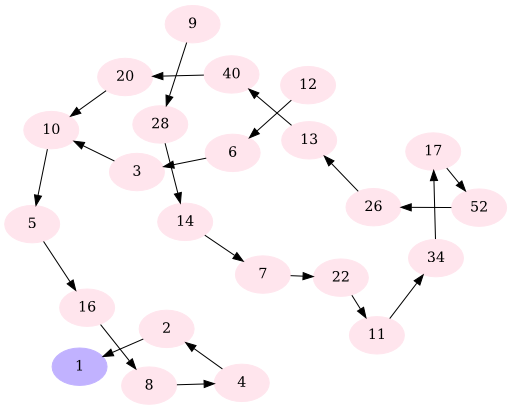
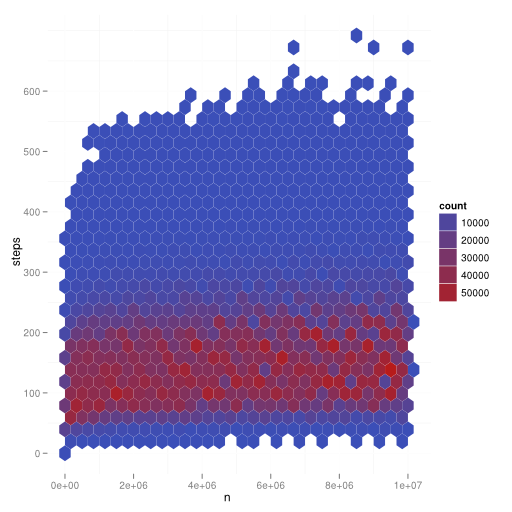
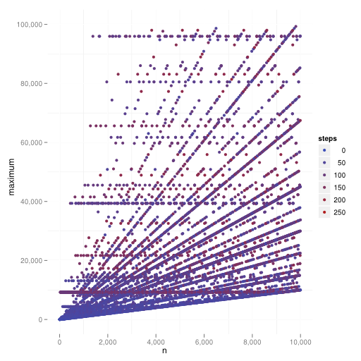

The goal of this post is to show you some tools that allow you to visualize data. And I also want to analyze some basic characteristics of the Collatz sequence.

The Collatz sequences $(c^n_i)$ of a number $n \in \mathbb{N}_{> 0}$ is defined like this:

$f:\mathbb{N}_{>0} \rightarrow \mathbb{N}_{> 0}\;\;\;\;f(n) := \begin{cases}
\frac{n}{2}   & \text{if } n \text{ is even}\\
3 \cdot n + 1 & \text{if } n \text{ is odd}
\end{cases}$

So the sequence $(c^n_{i})$ is defined as:

$c^n_{i} := \begin{cases}
n   & \text{if } i = 0\\
f(c^n_i) & \text{otherwise} 
\end{cases}$

You can define a directed graph $G=(V, E)$ like this:

$V = \mathbb{N}_{>0}, \;\;\; E = \{(n, f(n)) | n \in V\}$

I will call this the <em>Collatz graph</em>.


<h2>Collatz conjecture</h2>
<div class="important">
$\forall_{n \in \mathbb{N}_{>0}} \exists_{i \in \mathbb{N}_{>0}}: c^n_i = 1$
</div>

The Collatz conjecture was not (dis)proved by now. This is astonishing, as it was proposed in 1937 and I think it is very easy to understand.

We also don't know if the Collatz graph is connected. When it is not connected, it could be that one sequence $(c^n_i)$ goes to infinity or that there is another circle ($4,2,1,4$ is a circle in the Collatz graph).

<h2>Small $n$</h2>
When you go through all possible Collatz sequences with $n \in 1, \dots, 15$, this is what you get:

<figure class="aligncenter">
            <a href="../images/2013/05/collatz-graph.png"></a>
            <figcaption class="text-center">A graph for all Collatz sequences $(c^n_i)$ with $n\leq15$</figcaption>
        </figure>

This image was created with the following Python script:

```python

#!/usr/bin/env python
# -*- coding: utf-8 -*-

# Based on: http://en.wikipedia.org/wiki/File:Collatz-graph-all-30-no27.svg

def f(n):
    if n % 2 == 0:
        return n / 2
    else:
        return 3*n + 1

def writeDotfile(filename, limit, explored):
    dotfile = file(filename, 'w')

    dotfile.write('digraph {\n')
    dotfile.write('node[style=filled,color=".7 .3 1.0"];\n')
    dotfile.write('1\n')
    dotfile.write('node[style=filled,color=".95 .1 1"];\n')
    #dotfile.write('size="15,8";\n')

    for n in range(2, limit):
        while n not in explored:
            dotfile.write(str(n) + ' -> ')
            explored.add(n)
            n = f(n)
        dotfile.write(str(n) + ';\n')
    dotfile.write('}\n')

def createPng(dotfile, base, program):
    import os
    command = program + " -Tsvg " + dotfile + " -o " + base + ".svg"
    print("Execute command: %s" % command)
    os.system(command)

    command = "inkscape "+base+".svg"+" -w 512 --export-png="+base+".png"
    print("Execute command: %s" % command)
    os.system(command)

if __name__ == "__main__":
    import argparse
 
    parser = argparse.ArgumentParser(
        description="Graph for small Collatz sequences"
    )
    parser.add_argument("-f", "--file", dest="filename",
                        default="collatz-graph.gv",
                        help="write dot-FILE", metavar="FILE")
    parser.add_argument("-p", "--program", dest="program",
                  help="dot, neato, twopi, circo, fdp, sfdp, osage", 
                  metavar="PROGRAM", default="dot")
    parser.add_argument("-n", 
                      dest="limit", default=20, type=int, 
                      help="limit")
    args = parser.parse_args()
    
    writeDotfile(args.filename, args.limit, set([1]))
    import os
    createPng(args.filename, os.path.splitext(args.filename)[0], args.program)

```

called like this:

```bash
python small-numbers.py -n 15 -p fdp
```

<h2>$n=27$</h2>
$n=27$ is an enourmously long sequence:

<figure class="aligncenter">
            <a href="../images/2013/05/collatz-27.png"></a>
            <figcaption class="text-center">Collatz sequence $c^{27}_i$</figcaption>
        </figure>

It was created with pgfplots:
```text

\documentclass[varwidth=true, border=2pt]{standalone}
\usepackage[margin=2.5cm]{geometry} %layout

\usepackage{pgfplots}

\begin{document}
\begin{tikzpicture}
    \begin{axis}[
            axis x line=middle,
            axis y line=middle,
            enlarge y limits=true,
            scaled y ticks = false,
            width=15cm, height=8cm, % size of the image
            grid = major,
            grid style={dashed, gray!30},
            ylabel=$c^{27}_i$,
            xlabel=$i$,
            legend style={at={(0.1,-0.1)}, anchor=north}
         ]
          \addplot[sharp plot, mark=x, blue] table [x=steps, y=n, col sep=comma] {../collatz27.csv};
    \end{axis}
\end{tikzpicture}
\end{document}

```

<h2>How long are Collatz sequences?</h2>
I've been interested in the question how long Collatz sequences are. Of course, they will be longer when $n$ is bigger. But how does the choice of $n$ influence the number of steps it takes until you reach $c^n_i = 1$?

I've tested all Collatz sequences with $n \leq 10,000,000$. This is the result:

<figure class="aligncenter">
            <a href="../images/2013/05/collatz-sequence-steps.png"></a>
            <figcaption class="text-center">Collatz sequence steps</figcaption>
        </figure>

For every hexagon, you check how many datapoints $(n,steps)$ you have there. This leads to the count. As you can see, step numbers from 50-120 are very common, the rest is very uncommon. The number of steps increases very slow.

The data was created as a 116.9 MB csv file with this C++ code:

```cpp

#include <iostream>
#include <string>
#include <map>
#include <vector>
#include <climits> // get maximum value of unsigned long long
#include <cstdlib> // exit

#define SURPRESS_OUTPUT true
#define SHOW_DICT_CREATION false
 
using namespace std;

struct element {
    /** What is the next collatz number? */
    unsigned long long next;
    
    /** How many steps does it take until you reach 1? */
    unsigned long long steps;
};

map<unsigned long long, struct element> collatz;

unsigned long long CRITICAL_VALUE = (ULLONG_MAX-1) / 3;

unsigned long long maxAddFromOneEntry = 0;
unsigned long long maxEntry = 0;
unsigned long long maxStepsToOne = 0;
unsigned long long saveULong = 0;

/** n >= 1 */
unsigned long long nextCollatz(unsigned long long n) {
    if (n%2 == 0) {
        return n/2;
    } else {
        if (n >= CRITICAL_VALUE) {
            cerr << "Critical value is: " << CRITICAL_VALUE << endl;
            cerr << "n is: " << n << endl;
            cerr << "saveULong is: " << saveULong << endl;
            exit(1);
        }
        return 3*n+1;
    }
}

void insertCollatz(unsigned long long i){
    if (collatz.find(i) == collatz.end()) {
        if (SHOW_DICT_CREATION && !SURPRESS_OUTPUT) {
            cout << i << " is not in collatz:" << endl;
        }

        // i is not in collatz
        vector<unsigned long long> steps;
        unsigned long long current = i;
        unsigned long long next = nextCollatz(current);
        while(collatz.find(current) == collatz.end()) {
            steps.push_back(current);
            current = next;
            next = nextCollatz(current);
        }

        if (steps.size() > maxAddFromOneEntry) {
            maxAddFromOneEntry = steps.size();
        }

        vector<unsigned long long>::reverse_iterator it;
        for(it=steps.rbegin(); it != steps.rend(); it++){
            struct element el;
            el.next = current;
            el.steps = collatz[current].steps + 1;
            collatz[*it] = el;

            if (el.steps > maxStepsToOne) {
                maxStepsToOne = el.steps;
            }

            if (*it > maxEntry) {
                maxEntry = *it;
            }

            current = *it;

            if (SHOW_DICT_CREATION && !SURPRESS_OUTPUT) {
                cout << "\tinserted " << *it << "->" << el.next << endl;
            }
        }

        return;
    } else if (SHOW_DICT_CREATION && !SURPRESS_OUTPUT) {
        cout << i << " was already in collatz." << endl;
    }
}

void printCollatz() {
    for(map<unsigned long long, struct element>::iterator it=collatz.begin(); 
        it!=collatz.end(); ++it) {
        unsigned long long next = (*it).first;
        while(next != 1) {
            cout << next << "->";
            next = collatz[next].next;
        }
        cout << 1 << endl;
    }
}

void printSteps(unsigned long long max) {
    cout << "n,steps" << endl;
    for(unsigned long long i=1;i<=max;i++) {
        cout << i << "," << collatz[i].steps << endl;
    }
}

int main(int argc, char* argv[]) {
    struct element e;
    e.next = 4;
    e.steps = 0;
    collatz[1] = e;

    unsigned long long maxCollatz = (unsigned long long) atoi(argv[1]);
 
    for (unsigned long long i = 2; i <= maxCollatz; i++) {
        insertCollatz(i);
        saveULong = i;
        if (i % 1000000 == 0) {
            cerr << i << endl;
        }
    }

    cerr << "maxAddFromOneEntry: " << maxAddFromOneEntry << endl;
    cerr << "maxStepsToOne: " << maxStepsToOne << endl;
    cerr << "maxEntry: " << maxEntry << endl;
    cerr << "entries: " << collatz.size() << endl;
    
    //printCollatz();
    printSteps(maxCollatz);

    return 0;
}

```

Then I've processed it with R:

```bash
R -f analyze.R
```

analyze.R:
```text

library(ggplot2)
memory.limit(4000)

mydata = read.csv("/home/moose/Downloads/algorithms/collatz/steps.csv")

# Prepare data
p<-ggplot(mydata, aes ( x=n,y=steps ))

p<-p + geom_hex(bins=30)
p<-p + opts(panel.background = theme_rect(fill='white', colour='white'))

# This will save the result in a pdf file called Rplots.pdf
p

```

And finally, I've converted it to png:
```bash
inkscape Rplots.pdf -w 512 --export-png=collatz-sequence-steps.png
```

I've explained this a bit more detailed on <a href="http://tex.stackexchange.com/a/114577/5645">StackExchange</a>.

<h2>Maximum in sequence</h2>
In the following plot you can see $n \in 1, \dots, 10,000,000$ on the $x$-axis and the maximum $y = \max(\{a^n_i | i \in \mathbb{N}_{> 0}\})$:

<figure class="aligncenter">
            <a href="../images/2013/05/maxInSequence.png"></a>
            <figcaption class="text-center">Hexagonal binpacking plot for maximum in sequence</figcaption>
        </figure>

```text

library(ggplot2)

mydata = read.csv("../collatz-maxNumber.csv")

# Prepare data
p<-ggplot(mydata, aes(x=n, y=maximum)) + scale_y_log10()

p<-p + geom_hex(bins=50)
p<-p + opts(panel.background = theme_rect(fill='white', colour='white'))

# This will save the result in a pdf file called Rplots.pdf
p

```

<h2>Execution times</h2>
Generating all Collatz sequences up to 10,000,000 items took about 50 seconds. But R needed about 10 minutes to generate images from that.

Inkscape didn't like the heavy plot:

```bash
moose@pc07$ inkscape Rplots.pdf -w 512 --export-png=maxInSequence.png

(inkscape:26733): GLib-ERROR **: /build/buildd/glib2.0-2.34.1/./glib/gmem.c:165: failed to allocate 3440640 bytes
^CTrace/breakpoint trap (core dumped)

```

<h2>Maximum in sequence and steps</h2>

<figure class="aligncenter">
            <a href="../images/2013/05/collatz-sequence-and-steps-for-n.png"></a>
            <figcaption class="text-center">Maximum value and number of steps for n up to 10,000</figcaption>
        </figure>

<h2>Read more</h2>
<ul>
  <li><a href="https://github.com/MartinThoma/algorithms/tree/master/collatz">All sources</a> of this article are on GitHub</li>
  <li><a href="http://www.graphviz.org/Documentation/dotguide.pdf">Dot guide</a>, <a href="http://www.graphviz.org/doc/info/shapes.html">Node shapes</a></li>
  <li><a href="http://wiki.ubuntuusers.de/R">R on UbuntuUsers</a> (German)</li>
  <li><a href="http://projecteuler.net/problem=14">Project Euler 14</a></li>
</ul>
