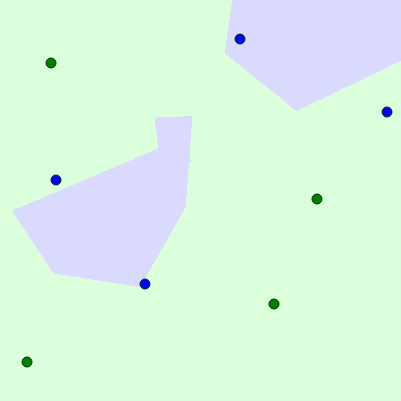
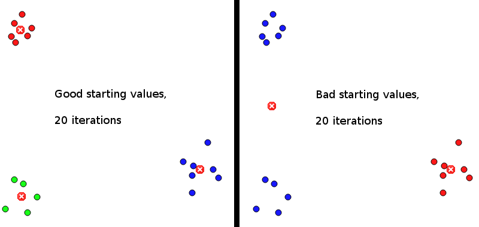

<iframe src="../html5/clustering/clustering.htm" width="98%" height="700px"></iframe>

When the circle has exactly the same number of blue / green dots in it, it will
be green.

When you move the mouse over the box, everything will be calculated and drawn
again. This leads to flickering with k-means, as k-means includes a random
choice of cluster centers.

<h2>Changelog</h2>
<table>
  <tr>
    <th>Version</th>
    <th>Change</th>
  </tr>
  <tr>
    <td>2.2</td>
    <td>Cluster centers have the same color as the clustered points; when one cluster has no points (and there are at least as many points as clusters) everything gets recalculated</td>
  </tr>
  <tr>
    <td>2.1</td>
    <td>users can now specify an arbitrary number of classes; ctrl-key change of class was removed; added hints to configuration options</td>
  </tr>
  <tr>
    <td>2.0</td>
    <td>k-means implemented</td>
  </tr>
  <tr>
    <td>1.0</td>
    <td>k-nearest neighbor implemented</td>
  </tr>
</table>

Code is <a href="https://github.com/MartinThoma/algorithms/tree/master/k-nearest-neighbor">on GitHub</a>.
You may use it for free, but you should add a link to this article.

<h2>See also</h2>

<figure class="aligncenter">
            
            <figcaption class="text-center">One interesting setting for k=2</figcaption>
        </figure>

<figure class="aligncenter">
            
            <figcaption class="text-center">k-means: Good vs. Bad</figcaption>
        </figure>

<ul>
  <li><a href="http://en.wikipedia.org/wiki/Voronoi_diagram">Voronoi diagram</a></li>
  <li><a href="http://en.wikipedia.org/wiki/K-nearest_neighbors_algorithm">K-nearset neighbor</a></li>
  <li><a href="http://en.wikipedia.org/wiki/K-means_clustering">k-means clustering</a></li>
  <li>Udacity: Introduction to A.I: <a href="https://www.youtube.com/watch?v=zaKjh2N8jN4">k-means</a></li>
</ul>
