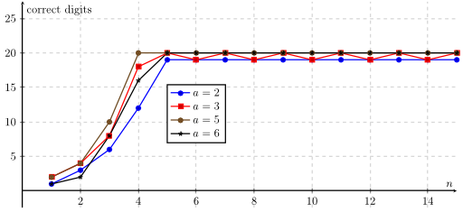

Suppose you have an equation like this:

$x^2 = a, \;\;\;\; a \in \mathbb{R}_{\geq 0}$

Your task is to compute the solution $x \in \mathbb{R}_{\geq 0}$.

How do you solve this algorithmically?

<h2>Input and output</h2>
Write a program that takes two parameters $a, n \in \mathbb{N}_{\geq 1}$:
<ul>
  <li>$a$: The number you should take the square root of. $a$ is not bigger than 65535. To make this a little bit simpler, you can also assume that $a$ is an integer.</li>
  <li>$n$: Number of iterations you may use</li>
</ul>

Your program should output exactly one positive floating point number. The decimal separator is a point. At the end of the number should be a newline character <code>\n</code>.

<h2>Reference code</h2>
```c

// Thanks to http://stackoverflow.com/a/15363123/562769
#include <stdio.h>
#include <gmp.h>

int main(int argc, char *argv[]) {
    mpf_t res, a;
    mpf_set_default_prec(1000000); // Increase this number.
    mpf_init(res);
    mpf_init(a);
    mpf_set_str(a, "2", 10);
    mpf_sqrt (res, a); 
    gmp_printf("%.1000Ff\n\n", res); // Increase this number.
    return 0;
}

```

You need <a href="http://gmplib.org/manual">GMP</a> (<code>libgmp-dev</code>) to compile this. 

Compile it like this:

```bash
gcc sqrt-reference.c  -lgmp -lm -O0 -g3 -o reference.out
```

This is the script I use to get the number of correct digits:
```python
#!/usr/bin/env python
# -*- coding: utf-8 -*-


def getScore(program, a, n):
    import os

    os.system("./reference.out " + str(a) + " > reference.txt")
    os.system("./" + program + " " + str(a) + " " + str(n) + " > result.txt")

    f = open("reference.txt", "r")
    reference = f.read()
    f.close()

    f = open("result.txt", "r")
    result = f.read()
    f.close()

    points = 0
    areEqual = True
    while reference[points] != "\n" and result[points] != "\n":
        if reference[points] == result[points]:
            points += 1
        else:
            break
    if points >= 2:
        points -= 1  # decimal point
    return points


if __name__ == "__main__":
    from argparse import ArgumentParser

    parser = ArgumentParser()

    # Add more options if you like
    parser.add_argument(
        "-p",
        "--program",
        dest="program",
        help="your program",
        metavar="FILE",
        required=True,
    )
    parser.add_argument(
        "-a", metavar="A", type=int, required=True, help="calculate squre root of a"
    )
    parser.add_argument(
        "-n", metavar="N", type=int, required=True, help="maximum n iterations"
    )

    args = parser.parse_args()

print(
    "Points for a=%i and n=%i: %i"
    % (args.a, args.n, getScore(args.program, args.a, args.n))
)
```

<h2>Newton's method</h2>
How should be choose the initial value? I thought $\frac{a}{2}$ could be ok. In a good implementation you'll probably do this with a lookup table.

With long double:
```cpp

#include <iostream>
#include <cmath>
 
using namespace std;
 
long double newton(int a, int n) {
    long double x = ((long double)a)/2;
    for (int i=0; i<n; i++) {
        x = x - (x*x - a)/(2*x);
    }
    return x;
}
 
int main(int argc, char *argv[]) {
    if (argc != 3) {
        cout << "Please enter exactly two arguments." << endl;
        return 1;
    }
    int a = atoi(argv[1]);
    int n = atoi(argv[2]);
    printf("%.80Lf\n", newton(a, n));
    return 0;
}

```

I failed to convert this to a version that uses GMP :-/

But it converges quite fast:

<figure class="aligncenter">
            <a href="../images/2013/06/newton-correct-digits.png"></a>
            <figcaption class="text-center">Newtons method for calculating square roots</figcaption>
        </figure>

<h2>Exponential identity</h2>
According to Wikipedia (Source: <a href="http://en.wikipedia.org/wiki/Methods_of_computing_square_roots#Exponential_identity">Methods of computing square roots</a>) many calculators use the following identity:

$\displaystyle \sqrt{a} = e^{\frac{1}{2}\ln a}$

But to calculate this, you need to be able to calculate $e^x$ for $x \in \mathbb{R}_{\geq 0}$ and $\ln(a)$ for $a \in \mathbb{R}_{\geq 0}$.

I've used the definition of $e^x$ to calculate $e^x$:
$\displaystyle e^x := \sum_{i = 0}^\infty \frac{x^i}{i!}$

and:

$\displaystyle \ln(1+x) =- \sum_{k=0}^\infty \frac{(-x)^{k+1}}{k+1}$

So I gave it a try:

```cpp

#include <iostream>
#include <cmath>
 
using namespace std;
 
long double ln(int S, int n) {
    long double tmp = S - 1;
    long double result = tmp;
    long double sign = 1.0;
    for (int i=2; i<n/2; i++) {
        tmp *= (S-1);
        sign *= -1;
        result += sign*tmp/i;
    }
    return result;
}

long double e(long double x, int n) {
    long double numerator = 1;
    long double denominator = 1;
    long double result = 1;
    for (int i=1; i<n/2; i++) {
        numerator *= x;
        denominator *= i;
        result += numerator/denominator;
    }
    return result;
}

long double sqrt(int a, int n) {
    return e(ln(a, n)*0.5, n);
}
 
int main(int argc, char *argv[]) {
    if (argc != 3) {
        cout << "Please enter exactly two arguments." << endl;
        return 1;
    }
    int a = atoi(argv[1]);
    int n = atoi(argv[2]);
    printf("%.80Lf\n", sqrt(a, n));
    return 0;
}

```

This converges VERY slow: For $a = 2$

<ul>
  <li>$n=1$: 1 digit correct</li>
  <li>$n=10$: 1 digit correct</li>
  <li>$n=100$: 2 digits correct</li>
  <li>$n=1000$: 4 digit correct</li>
  <li>$n=10,000$: 5 digit correct</li>
  <li>$n=100,000$: 5 digit correct</li>
  <li>$n=1,000,000$: 6 digit correct</li>
</ul>

Ok, lets take a better Taylor series for calculating $e^x$:
$\displaystyle e^x = \sum_{k=0}^\infty \frac{x^{-1+2 k} (2 \cdot k+x)}{(2\cdot k)!}$

This didn't change anything! I'm very surprised ... as I've calculated $\pi$ for another article, changing the series to something similar improved the speed of convergence drastically.

<h2>See also</h2>
<ul>
  <li>StackOverflow: <a href="http://stackoverflow.com/a/12304868/562769">How does the computer calculate Square roots?</a></li>
  <li><a href="http://www.intel.com/content/www/us/en/processors/architectures-software-developer-manuals.html">Intel&reg; 64 and IA-32 Architectures Software Developer&rsquo;s Manual</a>: FSQRT, SQRTPS, SQRTSS</li>
  <li><a href="https://github.com/MartinThoma/algorithms/tree/master/square-root-calculation">Source code</a> of this article</li>
</ul>

Feel free to add a program that calculates square roots. When they are interesting, I'll probably add them to this article.
