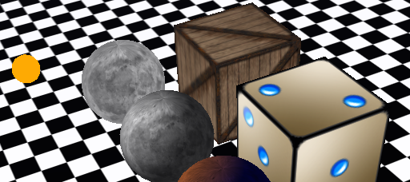
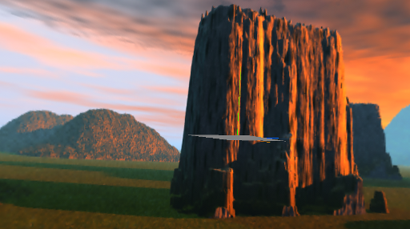
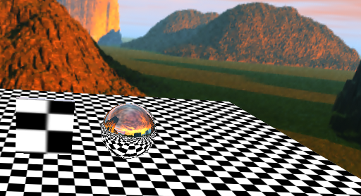
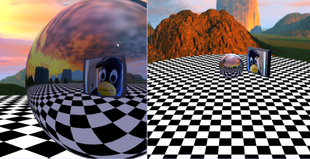
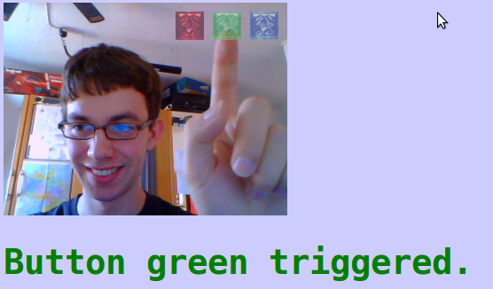
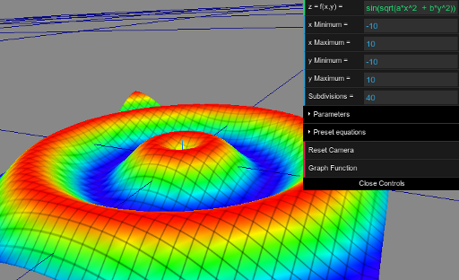
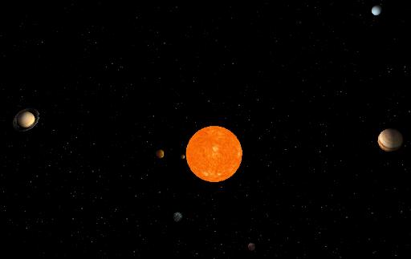
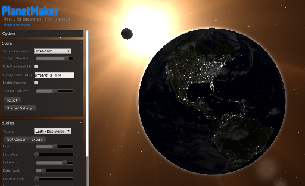

I recently discovered <a href="http://en.wikipedia.org/wiki/Three.js">three.js</a>, a JavaScript library/API used to create and display animated 3D computer graphics.

Here are some examples what you can do with three.js. It's pure JavaScript, no Flash required!

They all worked smooth on my Notebook (<a href="http://ark.intel.com/products/50176/Intel-Pentium-Processor-P6200-3M-Cache-2_13-GHz">Intel Pentium P6200</a> processor) with Google Chrome 28 on Linux.

You have to click on the links to see the examples!

<h2>Stemkoski</h2>
<h3>Textures</h3>
<figure>
    
    <figcaption>Three.js textures example</figcaption>
</figure>

<a href="http://stemkoski.github.io/Three.js/Textures.html">Demonstration</a>

<h3>Three.js</h3>
<figure>
    
    <figcaption>Threejs Skybox example</figcaption>
</figure>

<a href="http://stemkoski.github.io/Three.js/Skybox.html">Demonstration</a>

<h3>Reflection</h3>
<figure>
    
    <figcaption>Reflection example</figcaption>
</figure>

<a href="http://stemkoski.github.io/Three.js/Reflection.html">Demonstration</a>

<h3>Webcam</h3>
<figure>
    
    <figcaption>Webcam example</figcaption>
</figure>

<a href="http://stemkoski.github.io/Three.js/Many-Cameras.html">Demonstration</a>

<h3>Motion detection</h3>
<figure>
    
    <figcaption>Motion detection with three.js!</figcaption>
</figure>

<a href="http://stemkoski.github.io/Three.js/Webcam-Motion-Detection.html">Demonstration</a>

<h3>3D function plotter</h3>
<figure>
    
    <figcaption>3D function plotter</figcaption>
</figure>

<a href="http://stemkoski.github.io/Three.js/Graphulus-Function.html">Demonstration</a>

<h2>HexGL</h2>
<iframe width="512" height="288" src="//www.youtube.com/embed/se-oorr2zM8" frameborder="0" allowfullscreen></iframe>

<a href="http://hexgl.bkcore.com/">Demonstration</a>

<h2>Solar System</h2>
<figure>
    
    <figcaption>Solar system simulation</figcaption>
</figure>

<a href="http://www.webdev20.pl/skins/default/js/demos/solar_system/index.html">Demonstration</a>

<h2>Planet Maker</h2>
<figure>
    
    <figcaption>PlanetMaker</figcaption>
</figure>

<a href="http://planetmaker.wthr.us/?model=51b8d1021fef93.32065956">Demonstration</a> - takes ages to load, but when it's loaded it is fast

<h2>See also</h2>
<ul>
  <li><a href="http://stemkoski.github.io/Three.js/">stemkoski</a>: Many examples</li>
  <li><a href="http://www.chromeexperiments.com/tag/3d/">Chrome Experiments</a></li>
</ul>
