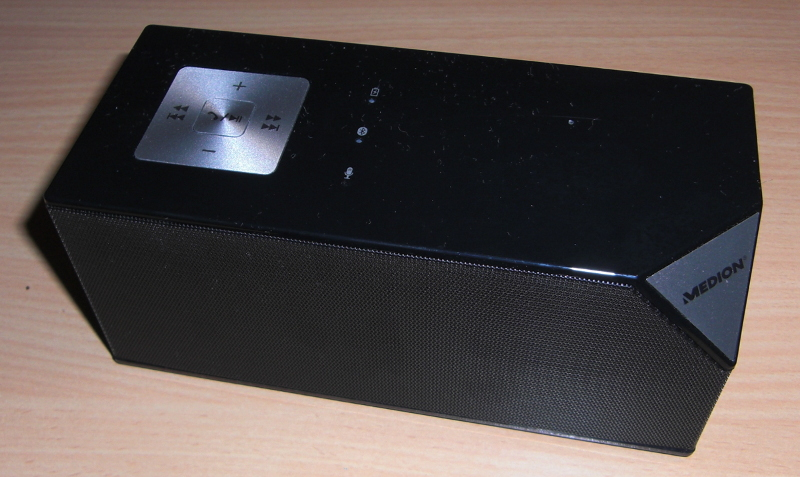
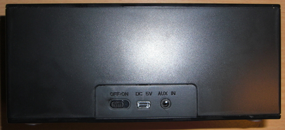
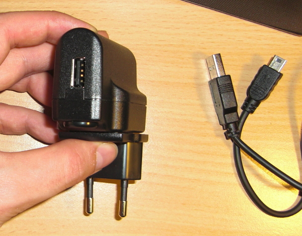
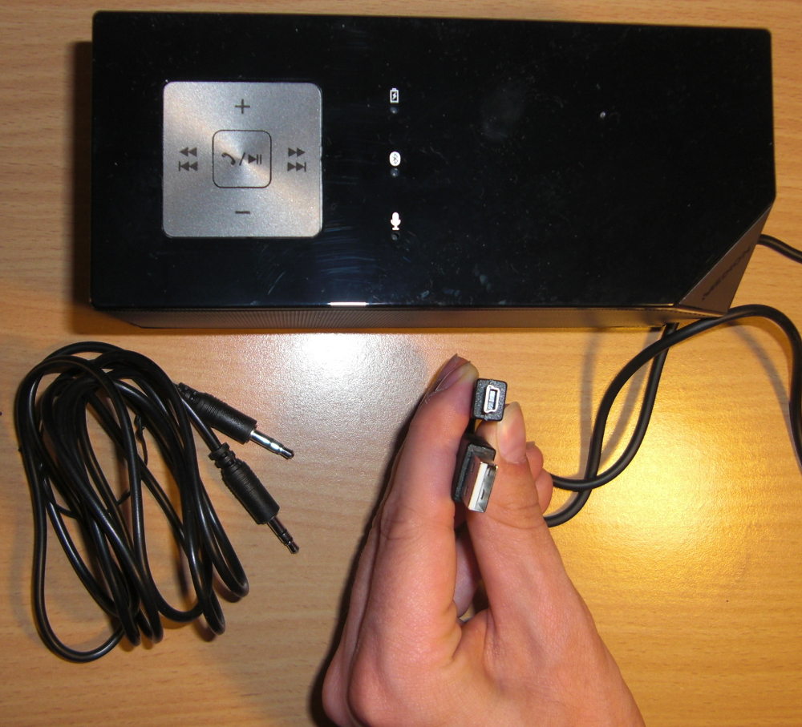

Momentan kann man <a href="http://www.medion.com/de/prod/Lautsprecher+mit+Bluetooth+Funktion+MEDION%C2%AE+LIFE%C2%AE+E69229+(MD+83962)/50043426A1">diese Blootooth</a> Lautsprecher für 30 Euro bei Aldi kaufen:

<ul class="gallery mw-gallery-traditional" style="max-width: 326px; width: 326px;"><li class="gallerybox" style="width: 155px">

Medion MD 83962

</li><li class="gallerybox" style="width: 155px">

Medion MD 83962: Anschlüsse

</li><li class="gallerybox" style="width: 155px">

Medion MD 83962: Micro-USB Netzteil

</li><li class="gallerybox" style="width: 155px">

Medion MD 83962: Micro-USB auf USB Anschluss

</li></ul>

Ich habe sie mir angeschaut, bin aber enttäuscht. Wenn ich sie per Bluetooth an mein Nexus 4 anschließe gibt es hässliche Geräusche von sich. Außerdem ist die Audio-Qualität nicht so toll und die Freisprechfunktion ist ... naja. Deutlich schechter als das interne Micro, wenn ich direkt zur Box rede.

Um euch mal einen Vergleich zu geben, habe ich die ersten zwei Minuten des Open Movie "Bick Buck Bunny" mit meinem Nexus 4 aufgenommen. Bei der ersten Aufnahme hört man die erste 2 Minuten durch meine internen Notebook-Lautsprecher, bei der zweiten durch den Medion Life MD 83962 Lautsprecher (per Kabel mit dem Notebook verunden):
<ul>
  <li><a href="../images/2013/07/medion-md-83962.wav">Medion MD 83962: Bluetooth speakers</a></li>
  <li><a href="../images/2013/07/acer-travelmate-5744z.wav">Acer Travelmate 5744Z: Internal Speakers</a></li>
</ul>

Hier hört man keinen großen Unterschied. Aber die internen Lautsprecher meines Acer Travelmate 5744Z hören sich besser an als der Bluetooth-Lautsprecher. Und das Micro ist wie gesagt ziemlich schlecht. Ich kann also definitiv keine Kaufempfehlung geben.

Die Maße sind übrigens: 16,5 cm x 7,0 cm x 7,3 cm (Breite x Tiefe x Höhe).
