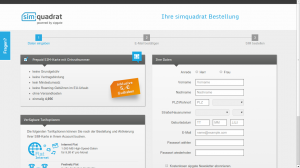
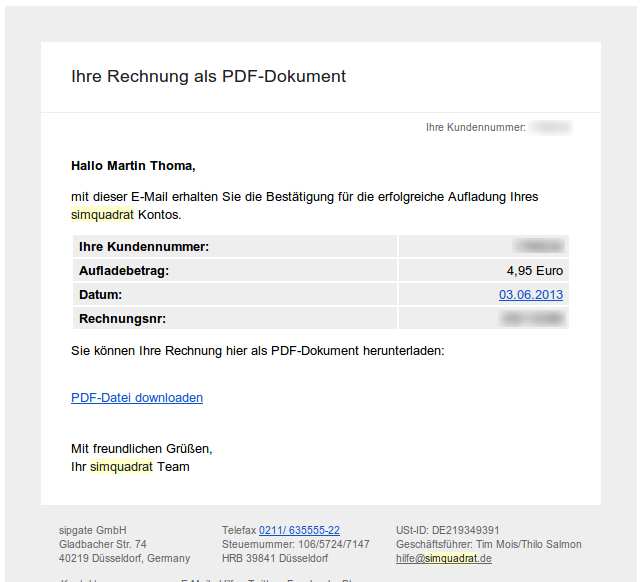
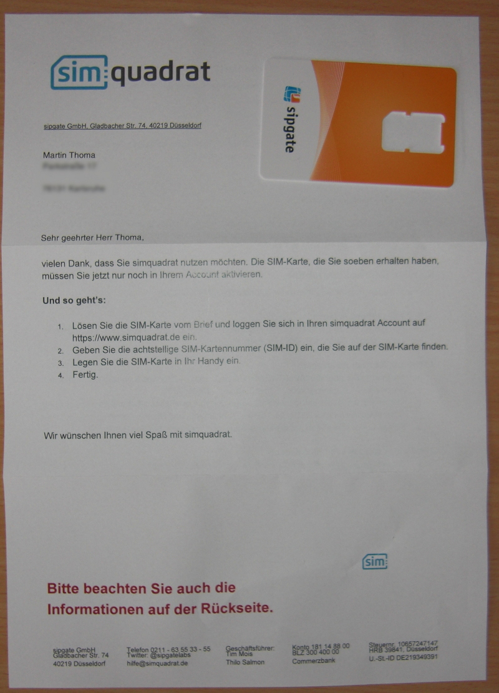
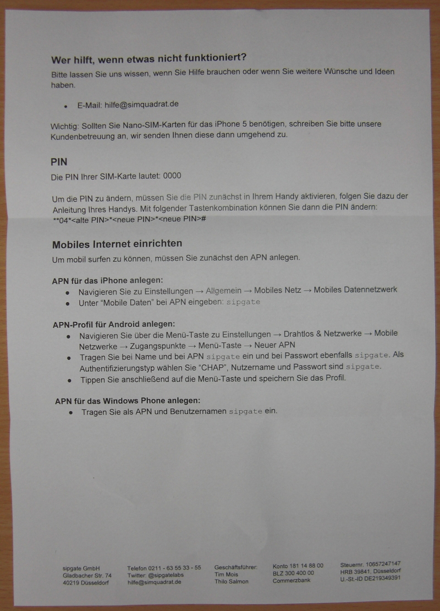
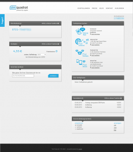

Simquadrat ist ein Dienst von <a href="http://en.wikipedia.org/wiki/Sipgate">sipgate</a>. Das besondere daran ist, dass Simkarten verkauft werden, die eine Festnetznummer haben. Ich habe das ganze ausprobiert und will meine Erfahrungen nun teilen.

<h2>Das Angebot</h2>
Man geht auf <a href="https://www.simquadrat.de/">simquadrat.de</a>, bezahlt 4,95 Euro und bekommt eine <strong>Festnetznummer</strong> des Ortes, für den man die Postadresse angibt. Die meisten Leute, die ich kenne, haben eine Festnetz-Flat. Das bedeutet, sie können mich kostenlos auf dem Handy anrufen. Toll, oder?

Es ist ein <strong>Prepaid</strong>-Service. Das heißt, ich habe ein Guthaben, das ich vertelefonieren kann. Wenn das Guthaben weg ist, kann ich nicht mehr telefonieren. Das hat für mich vor allem den Vorteil, dass es keine versteckten Kosten gibt (bzw. diese mich nicht so hart treffen).

Für <strong>10 Euro</strong> bekommt man eine <strong>1-Monat-Festnetzflat</strong>.

<h2>Die Bestellung</h2>
Die Bestellung auf <a href="https://www.simquadrat.de/signup">simquadrat.de</a> ist extrem einfach.

<figure>
    
    <figcaption>Bestellung bei Simquadrat</figcaption>
</figure>

Nach drei Schritten ist man wirklich fertig. Die beiden E-Mails, die man dann
bekommt, sind auch schön kurz:

    <figure>
        
        <figcaption>Simquadrat: Bestätigung</figcaption>
    </figure>
    <figure>
        
        <figcaption>Simquadrat: Rechnung</figcaption>
    </figure>

Nach wenigen Tagen ist dann die Simkarte angekommen:

    <figure>
        
        <figcaption>Brief, Seite 1</figcaption>
    </figure>
    <figure>
        
        <figcaption>Brief, Seite 2</figcaption>
    </figure>
    <figure>
        
        <figcaption>Simkarte von Sipgate</figcaption>
    </figure>

Wie man sieht, bekommt man eine Simkarte, wo man sich die richtige Größe herausbrechen kann. Micro- und Mini-Simkarten gehen also (bei Nano-Sim fürs iPhone bin ich mir nicht sicher, aber ich glaube auch das konnte man angeben).

<h2>Der Dienst</h2>
Simquadrat hat sofort funktioniert. Ich konnte telefonieren und SMS schreiben (die aber nicht bei meiner Freundin angekommen sind ... aber das könnte auch gut an ihrem Handy/Anbieter liegen). Auch die Online-Benutzeroberfläche ist gut:

<figure>
    
    <figcaption>Simquadrat - So siehts aus, wenn man eingeloggt ist</figcaption>
</figure>

ABER: Die <strong>Telefonqualität ist unterirdisch</strong>. Ich erwarte, dass der Zugangsanbieter mein Gespräch in so guter Qualität überträgt, wie es mein Handy unterstützt. Mit Simyo ist die Qualität genauso gut wie über das Festnetz-Telefon.
Laut prepaid-wiki nutzt Simquadrat wie Simyo das E-Plus-Netz. Ich habe mit meiner Freundin mit meinem Nexus 4 am selben Tag (mit einem Abstand von 10 Minuten für den Simkartenwechsel) einmal mit Simyo und einmal mit Simquadrat telefoniert.  Das ist, im Bezug auf die Qualität der Sprachübertragung, ein himmelweiter Unterschied.

<h2>Fazit</h2>
Wenn man sehr günstig in Deutschland erreichbar sein will, ist Simquadrat super. Sonst ist Simyo besser.
