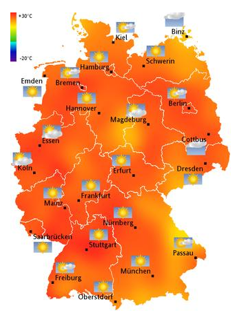
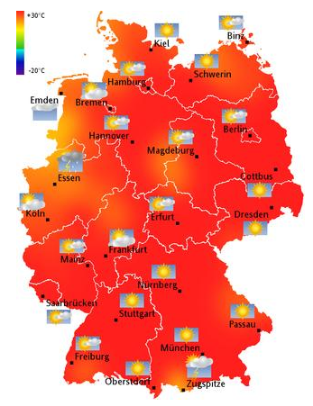
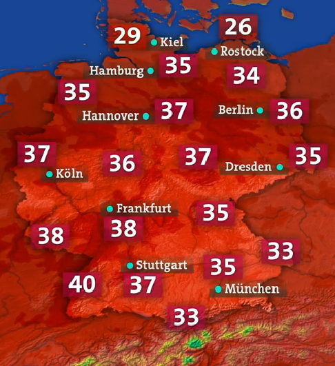

    <figure>
        
        <figcaption>Weather map</figcaption>
    </figure>
    <figure>
        
        <figcaption>Wetterkarte vom 26.07.2013</figcaption>
    </figure>
    <figure>
        
        <figcaption>Wetterkarte vom 04.07.2015</figcaption>
    </figure>

<h2>See also</h2>
<ul>
  <li><a href="http://www.pleated-jeans.com/2013/07/02/20-signs-its-too-freaking-hot-outside/">20 Signs It&rsquo;s Too Freaking Hot Outside</a> - As a <a href="http://imgur.com/2XQla6k">single image on imgur.com</a></li>
  <li><a href="http://imgur.com/gallery/bOIHj">Another image</a></li>
</ul>
