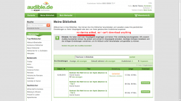
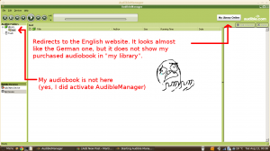
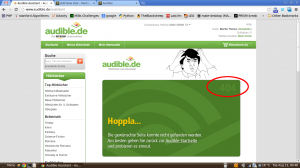

I have just decided to try Audible.de, the German part of <a href="http://en.wikipedia.org/wiki/Audible.com">Audible.com</a> which is "An Amazon Company". They offer audiobooks. You have to know that I really like to listen to audiobooks when I can't read and need some distraction.

Everybody who lives in Germany and buys something at Amazon knows the coupons that you get with a purchase:

<ul class="gallery mw-gallery-traditional">
   <li class="gallerybox" style="width: 155px">
      

         

            

               
            

         

         
Audible coupon - front

      

   </li>
   <li class="gallerybox" style="width: 155px">
      

         

            

               
            

         

         
Audible coupon - back

      

   </li>
</ul>

<h2>Buying audiobooks</h2>
Buying the audiobook I liked ("Darknet" from Daniel Suarez) was just as I knew it from Amazon. Another design, but even my bank account data is there.
After purchasing it, I wanted to listen to it:

<figure class="aligncenter">
            
            <figcaption class="text-center">After having bought an audiobook</figcaption>
        </figure>

After clicking on "my library" I get to this page:

<figure class="aligncenter">
            
            <figcaption class="text-center">My library</figcaption>
        </figure>

A click on "Start Audible-Assistant" redirects to:

<figure class="aligncenter">
            
            <figcaption class="text-center">Software download assistant</figcaption>
        </figure>

So I thought I could download it to my smartphone.

<h2>Android App</h2>
If the <a href="https://play.google.com/store/apps/details?id=com.audible.application">Audible Android App</a> was software for your computer, you would call it spyware:

<ul>
  <li>It requires the permission to add or change calendar dates,</li>
  <li>send E-mails to "guests" (whatever this means),</li>
  <li>pairing with Bluetooth devices,</li>
  <li>and some other stuff (which seems to be okay)</li>
</ul>

Why the hell do they want to change my calendar dates? I only want to listen to audiobooks I've bought...

This is not okay for me, so lets see if I can listen to it on my computer.

<h2>Linux</h2>
As so often, there is no support for Linux. But <a href="http://appdb.winehq.org/objectManager.php?sClass=application&iId=1612">Wine</a> does a great job in bringing Windows applications to Linux. So I've installed the software:

<figure class="aligncenter">
            
            <figcaption class="text-center">Audible Manager</figcaption>
        </figure>

I thought, maybe I need to activate it via the web interface. Back to image "Software download assistant", click on "Add device" (the big orange button):

<figure class="aligncenter">
            
            <figcaption class="text-center">Audible Web assistant</figcaption>
        </figure>

<h2>My E-mail</h2>
There seems to be no way for me to download an audiobook with Audible. As it's now very late, I've contacted customer service and described the issue (12.08.2013, 23:00):

<blockquote>Sehr geehrte Damen und Herren,

wenn ich mein Hörbuch herunterladen will, werde ich darauf hingewiesen, dass ich noch kein Gerät hinzugefügt habe. Wenn ich dann über den Link (http://www.audible.de/assistant) ein Gerät (meinen Linux-Computer auf dem der AudibleManager mit wine läuft) hinzufügen will, bekomme ich einen Fehler 404 (Seite nicht gefunden).

Mit freundlichen Grüßen,
Martin Thoma</blockquote>

Answer:

<blockquote>Lieber Herr Thoma,

vielen Dank für Ihr freundliches Schreiben.

Es tut uns leid, tatsächlich können wir unseren Service derzeit nicht auf Linux-Systemen anbieten. Ob es in Zukunft eine Unterstützung für Linux geben wird, können wir gegenwärtig leider nicht versprechen. Wir bitten um Ihr Verständnis.

Wenn Sie den Manager bereits installiert haben und als Browser Firefox benutzen, dann sollten Sie das admhelper.adh Script mit dem AudibleDownloadHelper via wine öffnen können.

Wir hoffen, dass dies eine gute Alternative für Sie ist und stehen bei allen weiteren Fragen gerne zur Verfügung.

Ich wünsche Ihnen einen wunderbaren Tag.

Herzliche Grüße

[A name which I don't want to show here.]
Audible-Kundenservice</blockquote>

<h2>Virtual Box</h2>
I've finally got it to work. I've installed XP with Virtual Box.

<h2>Cancellation</h2>

<ul class="gallery mw-gallery-traditional" style="max-width: 652px; width: 652px;">
   <li class="gallerybox" style="width: 155px">
      

         

            

               
            

         

         
Step 0

      

   </li>
   <li class="gallerybox" style="width: 155px">
      

         

            

               
            

         

         
Step 1

      

   </li>
   <li class="gallerybox" style="width: 155px">
      

         

            

               
            

         

         
Step 2

      

   </li>
   <li class="gallerybox" style="width: 155px">
      

         

            

               
            

         

         
Step 3

      

   </li>
   <li class="gallerybox" style="width: 155px">
      

         

            

               
            

         

         
Step 4

      

   </li>
   <li class="gallerybox" style="width: 155px">
      

         

            

               
            

         

         
Step 5

      

   </li>
   <li class="gallerybox" style="width: 155px">
      

         

            

               
            

         

         
Step 6

      

   </li>
   <li class="gallerybox" style="width: 155px">
      

         

            

               
            

         

         
Step 7

      

   </li>
</ul>

<h2>Conclusion</h2>
<abbr title="Digital Rights Management">DRM</abbr> seems to be necessary for such a service. Okay, I want to get my free audiobook, so I have to accept this. But this one reason why the service SUCKS. It would be much easier to let the user download the audiobook as a simple MP3 / WAV / OGG file. Everybody can play these files.

Do you want to install software for every service you want to purchase audiobooks / songs from? Please also consider that Amazon might close your account (<a href="http://www.faz.net/aktuell/finanzen/meine-finanzen/geld-ausgeben/nachrichten/amazon-sperrt-kunden-konten-angst-um-die-retoure-12315430.html">source</a>), so you can not simply stick with one provider.

Currently, I can only say: Don't use audible. It's a terrible service.
