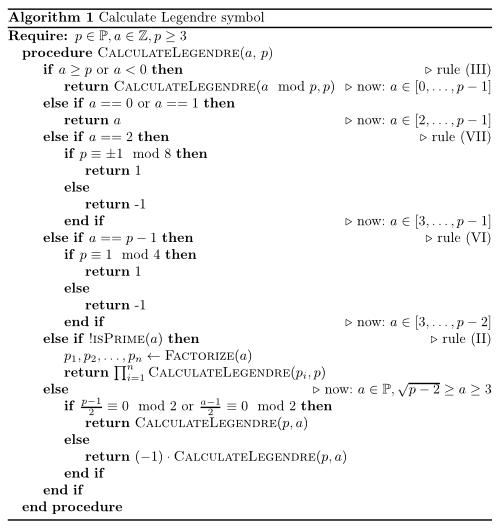

<h2>Pseudocode</h2>
<figure class="aligncenter">
            <a href="../images/2013/09/Calculate-Legendre.png"></a>
            <figcaption class="text-center">Pseudocode: Calculate Legendre symbol</figcaption>
        </figure>

<h2>Python</h2>
```python
#!/usr/bin/env python
# -*- coding: utf-8 -*-


def isPrime(a):
    return all(a % i for i in range(2, a))


# http://stackoverflow.com/a/14793082/562769
def factorize(n):
    factors = []

    p = 2
    while True:
        while n % p == 0 and n > 0:  # while we can divide by smaller number, do so
            factors.append(p)
            n = n / p
        p += 1  # p is not necessary prime, but n%p == 0 only for prime numbers
        if p > n / p:
            break
    if n > 1:
        factors.append(n)
    return factors


def calculateLegendre(a, p):
    """
	Calculate the legendre symbol (a, p) with p is prime.
	The result is either -1, 0 or 1

	>>> calculateLegendre(3, 29)
	-1
	>>> calculateLegendre(111, 41) # Beispiel aus dem Skript, S. 114
	-1
	>>> calculateLegendre(113, 41) # Beispiel aus dem Skript, S. 114
	1
	>>> calculateLegendre(2, 31)
	1
	>>> calculateLegendre(5, 31)
	1
	>>> calculateLegendre(150, 1009) # http://math.stackexchange.com/q/221223/6876
	1
	>>> calculateLegendre(25, 1009) # http://math.stackexchange.com/q/221223/6876
	1
	>>> calculateLegendre(2, 1009) # http://math.stackexchange.com/q/221223/6876
	1
	>>> calculateLegendre(3, 1009) # http://math.stackexchange.com/q/221223/6876
	1
	"""
    if a >= p or a < 0:
        return calculateLegendre(a % p, p)
    elif a == 0 or a == 1:
        return a
    elif a == 2:
        if p % 8 == 1 or p % 8 == 7:
            return 1
        else:
            return -1
    elif a == p - 1:
        if p % 4 == 1:
            return 1
        else:
            return -1
    elif not isPrime(a):
        factors = factorize(a)
        product = 1
        for pi in factors:
            product *= calculateLegendre(pi, p)
        return product
    else:
        if ((p - 1) / 2) % 2 == 0 or ((a - 1) / 2) % 2 == 0:
            return calculateLegendre(p, a)
        else:
            return (-1) * calculateLegendre(p, a)


if __name__ == "__main__":
    import doctest

    doctest.testmod()
```

<h2>More</h2>
<ul>
  <li><a href="https://github.com/MartinThoma/LaTeX-examples/tree/master/documents/eaz">Rules how to calculate with Legendre symbols</a></li>
  <li><a href="https://github.com/MartinThoma/LaTeX-examples/tree/master/source-code/Pseudocode/Calculate-Legendre">Python and Pseudocode source files</a></li>
</ul>
