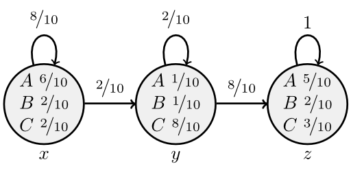
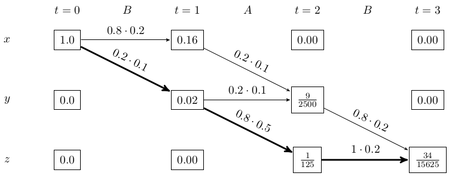

The goal of the Viterbi algorithm is find the most likely sequence of hidden states given some observed events.

Lets say this is your <abbr title="Hidden Markov model">HMM</abbr>:

<figure class="aligncenter">
            
            <figcaption class="text-center">A hidden Markov model (HMM) example</figcaption>
        </figure>

We always start in $x$ and always end in $z$.

Now you observed the sequence $O_1 = BAB$. What is the most likely sequence that would generate this path?

Candidates are:
<ul>
  <li>xxyz</li>
  <li>xyyz</li>
  <li>xyzz</li>
</ul>

If you're learing this because you will write the exam at KIT, you might have such an diagram:

<figure class="aligncenter">
            
            <figcaption class="text-center">Scheme of the Viterbi algorithm</figcaption>
        </figure>

In this case, the bold path is the Viterbi path. You can see this when you get backwards from the last state:

$\frac{1}{125} \cdot 1 \cdot 0.2 > \frac{9}{2500} \cdot 0.8 \cdot 0.2$. After this step, you only have one choice. So the Viterbi path is xyzz.

Please note that there might be multiple paths with the highest possibility.

As every state depends only on the state before, you can get the most likely path step by step. In every step, you calculate how likely it is that you end up in state x, state y, state z. After that, it doesn't matter how you got there. So you always have to expand those three nodes. You will get 9 following states, but only three of them matter (for each resulting state, the paths that had the highest probability leading there).

## See also

* [Wikipedia](https://en.wikipedia.org/wiki/Viterbi_algorithm)

