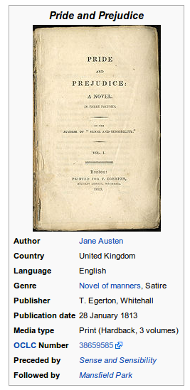

The following is a collection of ideas for projects I had, but never realized.
I would really love to do them, but they seem to be a little bit too time
consuming to do them in my free time. Please send me an E-Mail if you would
like to realize them!

## Web Services

### Book portal
I really miss a book recommendation portal. It should allow you to mark books
you've read or started to read, let you rate and tag books. The tags should be
created by users, similar to the system StackExchange uses. Tags might be
funny", "zombie", "magic", "romance", "love", ... and users should rate for
tags for books. In some general settings you define language(s) you know. Every
book, which should be administrated by ISBN number if possible, should have
information about the language. The portal should also see when books are only
released with a new cover / collectors edition and notice that its the same
story.

With this information, it should recommend books and allow you to search books.

Eventually you could connect to friends and let their ratings influence what
you get.

And, very important, it should let you follow series and/or authors. So you
should be able to say "When there is a new book of the 'Harry Potter' series,
send me an e-mail!" or "When there is a new book of the 'Harry Potter' series
translated to 'German', send me an e-mail!".

### Manual portal

Most pieces of electronics come with a manual. It might contain contains:

* Product description: Specifications like type of battery, supported Bluetooth
  standard, used frequencies, ... depends a lot on what it is
* Function introduction: With images on where buttons are and what effect they
  have. Especially important for combinations.
* Safety Notice
* Environmental notices (how to recycle it)
* Replacements: I wish this was the case. Especially for big equipment like
  washing machines / dishwashers, I wish the parts which might break like seals
  should have clear names so that they are easy to order and instructions on
  how to replace them.

Same goes for medicine:

* What is it for?
* When should you NOT take it?
* How much and at which time should you take it?
* What do you do if you took too much?

All of those manuals should be online. There should be an easy way to find them.

## Society

Anything related to how we live together.

### Science and Education Platform
Sometimes, scientists get new insights that are able to influence millions. But until such a great invention or discovery is made, hundreds or thousands of people might have thought about the same problem. Today, with <abbr title="Massive open online courses"><a href="https://en.wikipedia.org/wiki/Massive_open_online_course">MOOCs</a></abbr> education in some fields is quite open to a lot of people. <a href="https://www.khanacademy.org/">Khan academy</a> offers many very basic courses, <a href="https://www.coursera.org/">Coursea</a> and <a href="https://www.udacity.com">Udacity</a> a few advanced ones. But the process of creating new content seems to be quite closed. <a href="https://en.wikiversity.org">Wikiversity</a> is more open, but very limited. For example, I think it is not possible to include <a href="../html5/graphic-filters/graphic-filters.htm">my graphic filter examples</a>. And it is not possible to track progress of students.

I think it is necessary to gamify this. Both, students and educators, should
get rewards. They might be only digital, but a student who can see the progress
he makes might be much more interested in continuing a course. A teacher who
can see the influence he has, who can see how students learn and where problems
are might be much better able to improve his content and be motivated to do so.

Also, scientists should not have to worry about presenting their studies. A lot
of people know how to create graphics, some people know better about (the
English) language and others are experts in LaTeX. If people were able to
create requests online, get rewards for helping others and provide rewards to
show that they really need help, I guess much better research could be made. Of
course, this should be open.

For every unit / paper, there should be definitions what is necessary to know.
The topics should automatically be linked to content that provides the
knowledge.

It is very complex to plan such a system, because education in different
languages / nations might be very different and ideas how to educate vary a
lot. Even subtasks (creating a LaTeX editor, a graph that shows influence of
papers / books by citation, creating an image editor, creating a reward system)
are very difficult. And everything has to scale for millions of users. This
means you would have to plan quite a lot before you could even think about
implementation. For this project, you would need:

* Somebody, who has experience with online courses.
* A teacher for children.
* A teacher for teenagers.
* A teacher for students.
* Somebody, who has experience with gamification.
* Somebody, who has contacts to politics and knows how to advertise.

### Banking

I think our banking system is a mess. It is astonishing to me that you can
transfer / withdraw money just with a single number (IBAN).

Instead, I would like to have an open protocol which uses modern software
engineering methods to keep things save. Especially:

* As a customer, I want to have a secure way to authenticate.
    * This way should be consistent across banks
* As a customer, I want my bank to have high security standards.
    * This should be verified by external parties.
* As a customer, I DON'T want to write anything except for an reciever-ID.
    * The receiver-ID should have a checksum to prevent mistakes
    * The receiver-ID should be easy to write (ASCII) and only have writable characters (no whitespaces)
* As a customer, I want immediate feedback if the transaction was successful or
  not (e.g. receiver-ID didn't exist / checksum was wrong)
* As a customer, I want to be able to generate as many receiver-IDs as I want
  (basically random IBANs).
    * Each of those should either be handled internally at the bank as an alias,
      e.g. the money goes to another "receiver-ID" which is directly connected to the same account.
      Or it should be a different "space" of money. This way, one could
      easily see where money came from
* As a customer, I want to have as many sender-IDs as I want.
    * This helps to protect my privacy, in case cooperations analyze my buying
      behaviour.
* As a company, I want to have support for a subscription model. The subscription includes the amount, the day of first payment, the interval (every X days; every first day of a month, every last day of a month, every 15th of a month, every first day of a year, ...), the earliest day of cancellation, the cancellation deadline (e.g. earliest in 3 months), .
    * As a customer, I want to have control over all subscriptions. This means
      I need to have the possibility at my bank to cancel subscriptions.
    * As a customer, I want this cancellation of payment to optionally be a
      legal cancellation of the contract as well.
    * As a company, I want to get notified if a customer cancelled a subscription.
    * As a receiver of money, I want to be able to cancel subscriptions (e.g. if I can't deliver anymore; if the customer had an acceptable reason to cancel early)
* As a customer, I want to export all my data.
    * Personal data they have about me.
    * Transactions: Time, Sender-ID, Receiver-ID, Amount, Message
    * Subscriptions: See above
* As a customer, I want to be able to import subscriptions.
    * I want to be able to transfer subscriptions between accounts.
* As a customer, I want money transfers to be similar fast as e-mails are.


### Good Citizen

I often see minor things that could be improved: Broken glass bottles on the
street when I'm cycling to work, a bit of trash or a dead animal lying around,
people who park their car wrong in a way that is potentially dangerous
(e.g. so that children crossing the street could be overlooked), intersections
where the default right of way should be changed. Streets which need to be
fixed, because plants / ice broke it open.

And I can imagine way more:

* **Commute**: I would be fine with stating my most common rides. For example,
  something close to my home address and something close to my work address and
  the times when I go to / from work. With this data, one could potentially
  improve the schedule of busses / trains.
* **Trash cans**: Reporting a missing trash can, so that people throw their
  trash in the can instead of on the street.
* **Stations**: We have very different bus/train stations. Some have only a
  sign, indicating that a bus will stop there. Some have a roof to protect
  against rain. Some have seating. Some even have a small waiting spot which is
  protected against wind. And sometimes that waiting spot is even heated. I
  know one train station that has no shelter and almost no seats, but should
  have everything, because people often get stuck there. Maybe it would be even
  be possible to switch the directions of trains there, so that the direction
  that has most often issues is at the outside. Then one could have businesses
  there which sell warm food / provide protection against the elements.

Right now, there is no good way to report those minor suggestions for
improvement. I would like to have an app for it. So people could report them,
discuss them and the city could take care of the most important ones / the ones
that require least amount of money.


## Advertisement Site

I actually want advertisement. But I want also to easily keep track of it.
I don't want to look at stuff just to see that the advertisment was old. And
I don't want advertisment when I have lots to do and no time to buy things
anyway.

So giving people the possibility to go to a website and look at advertisment
the way they want might be very interesting.


## Site for Documents

Who wants to read all of the legal stuff we have to sign all the times?

I would really like to have a website where standard contracts are. Some people
read them and highlight the important stuff / the implications. A bit like
[tldrlegal.com](https://tldrlegal.com/), but not only for licenses.


## Wikipedia AI
Try to categorize images in
[Category:Uncategorized images](https://en.wikipedia.org/wiki/Category:Uncategorized_images)
or find images that have the wrong category / missing categories.

## Translations
I did some translation work some years ago for
[LordsAWar](http://www.nongnu.org/lordsawar/). From a software point of view,
this was a pain in the ass. Rosetta (part of Launchpad, for Ubuntu) is much
better.

Another idea that is much better is [Duolingo](http://www.duolingo.com/).

[getlocalization.com](http://www.getlocalization.com/) might also be worth a
try.

## Wiki-like Dictionary

Wikipedia is great, but the Wiktionaries suck. I would like to have a
dictionary service. It should be working for all language combinations
(English ↔ German; English ↔ French; German ↔ French; ...). The data should
initially be filled by computers, but then be improved / corrected by humans.


### Database
It is basically a database with a nice interface.

The database should have the following tables:

* Languages: LangID, Name in the language itself, icon
* Literature: LiteratureID, LangID, ISBN
* Words: WordID, Word, Normalized Occurences in Standard Literature
* WordPronounciation: WordPronounciationID, Pronounciation in phonetics, Pronounciation by a human
    * Pronounciation by a human should be stored on Wikipedia Commons
* WordTags: WordTagID, Tag, Description in Markdown
    * Examples: Adjective, Substantive, male, genitiv, past, medicine ...
* TagTag: TagTagID, TagID, TagTag, Description in Markdown
    * Examples: Gender, Word-Class, Tense, Context, ...
* Tags2Words: T2WID, TagID, WordID
* Sentences: SentenceID, Sentence
* Words2Sentece: ID, SentenceID, WordID
* Definitions: ID, WordID, Definition, Image
    * Images should be stored on Wikipedia Commons
* Translations: ID, WordID, TranslationID
    * Note that translations don't have to be unique. There might be more than
      one correct translation for a word (e.g. "Bank")
    * Note that some translations might be more appropriate, depending on the
      context.
* Users: UserID, DisplayName, E-mail, HashedPassword


### Initial Data

* Wiktionaries
* For nouns: Lemmas of articles


### Features

* Downloadable minimal dataset for language combinations
  (e.g. on your smartphone in case you don't have internet access). The most
  important words (2000 or so) should come with the audio data.
* Web search like dict.leo.org (e.g. [example search](http://dict.leo.org/?lp=ende&search=bank))
* Forum to ask for translations, given context.
* Discussion pages for entries
* Moderators to "protect" entries.
* Ranking to find most important words which need some human work


## Distributed, Universal Tagging System

### Tagging
Most information can be displayed rather simple. A string that describes the
kind of information and a bool / int / float / string / BLOB for the
information itself and an identifier.

For example, you can describe a product with the following labels:

* Identifier: "898a4c822ffc456fa7a417e500b2c05a"
* "898a4c822ffc456fa7a417e500b2c05a", "ISBN-10": "0141439513" (string)
* "898a4c822ffc456fa7a417e500b2c05a", "ISBN-13": "978-0141439518" (string)
* "898a4c822ffc456fa7a417e500b2c05a", "Pages": 480 (int)
* "898a4c822ffc456fa7a417e500b2c05a", "Publisher": "Penguin Classics" (string)
* "898a4c822ffc456fa7a417e500b2c05a", "Category": "Book" (string)
* "898a4c822ffc456fa7a417e500b2c05a", "Category": "Literature" (string)
* "898a4c822ffc456fa7a417e500b2c05a", "Category": ed054753e4b240a8aa1322ad348bf728 (identifier)
* "898a4c822ffc456fa7a417e500b2c05a", "VIEW": 0839c5beac414fb19c400b6ca0372388 (identifier)
* Identifier: "ed054753e4b240a8aa1322ad348bf728"
* "ed054753e4b240a8aa1322ad348bf728", "Name": "Literature"
* "ed054753e4b240a8aa1322ad348bf728", "Category": "Books"

As you can see, it is possible to create nested categories with this structure.
You an also create lists this way.

Now clients should store information like this and share it.

### Views
When information is presented like this, it is quite useless. But what about
this kind of presentation:

<figure class="aligncenter">
            <a href="../images/2013/10/pride-and-prejudice-infobox.png"></a>
            <figcaption class="text-center">Pride and prejudice infobox (defined <a href='https://en.wikipedia.org/wiki/Template:Infobox_book'>here</a>)</figcaption>
        </figure>

Or, for example [ark.intel.com](http://ark.intel.com/compare/75133,50176):

<figure class="aligncenter">
            <a href="../images/2013/10/intel-ark-compare.png"></a>
            <figcaption class="text-center">Intel Arc compare processors</figcaption>
        </figure>

So another required feature of such a client are "views". A view is defined by
an identifier (so that you can tag views just like any other object) and an
HTML template. Objects could have labels called "VIEW" with type identifier
that tell the client which view should be added.

### Distribution
There are plenty of cool tools out there (Amazon recommendations, <a href="http://ark.intel.com/">ark.intel.com</a> to compare Intel processors, <a href="http://de.blackberry.com/smartphones/compare.html">blackberry</a> allows you to compare their phones, Wikipedia info boxes, ...). But most of them are very ristricted. For example, the way I compare smartphones is not fundamentally different from the way I compare processors. Yes, the attributes differ. But basically it is creating a table with all the information. Also, Intel does not provide information about AMD processors.

So we need a way to get and share information. XML is the way-to-go for
centralized computer systems. Maybe they can also be used to realize what I'm
thinking about. But I think a problem that has to be solved is that we don't
have a single source for all information that we trust in. We have networks of
trust. When Intel says A and a friend says B about an Intel processor, I guess
I will rather believe A. But when Intel does not provide some information about
a processor and a friend says B, but a person I don't know says C, I'll believe
B. But when thousands of people say C and my friend says B, I might rather
believe C.

It's getting complicated, right? Maybe the processor example is not good, as
there is much information and information is either right or wrong. But lets
say we talk about genre of movies. This might be much more difficult as there
is no "definitely right" or "definitely wrong". Multiple answers might be
right.

So every information has also have to carry information about who thinks it is
right. And you have to be able to define networks you trust in. Perhaps you
could create "people objects" that can also be labeled. "Your" object had to be
protected so that only you could add "friend of" labels or "I trust" labels or
something like this.


## Python Code Search

Do you know [Debian Code Search](https://codesearch.debian.net/)?
Michael Stapelberg, the creator of it, described how he did it in
[his bachelor's thesis](https://codesearch.debian.net/research/bsc-thesis.pdf).

I would like to have the same for Python code. This could be done by
downloading all Python packages. I already did this part, see
[Analyzing PyPI Metadata](//martin-thoma.com/analyzing-pypi-metadata/)
and the follow-up post which is still on my TODO-list to be published (see
[draft](https://github.com/MartinThoma/MartinThoma.github.io/blob/source/_drafts/2015-12-07-analyzing-pypi-metadata-2.md)).

It would also be possible to add GitHub repositories.


## Comment.it

Sometimes, I just want to add my 2ct to something. I would like to have a
central website / service - preferable as a browser plugin - with which I
can add comments to other websites on an URL basis (including anchors for
maximum exactness). Then I could read what other people think of something,
even if there is no comments section.

The comment should contain a very specific link. For some websites - like
wikipedia - a permalink can be created. Others might change the content after
a comment was made. For this reason a screenshot should be taken.

Deep links help to make a comment to exactly what you mean. Help the user to
use deep links.

Identifiers besides URLs:

* Books have ISBN numbers.
* There are ISSN numbers.
* Other products have bar codes.
* People have lots of identifiers (names, ORCiD, e-mail). However, the
  possibility to add comments to a person should be examined carefully. They
  might not like it. They might not get useful comments / to much "shitstorm".
  They might also use legal means to prevent comments.

To make comments more useful, gamification can be used:

* People have "karma". It represents the value they've added to the community.
    * They start with 0 karma.
    * At X karma, they get the "trusted user" rights.
* Everybody can add comments by default
    * Moderators might restrict this to "trusted users"
    * Only trusted users can add URLs within the comment.
* Upvotes for good comments
    * Upvotes give karma to the creator of the comment
    * You are only allowed to upvote when you are a trusted user
* Downvotes for bad comments
    * Downvotes remove karma from the creator of the comment
    * The downvoter gets also karma removed (to prevent bashing people)
* Users with more than 10 comments with less than -5 rating get soft deleted.
* Moderators can delete users if they are purely spam
    * It is a "soft delete"
* Users can veto soft deletes. In this case they have to speak with a
  moderator, after they passed some Captchas.

For reviews there are microformats which should be used.


## Charity Search & Find

"Vermittlung" ([recruiting?](http://ell.stackexchange.com/q/80159/11067)) of
people who have the ability needed for charity organizations.

People:

* profile / abilities
    * Text, grade / level?
    * tags?
* location
* Karma?
* Filtering

Projects:

* Profile page for each project
* photos
* members / oranization / roles / karma / contributers
* domain

Other elements:

* Forum: phpBB? Disqus?
* File uploads: Imgur?
* Calendar
* E-Mail list: GNU Mailman?
* Surveys: Limemonkey?


## Online CV

A service to create an online CV. Manage your CV only in one place instead of
many (LinkedIn, StackExchange, ORCiD, ResearchGate, ...).

Sadly, many nice URLs are already gone:

* cv.me, its.me, about.me
* note.me, write.me, ping.me, help.me
* lookat.me


Things to link:

* arXiv profile page
* http://dblp.uni-trier.de/ - http://dblp.uni-trier.de/pers/hd/t/Thoma_0001:Martin

## Jobs

### Job Portal for cheap jobs

It seems to me that LinkedIn is mainly for high-paid jobs. However, "cheap"
jobs like cleaning people or handymen are also looking for jobs


### Job Map

The location of a job is super important. Being able to search for a job by
location, money, weekly hours, vacation days and other factors would be nice.

With [microformats for job listings](http://microformats.org/wiki/job-listing-formats)
one could build a search engine for this.


## Social Network

like Facebook (Groups, pages, sharing, upvoting), but with Markdown.


## Development Tools

### Bug Tracker for Users

* OpenID login
* Profiles for users
    * Private: Contact data
    * Public: name, biography
    * Statistical: Links to bugs
* Software:
    * id, name
    * description
    * url
    * download_url
    * source_url
    * is_open_source
    * license
* Bug
    * title
    * description
    * software_id
* Monetarization:
    * Offering Beta-Testers
    * Official accounts to administrate bugs
    * "security status"
* Educating users how to commit issues
* Screenshots: imgur.com
* Seach terms: QA (quality assurance), bugs
* Alternative Products: User Echo


### Database administration interface

It would be nice to have a database administration interface similar to
phpMyAdmin for other databases, too (postgres, sqlite). One could also make
it a web service (dbadmin.io or something similar).

I would probably do it with Python and SQLAlchemy. A good name might be
`pydbadmin`.


## Chrome
I had some <a href="../how-chrome-could-be-improved-2nd-post/">ideas how to improve Chrome</a>.

## MATE
After the changes in desktop environments, <a href="https://en.wikipedia.org/wiki/MATE_(software)">MATE</a> got my favorite desktop environment. Although I was more happy with GNOME 2.6.

* Adding the drag-and-drop effect that creates a new window from an tab, known
  from Chrome, to Terminal and Pluma (gEdit).
* Creating a LaTeX plugin for Pluma that auto-completes the environments.


## Typesetting

I love creating beautiful documents. My tool of choice at the moment is LaTeX
(TeXlive with Sublime Text and console + Jabref)

### LaTeX Tools
I would like to create online tools (pure HTML/CSS/JavaScript) that make the
following tasks simpler.

* A table editor. I know [Trubens table tool](http://truben.no/latex/table/),
  but this tool does not allow to combine cells. Also, the site is down quite
  often.
* A Ti<em>k</em>Z editor.
* An editor for bibliography.
* A LaTeX source code beautifier.
* A LaTeX-aware spell checker. This spell checker could probably use aspell,
  but it would have to filter LaTeX code.

Also, I would like to create an app that helps users to create formulas. This
app should run on smartphones and on tablets. I don't think that this can be
done with pure JavaScript.

### New Typesetting Language

I do realize that LaTeX is hard. I'm not quite sure yet, but I'd say it is
harder than necessary. However, having a language which is purely based on
text, openly documented, and human-writable for typesetting is pretty awesome.

There are a couple of <a href="https://en.wikipedia.org/wiki/Markup_language">markup languages</a>
and I've summarized the relevant ones in the following table.

What I don't consider relevant:

* <a href="https://en.wikipedia.org/wiki/ReStructuredText">reStructuredText</a> (reST):
  Yes, it is widespread in Python documentation. I have no idea why. It looks
  like a less readable and more flexible version of Markdown. However, as you
  can mix Markdown with HTML almost all things you can to in reST are also
  possible in Markdown + HTML.
* Anything for images: InkML
* Markdown flavours:
    * CriticMarkup: No fenced code blocks
    * CommonMark: No Syntax highlighting, no footnotes
    * GFM: No footnotes
    * <a href="https://rawgit.com/fletcher/human-markdown-reference/master/index.html">MultiMarkdown</a> (MMD): Despite being powerful, it is not well-known and I'm not sure if there is a solid implementation
* MediaWiki: Not used anywhere except MediaWiki (Wikipedia); more complicated than HTML

<table class="table">
    <thead>
        <tr>
            <th></th>
            <th><a href="https://github.github.com/gfm/">Markdown</a> (GFM)</th>
            <th>LaTeX</th>
            <th>HTML+MathML</th>
            <th>OpenDocument</th>
        </tr>
    </thead>
    <tbody>
    <tr>
        <td>Human Writability Score (higher is better)</td>
        <td>99</td>
        <td>50</td>
        <td>70</td>
        <td>10</td>
    </tr>
    <tr>
        <td>Human Readability Score (higher is better)</td>
        <td>99</td>
        <td>30</td>
        <td>50</td>
        <td>5</td>
    </tr>
    <tr>
        <td>Parsability Score (higher is better)</td>
        <td>75</td>
        <td>5</td>
        <td>80</td>
        <td>70</td>
    </tr>
    <tr>
        <td colspan="4">How flexible are you?</td>
    </tr>
    <tr>
        <td>Tables</td>
        <td>25</td>
        <td>80</td>
        <td>90</td>
        <td>75</td>
    </tr>
    <tr>
        <td>Mathematics</td>
        <td><a href="https://github.com/cben/mathdown/wiki/math-in-markdown">50</a></td>
        <td>99</td>
        <td>99</td>
        <td>90</td>
    </tr>
    <tr>
        <td>Footnotes</td>
        <td>No</td>
        <td>99</td>
        <td>10</td>
        <td>95</td>
    </tr>
    <tr>
        <td>Citations</td>
        <td>No</td>
        <td>99</td>
        <td>No</td>
        <td>90</td>
    </tr>
    </tbody>
</table>


## App Development

Things for mobile - factually only Android and iOS matter.

### Jabber Messaging App

There are some commercial messangers which are wide-spread (WhatsApp, Facebook Messanger, Skype),
some known secure messangers (Threema, Signal) and lots of other messangers
(see [Comparison of instant messaging clients](https://en.wikipedia.org/wiki/Comparison_of_instant_messaging_clients), [2](https://de.wikipedia.org/wiki/Liste_von_mobilen_Instant-Messengern)).

However, there seems not to be a single client which has the following:

* Security
    * Free Software
    * Encryption of text messages
* Support of Android and iOS as well as a web interface
* Support of open protocolls (XMPP - see [Comparison of instant messaging protocols](https://en.wikipedia.org/wiki/Comparison_of_instant_messaging_protocols))
    * Support of sharing pictures
    * Support of sharing short audio messages
    * Efficient voice calls
    * Efficient video calls
* Text messaging features
    * Emoticons
    * UTF-8
    * Typing indicator
    * Status: Message on server / Message on target client / Message read


### Podcast Player

I currently use [Podcast Addict](https://play.google.com/store/apps/details?id=com.bambuna.podcastaddict&hl=de).
It has 4.7 stars at roughly 500k downloads... which should mean it's good, right?

I'm super unhappy with a couple of things:

* Adding new podcasts: I always have to search this.
* Finding new podcasts: Isn't there a good search engine for them?
* Information about new podcasts: I want to know when there is a new episode.
* Download management: Podcasts are big in file size. I want the ones I have
  already listened to to be deleted, but still track what I have listened to
  (and how much of it). Also over devices / installs. So some form of login /
  registration is desired.
* Interface: What I want to do is simple
    * Explore: Find new podcasts
    * Subscribe / unsubscribe to podcasts
    * Download episodes
    * Play


## Open Hardware
I'm fascinated by the idea of open hardware. That means that you publish plans
of something and maybe also how to create it. Although I don't have any
experience in this field, I can think of some interesting projects. One way to
support open hardware would be to create an education and science platform,
like the one I've described above.

### Open Internet
I guess most smartphone users know this situation: You go to a friend / on
vacation and you don't have WLAN. This means you have to use mobile internet,
which is expensive. If you're in an area where not many people live, it is ok.
If you're in a big city, it is not. There are so many people who have an
internet connection and a router which already establishes a WLAN. You can see
them, but not use the connection! What a shame!

What we would need is a device with the following attributes:
<ul>
  <li>Simplicity
    <ul>
      <li>It has to be a <a href="https://en.wikipedia.org/wiki/DSL_modem">DSL modem</a> and a <a href="https://en.wikipedia.org/wiki/Router_(computing)">router</a> combined, eventually also a <a href="https://en.wikipedia.org/wiki/DSL_filter">DSL filter</a>.</li>
      <li>Everything has to be configurable via web interface. This interface has to be VERY GOOD.</li>
      <li>You should be able to get a backup file via web interface that contains every single configuration. This file should be an good documented XML file. The documentation should contain example data.</li>
      <li>Every setting should have its own url, just like in Google Chrome.</li>
      <li>As many self-tests that give meaningful messages as possible:
        <ul>
          <li>A LED that indicates if the device has power.</li>
          <li>Ethernet jack should glow if a device is connected and blink if data is send.</li>
          <li>A software test via web interface that checks if internet connection is available.</li>
          <li>Direct feedback when you enter wrong / malformed credentials.</li>
        </ul>
      </li>
      <li>A reset button that restores the software completely from non-erasable memory.</li>
      <li>Small memory and rechargeable battery that allows you to download router software updates when the battery is full.</li>
      <li>A user manual with pictures that explains what to do to get internet.</li>
    </ul>
  </li>
  <li>Functionality and requirements
    <ul>
      <li>It has to be able to create a WLAN.</li>
      <li>It has to be fast. I think currently 802.11n is with 450 Mbit/s the best you can get for WLAN and 1000 Mbit/s for Ethernet</li>
      <li>At least one Ethernet jack.</li>
      <li>It should be secure (WPA2, eventually don't support WEP and WPA).</li>
      <li>Reasonable energy consumption and no active fans.</li>
      <li>A standardized power supply unit that can be bought without buying a new device.</li>
    </ul>
  </li>
  <li>Box - how it looks
    <ul>
      <li>The case should be robust.</li>
      <li>You should be able to mount it to a wall or to lay it on the floor.</li>
    </ul>
  </li>
</ul>

I don't think it is necessary to support VoIP, ISDN and Surf Sticks.

Now the special part: It should allow you to create a WLAN that others can use
by registering in a service. The device should guarantee that you get the
bandwidth, in case you need it. But if you have free bandwidth, others should
be able to use it. Of course, this function should also protect you from legal
trouble. An essential problem is keeping you from legal trouble while making
sure that nobody uses the system to betray external users. But when you solve
this problem, I guess it would be quite easy to establish free WLAN in all
bigger cities. A great chance for tourism and a backup-option for you when your
internet connection breaks.

The service should also allow the user to register the free WLAN online. An app
should download these locations and be able to navigate a user to the next free
WLAN.

Ah and of course everything in there should be free. This piece of hardware is
critical for your internet access. If you want to be sure that you don't get
under surveillance by an attack on this piece of hardware, it would be good to
know that some smart people had the possibility to check if everything is fine
with this hardware.

### Work computers
Today, we have a lot of computers that are used for very, very simple work. The
most computing intensive part might be large Excel sheets. So basically, they
don't need any improvements in hardware for years. But the few things they do,
need to be done well. Security is important. It is also important that things
are stable and don't change a lot. And what they do should be fast. Loading
times are almost not acceptable.

I guess many tasks could be done within a browser. So work that needs heavy
computation can be done on a stronger machine (the cloud - not necessarily
outside of the company).

Why hasn't any big company like <a
href="https://en.wikipedia.org/wiki/General_motors">General Motors</a>, <a
href="https://en.wikipedia.org/wiki/General_Electric">General Electric</a>, <a
href="https://en.wikipedia.org/wiki/Walmart">Wallmart</a> or even countries
that have thousands of schools and government employees tried to create such a
computer that is really reliable, robust and cheap (energy and because it can
be produced it can be produced in very big numbers)?

Here is what I think should be ok:

* processor with low power consumption (700 MHz or more)
* 2 GB of RAM (I guess you might now think of this <a
  href="https://en.wikiquote.org/wiki/Bill_Gates#Misattributed">missatributed
  Bill Gates quote</a> ... but with <code>cat /proc/meminfo</code> you can see
  how much you currently use).
* 30 GB SSD: Important information should be stored on a computer that is
  protected very well against data loss. A SSD is silent and can read content
  very fast. Ideally, only the <abbr title="operating system">OS</abbr> is
  stored on the employees computer.
* VERY silent fan, if possible non at all.
* Big monitor with high resolution, because those people have to work all day
  with the computer and low quality speakers.
* Good and silent keyboards (like the
  [CODE keyboard](http://codekeyboards.com/)).
* Network card.
* Graphic card that allows the high resolution display.

This is just a quick thought. I think such a system should contain some
reference software that has to run fluidly. The software should also be open,
of course. I think the following should be enough:

<ul>
  <li>Linux based OS (e.g. <a href="https://en.wikipedia.org/wiki/Debian">Debian</a>)</li>
  <li>Basic command line tools (bash, grep, find, cat, vim)</li>
  <li>Desktop manager with classic desktop metaphor (e.g. <a href="https://en.wikipedia.org/wiki/MATE_(desktop_environment)">MATE</a>)</li>
  <li>File manager with access to a network drive (e.g. Caja or Nautilus)</li>
  <li>Modern Browser (Firefox or Chrome)</li>
</ul>

Tasks that can (and should) be done via browser are:

* E-mails: e.g. [Roundcube](https://en.wikipedia.org/wiki/Roundcube)
* Excel: Hmmm ... I know that <a href="https://drive.google.com">Google
  Docs</a> offers some similar stuff. Bug I guess it can't replace Microsoft
  Excel by now. I don't know if there are any self-hosted services
* Word: e.g. [Etherpad](http://etherpad.org/)
* Outlook: e.g. [OwnCloud](http://owncloud.org/)
* LaTeX: e.g. [FlyLaTeX](https://github.com/alabid/flylatex)
* Geographic information systems: I don't know if there is software online. But
  I guess with OpenStreetMaps it should not be too difficult to create it.
  [ArcGis](http://www.esri.com/software/arcgis/arcgisonline) seems to be one
  solution.

Basically, you can do almost everything with a web application. So the client
can get quite slim. But although you could probably do everything with a self
hosted client/server solution, those solutions don't always exist yet.

Tasks that should not be done via browser might be:

* Professional video/audio editing: I guess you need more than one monitor to
  display all relevant information.
* Programming: Although I have seen [Cloud9](https://c9.io/), I doubt that
  programming in the cloud can be convenient in the next years. How does bug
  fixing work? How about manual testing? Whats with parallel execution?
* Messaging: If you want to use encrypted communication (e.g. E-mail with PGP)
  you should probably do the encryption on your machine.

Hmmm ... astonishingly, I can currently not think of more tasks.

### Not so smart phone
Do you remember the good old days when your cell phone wasn't essentially a small PC?
I've bought a smartphone a while ago (<a href="../nexus-4/">article</a>), but I still see reasons to have a cell phone:
<ul>
  <li>Battery life: My Motorola W156 had a battery with only 940 mAh, but 465 hours stand-by time. If it had 3100 mAh as the <a href="https://en.wikipedia.org/wiki/Samsung_Galaxy_Note_II">Samsung Galaxy Note II</a>, it would have a standby time of 1534 hours! That are about 64 days!</li>
  <li>Security: Have you ever heard of somebody hacking a device that can only phone and send SMS?</li>
  <li>Cost: The Motorola W156 costs 25 Euro on Amazon.</li>
  <li>Robustness: A friend of mine put her <a href="https://en.wikipedia.org/wiki/Nokia_3310">Nokia 3310</a> accidentally in the washing machine. After that, she removed the battery, let it dry for a week, put the battery back. It worked. What the hell!?! (See also: <a href="http://weknowmemes.com/2012/02/our-love-is-forever-so-here-is-a-nokia/">Nokia is forever</a> and <a href="http://knowyourmeme.com/memes/indestructible-nokia-3310">Indestructible Nokia 3310 meme</a>)</li>
  <li>Size: Modern smartphones are a little bit uncomfortable to phone with. They are too big, although they are very thin. A size of 114 x 43 x 14 mm is fine, maybe a little bigger is also ok.</li>
</ul>

The needed functionality is:

* Phone with good quality
* Send SMS (and repetedly try to do so if no net is available)
* Store about 100 contacts
* Save about 100 SMS
* Load battery via micro USB ([Common External Power Supply](https://en.wikipedia.org/wiki/Common_External_Power_Supply))
* If not too complicated: Let me back up all data on the phone via this
  micro-USB slot and let me also restore such a backup
* 3.5mm phone jack for using a headset

What is not needed:

* Camera, Flashlight
* Internet access, Bluethooth, NFC, ...
* Multi-colored display: B/W screen is just ok
* Fingerprint scanner


### Light Alarm Clock

An alarm clock which wakes you up with light.

Features:

* Set multiple alarms
* (Non-lit) display which shows
    * the time
    * time to the next alarm in `X d - Y h - Z m` format
* Batteries
* Be able to set multiple alarms:
    * Choose days for which the alarm rings
    * Choose dimming profile for the alarm (smooth - aprubt)
* Be able to change the (dimming) light which is inside


## Machine Learning

### Face recognition package

I am not aware of any Python face recognition package, although I think face
recognition is a very well-studied problem. There are a couple of web services
(e.g. [1](http://betaface.com/demo.html), [2](https://skybiometry.com/),
[3](https://facedetection.com/online-reverse-image-search/)), but sometimes
you don't want to send a company your photos. Or your application just needs to
process too many pictures. There is also[this repository](https://realpython.com/blog/python/face-recognition-with-python/),
but even if you only put a hand in front of your eyes or tilt your head, it
stops recognizing your head.

So the aim of this project would be to build a Python package which allows
recognition of faces in images, gives a good representation of those faces
and allows to tell if two faces are the same or different (face verification).
The api could be something like:

```python
import faces

face_list = faces.get_face_locations("some_photo.jpg")
if len(face_list) >= 2:
    if faces.is_same_person(
        face_list[0]["representation"], face_list[1]["representation"]
    ):
        print(
            ("The person found at %s and the person found " "at %s are the same")
            % (face_list[0]["location"], face_list[1]["location"])
        )
        faces.save_overlay(
            input="some_photo.jpg", output="some_photo-overlay.jpg", face_list
        )
```


### Jarvis

Basically a smart room

Hardware:

* In the corners of the room:
    * Microphones
    * Cameras
    * Speakers
    * Lights
    * Connected by WLAN
    * Display (Beamer?)
* Software
    * Activity recognition
    * Objection recognition
* Applications
    * Where did I put XY
    * Record what I did at which time / how long in the month
    * Write short emails / SMS
    * Read out emails / SMS
    * Make entries in calendar


### Date Extraction Package

See [this datascience.stackexchange question](https://datascience.stackexchange.com/q/45854/8820)


## Coupon Sharing

There are coupons I receive, but never use (e.g. [Penny](https://en.wikipedia.org/wiki/Penny_(supermarket)) or [Sanifair](https://de.wikipedia.org/wiki/Sanifair)).
I would like to be able to give them to others.

## GIMP

Add good support to improve scanned documents:

* [Rotation](https://gitlab.gnome.org/GNOME/gimp/issues/2927)
