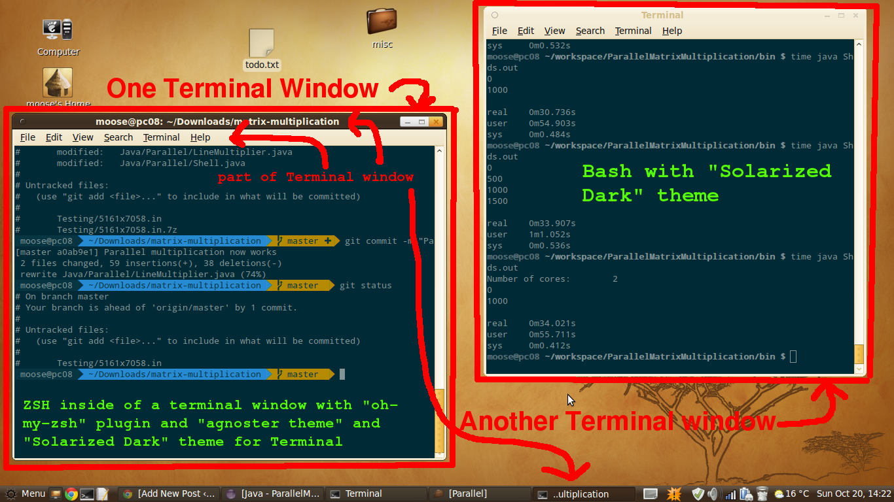
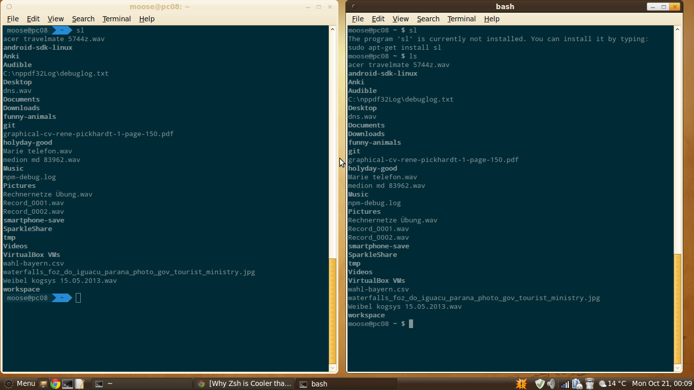
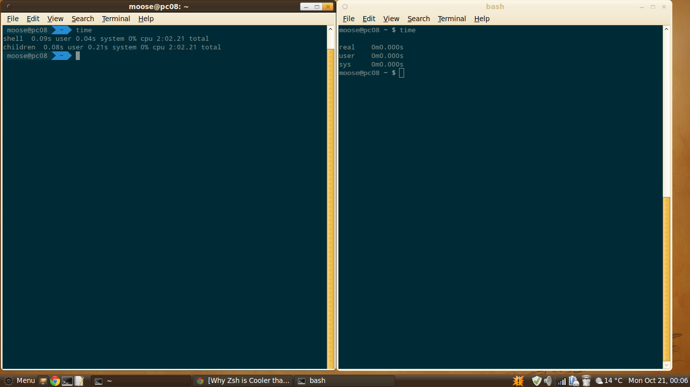

I've just switched from [Bash](https://en.wikipedia.org/wiki/Bash_(Unix_shell))
to [ZSH](https://en.wikipedia.org/wiki/Z_shell) because of <a
href="https://github.com/robbyrussell/oh-my-zsh">oh-my-ZSH</a>. I think this is
just the right time to explain the words Shell, command line, Terminal, Bash
and ZSH.

[Terminal](https://en.wikipedia.org/wiki/GNOME_Terminal) is an terminal
emulator, sometimes also called a "terminal window". I work in a window
environment (MATE) and I want to use command line tools within that
environment. So I need a "terminal window":

<figure class="aligncenter">
            <a href="../images/2013/10/teriminal-window.png"></a>
            <figcaption class="text-center">Terminal Window with ZSH and Bash</figcaption>
        </figure>

ZSH and Bash are both Unix shells. A shell is a command line interpreter that
provides a text-based user interface.

Command line describes the textual way you interact with the computer. When
you're in a graphical user interface situation you interact by manipulating
windows with your keyboard/mouse. When you're in a text-based user interface
situation, you interact by entering commands in a line (hence command line).

## Solarized Dark Theme

The [Solarized Dark Theme](http://ethanschoonover.com/solarized) is very good
for command line. It can be installed like this as explained
[here](https://github.com/oz123/solarized-mate-terminal):

```bash
$ git clone https://github.com/oz123/solarized-mate-terminal.git
$ cd solarized-mate-terminal
$ ./solarized-mate.sh dark
```

restart the terminal.


## Oh-my-ZSH Installation
Oh-my-ZSH is a plugin for ZSH. I think this plugin is very good and makes a big
difference to Bash. So when you look at the screenshots below, keep in mind
that this is not a "plain vanilla" zsh.

* Install "<a href="https://github.com/robbyrussell/oh-my-zsh">Oh-my-ZSH</a>"
* Install "<a href="https://github.com/Lokaltog/powerline-fonts">powerline fonts</a>" and change your Terminal font to one of them
* Change your Terminal theme to "agnoster" by setting <code>ZSH_THEME="agnoster"</code> in **~/.zshrc**
* Set your terminal theme to "Solarized Dark" (<a href="http://www.mintmate.org/?p=13">description</a>)
* Make ZSH your default Shell in MATE Terminal (<a href="http://askubuntu.com/a/342342/10425">description</a>) and eventually <code>sudo chsh -s /usr/bin/zsh username</code>


## ZSH and Bash
Here are some differences. On the left side is zsh, on the right is bash:

<ul class="gallery mw-gallery-traditional" style="max-width: 326px; width: 326px;">
   <li class="gallerybox" style="width: 155px">
      <div style="width: 155px">
         <div class="thumb" style="width: 150px;">
            <div style="margin:21px auto;height: 113px;line-height: 150px;">
               <a href="../images/2013/10/bash-vs-zsh-cd.png" class="image">
                  
               </a>
            </div>
         </div>
         <div class="gallerytext">Bash vs zsh: cd command completion</div>
      </div>
   </li>
   <li class="gallerybox" style="width: 155px">
      <div style="width: 155px">
         <div class="thumb" style="width: 150px;">
            <div style="margin:21px auto;height: 113px;line-height: 150px;">
               <a href="../images/2013/10/bash-vs-zsh-git.png" class="image">
                  
               </a>
            </div>
         </div>
         <div class="gallerytext">Bash vs zsh: Git prompt indicator</div>
      </div>
   </li>
   <li class="gallerybox" style="width: 155px">
      <div style="width: 155px">
         <div class="thumb" style="width: 150px;">
            <div style="margin:21px auto;height: 113px;line-height: 150px;">
               <a href="../images/2013/10/bash-vs-zsh-spelling-correction.png" class="image">
                  
               </a>
            </div>
         </div>
         <div class="gallerytext">Bash vs zsh: Spelling correction</div>
      </div>
   </li>
   <li class="gallerybox" style="width: 155px">
      <div style="width: 155px">
         <div class="thumb" style="width: 150px;">
            <div style="margin:21px auto;height: 113px;line-height: 150px;">
               <a href="../images/2013/10/bash-vs-zsh-time.png" class="image">
                  
               </a>
            </div>
         </div>
         <div class="gallerytext">Bash vs zsh: time command</div>
      </div>
   </li>
</ul>

I like the time command of bash more, but that's it. All other interactions are
either almost the same or better in zsh. I especially like that zsh doesn't
print everything again when you autocomplete with tab. And it also
autocompletes when you make an capitalization error.

I also begin to like the Git-specific prompt indicators:
<figure class="aligncenter">
            <a href="../images/2013/10/oh-my-zsh-git-added.png"></a>
            <figcaption class="text-center">ZSH 'git add' indicator</figcaption>
        </figure>

## Some usefull tools

### ack
You might already know `grep`. And if you've worked with it, you
might already have typed something like the following:

```bash
grep --exclude-dir=".svn" "searchterm" *
grep -rI "onlytextSearchterm" .
```

An alternative to `grep` is `ack` (for Ubuntu users: `ack-grep`).
See [beyondgrep.com](http://beyondgrep.com/).

## Windows

It seems to be possible to get something similar (the same?) for Windows. See
[OH MY CYGWIN](https://github.com/haithembelhaj/oh-my-cygwin/blob/master/README.md).
