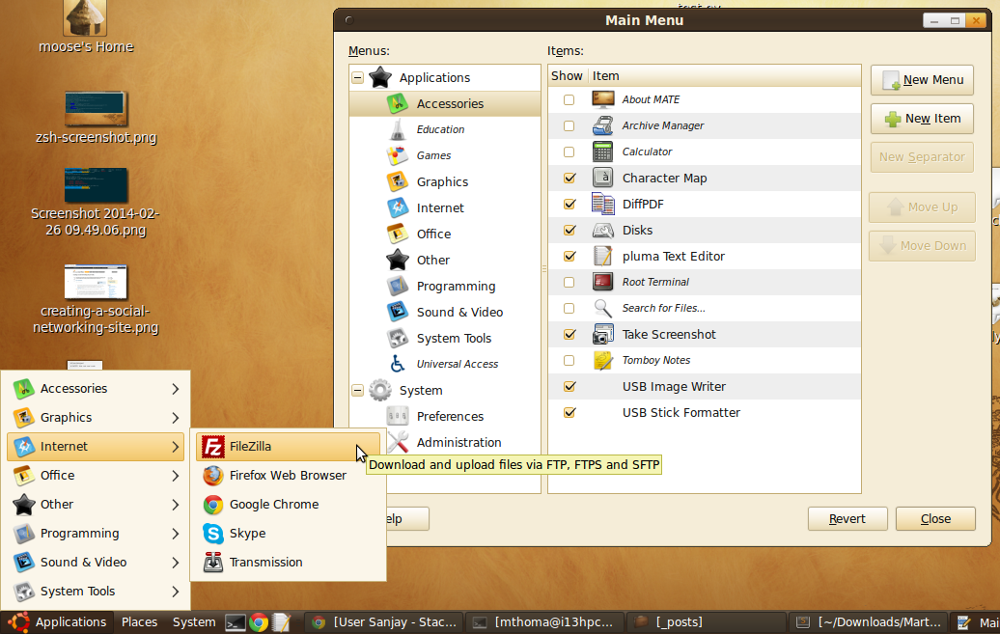
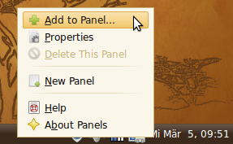
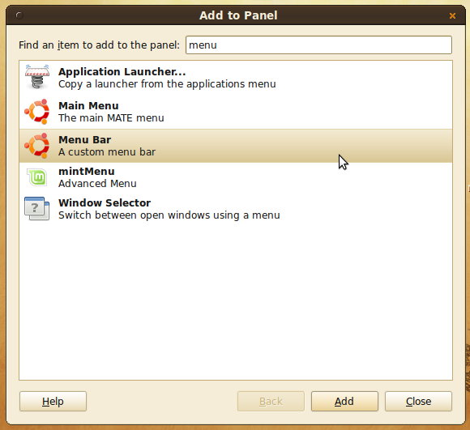

When I reinstall my computer, I usually do the following steps:

1. Copy all data to an external HDD
2. Save configuration:
    * Write down all WLAN configurations (possibly with screenshots; NOT ONLY PASSWORDS!)
    * `.ssh` and `GPG` keys
    * Filezilla configurations
3. Write down all programs that I use.
    1. Export configuration of those programs.
4. Wait a week or a month and see if something is missing in the lists from above.
5. Drop the old system and install a new one


## Operating System

I like to install the latest Ubuntu long term support version (LTS) with the
MATE desktop environment: [Download link](https://ubuntu-mate.org/download/)

Ubuntu is an operating system and one of many flavors of Linux. Those
flavors are called *distributions*. It is one
of the most popular distributions according to [distrowatch.com](https://distrowatch.com/table.php?distribution=mx),
just behind [MX Linux](https://en.wikipedia.org/wiki/MX_Linux), [Manjaro](https://en.wikipedia.org/wiki/Manjaro)
and [Linux Mint](https://en.wikipedia.org/wiki/Linux_Mint).


## Software I usually install

If possible, I will give the Debian package names in the following list:

* [`sublime_text`](../sublime-text/)
* [LaTeX](../how-to-install-the-latest-latex-version/) and scientific writing
    * [`jabref`](../reference-management-with-jabref/): A reference manager
    * `gnuplot`
    * `pdf2svg`
    * `aspell` and `aspell-de`
* [Google Chrome](https://www.google.com/intl/de/chrome/browser/)
* Multimedia
    * [`vlc`](http://www.videolan.org/vlc/): A very good DVD player
    * [OnlineTvRecorder](http://wiki.ubuntuusers.de/OnlineTvRecorder) and especially [OTR-Verwaltung](http://wiki.ubuntuusers.de/OTR-Verwaltung)
    * `avidemux wine mplayer`
    * `sudo add-apt-repository ppa:clipgrab-team && sudo apt-get update && sudo apt-get install clipgrab`
* Graphics
    * [`gimp`](http://www.gimp.org/)
    * [`inkscape`](http://www.inkscape.org/)
    * [`imagemagick`](http://www.imagemagick.org/script/index.php)
    * `pdf2svg librsvg2-bin`
* Programming
    * `zsh` and [Oh-my-zsh](../working-terminal/)
    * General Tools: `sudo apt-get install make curl wget tree htop vim direnv zsh sqlitebrowser meld diffpdf`
    * Python: [`pyenv`](https://github.com/pyenv/pyenv), `pip install pip-tools black isort pre-commit`
    * MySQL: `sudo apt-get install mysql-server && sudo apt-get install phpmyadmin`
    * [VS Code](https://code.visualstudio.com/)
    * C/C++: `sudo apt-get install gcc g++ cmake build-essential gdb`
    * `ruby ruby-sqlite3 ruby-mysql`
    * PHP: `apache2 php5 php5-mysql`
    * JavaScript: `sudo apt-get install nodejs npm`
* Themes
    * Balanzan theme from [bisigi-project](http://www.bisigi-project.org/?page_id=8&lang=en) (simply download it.)
* Work
    * [Slack](https://slack.com/intl/de-de/downloads/linux)
    * [Zoom](https://support.zoom.us/hc/en-us/articles/204206269-Installing-or-updating-Zoom-on-Linux)
* Other
    * `libreoffice`
    * PDF: qpdf ([1](https://askubuntu.com/a/672001/10425))
* DRM-caused (I want to watch DVDs!)
    * `ubuntu-restricted-extras libdvd-pkg libdvdread4 libdvdnav4`, then run
    `sudo dpkg-reconfigure libdvd-pkg`
    * `totem banshee mplayer rhythmbox`


## Configure

### Set defaults

```bash
update-alternatives --config editor
update-alternatives --config x-www-browser
```

### MATE

See [issues/262](https://github.com/mate-desktop/caja/issues/262):

```bash
mv ~/.config/gtk-3.0/bookmarks ~/.config/gtk-3.0/bookmarks-backup
ln -s ~/.gtk-bookmarks ~/.config/gtk-3.0/bookmarks
```

### GUI

I like the old menu bar quite a lot. It opens instantly and is customizable:


<figure>
    <a href="../images/2014/03/mate-old-menu.png"></a>
    <figcaption>Old menu bar</figcaption>
</figure>

You can get it back in MATE by doing a right-click on the menu. Then click on
"add to panel":

<figure>
    <a href="../images/2014/03/mate-add-to-panel.png"></a>
    <figcaption>Add to panel</figcaption>
</figure>

After that, the following dialog will pop up. Choose "Menu Bar":

<figure>
    <a href="../images/2014/03/mate-add-menu-bar.png"></a>
    <figcaption>Add menu bar</figcaption>
</figure>

### DRM-Stuff

```bash
sudo /usr/share/doc/libdvdread4/install-css.sh
sudo regionset #use that with caution
```

### dotfiles
See [github.com/MartinThoma/dotfiles](https://github.com/MartinThoma/dotfiles).

## Data
Download / copy all data back from GitHub / external HDDs to my internal HDD.

## Themes

Bigger sites:

* [Mate-look.org](https://www.mate-look.org/)

And some specific ones:

* Mac: [McMojave](https://www.pling.com/p/1275087/)
* [Balanzan](../balanzan-theme/)
