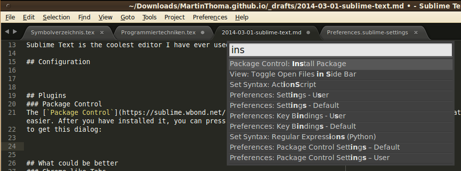
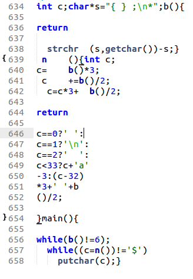
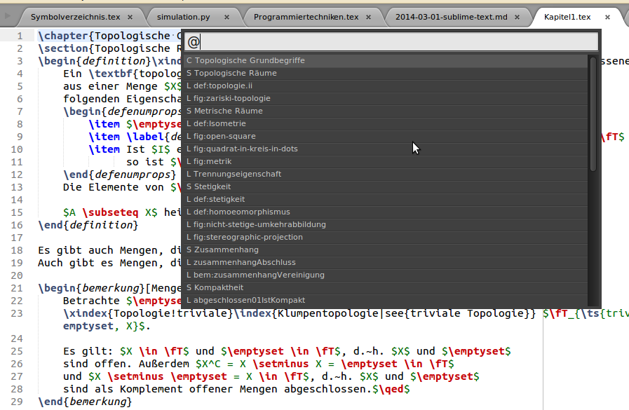
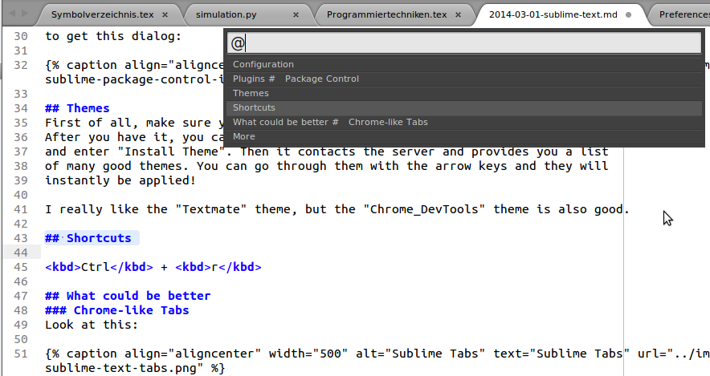
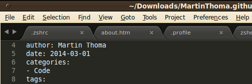
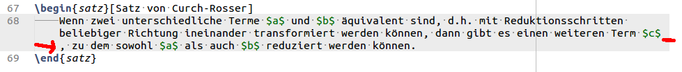

Sublime Text is the coolest editor I have ever used. It has a lot of features,
is blazingly fast as I expect it from every editor and has a convenient configuration.
It is available for Linux, Windows and Mac. You can use it for free without any
restrictions as long as you want. But keep in mind that somebody had to develop
this nice software.

## Installation
You can get a free version from [sublimetext.com](http://www.sublimetext.com/)
or you could install it on Linux Mint via

```bash
sudo apt-get install sublime-text
```

I've added a symlink to make it easier to call it from command line:

```bash
sudo ln -s /opt/sublime_text/sublime_text /usr/local/bin/sublime
```

The editor is usable right after the installation, but you might want to make
some fine-tuning.

## Package Control

The [`Package Control`](https://sublime.wbond.net/) plugin should definitely be
installed. It makes installation of other packages so much easier. After you
have installed it, you can press <kbd>Ctrl</kbd>+<kbd>Shift</kbd>+<kbd>P</kbd>
to get this dialog:

<figure class="aligncenter">
            <a href="../images/2014/03/sublime-package-control-install.png"></a>
            <figcaption class="text-center">Sublime Tabs</figcaption>
        </figure>

## Configuration
Sublime Text offers plenty of configuration options. You can apply them to projects, users or system wide. Most of the time, I change my preferences for me via Preferences > Settings - User:

<figure class="aligncenter">
            <a href="../images/2014/03/sublime-user-preferences.png"> Settings - User" style="max-width:500px;" class=""/></a>
            <figcaption class="text-center">Preferences > Settings - User</figcaption>
        </figure>

Here is what I have changed:

```text
{
    "WrapPlus.break_on_hyphens": false,
    "color_scheme": "Packages/User/textmate (Flake8Lint).tmTheme",
    "detect_indentation": false,
    "draw_white_space": "all",
    "fold_buttons": true,
    "font_face": "Ubuntu Mono",
    "font_size": 15,
    "highlight_line": true,
    "rulers":
    [
        79,
        120
    ],
    "scroll_speed": 0,
    "search_threshold": 1000000,
    "tab_size": 4,
    "translate_tabs_to_spaces": true,
    "use_tab_stops": false
}
```

Note that you have to install the color scheme and the font ([source](http://font.ubuntu.com/)) to use it.

## Command Palette

You can get to the command palette by <kbd>Ctrl</kbd> + <kbd>Shift</kbd> + <kbd>P</kbd>.
This opens such a dialog:

<figure class="aligncenter">
            <a href="../images/2014/03/sublime-command-palette.png"></a>
            <figcaption class="text-center">automatical alignment</figcaption>
        </figure>

This will do a fuzzy search through all elements in the menu. So you don't need
to use <kbd>Alt</kbd> + arrow keys no longer. I love it ☺

## Plugins

### LaTeXTools
The [LaTeXTools](https://github.com/SublimeText/LaTeXTools) package adds support
for LaTeX. It adds shortcuts, a pull-down menu when you enter `\cref{` and much
more.

### BracketHighlighter
[BracketHighlighter](https://github.com/facelessuser/BracketHighlighter) adds
brackets on the left side. It looks like this:

<figure class="aligncenter">
            <a href="../images/2014/03/sublime-braces.png"></a>
            <figcaption class="text-center">Highlight braces</figcaption>
        </figure>

### Alignment
[Sublime Alignment](http://wbond.net/sublime_packages/alignment) gives you the
possibility to mark text, press <kbd>Ctrl</kbd>+<kbd>Alt</kbd>+<kbd>a</kbd> to
align:

<figure class="aligncenter">
            <a href="../images/2014/03/sublime-align.gif"></a>
            <figcaption class="text-center">automatical alignment</figcaption>
        </figure>

### Colorsublime

Colorsublime is a plugin for theming Sublime&nbsp;Text&nbps;3 within seconds.
Take a look at [colorsublime.com](http://colorsublime.com/) for some examples.


### TrailingSpaces

Tools for easy removing trailing spaces with <kbd>Ctrl</kbd> +
<kbd>Shift</kbd> + <kbd>T</kbd>.
See [GitHub repository](https://github.com/SublimeText/TrailingSpaces).


### Wrap Plus

Tools for easy wrapping lines with <kbd>Alt</kbd> + <kbd>Q</kbd>.
See [GitHub repository](https://github.com/ehuss/Sublime-Wrap-Plus).


### Python Flake8 Lint

Highlight potential problems with Python code.
See [GitHub repository](https://github.com/dreadatour/Flake8Lint).


## Themes
First of all, make sure you have installed the `Colorsublime` package.
After you have it, you can press <kbd>Ctrl</kbd> + <kbd>Shift</kbd> + <kbd>P</kbd>
and enter "Install Theme". Then it contacts the server and provides you a list
of many good themes. You can go through them with the arrow keys and they will
instantly be applied!

I really like the "Textmate" theme, but the "Chrome_DevTools" theme is also good.

## Custom Keybindings

You can create custom keybindings via *Preferences Key Bindings (User)*

I have these:

```text
[
{ "keys": ["ctrl+shift+r"], "command": "reindent", "args": { "single_line": false } },
{ "keys": ["shift+tab"], "command": "unindent", "args": {"single_line":true} },
{ "keys": ["ctrl+7"], "command": "toggle_comment", "args": { "block": false } },
{ "keys": ["ctrl+shift+7"], "command": "toggle_comment", "args": { "block": true } },
{ "keys": ["ctrl+shift+t"], "command": "delete_trailing_spaces" }
]
```

## Custom snippets

Snippets are a very cool feature of <abbr title="Sublime Text">ST</abbr>. They
allow you to enter some text, press <kbd>Tab</kbd> and get whatever you wanted.
So you could create a new <tt>.tex</tt> document, enter <tt>article</tt>, press
<kbd>Tab</kbd> and get a template for a LaTeX document of the article document
class.

A tutorial how to create a snippet for the <tt>article</tt> document class
was written Jonathan Page: [Creating Snippets in Sublime Text 2 for LaTeX](http://economistry.com/2013/01/creating-snippets-in-sublime-text-2-for-latex/)

## Buildin Keybindings

<kbd>Ctrl</kbd> + <kbd>p</kbd>: Goto file

<kbd>Ctrl</kbd> + <kbd>Shift</kbd> + <kbd>P</kbd>: Goto anything


<kbd>Ctrl</kbd> + <kbd>r</kbd>: Goto section

<figure class="aligncenter">
            <a href="../images/2014/03/sublime-latextools-jump-ctrl-r.png"></a>
            <figcaption class="text-center">Ctrl+R in Sublime Text (LaTeX)</figcaption>
        </figure>
<figure class="aligncenter">
            <a href="../images/2014/03/sublime-jump-markdown-ctrl-r.png"></a>
            <figcaption class="text-center">Ctrl+R in Sublime Text (Markdown)</figcaption>
        </figure>

<kbd>Ctrl</kbd> + <kbd>Shift</kbd> + <kbd>Up / Down</kbd>: Move the current line one line up / down

<kbd>Shift</kbd> + <kbd>F11</kbd>: Distraction free mode

<figure class="aligncenter">
            <a href="../images/2014/03/sublime-text-distraction-free.png"></a>
            <figcaption class="text-center">Distraction free mode</figcaption>
        </figure>

<kbd>Ctrl</kbd> + <kbd>D</kbd>: Multi-Select


## What could be better

### Chrome-like Tabs
Look at this:

<figure class="aligncenter">
            <a href="../images/2014/03/sublime-text-tabs.png"></a>
            <figcaption class="text-center">Sublime Tabs</figcaption>
        </figure>

Now compare it to this:

<figure class="aligncenter">
            <a href="../images/2014/03/chrome-tabs.png"></a>
            <figcaption class="text-center">Chrome Tabs</figcaption>
        </figure>

Chrome tabs look much cleaner, don't they? Many others seem to think that, too ([source](http://sublimetext.userecho.com/topic/19361-move-tabs-to-the-title-bar-like-in-google-chrome/)).

### Line Wrapping
Sublime Text 3 does wrap points and commas to the next line:

<figure class="aligncenter">
            <a href="../images/2014/03/sublime-word-wrapping.png"></a>
            <figcaption class="text-center">line wrapping</figcaption>
        </figure>

This behaviour is bad and not liked by the community ([source](http://www.sublimetext.com/forum/viewtopic.php?f=3&t=5214)).

### Support for Tooltips

It would be absolutely great for many plugins like linters if they could make
use of tooltips.

> Any news on tooltip and sidebar API? Are you planning to implement this (ever? :mrgreen: )
> It's something I very much want to get done, but at this stage I don't know when that will be.

Source: [Sublime Text Forum: Sublime Text 3 Beta](http://www.sublimetext.com/forum/viewtopic.php?f=2&t=10780&p=42383&hilit=+tooltip#p42383)

## More
* [Documentation](https://www.sublimetext.com/docs/3/)
* [colorsublime.com](http://colorsublime.com/): Lots of themes
* [tmtheme-editor.herokuapp.com](http://tmtheme-editor.herokuapp.com/#/theme/Chrome%20DevTools): Adjust your theme online
* [Sublime Text 2 Video Tutorials](https://www.youtube.com/watch?v=5AV9zJH2n_Y&index=2&list=PLmJpVU-TdmVtTLooKvX3jcrOziPjlWrD4): A series of 32 video tutorials for Sublime Text 2. At least the first few are the same in ST 3.
