<figure class="figure-right">
    <a href="../images/2014/03/panasonic-lumix-tz41.jpg">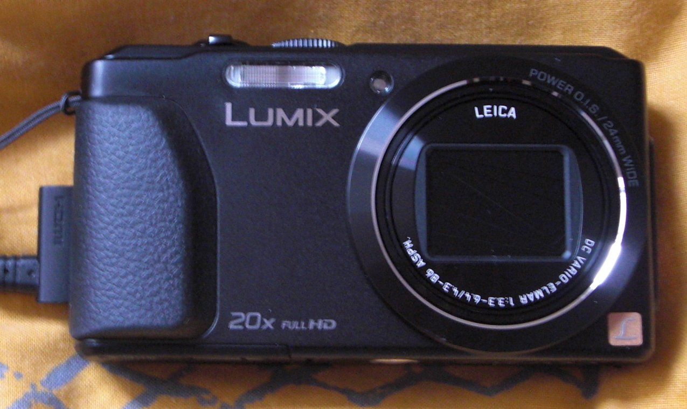</a>
    <figcaption>Panasonic Lumix TZ41</figcaption>
</figure>

The <span itemprop="name">Panasonic Lumix TZ41</span> is currently the best
camera in the compact segment.

<span itemprop="description">The TZ41 offers an excellent 20× zoom that is usable due to optical image
stabilization. It is compact, lightweight and has a reasonably sized battery.</span>

## Technical specification

| Name             | Panasonic Lumix TZ41      |
|------------------|---------------------------|
| Model            | Panasonic DMC-TZ41EG-K    |
| Price            | <span itemprop="offers" itemscope itemtype="http://schema.org/Offer"><span itemprop="price">259.03</span> <span itemprop="priceCurrency">Euro</span></span> |
| Dimensions       | 108.3 × 58.9 × 27.7 mm    |
| Weight           | 198g                      |
| Zoom             | 20×                       |
| optical image stabilization | ✔              |
| Battery Power    | 1250mAh                   |
| GPS Sensor       | ✔                        |
| Sensor           | 1/2.3" MOS Sensor with 18.9 Megapixel |
| Video            | 1920 x 1080 full HD video |
| Wi-Fi            | ✔                        |
| NFC              | ✔                        |
| LCD Monitor      | ✔                        |
| Internal Storage | 12 MB                     |

This camera is the same as the '<span itemprop="alternateName">TZ40</span>' which
has an [<span itemprop="sameAs">official data sheet</span>](http://www.panasonic.com/au/consumer/imaging/lumix-cameras/dmc-tz40.specs.html) and [digitalkamera.de](http://www.digitalkamera.de/Kamera/Panasonic/Lumix_DMC-TZ41.aspx).

### Model name

| Panasonic | Meaning              | Alternatives                   |
|-----------|----------------------|--------------------------------|
| [Lumix](https://en.wikipedia.org/wiki/Lumix) | Compact cameras |           |
| DMC       | [Digital Media Camera](http://photo.stackexchange.com/q/49043/27076) |      |
| TZ        | Traveler Zoom        | SZ, TS, GM, LX                 |
| 41        |                      | 40 seems to be the same as 41; 60, ... |
| EG        | European Union model |                                |
| K         | Black colored        | W = White, R = Red, S = Silver |

## Criticism

### Charger

Panasonic doesn't use the standard European charger / cable combination that is
used for smartphones.

<figure>
    <a href="../images/2014/03/panasonic-lumix-tz-41-charger.jpg"></a>
    <figcaption>Charging works via microUSB, but not via a standard charger.</figcaption>
</figure>

<figure>
    <a href="../images/2014/03/panasonic-cable-standard-cable.jpg">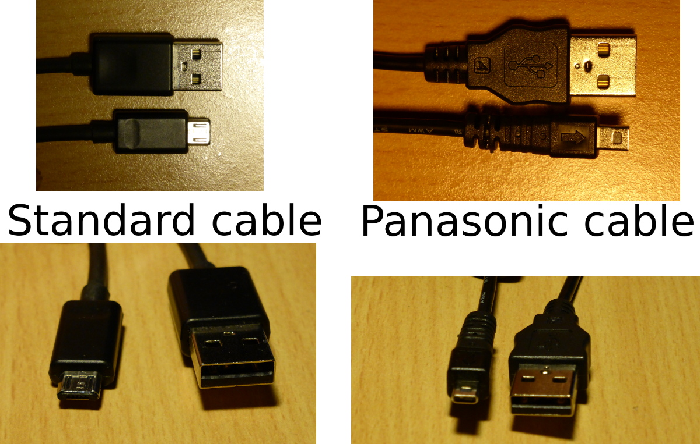</a>
    <figcaption>Panasonic does not use standard microUSB2USB cables for charging / data exchange</figcaption>
</figure>

### Software

The software is not available for Linux.

## Linux

```bash
moose@pc08$ cat /etc/issue
Linux Mint 16 Petra
moose@pc08$ uname -a
Linux pc08 3.11.0-12-generic #19-Ubuntu SMP Wed Oct 9 16:20:46 UTC 2013 x86_64 x86_64 x86_64 GNU/Linux
```

and the camera as a USB device:

```bash
moose@pc08$ lsusb
Bus 001 Device 006: ID 04da:2372 Panasonic (Matsushita) Lumix Camera (Storage mode)
```

### GPS Assist Tool

The GPS Assist Tool seems to update the camera's internal GPS information. It
works like this:

1. Connect the camera with the SD card in it to the computer.
2. Start gpsasist.exe with wine.

<div class="gallery">
    <figure>
        <a href="../images/2014/03/gpsasist.exe.png">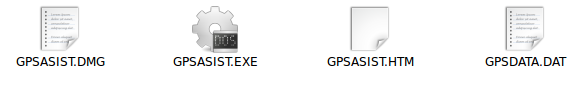</a>
        <figcaption>gpsasist.exe</figcaption>
    </figure>
    <figure>
        <a href="../images/2014/03/gps-assist-tool.png">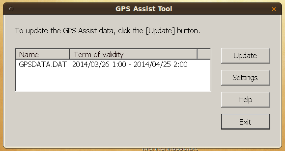</a>
        <figcaption>gps-assist-tool</figcaption>
    </figure>
    <figure>
        <a href="../images/2014/03/gps-update-completed.png">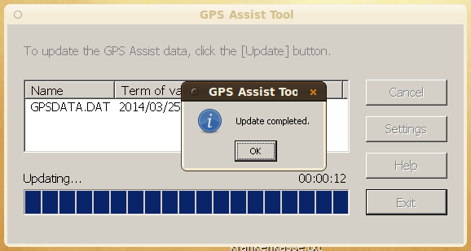</a>
        <figcaption>update completed</figcaption>
    </figure>
    <figure>
        <a href="../images/2014/03/gps-assist-settings.png">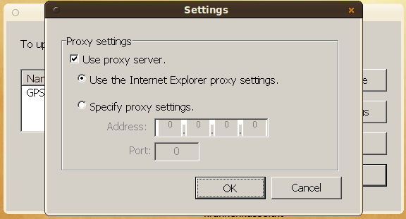</a>
        <figcaption>Settings</figcaption>
    </figure>
</div>

### LUMIX Map Tool

The LUMIX Map Tool should allow you to copy maps with information about the
environment on your camera. It looks like this:

<div class="gallery">
    <figure>
        <a href="../images/2014/03/lumix-map-tool.png">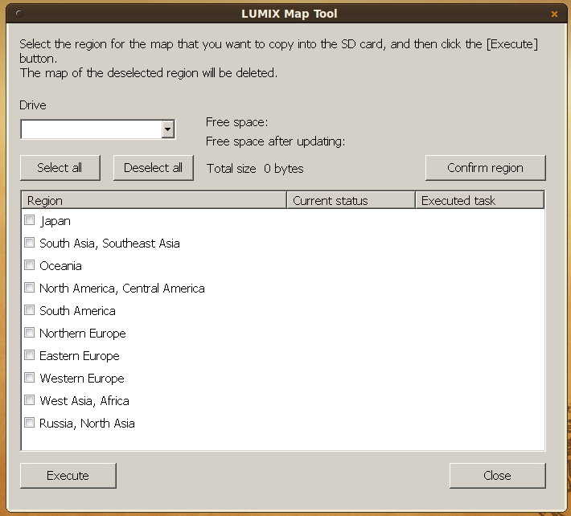</a>
    </figure>
    <figure>
        <a href="../images/2014/03/lumix-map-tool-no-drive-detection.png">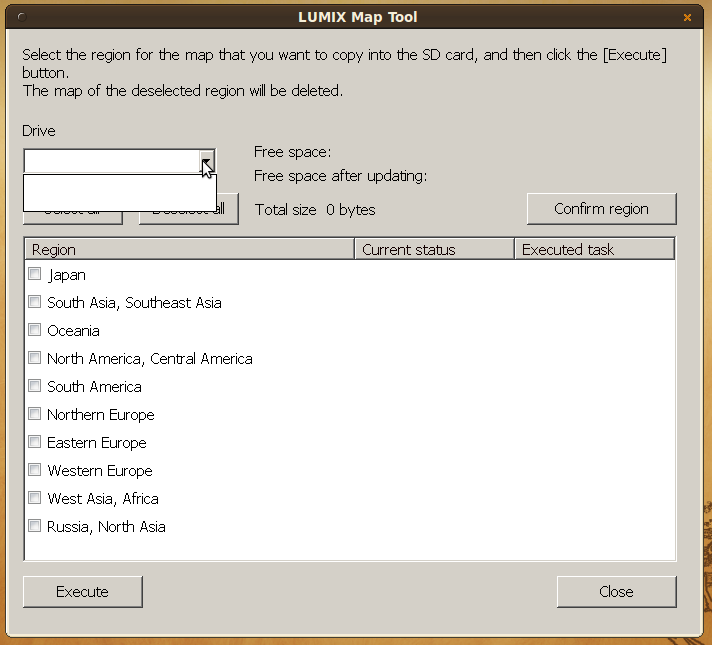</a>
    </figure>
</div>

The drive detection for the SD card doesn't work on Linux, as you can see in the
second image. So I have written a Linux version of that program which can be
found on [GitHub](https://github.com/MartinThoma/lumix_map_tool).

## Example photographs

To compare the quality of the Panasonic Lumix DMC-TZ41, I have shot the same photographs
with my old Casio Exilim EX-Z200.

### Macro photographs

<div class="gallery">
    <figure>
        <a href="../images/2014/03/casio-exilim-ex-z200/blume-blau-1.jpg"></a>
        <figcaption>Casio</figcaption>
    </figure>
    <figure>
        <a href="../images/2014/03/panasonic-lumix-dmc-tz-41/blume-blau-1.jpg"></a>
        <figcaption>TZ41</figcaption>
    </figure>
    <figure>
        <a href="../images/2014/03/panasonic-lumix-dmc-tz-41/blume-glare.jpg"></a>
        <figcaption>TZ41</figcaption>
    </figure>
</div>

### Normal range photographs

<div class="gallery">
    <figure>
        <a href="../images/2014/03/casio-exilim-ex-z200/bank.jpg">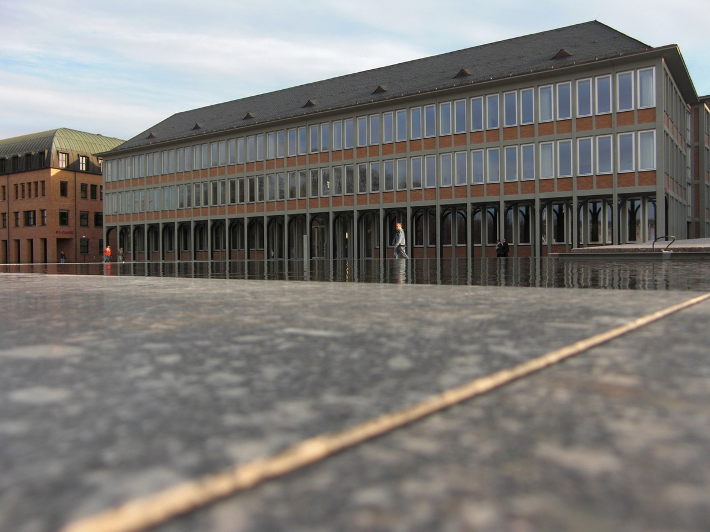</a>
        <figcaption>Casio</figcaption>
    </figure>
    <figure>
        <a href="../images/2014/03/panasonic-lumix-dmc-tz-41/bank.jpg">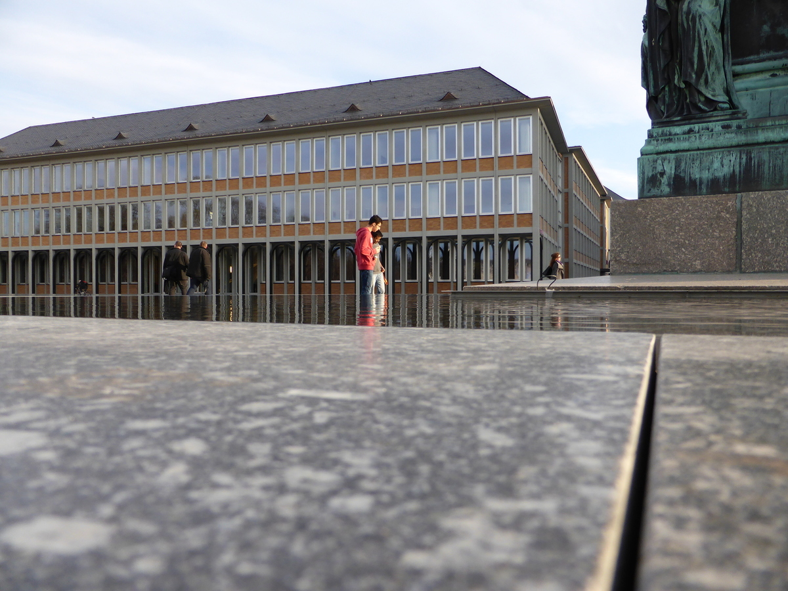</a>
        <figcaption>TZ41</figcaption>
    </figure>
    <figure>
        <a href="../images/2014/03/casio-exilim-ex-z200/blume-front-unschaerfe.jpg"></a>
        <figcaption>Casio</figcaption>
    </figure>
    <figure>
        <a href="../images/2014/03/panasonic-lumix-dmc-tz-41/blume-front-unschaerfe.jpg"></a>
        <figcaption>TZ41</figcaption>
    </figure>
    <figure>
        <a href="../images/2014/03/casio-exilim-ex-z200/schlossplatz.jpg">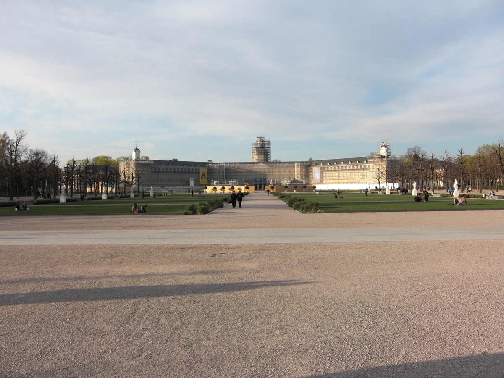</a>
        <figcaption>Casio</figcaption>
    </figure>
    <figure>
        <a href="../images/2014/03/panasonic-lumix-dmc-tz-41/schlossplatz.jpg">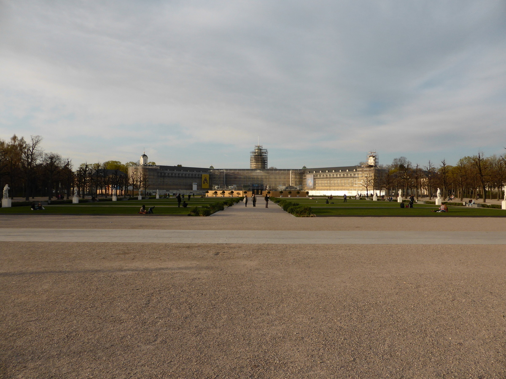</a>
        <figcaption>TZ41</figcaption>
    </figure>
    <figure>
        <a href="../images/2014/03/casio-exilim-ex-z200/springbrunnen-ganz.jpg">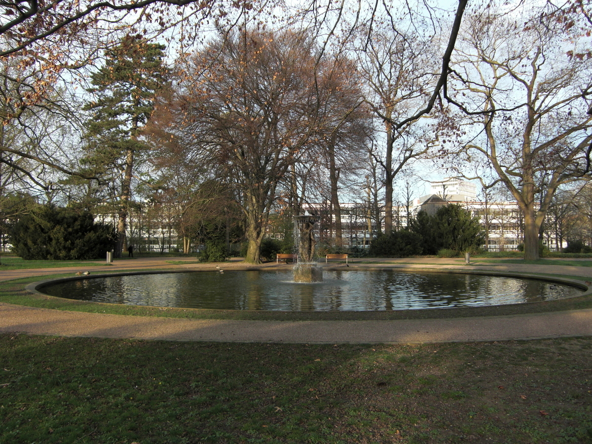</a>
        <figcaption>Casio</figcaption>
    </figure>
    <figure>
        <a href="../images/2014/03/panasonic-lumix-dmc-tz-41/springbrunnen-ganz.jpg">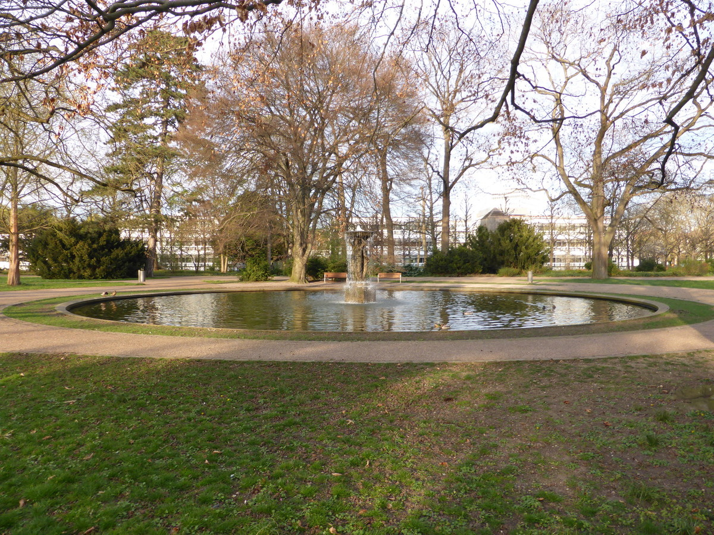</a>
        <figcaption>TZ41</figcaption>
    </figure>
</div>

<div class="gallery">
    <figure>
        <a href="../images/2014/03/panasonic-lumix-dmc-tz-41/relief.jpg"></a>
    </figure>
    <figure>
        <a href="../images/2014/03/panasonic-lumix-dmc-tz-41/poor-light-conditions.jpg">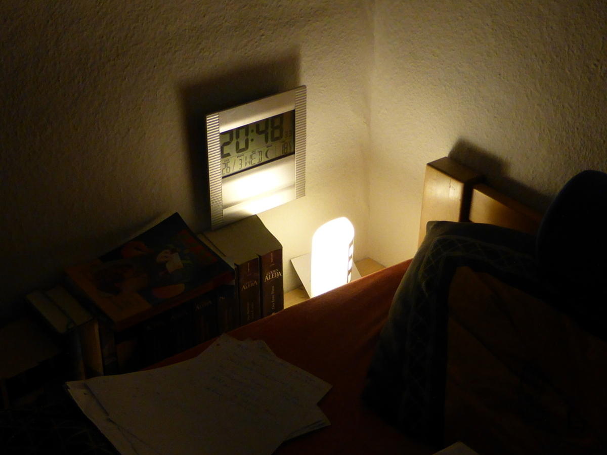</a>
    </figure>
    <figure>
        <a href="../images/2014/03/panasonic-lumix-dmc-tz-41/taube-fliegt.jpg"></a>
    </figure>
    <figure>
        <a href="../images/2014/03/panasonic-lumix-dmc-tz-41/enterich-1.jpg"></a>
    </figure>
    <figure>
        <a href="../images/2014/03/panasonic-lumix-dmc-tz-41/enterich-2.jpg"></a>
    </figure>
    <figure>
        <a href="../images/2014/03/panasonic-lumix-dmc-tz-41/enterich-3.jpg"></a>
    </figure>
    <figure>
        <a href="../images/2014/03/panasonic-lumix-dmc-tz-41/enterich-4.jpg"></a>
    </figure>
    <figure>
        <a href="../images/2014/03/panasonic-lumix-dmc-tz-41/ente-1.jpg"></a>
    </figure>
    <figure>
        <a href="../images/2014/03/panasonic-lumix-dmc-tz-41/ente-2.jpg"></a>
    </figure>
    <figure>
        <a href="../images/2014/03/panasonic-lumix-dmc-tz-41/ente-und-enterich-1.jpg"></a>
    </figure>
    <figure>
        <a href="../images/2014/03/panasonic-lumix-dmc-tz-41/ente-und-enterich-2.jpg"></a>
    </figure>
    <figure>
        <a href="../images/2014/03/panasonic-lumix-dmc-tz-41/fassade.jpg"></a>
    </figure>
    <figure>
        <a href="../images/2014/03/panasonic-lumix-dmc-tz-41/fassade-statue.jpg"></a>
    </figure>
    <figure>
        <a href="../images/2014/03/panasonic-lumix-dmc-tz-41/springbrunnen.jpg"></a>
    </figure>
</div>

### Long-range photographs

<div class="gallery">
    <figure>
        <a href="../images/2014/03/casio-exilim-ex-z200/ente-zoom.jpg"></a>
        <figcaption>Casio</figcaption>
    </figure>
    <figure>
        <a href="../images/2014/03/panasonic-lumix-dmc-tz-41/ente-zoom.jpg">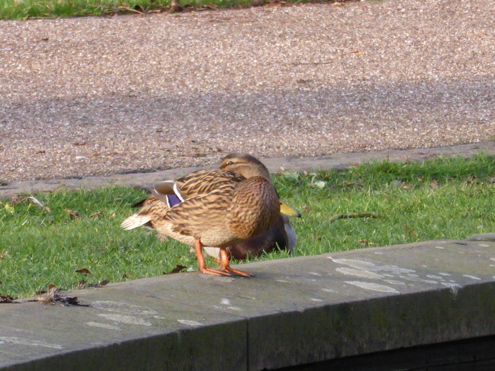</a>
        <figcaption>TZ41</figcaption>
    </figure>
    <figure>
        <a href="../images/2014/03/casio-exilim-ex-z200/schlosstor-zoom.jpg">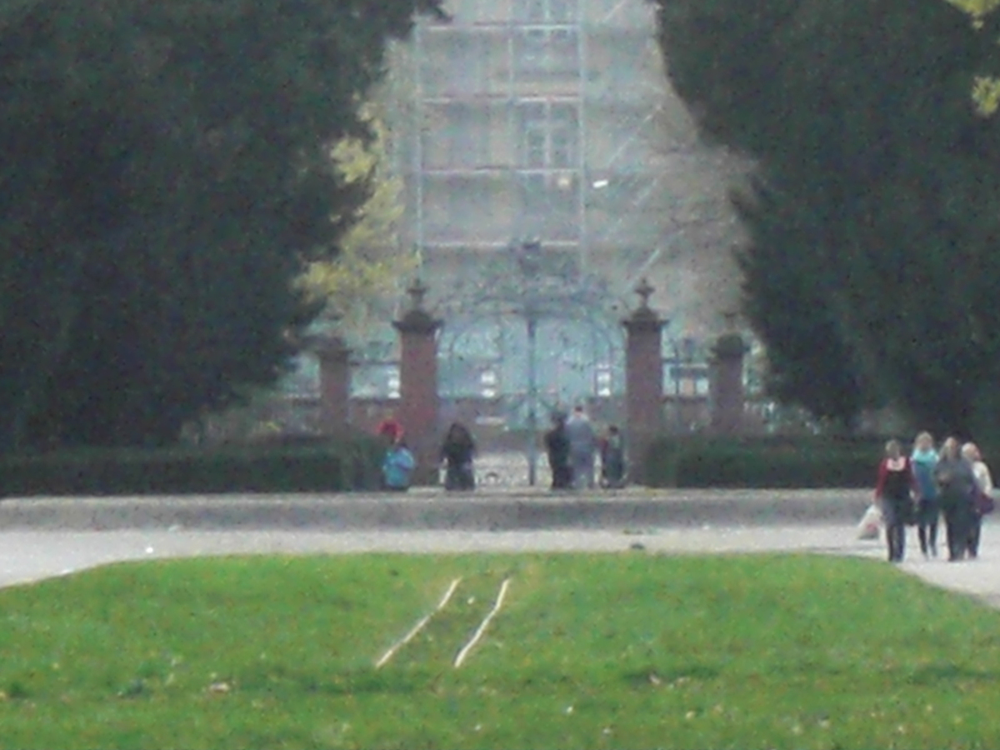</a>
        <figcaption>Casio</figcaption>
    </figure>
    <figure>
        <a href="../images/2014/03/panasonic-lumix-dmc-tz-41/schlosstor-zoom.jpg">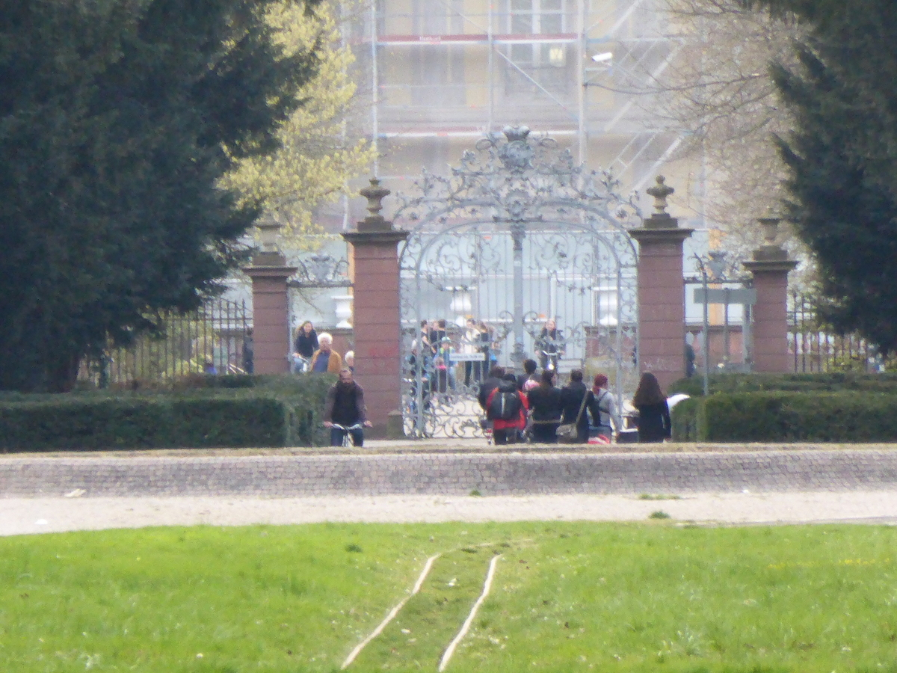</a>
        <figcaption>TZ41</figcaption>
    </figure>
    <figure>
        <a href="../images/2014/03/casio-exilim-ex-z200/schloss-zoom-spitze.jpg">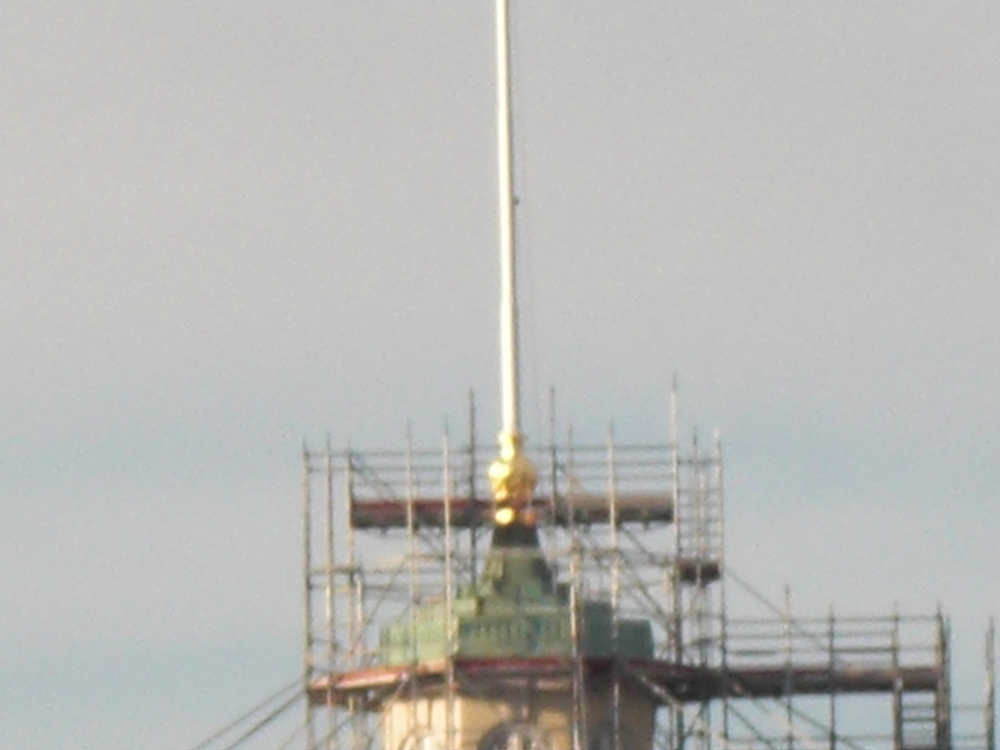</a>
        <figcaption>Casio</figcaption>
    </figure>
    <figure>
        <a href="../images/2014/03/panasonic-lumix-dmc-tz-41/schloss-zoom-spitze.jpg">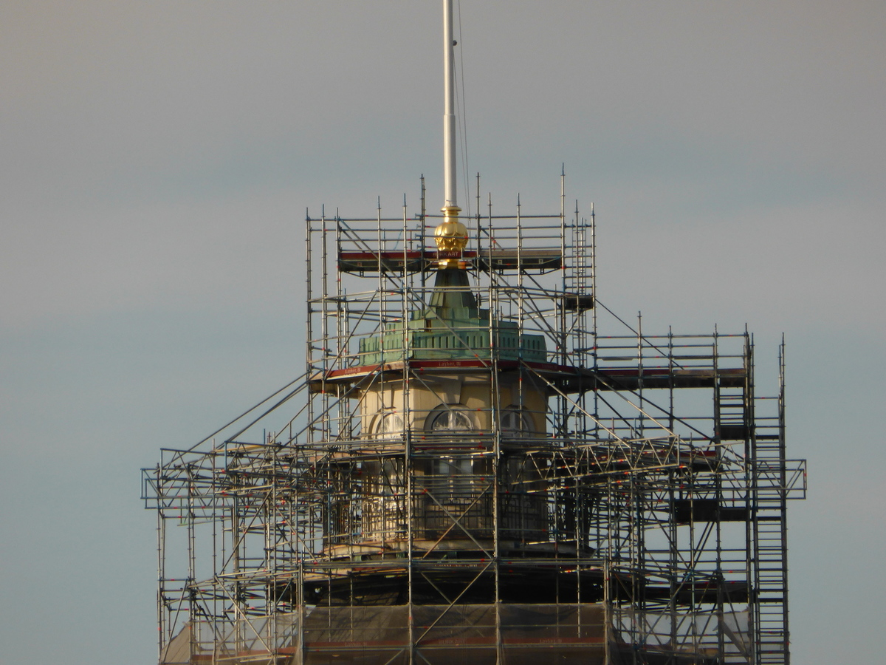</a>
        <figcaption>TZ41</figcaption>
    </figure>
</div>

## Conclusion
Overall, the Panasonic Lumix TZ41 is a great camera. But the lack of a standard
charger and a standard cable as well as the missing Linux software are a downer.
This is the reason why <meta itemprop="author" property="v:reviewer" content="Martin Thoma">I <span itemprop="reviewRating" rel="v:rating" itemscope itemtype="http://schema.org/Rating">
<meta itemprop="worstRating" content="1" property="v:worst" > give it <span itemprop="ratingValue" property="v:rating">4</span>/<span itemprop="bestRating" property="v:best">5</span> stars.</span>

## More Information

Good German resources are:

* [Chip.de](http://www.chip.de/artikel/Panasonic-Lumix_DMC-TZ41-Digitalkamera-Test_60063203.html): A review with some comparisons to other cameras.
* [Panasonic Lumix DMC-TZ41 - Mein Fazit](https://www.youtube.com/watch?v=4v2vLMihcOg):
  A very detailed video review.
