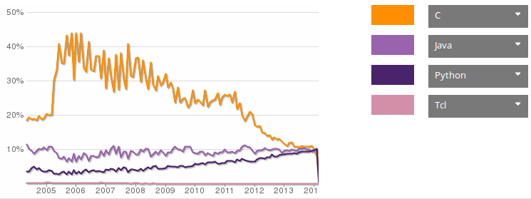
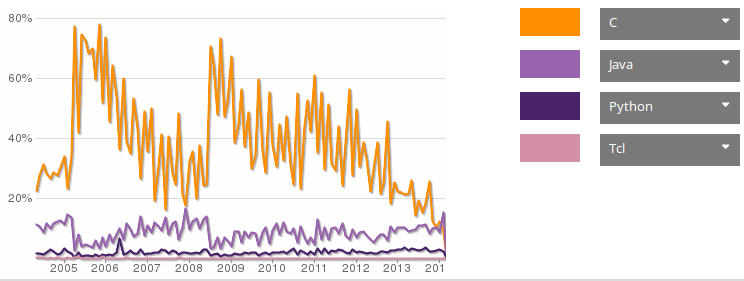
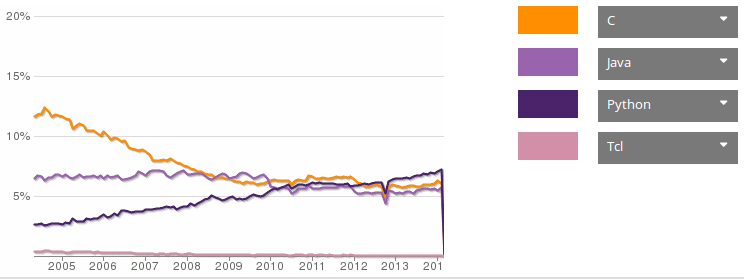
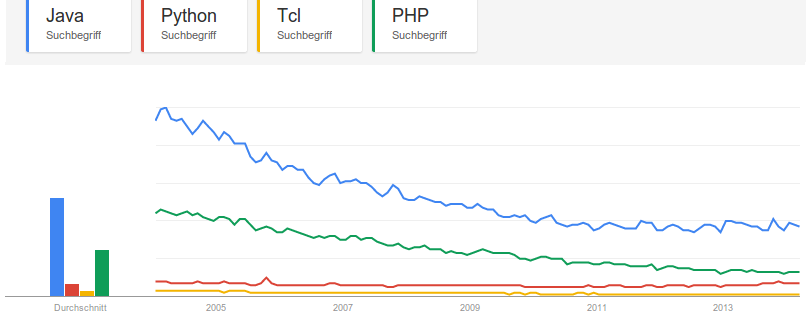

TCL is an imperative, interpreted, dynamically typed programming language. The
**T**ool **C**ommand **L**anguage appeared in 1988. In Tcl, everything is a string.

It is probably best (and completely?)
described by the [12 Rules for Tcl](http://wiki.tcl.tk/10259).

## Basic Syntax by Example

Some nice comparisons of the syntax of many languages can be found at [rigaux.org](http://rigaux.org/language-study/syntax-across-languages.html)

### Hello World

```tcl
set myVariable "Hallo World!"
puts $myVariable
```

### Loop over a list
```tcl
% foreach element {1 2 3} {
    puts $element
}
```

### Fibonacci

```tcl
proc fib {n} {
    if {$n < 2} {
        return $n
    } else {
        return [expr {[fib [expr {$n-2}]] + [fib [expr {$n-1}]]}]
    }
}

for {set x 0} {$x<10} {incr x} {
    puts [fib $x]
}
```

### Comments

TCL uses `#` as a line comment and does not offer block comments. In fact, they
recommend this:

```tcl
if 0 {
    Any Tcl code to be commented out (with matching braces, of course!)
    or any other kind of text, will be ignored - and even [exit] won't fire
    because it's in braces, so left unevaluated!
}
```

Source: [wiki.tcl.tk/1669](http://wiki.tcl.tk/1669)

### Logical operators


| AND   | OR           | TRUE | FALSE |
|-------|--------------|------|-------|
| &&    | &#124;&#124; |   1  |     0 |
| **EQUAL** | **UNEQUAL**      | **NOT**  |       |
|  ==   |    !=        |   !  |       |

### 99 bottles of beer

```tcl
#!/usr/bin/tclsh

# 99.tcl; Tcl version of 99 Bottles of Beer Song

proc findBString { count } {
  return [switch -exact -- $count {
    0       { expr {"No more bottles"}  }
    1       { expr {"1 bottle"}         }
    default { expr {"$count bottles"}   }
  }]
}

set bottles 99
set bString [findBString $bottles]
while {$bottles + 1} {
  puts "$bString of beer on the wall.  $bString of beer."
  incr bottles -1
  if {$bottles + 1} {
    set bString [findBString $bottles]
    puts "Take one down, pass it round, $bString of beer on the wall.\n"
  } else {
    puts "Go to the store and buy some more...99 bottles of beer."
  }
}
```

Source: [99-bottles-of-beer.net](http://99-bottles-of-beer.net/language-tcl-797.html)

### Argument parsing ###
See [`itfParseArgv`](http://www.cs.cmu.edu/~tanja/Lectures/JRTkDoc/OldDoc/interface/parseArgv.html)

## Naming schemes

* Variables have to fit to the pattern `[_a-zA-Z][_a-zA-Z0-9]*`.
* Functions have to fit to the pattern `[^ \t\n\r\f]+`.
* Variables and function are scrunched together by camelCase or CamelCase.

## Community

I think one indicator for the quality of the community is it's size. And the
community will grow, when the language gets more popular.

According to [Ohloh](http://www.ohloh.net/languages/compare), TCL is quite unpopular:

<ul class="gallery mw-gallery-traditional" style="max-width: 652px; width: 652px;">
   <li class="gallerybox" style="width: 155px">
      <div style="width: 155px">
         <div class="thumb" style="width: 150px;">
            <div style="margin:21px auto;height: 113px;line-height: 150px;">
               <a href="../images/2014/04/monthly-commits-ohloh.png" class="image">
                  
               </a>
            </div>
         </div>
         <div class="gallerytext">Monthly Commits</div>
      </div>
   </li>
   <li class="gallerybox" style="width: 155px">
      <div style="width: 155px">
         <div class="thumb" style="width: 150px;">
            <div style="margin:21px auto;height: 113px;line-height: 150px;">
               <a href="../images/2014/04/monthly-contributors-ohloh.png" class="image">
                  
               </a>
            </div>
         </div>
         <div class="gallerytext">Monthly Contributors</div>
      </div>
   </li>
   <li class="gallerybox" style="width: 155px">
      <div style="width: 155px">
         <div class="thumb" style="width: 150px;">
            <div style="margin:21px auto;height: 113px;line-height: 150px;">
               <a href="../images/2014/04/monthly-loc-ohloh.png" class="image">
                  
               </a>
            </div>
         </div>
         <div class="gallerytext">Monthly Lines of Code</div>
      </div>
   </li>
   <li class="gallerybox" style="width: 155px">
      <div style="width: 155px">
         <div class="thumb" style="width: 150px;">
            <div style="margin:21px auto;height: 113px;line-height: 150px;">
               <a href="../images/2014/04/monthly-projects-ohloh.png" class="image">
                  
               </a>
            </div>
         </div>
         <div class="gallerytext">Monthly Projects</div>
      </div>
   </li>
</ul>

You can also take a look at [Google Trends](http://www.google.com/trends/):

<figure class="aligncenter">
            <a href="../images/2014/04/google-trends-tcl.png"></a>
            <figcaption class="text-center">Google Trends</figcaption>
        </figure>

* The [TIOBE Index](http://www.tiobe.com/index.php/content/paperinfo/tpci/index.html)
ranked Tcl on place 43 in March 2014.
* [lang-index](http://lang-index.sourceforge.net/) ranked Tcl on place 84 in the
  general category and on place 34 in the script category.
* There are 2,490 Tcl questions on StackOverflow. Compare that to 286,244
  questions about Python or 609,648 questions about Java.
* Tcl is on rank 18 for GitHub ([source](http://adambard.com/blog/top-github-languages-for-2013-so-far/)).

## Execution Speed

Speed comparisons of programming languages are difficult. One nice way to
compare the execution speed of programming languages is the [benchmarksgame](http://benchmarksgame.alioth.debian.org/). But sadly, they don't have TCL.

## Additional information

* [Official website](http://www.tcl.tk/)
* [Wikipedia](https://en.wikipedia.org/wiki/Tcl)
