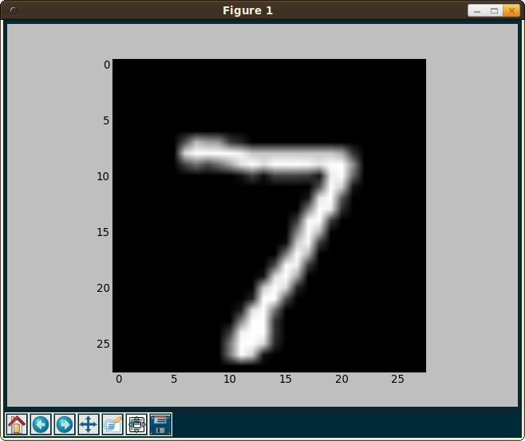

The <abbr title="Mixed National Institute of Standards and Technology">MNIST</abbr>
database is a huge database of handwritten digits that is commonly used for
training, evaluating and comparing classifiers.

It has a training set of 60,000 instances and a test set of 10,000 instances.
Every instance is a 28 &times; 28 pixel grayscale image.

## The MNIST format

MNIST comes in 4 files ([download here](http://yann.lecun.com/exdb/mnist/)):

* train-images-idx3-ubyte.gz: training set images (9.45 MB, 60000 instances)
* train-labels-idx1-ubyte.gz:  training set labels (28.2 kB, 60000 labels)
* t10k-images-idx3-ubyte.gz:   test set images (1.57 MB, 10000 instances)
* t10k-labels-idx1-ubyte.gz:   test set labels (4.43 kB, 10000 labels)

Both label files are like this:

```
[offset] [type]          [value]          [description]
0000     32 bit integer  0x00000801(2049) magic number (MSB first)
0004     32 bit integer  60000            number of items
0008     unsigned byte   ??               label
0009     unsigned byte   ??               label
........
xxxx     unsigned byte   ??               label
The labels values are 0 to 9.
```

and both image containers are like that:

```
[offset] [type]          [value]          [description]
0000     32 bit integer  0x00000803(2051) magic number
0004     32 bit integer  60000            number of images
0008     32 bit integer  28               number of rows
0012     32 bit integer  28               number of columns
0016     unsigned byte   ??               pixel
0017     unsigned byte   ??               pixel
........
xxxx     unsigned byte   ??               pixel
```

And they are, of course, compressed.

## Reading the dataset

Python brings all necessary tools to make it easy to read the dataset:

* [gzip](https://docs.python.org/2/library/gzip.html): A library for reading
  gzipped files
* [unpack](https://docs.python.org/2/library/struct.html#struct.unpack) to
  read the packed binary data

As the training and the testing dataset is structured the same way, we can
create a method thad retrives the data for both files.

```python
from struct import unpack
import gzip
from numpy import zeros, uint8, float32


def get_labeled_data(imagefile, labelfile):
    """Read input-vector (image) and target class (label, 0-9) and return
       it as list of tuples.
    """
    # Open the images with gzip in read binary mode
    images = gzip.open(imagefile, "rb")
    labels = gzip.open(labelfile, "rb")

    # Read the binary data

    # We have to get big endian unsigned int. So we need '>I'

    # Get metadata for images
    images.read(4)  # skip the magic_number
    number_of_images = images.read(4)
    number_of_images = unpack(">I", number_of_images)[0]
    rows = images.read(4)
    rows = unpack(">I", rows)[0]
    cols = images.read(4)
    cols = unpack(">I", cols)[0]

    # Get metadata for labels
    labels.read(4)  # skip the magic_number
    N = labels.read(4)
    N = unpack(">I", N)[0]

    if number_of_images != N:
        raise Exception("number of labels did not match the number of images")

    # Get the data
    x = zeros((N, rows, cols), dtype=float32)  # Initialize numpy array
    y = zeros((N, 1), dtype=uint8)  # Initialize numpy array
    for i in range(N):
        if i % 1000 == 0:
            print("i: %i" % i)
        for row in range(rows):
            for col in range(cols):
                tmp_pixel = images.read(1)  # Just a single byte
                tmp_pixel = unpack(">B", tmp_pixel)[0]
                x[i][row][col] = tmp_pixel
        tmp_label = labels.read(1)
        y[i] = unpack(">B", tmp_label)[0]
    return (x, y)
```

## Viewing data

You might want to take a look at an image. This is easily possible with
[PyLab](http://wiki.scipy.org/PyLab) (which is a part of Matplotlib):

```python
from pylab import imshow, show, cm


def view_image(image, label=""):
    """View a single image."""
    print("Label: %s" % label)
    imshow(image, cmap=cm.gray)
    show()
```

It tooks like this:

<ul class="gallery mw-gallery-traditional" style="max-width: 326px; width: 326px;">
   <li class="gallerybox" style="width: 155px">
      <div style="width: 155px">
         <div class="thumb" style="width: 150px;">
            <div style="margin:21px auto;height: 113px;line-height: 150px;">
               <a href="../images/2014/06/mnist-1.png" class="image">
                  
               </a>
            </div>
         </div>
         <div class="gallerytext">7</div>
      </div>
   </li>
   <li class="gallerybox" style="width: 155px">
      <div style="width: 155px">
         <div class="thumb" style="width: 150px;">
            <div style="margin:21px auto;height: 113px;line-height: 150px;">
               <a href="../images/2014/06/mnist-2.png" class="image">
                  
               </a>
            </div>
         </div>
         <div class="gallerytext">2</div>
      </div>
   </li>
</ul>

## Classify data

Now we can use [PyBrain](http://pybrain.org/) to classify data.

The following code will first build the PyBrain datastructure for the training
set and the testing set. Then it will build a very simple neural network called
a *Multilayer Perceptron* (MLP) with three layers: An input layer, a hidden
layer and an output layer.

After creating it, the MLP will be trained with the backpropagation algorithm.
Every training step is followed by an evaluation step.

By the way, [`numpy.ravel`](http://docs.scipy.org/doc/numpy/reference/generated/numpy.ravel.html)
simply flattens a list.

```python
from numpy import ravel

from pybrain.datasets import ClassificationDataSet
from pybrain.utilities import percentError
from pybrain.tools.shortcuts import buildNetwork
from pybrain.supervised.trainers import BackpropTrainer
from pybrain.structure.modules import SoftmaxLayer


def classify(
    training,
    testing,
    HIDDEN_NEURONS,
    MOMENTUM,
    WEIGHTDECAY,
    LEARNING_RATE,
    LEARNING_RATE_DECAY,
    EPOCHS,
):
    trndata = ClassificationDataSet(INPUT_FEATURES, 1, nb_classes=CLASSES)
    tstdata = ClassificationDataSet(INPUT_FEATURES, 1, nb_classes=CLASSES)

    for i in range(len(testing)):
        tstdata.addSample(ravel(testing["x"][i]), [testing["y"][i]])
    for i in range(len(trndata)):
        trndata.addSample(ravel(trndata["x"][i]), [trndata["y"][i]])

    # This is necessary, but I don't know why
    # See http://stackoverflow.com/q/8154674/562769
    trndata._convertToOneOfMany()
    tstdata._convertToOneOfMany()

    fnn = buildNetwork(
        trndata.indim, HIDDEN_NEURONS, trndata.outdim, outclass=SoftmaxLayer
    )

    trainer = BackpropTrainer(
        fnn,
        dataset=trndata,
        momentum=MOMENTUM,
        verbose=True,
        weightdecay=WEIGHTDECAY,
        learningrate=LEARNING_RATE,
        lrdecay=LEARNING_RATE_DECAY,
    )
    for i in range(EPOCHS):
        trainer.trainEpochs(1)
        trnresult = percentError(trainer.testOnClassData(), trndata["class"])
        tstresult = percentError(
            trainer.testOnClassData(dataset=tstdata), tstdata["class"]
        )

        print(
            "epoch: %4d" % trainer.totalepochs,
            "  train error: %5.2f%%" % trnresult,
            "  test error: %5.2f%%" % tstresult,
        )
    return fnn
```

## Final steps

You might want to add [command line parameters](//martin-thoma.com/how-to-parse-command-line-arguments-in-python/), [logging](https://docs.python.org/2/library/logging.html) and
probably [pickle](https://docs.python.org/2/library/pickle.html#module-cPickle)
the data.

## Final complete code

```python
#!/usr/bin/env python

"""Train NN with PyBrain."""

from struct import unpack
import gzip
from numpy import zeros, uint8, float32, ravel

from pylab import imshow, show, cm

from pybrain.datasets import ClassificationDataSet
from pybrain.utilities import percentError
from pybrain.tools.shortcuts import buildNetwork
from pybrain.supervised.trainers import BackpropTrainer
from pybrain.structure.modules import SoftmaxLayer

from argparse import ArgumentParser
import os.path
import cPickle as pickle


def get_labeled_data(imagefile, labelfile, picklename):
    """
    Read input-vector (image) and target class (label, 0-9).

    Return
    ------
    dict
    """
    if os.path.isfile("%s.pickle" % picklename):
        data = pickle.load(open("%s.pickle" % picklename))
    else:
        # Open the images with gzip in read binary mode
        images = gzip.open(imagefile, "rb")
        labels = gzip.open(labelfile, "rb")

        # Read the binary data

        # We have to get big endian unsigned int. So we need '>I'

        # Get metadata for images
        images.read(4)  # skip the magic_number
        number_of_images = images.read(4)
        number_of_images = unpack(">I", number_of_images)[0]
        rows = images.read(4)
        rows = unpack(">I", rows)[0]
        cols = images.read(4)
        cols = unpack(">I", cols)[0]

        # Get metadata for labels
        labels.read(4)  # skip the magic_number
        N = labels.read(4)
        N = unpack(">I", N)[0]

        if number_of_images != N:
            raise Exception(
                "The number of labels did not match " "the number of images."
            )

        # Get the data
        x = zeros((N, rows, cols), dtype=float32)  # Initialize numpy array
        y = zeros((N, 1), dtype=uint8)  # Initialize numpy array
        for i in range(N):
            if i % 1000 == 0:
                print("i: %i" % i)
            for row in range(rows):
                for col in range(cols):
                    tmp_pixel = images.read(1)  # Just a single byte
                    tmp_pixel = unpack(">B", tmp_pixel)[0]
                    x[i][row][col] = float(tmp_pixel) / 255
            tmp_label = labels.read(1)
            y[i] = unpack(">B", tmp_label)[0]
        data = {"x": x, "y": y, "rows": rows, "cols": cols}
        pickle.dump(data, open("%s.pickle" % picklename, "wb"))
    return data


def view_image(image, label=""):
    """View a single image."""
    print("Label: %s" % label)
    imshow(image, cmap=cm.gray)
    show()


def classify(
    training,
    testing,
    HIDDEN_NEURONS,
    MOMENTUM,
    WEIGHTDECAY,
    LEARNING_RATE,
    LEARNING_RATE_DECAY,
    EPOCHS,
):
    INPUT_FEATURES = testing["rows"] * testing["cols"]
    print("Input features: %i" % INPUT_FEATURES)
    CLASSES = 10
    trndata = ClassificationDataSet(INPUT_FEATURES, 1, nb_classes=CLASSES)
    tstdata = ClassificationDataSet(INPUT_FEATURES, 1, nb_classes=CLASSES)

    for i in range(len(testing["x"])):
        tstdata.addSample(ravel(testing["x"][i]), [testing["y"][i]])
    for i in range(len(training["x"])):
        trndata.addSample(ravel(training["x"][i]), [training["y"][i]])

    # This is necessary, but I don't know why
    # See http://stackoverflow.com/q/8154674/562769
    trndata._convertToOneOfMany()
    tstdata._convertToOneOfMany()

    fnn = buildNetwork(
        trndata.indim, HIDDEN_NEURONS, trndata.outdim, outclass=SoftmaxLayer
    )

    trainer = BackpropTrainer(
        fnn,
        dataset=trndata,
        momentum=MOMENTUM,
        verbose=True,
        weightdecay=WEIGHTDECAY,
        learningrate=LEARNING_RATE,
        lrdecay=LEARNING_RATE_DECAY,
    )
    print("Start training")
    for i in range(EPOCHS):
        trainer.trainEpochs(1)
        trnresult = percentError(trainer.testOnClassData(), trndata["class"])
        tstresult = percentError(
            trainer.testOnClassData(dataset=tstdata), tstdata["class"]
        )

        print(
            "epoch: %4d" % trainer.totalepochs,
            "  train error: %5.2f%%" % trnresult,
            "  test error: %5.2f%%" % tstresult,
        )
    return fnn


if __name__ == "__main__":
    parser = ArgumentParser()

    # Add more options if you like
    parser.add_argument(
        "-H",
        metavar="H",
        type=int,
        dest="hidden_neurons",
        default=200,
        help="number of neurons in the hidden layer",
    )
    parser.add_argument(
        "-e",
        metavar="EPOCHS",
        type=int,
        dest="epochs",
        default=20,
        help="number of epochs to learn",
    )
    parser.add_argument(
        "-d",
        metavar="W",
        type=float,
        dest="weightdecay",
        default=0.01,
        help="weightdecay",
    )
    parser.add_argument(
        "-m", metavar="M", type=float, dest="momentum", default=0.1, help="momentum"
    )
    parser.add_argument(
        "-l",
        metavar="ETA",
        type=float,
        dest="learning_rate",
        default=0.01,
        help="learning rate",
    )
    parser.add_argument(
        "-ld",
        metavar="ALPHA",
        type=float,
        dest="lrdecay",
        default=1,
        help="learning rate decay",
    )
    args = parser.parse_args()

    print("Get testset")
    testing = get_labeled_data(
        "t10k-images-idx3-ubyte.gz", "t10k-labels-idx1-ubyte.gz", "testing"
    )
    print("Got %i testing datasets." % len(testing["x"]))
    print("Get trainingset")
    training = get_labeled_data(
        "train-images-idx3-ubyte.gz", "train-labels-idx1-ubyte.gz", "training"
    )
    print("Got %i training datasets." % len(training["x"]))
    classify(
        training,
        testing,
        args.hidden_neurons,
        args.momentum,
        args.weightdecay,
        args.learning_rate,
        args.lrdecay,
        args.epochs,
    )
```

## Results

I'll update that tomorrow:

```bash
python pybrainmnist.py
Get testset
Got 10000 testing datasets.
Get trainingset
Got 60000 training datasets.
Input features: 784
Start training
Total error: 0.0132789873631
('epoch:    1', '  train error: 14.97%', '  test error: 14.28%')
Total error: 0.0122669294279
('epoch:    2', '  train error: 11.54%', '  test error: 11.18%')
Total error: 0.0121586496637
('epoch:    3', '  train error: 12.21%', '  test error: 11.71%')
Total error: 0.0121439024528
('epoch:    4', '  train error: 13.91%', '  test error: 13.01%')
Total error: 0.0121144144187
('epoch:    5', '  train error: 12.51%', '  test error: 11.95%')
Total error: 0.0121177344402
('epoch:    6', '  train error: 12.14%', '  test error: 11.35%')
Total error: 0.0121240818924
('epoch:    7', '  train error: 15.82%', '  test error: 15.38%')
Total error: 0.0120871124447
('epoch:    8', '  train error: 13.00%', '  test error: 12.32%')
Total error: 0.0120638692784
('epoch:    9', '  train error: 14.02%', '  test error: 13.06%')
Total error: 0.0120865053396
('epoch:   10', '  train error: 13.42%', '  test error: 12.79%')
Total error: 0.0120843528845
('epoch:   11', '  train error: 13.42%', '  test error: 13.02%')
Total error: 0.0120598288441
('epoch:   12', '  train error: 13.08%', '  test error: 12.33%')
Total error: 0.0120947755501
('epoch:   13', '  train error: 12.86%', '  test error: 12.36%')
Total error: 0.0120686450925
('epoch:   14', '  train error: 13.21%', '  test error: 12.34%')
Total error: 0.0120948253309
('epoch:   15', '  train error: 12.53%', '  test error: 11.64%')
Total error: 0.0120471256247
('epoch:   16', '  train error: 13.71%', '  test error: 12.88%')
Total error: 0.0120735887868
('epoch:   17', '  train error: 12.78%', '  test error: 11.81%')
Total error: 0.0120712301982
('epoch:   18', '  train error: 13.66%', '  test error: 13.13%')
Total error: 0.0120947124816
('epoch:   19', '  train error: 12.48%', '  test error: 11.79%')
Total error: 0.0120736808357
('epoch:   20', '  train error: 14.52%', '  test error: 13.95%')

real    3745,91s
user    7336,48s
sys    21571,09s
```

