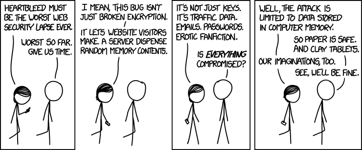

Recently, the [Heartbleed bug](https://en.wikipedia.org/wiki/Heartbleed) was
discovered. It works like this:

<figure class="aligncenter">
            <a href="../images/xkcd/heartbleed_explanation.png"></a>
            <figcaption class="text-center">Heartbleed Explanation<br/>From <a href='http://xkcd.com/1354/'>xkcd</a></figcaption>
        </figure>

One effect of that bug is that you have to change your password.

<figure class="aligncenter">
            <a href="../images/xkcd/heartbleed.png"></a>
            <figcaption class="text-center">From <a href='http://xkcd.com/1353/'>xkcd</a></figcaption>
        </figure>

You can do that from home via SSH. Just replace `s_thoma` by `s_[your last name]`:

```bash
$ ssh s_thoma@i08fs1.ira.uka.de
s_thoma@i08fs1.ira.uka.de's password: 
s_thoma@i08fs1(~)$ passwd
Changing password for user s_thoma.
Enter login(AD) password: 
Current Password: 
New password: 
Retype new password: 
AD password information changed for s_thoma
passwd: all authentication tokens updated successfully.
s_thoma@i08fs1(~)$ exit
logout
Connection to i08fs1.ira.uka.de closed.
```

In case you don't remember your password: Take a look at your Browser settings.
You've probably entered it already for looking at your printing account and
eventually your browser saved it.