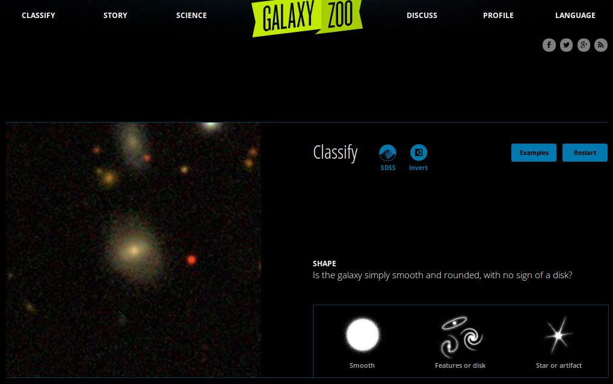
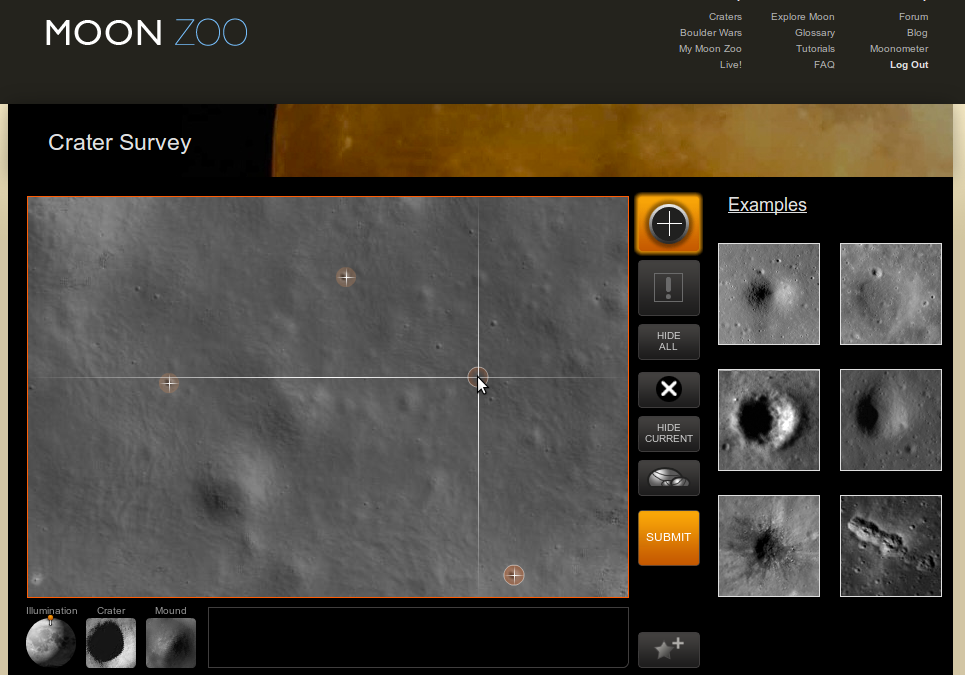
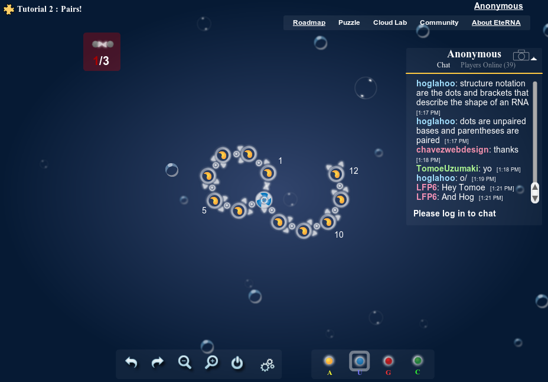
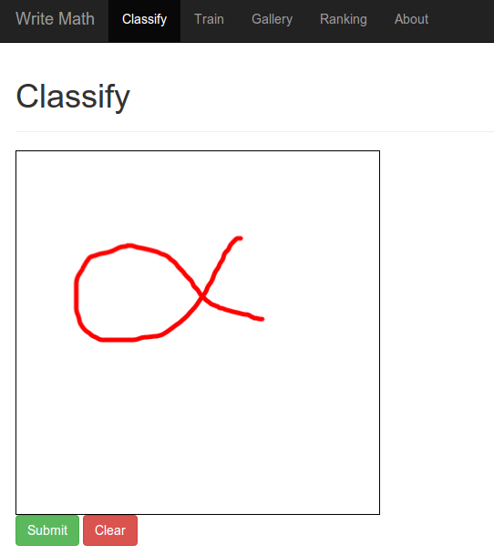

"Citizen Science Projects" are research projects that crowdsource a part of
the research work. The idea behind that is quite simple: Some tasks of
researchers are very simple. Everybody can do them.

I think some of them are a great example of [Gamification](https://en.wikipedia.org/wiki/Gamification).

## Galaxy Zoo
[Galaxy Zoo](https://en.wikipedia.org/wiki/Galaxy_Zoo) is a crowdsourced 
astronomy project which invites people to assist in the classification of
galaxies.

You get some images of Galaxies and you should see some characteristics by
looking at them. You get about three possible answers to every question. 

It looks like that:
<figure class="aligncenter">
            
            <figcaption class="text-center">Galaxy Zoo</figcaption>
        </figure>

## Moon Zoo
> High-resolution images of the Moon's surface provided by the Lunar
Reconnaissance Orbiter are used by volunteers to create detailed crater counts,
mapping the variation in age of lunar rocks.

Source: [Wikipedia](https://en.wikipedia.org/wiki/Moon_Zoo#Active_projects)

<iframe width="512" height="377" src="http://www.youtube.com/embed/rJHfoM6kh7w" frameborder="0" allowfullscreen></iframe>

It looks like this:

<figure class="aligncenter">
            
            <figcaption class="text-center">Moon Zoo</figcaption>
        </figure>

## EteRNA

[EteRNA](https://en.wikipedia.org/wiki/EteRNA) is a browser based game,
developed by scientists at Carnegie Mellon University and Stanford University,
that engages users to solve puzzles related to the folding of RNA molecules.

It looks like this:

<figure class="aligncenter">
            
            <figcaption class="text-center">EteRNA</figcaption>
        </figure>

## Write Math

[write-math.com](http://write-math.com) is my own project. The aim of the
project is to get fast and accurate recognition of mathematical symbols.
To do so, I needed data.

Currently, the project is still under heavy development. Currently, most
work I do is done offline. Hence the project might not improve until
end of October (2014).

It looks like this:

<figure class="aligncenter">
            
            <figcaption class="text-center">write math</figcaption>
        </figure>

The most interesting part might be the [interactive preprocessing experiments](http://write-math.com/render/?raw_data_id=19181).

## See also

* [EteRNA](http://eternagame.org/web/)
* Galaxy Zoo: [How to take part](http://www.galaxyzoo.org/how_to_take_part)
* Moon Zoo: [How to take part](http://www.moonzoo.org/how_to_take_part)
